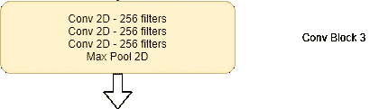
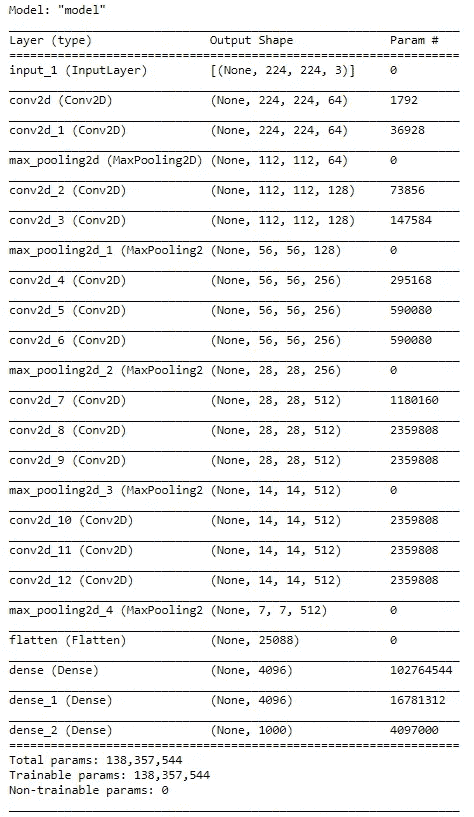

# 使用张量流从零开始创建 VGG

> 原文：<https://towardsdatascience.com/creating-vgg-from-scratch-using-tensorflow-a998a5640155?source=collection_archive---------12----------------------->

## 我们将看到如何使用 Tensorflow 2.0 从头开始实现 VGG16


图一。VGG 16 号建筑(来源:图片由作者创作)

LeNet-5 是最古老的卷积神经网络架构之一，由 Yann LeCun 于 1998 年设计，用于识别手写数字。它使用 5x5 过滤器，平均池，没有填充。但按照现代标准，这是一个非常小的神经网络，只有 6 万个参数。如今，我们看到的网络有一千万到几十亿个参数。下一个革命性地使用卷积网络的大型卷积神经网络是 AlexNet，它有大约 6000 万个参数。AlexNet 第一层使用 96 个内核大小为 11x11 的滤镜，步长为 4。下一层使用 3x3 滤镜，依此类推。此外，AlexNet 使用最大池和填充，这在 LeNet-5 中没有使用。AlexNet 与 LeNet-5 非常相似，但它要大得多。还有，AlexNet 用的是 ReLU 激活功能，而 LeNet-5 主要用的是 Sigmoid 激活。这些网络的共同点是，随着我们深入网络，张量的大小不断减小，而通道的数量不断增加。此外，如今在创建神经网络架构时仍在使用的另一个趋势是使用卷积层(一层或多层),然后是一些池层，最后是一些完全连接的层。

下一个大的卷积神经网络是 VGG 网络。关于 VGG，值得注意的是，作者没有使用这么多超参数，而是使用了一个更简单的网络，其中重点是使用具有小尺寸 3×3 滤波器的卷积层，步长为 1，并使用“相同”填充，并使所有 MaxPooling 层 2×2 的步长为 2。VGG 大大简化了以前制作的神经网络结构。

[https://arxiv.org/abs/1409.1556](https://arxiv.org/abs/1409.1556)VGG 纸链接

**使用 Tensorflow 的 VGG 16 架构和实现:**


图二。VGG 建筑。用红色突出显示的 VGG 16 号(来源:图片来自原始论文)

图 2 显示了所有的 VGG 架构。VGG 16 号的建筑用红色突出显示。图 1 给出了该架构的一个简单版本。

VGG 网络使用最大池和 ReLU 激活功能。所有隐藏层使用 ReLU 激活，最后一个密集层使用 Softmax 激活。MaxPooling 是在步长为 2 的 2x2 像素窗口上执行的。

VGG 16 有 5 个卷积块和 3 个全连接层。每个块由 2 个或更多卷积层和一个最大池层组成。

**算法:**

1.  导入所有必要的层
2.  为卷积块编写代码
3.  为密集层编写代码
4.  建立模型

**导入库:**

```
*# import necessary layers*

**from** **tensorflow.keras.layers** **import** Input, Conv2D
**from** **tensorflow.keras.layers** **import** MaxPool2D, Flatten, Dense
**from** **tensorflow.keras** **import** Model
```

**输入:**

```
*# input* input = Input(shape =(224,224,3))
```

输入是 224x224 RGB 图像，所以 3 个通道。

**Conv 第一街区:**

它有两个 Conv 层，每个层有 64 个过滤器，后面是最大池。


```
*# 1st Conv Block*

x = Conv2D (filters =64, kernel_size =3, padding ='same', activation='relu')(input)
x = Conv2D (filters =64, kernel_size =3, padding ='same', activation='relu')(x)
x = MaxPool2D(pool_size =2, strides =2, padding ='same')(x)
```

**Conv 第二街区:**

它有两个 Conv 层，128 个过滤器，然后是最大池。


```
*# 2nd Conv Block*

x = Conv2D (filters =128, kernel_size =3, padding ='same', activation='relu')(x)
x = Conv2D (filters =128, kernel_size =3, padding ='same', activation='relu')(x)
x = MaxPool2D(pool_size =2, strides =2, padding ='same')(x)
```

**Conv 第三街区:**

它有三个 Conv 层，256 个过滤器，然后是最大池。



```
*# 3rd Conv block* x = Conv2D (filters =256, kernel_size =3, padding ='same', activation='relu')(x) 
x = Conv2D (filters =256, kernel_size =3, padding ='same', activation='relu')(x) 
x = Conv2D (filters =256, kernel_size =3, padding ='same', activation='relu')(x) 
x = MaxPool2D(pool_size =2, strides =2, padding ='same')(x)
```

**Conv 第 4 和第 5 区块:**

Conv 区块 4 和 5 都有 3 个 Conv 层，512 个过滤器，然后是最大池。


```
*# 4th Conv block*

x = Conv2D (filters =512, kernel_size =3, padding ='same', activation='relu')(x)
x = Conv2D (filters =512, kernel_size =3, padding ='same', activation='relu')(x)
x = Conv2D (filters =512, kernel_size =3, padding ='same', activation='relu')(x)
x = MaxPool2D(pool_size =2, strides =2, padding ='same')(x)

*# 5th Conv block*

x = Conv2D (filters =512, kernel_size =3, padding ='same', activation='relu')(x)
x = Conv2D (filters =512, kernel_size =3, padding ='same', activation='relu')(x)
x = Conv2D (filters =512, kernel_size =3, padding ='same', activation='relu')(x)
x = MaxPool2D(pool_size =2, strides =2, padding ='same')(x)
```

**密集层:**

有 3 个完全连接的层，前两层具有 4096 个隐藏单元和 ReLU 激活，最后一个输出层具有 1000 个隐藏单元和 Softmax 激活。


```
*# Fully connected layers* x = Flatten()(x) 
x = Dense(units = 4096, activation ='relu')(x) 
x = Dense(units = 4096, activation ='relu')(x) 
output = Dense(units = 1000, activation ='softmax')(x)
```

**创建模型:**

```
*# creating the model*

model = Model (inputs=input, outputs =output)
model.summary()
```

输出:



**绘制模型:**

```
*# plotting the model*

**from** **tensorflow.python.keras.utils.vis_utils** **import** model_to_dot
**from** **IPython.display** **import** SVG
**import** **pydot**
**import** **graphviz**

SVG(model_to_dot(model, show_shapes=**True**, show_layer_names=**True**, rankdir='TB',expand_nested=**False**, dpi=60, subgraph=**False**).create(prog='dot',format='svg'))
```

输出片段:


# 用 TensorFlow 实现 VGG 16 的完整代码:

```
***# import necessary layers*** **from** **tensorflow.keras.layers** **import** Input, Conv2D **from** **tensorflow.keras.layers** **import** MaxPool2D, Flatten, Dense **from** **tensorflow.keras** **import** Model***# input***

input = Input(shape =(224,224,3))***# 1st Conv Block***

x = Conv2D (filters =64, kernel_size =3, padding ='same', activation='relu')(input)
x = Conv2D (filters =64, kernel_size =3, padding ='same', activation='relu')(x)
x = MaxPool2D(pool_size =2, strides =2, padding ='same')(x)***# 2nd Conv Block***

x = Conv2D (filters =128, kernel_size =3, padding ='same', activation='relu')(x)
x = Conv2D (filters =128, kernel_size =3, padding ='same', activation='relu')(x)
x = MaxPool2D(pool_size =2, strides =2, padding ='same')(x)***# 3rd Conv block***

x = Conv2D (filters =256, kernel_size =3, padding ='same', activation='relu')(x)
x = Conv2D (filters =256, kernel_size =3, padding ='same', activation='relu')(x)
x = Conv2D (filters =256, kernel_size =3, padding ='same', activation='relu')(x)
x = MaxPool2D(pool_size =2, strides =2, padding ='same')(x)***# 4th Conv block***

x = Conv2D (filters =512, kernel_size =3, padding ='same', activation='relu')(x)
x = Conv2D (filters =512, kernel_size =3, padding ='same', activation='relu')(x)
x = Conv2D (filters =512, kernel_size =3, padding ='same', activation='relu')(x)
x = MaxPool2D(pool_size =2, strides =2, padding ='same')(x)

***# 5th Conv block***

x = Conv2D (filters =512, kernel_size =3, padding ='same', activation='relu')(x)
x = Conv2D (filters =512, kernel_size =3, padding ='same', activation='relu')(x)
x = Conv2D (filters =512, kernel_size =3, padding ='same', activation='relu')(x)
x = MaxPool2D(pool_size =2, strides =2, padding ='same')(x)***# Fully connected layers***

x = Flatten()(x)
x = Dense(units = 4096, activation ='relu')(x)
x = Dense(units = 4096, activation ='relu')(x)
output = Dense(units = 1000, activation ='softmax')(x)***# creating the model***

model = Model (inputs=input, outputs =output)
model.summary()
```

**结论:**

VGG 网络是一个非常简单的卷积神经网络，由于其简单性，使用 Tensorflow 很容易实现。它只有 Conv2D、MaxPooling 和 Dense 图层。VGG 16 共有 1.38 亿个可训练参数。

VGG 是 CNN 出版期间最深的模型架构，最多有 19 个重量层。它在 ImageNet 挑战中取得了最先进的性能，并表明更深的网络有利于更好的分类准确性。

**参考文献:**

1.  卡伦·西蒙扬和安德鲁·齐泽曼，用于大规模图像识别的极深度卷积网络，[arXiv:1409.1556 V6](https://arxiv.org/abs/1409.1556v6)【cs .CV]，2015。