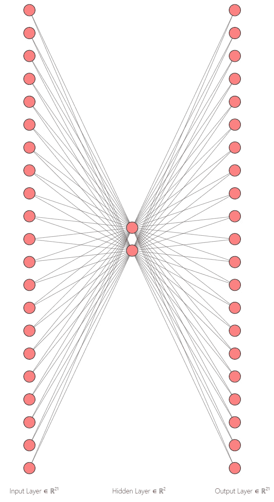
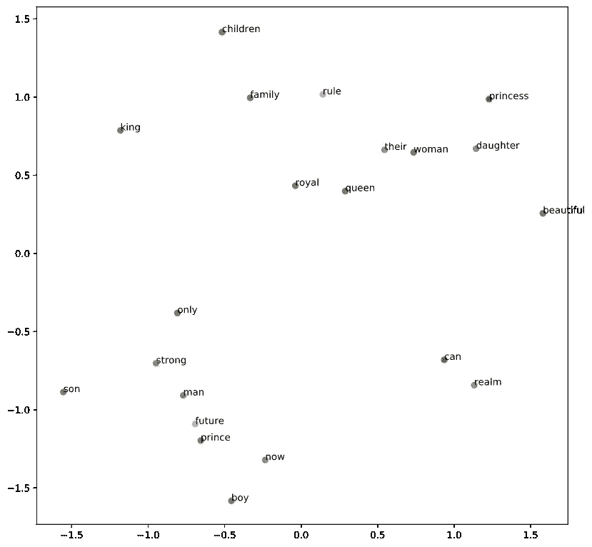

# 创建单词嵌入:使用深度学习在 Python 中编码 Word2Vec 算法

> 原文：<https://towardsdatascience.com/creating-word-embeddings-coding-the-word2vec-algorithm-in-python-using-deep-learning-b337d0ba17a8?source=collection_archive---------1----------------------->

## 用深度学习理解单词嵌入创作背后的直觉


当我在写另一篇展示如何在文本分类目标中使用单词嵌入的文章时，我意识到我总是使用从外部来源(例如[https://nlp.stanford.edu/projects/glove/](https://nlp.stanford.edu/projects/glove/))下载的预训练单词嵌入。我开始思考如何从头开始创建单词嵌入，因此这就是这篇文章的诞生。我的主要目标是让人们通过我的代码片段阅读这篇文章，并深入理解创建单词的向量表示背后的逻辑。

完整的代码可以在这里找到:

https://github.com/Eligijus112/word-embedding-creation

单词 embeddings 的创建的简短版本可以概括为以下流程:

阅读文本 **- >** 预处理文本 **- >** 创建(X，Y)数据点 **- >** 创建一个热编码(X，Y)矩阵 **- >** 训练一个神经网络 **- >** 从输入层提取权重

在这篇文章中，我将简要解释每一步。

来自 wiki: **单词嵌入**是一组[自然语言处理](https://en.wikipedia.org/wiki/Natural_language_processing) (NLP)中的[语言建模](https://en.wikipedia.org/wiki/Language_model)和[特征学习](https://en.wikipedia.org/wiki/Feature_learning)技术的统称，其中来自词汇表的**单词或短语被映射到实数向量。**术语 word2vec 字面翻译为**字到矢量**。举个例子，

“爸爸”= [0.1548，0.4848，…，1.864]

"妈妈" = [0.8785，0.8974，…，2.794]

单词嵌入最重要的特征是语义上相似的单词之间的距离(欧几里德距离、余弦距离或其他距离)比没有语义关系的单词之间的距离要小。例如，像“妈妈”和“爸爸”这样的词应该比“妈妈”和“番茄酱”或“爸爸”和“黄油”更靠近。

使用具有一个输入层、一个隐藏层和一个输出层的神经网络来创建单词嵌入。


在 [Unsplash](https://unsplash.com?utm_source=medium&utm_medium=referral) 上由 [Toa Heftiba](https://unsplash.com/@heftiba?utm_source=medium&utm_medium=referral) 拍摄的照片

要创建单词嵌入，首先需要的是文本。让我们创建一个简单的例子，用 12 句话陈述一些关于一个虚构的皇室家族的众所周知的事实:

```
The future king is the princeDaughter is the princessSon is the princeOnly a man can be a kingOnly a woman can be a queenThe princess will be a queenQueen and king rule the realmThe prince is a strong manThe princess is a beautiful womanThe royal family is the king and queen and their childrenPrince is only a boy nowA boy will be a man
```

计算机不理解国王、王子和男人在语义上比王后、公主和女儿更接近。它看到的都是编码成二进制的字符。那么我们如何让计算机理解某些单词之间的关系呢？**通过创建 X 和 Y 矩阵并使用神经网络。**

当创建用于单词嵌入的训练矩阵时，超参数之一是上下文(w) 的**窗口大小。最小值为 1，因为没有上下文，算法无法工作。让我们看第一句话，假设 w = 2。**

```
**The** *future king* is the prince
```

粗体字**称为焦点字，左边的 2 个字和右边的 2 个字(因为 w = 2)是所谓的上下文字。所以我们可以开始建立我们的数据点:**

```
(**The**, future), (**The**, king)
```

**现在，如果我们浏览整个句子，我们会得到:**

```
(**The**, future), (**The**, king), 
(**future**, the), (**future**, king), (**future**, is)
(**king**, the), (**king**, future), (**king**, is), (**king**, the)
(**is**, future), (**is**, king), (**is**, the), (**is**, prince),
(**the**, king), (**the**, is), (**the**, prince)
(**prince**, is), (**prince**, the)
```

**从 6 个单词中，我们能够创建 18 个数据点。在实践中，我们对文本做了一些预处理，删除了停用词，如 **is，the，a 等。**通过扫描整个文本文档并添加数据，我们创建了初始输入，然后可以将其转换为矩阵形式。**

**文本预处理功能**

**给定字符串列表**文本**创建(X，Y)单词对的完整管道:**

**数据点的创建**

**创建的数据点的第一个条目:**

```
['future', 'king'],
['future', 'prince'],
['king', 'prince'],
['king', 'future'],
['prince', 'king'],
['prince', 'future'],
['daughter', 'princess'],
['princess', 'daughter'],
['son', 'prince']
...
```

**在最初创建数据点之后，我们需要为词汇表中的每个唯一单词分配一个唯一的整数(通常称为 index)。这将在创建**独热编码矢量时进一步使用。****

**创建独特的单词词典**

**对文本使用上述函数后，我们得到字典:**

```
**unique_word_dict** = {
 'beautiful': 0,
 'boy': 1,
 'can': 2,
 'children': 3,
 'daughter': 4,
 'family': 5,
 'future': 6,
 'king': 7,
 'man': 8,
 'now': 9,
 'only': 10,
 'prince': 11,
 'princess': 12,
 'queen': 13,
 'realm': 14,
 'royal': 15,
 'rule': 16,
 'son': 17,
 'strong': 18,
 'their': 19,
 'woman': 20
}
```

**到目前为止，我们所创建的仍然不是神经网络友好的，因为我们所拥有的数据是成对的**(焦点词，上下文词)**。为了让计算机开始计算，我们需要一种聪明的方法将这些数据点转换成由数字组成的数据点。一个聪明的方法是**一键编码**技术。**

**一键编码将一个单词转换成一个向量，该向量由 0 和一个表示字符串的坐标组成，等于 1。向量大小等于文档中唯一单词的数量。例如，让我们定义一个简单的字符串列表:**

```
a = ['blue', 'sky', 'blue', 'car']
```

**有三个独特的词:蓝色，天空和汽车。每个单词一个热表示:**

```
'blue' = [1, 0, 0]
'car' = [0, 1, 0]
'sky' = [0, 0, 1]
```

**因此，列表可以转换成矩阵:**

```
A = 
[
1, 0, 0
0, 0, 1
1, 0, 0
0, 1, 0
]
```

**我们将用完全相同的技术创建两个矩阵，X 和 Y。将使用焦点词创建 **X 矩阵，使用上下文词创建 **Y 矩阵。******

**回想一下我们根据版税文本创建的前三个数据点:**

```
['future', 'king'],
['future', 'prince'],
['king', 'prince']
```

**python 中的一键编码 X 矩阵(单词 f**future，future，king** )应该是:**

```
[array([0., 0., 0., 0., 0., 0., 1., 0., 0., 0., 0., 0., 0., 0., 0., 0., 0.,
        0., 0., 0., 0.]),
 array([0., 0., 0., 0., 0., 0., 1., 0., 0., 0., 0., 0., 0., 0., 0., 0., 0.,
        0., 0., 0., 0.]),
 array([0., 0., 0., 0., 0., 0., 0., 1., 0., 0., 0., 0., 0., 0., 0., 0., 0.,
        0., 0., 0., 0.])]
```

**python 中一键编码的 Y 矩阵(单词 **king，prince，prince** )应该是:**

```
[array([0., 0., 0., 0., 0., 0., 0., 1., 0., 0., 0., 0., 0., 0., 0., 0., 0.,
        0., 0., 0., 0.]),
 array([0., 0., 0., 0., 0., 0., 0., 0., 0., 0., 0., 1., 0., 0., 0., 0., 0.,
        0., 0., 0., 0.]),
 array([0., 0., 0., 0., 0., 0., 0., 0., 0., 0., 0., 1., 0., 0., 0., 0., 0.,
        0., 0., 0., 0.])]
```

**这些矩阵的最终大小将是**n×m，**其中**

****n** -创建的数据点的数量(焦点词和上下文词对)**

****m**——唯一字的数量**

**创建 X 和 Y 矩阵**

**我们现在有了从焦点单词和上下文单词对构建的 X 和 Y 矩阵。下一步是选择嵌入维度。我将选择维数等于 2，以便稍后绘制单词，并查看相似的单词是否形成簇。**

****

**神经网络体系结构**

**隐层维度就是我们的单词嵌入的大小。输出层激活功能是 **softmax。**隐藏层的激活函数是**线性的。**输入维数等于唯一字的总数(记住，我们的 X 矩阵的维数是 n×21)。每个输入节点将有两个权重将其连接到隐藏层。这些权重就是单词嵌入！在网络的训练之后，我们提取这些权重并去除所有剩余的权重。我们不一定关心输出。**

**对于网络的训练，我们将使用 keras 和 tensorflow:**

**训练和获得重量**

**在网络训练之后，我们可以获得权重并绘制结果:**

```
import matplotlib.pyplot as pltplt.figure(figsize=(10, 10))for word in list(unique_word_dict.keys()):
  coord = embedding_dict.get(word)
  plt.scatter(coord[0], coord[1])
  plt.annotate(word, (coord[0], coord[1]))
```

****

**嵌入的可视化**

**我们可以看到，在剧情的各个角落，出现了‘男人’，‘未来’，‘王子’，‘男孩’和‘女儿’，‘女人’，‘公主’这样的字眼，形成一簇簇。所有这些都是通过 21 个独特的单词和 12 个句子实现的。**

**通常在实践中，使用预训练的单词嵌入，典型的单词嵌入维数为 100、200 或 300。我个人使用这里存储的嵌入:\[https://nlp.stanford.edu/projects/glove/](https://nlp.stanford.edu/projects/glove/)。**