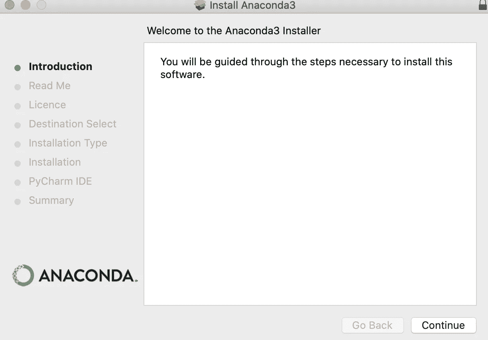
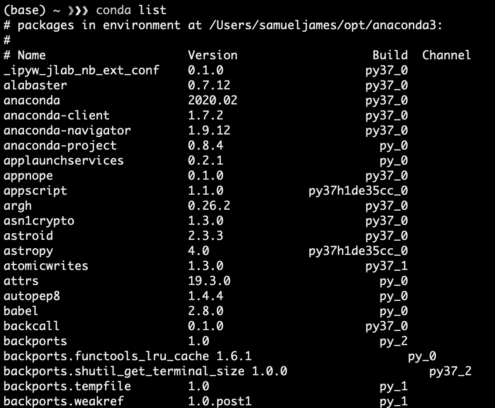
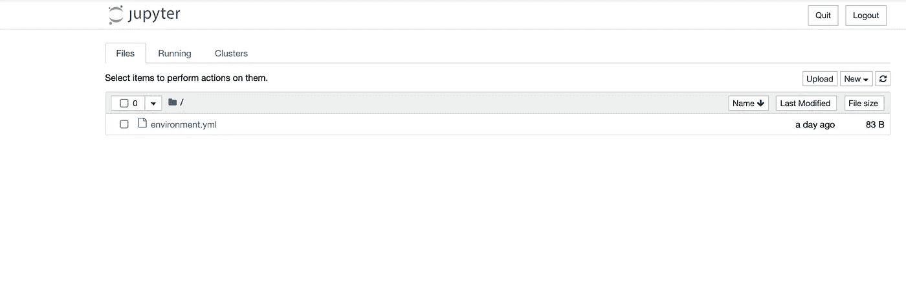

# 创建您的第一个机器学习模型

> 原文：<https://towardsdatascience.com/creating-your-first-machine-learning-model-f97f47ee6749?source=collection_archive---------50----------------------->

## 向我展示如何像五岁小孩一样设置我的本地环境


韦斯·希克斯在 [Unsplash](https://unsplash.com?utm_source=medium&utm_medium=referral) 上的照片

这是我题为“**创建你的第一个机器学习模型**”系列的第一篇文章我假设你已经知道了机器学习的基础知识，并且想要创建你的第一个机器学习模型。我的目标是尽可能地为你分解步骤。

如果你发现任何不清楚的条款或你不明白的东西，这意味着我没有兑现我的承诺。请注意，你可以自由评论和要求澄清。

在这篇文章中，你将学到:

*   如何为机器学习项目设置硬件？
*   使用 conda 管理机器学习依赖性的可重复过程。
*   如何在新计算机上创建相同的机器学习项目环境
*   本地硬件的限制以及何时使用云服务进行机器学习工作。
*   免费云服务，允许你免费研究、构建和训练模型。

如果你要进行一次公路旅行，在开始旅行之前，你需要做一些事情。否则，你可能会停止你的公路旅行，并可能不得不支付一些意想不到的维修费用，也许，浪费时间。同样，在您开始机器学习之旅之前，您的环境必须完全设置好。

# 配置您的硬件

机器学习工作需要大量的计算能力；你要做的第一件事是确保你的硬件足够强大，能够在本地构建东西。对于硬件要求，您应该满足以下条件:

*   中央处理器
*   英特尔酷睿 i5 或更高版本。你也可以选择 AMD 的同类产品
*   你至少有 8GB 的内存
*   建议使用 GPU (NVIDIA GeForce GTX 960 ),但这是可选的

如果您是一名开发人员，这些步骤对您来说并不陌生。你应该做的第一件事是确保你的操作系统是最新的。

作为个人电脑的拥有者，你可能对“发行版”这个概念很熟悉——为便于使用而构建、组装和配置的软件组件的集合。对于科学任务，你需要一组用于科学计算的软件。我们将在本教程中使用的发行版之一是 Anaconda。

Anaconda 只是众多发行版中的一个。对于一个刚刚进入“condas”世界的初学者来说，你可能会发现术语“anaconda”、“miniconda”和 conda 令人困惑。你并不孤单。刚开始我也是这种感觉。如果你仔细看看这些单词，你会发现“conda”这个词在这三个名字中很常见。

“康达”究竟是什么？

## **康达**

如果在 python 中使用 pip 和 virtual env，那么 conda 会更清晰。Conda 是一个独立于平台的包管理器和环境管理器。包管理器允许你管理依赖关系(你或其他人写的代码)。即安装、更新和删除软件包。另一方面，环境管理器允许您隔离软件环境。

环境隔离是机器学习项目的一个重要方面，因为不同的工具可能具有冲突的需求和包；如果没有环境隔离，将很难管理多个项目。

## **迷你康达**

出于许多原因，您可能不想安装 Anaconda。例如，如果您的任务只需要一个包，为什么要安装 199 个您不会使用的包呢？您可以将 miniconda 视为 Anaconda 的引导版本，其中包括包管理器“conda”、python 以及一些基本包。Miniconda 需要大约 400MB 的磁盘空间，当磁盘空间不足时，这可能是一个更好的选择。

## **蟒蛇**

Anaconda 是一个 python 和 R 发行版，其目标是为您提供开箱即用的数据科学包。在撰写本文时，anaconda 已经预打包了多达 200 个数据科学包。因为 anaconda 拥有大多数包，所以它在您的机器上占用了更大的磁盘空间。对于初学者，您可能想从 Anaconda 开始您的机器学习之旅——这就是为什么我们在本教程的剩余部分使用它。

那么如何安装 Anaconda 呢？

# 安装 Anaconda

要安装 anaconda，请进入 Anaconda 的[下载页面](https://www.anaconda.com/products/individual)，下载一个适合您选择的操作系统的二进制文件。

双击二进制发行版进行安装，始终单击“继续”并接受许可协议。在我的 Mac OS 上，Anaconda 的第一个屏幕是这样的:



Anaconda 安装屏幕

请花点时间放松一下；安装可能需要几分钟时间。您可以通过运行以下命令来验证 anaconda 是否已成功安装:

```
conda list
```

如果一切正常，您应该会看到软件包和预安装版本的列表，如下图所示。



Conda 列表输出

如果你得到一个错误，不要惊慌，你可能需要杀死你的终端并重新启动它。

## ***使用 conda*** 管理环境

> *科学是基于再现性和人为制造的客观性。这使得它有能力提出关于物质和能量的主张，也使得科学知识不适用于人类生活的存在性和本能，这是独特的、主观的和不可预测的*
> 
> *——****保罗·卡兰尼蒂***

你曾经重新运行过你或别人十年前写的代码吗？如果你足够幸运能让它运行起来，这可能会令人沮丧。原因与软件和库确实变化很快这一事实相差不远。所使用的库、操作系统、编译器和解释器的版本可能已经改变或被更新的版本所取代。简而言之，十年前软件运行的环境和条件可能已经发生了变化。

好的代码必须是可重复运行和可复制的。确定您软件可以重新运行的一种方法是确保可再现和可复制的条件和要求是恒定的。我们通过锁定需求和隔离软件环境来做到这一点。

在安装 anaconda 时，conda 会为您创建一个名为“base”的默认环境。如果您将所有代码都放在这个基础环境中，那么隔离代码的目的就失败了。您想要做的是为每个项目创建一个新的环境，以保持您的项目是独立的。

## ***用康达*创造环境**

要创建一个具有特定软件版本的新环境，例如 python 和 scipy 的特定版本，请执行以下命令。

```
conda create --name example_env python=3.7 scipy=1.4.1
```

有时，在 YAML 文件中定义所有的环境依赖项会很方便。如果你想和别人分享你的代码，这非常方便。

您可以使用 YAML 文件 environment.yml 将环境定义为:

```
# filename: environment.yml
name: another_example_env
dependencies:
  - python=3.7
  - scipy=1.4.1
```

在您的终端中执行下面的代码来创建环境之后

```
conda env create --file /path/to/environment.yml
```

## ***用康达*** 更新环境

更新您的环境是您在机器学习过程中的日常任务之一。

库经常变化，旧版本被替换，或者有时您甚至需要用一个库替换另一个库或者删除多余的依赖项。

Conda 提供了一个命令，用于在对环境文件进行更改后更新您的环境。

例如，让我们向环境中添加一个新的依赖项。

```
# filename: environment.yml
name: another_example_env
dependencies:
  - python=3.7
  - scipy=1.4.1
  - pytorch=1.5.0
```

对环境文件进行更改后，您可以通过运行以下命令来更新环境:

```
conda env update --file /path/to/environment.yml --prune
```

## ***列表环境***

当您有多个机器学习项目时，在选择要处理的项目之前，您可能希望先看到您的环境列表。

使用 conda list 命令，您可以看到您的环境列表:

```
conda info --envs
```

## ***激活您的环境***

环境激活是应用程序运行的先决条件。当您激活您的环境时，您正在设置您的应用程序工作可能需要的任意环境变量。

要使用 conda 激活环境，请运行以下命令:

```
conda activate myenv
```

## ***推出 jupyter 笔记本***

Jupyter notebook 是一个提供基于 web 的交互式界面的工具，允许您交互式地开发和展示数据科学项目。它将您的代码及其输出集成到一个文档中。

一旦您设置并激活了您的环境，您就可以通过执行命令`jupyter notebook`开始开发来启动 Jupyter 笔记本。

```
jupyter notebook
```

您将看到一个类似于下图的屏幕:



Jupyter 笔记本

## **分享和复制你的环境**

软件是为多次运行而编写的。通常，我们与同事、朋友、合作者，甚至随机的陌生人共享代码。当我们这样做时，我们应该确保他们能够运行我们与他们共享的代码——没有相同的环境，再现性是不可能的。

您可以通过导出您的环境来共享您的环境，以便您的同事可以构建与您相同的环境来运行您的代码。我们使用以下命令导出环境:

```
conda env export --file exported_environment.yml
```

## **打造相同的康达环境**

有时候，您可能希望在一台机器上构建一个相同的环境，而在另一台机器上构建一个相同的操作系统。

例如，如果你购买了新的硬件或者把你的代码从你的工作计算机转移到你的家用计算机，家用计算机有相同的操作系统。Conda 允许您在同一台机器上或者在运行相同操作系统平台的另一台机器上构建一个相同的环境。我们通过将规格列表导出为文件来实现这一点。

```
conda list --explicit  > current/working/directory/spec-file.txt
```

您可以使用以下命令，使用导出的规范在另一台计算机上创建完全相同的环境:

```
conda create --name identical_env --file spec-file.txt
```

# ***本地硬件的限制***

您已经看到了如何为机器学习项目设置本地开发环境。您的本地设置适合需要少量计算能力的小型机器学习项目。

在现实世界中，机器学习项目通常需要大量的数据和巨大的计算能力，远远超出了您的本地机器所能提供的。

如果你正在训练一个模型来识别模式，它可能需要并行计算资源，这在传统处理器上可能需要几天时间。

所有这些限制和更多的限制使我们转向云服务，如[谷歌云平台、](https://cloud.google.com/) [亚马逊 Sagemaker](https://aws.amazon.com/sagemaker/) ，它们的硬件针对机器学习工作进行了优化。它们使我们能够利用无限的计算能力并行训练大型数据集。Google、AWS、Azure 等提供的云服务。拥有针对机器学习作业优化的硬件

# **免费云服务，允许您免费构建模型**

你可能会想，“哦，不，这是一个介绍性的帖子，对于我的项目，我甚至不需要强大的计算能力，我只是想尝试一下。”

我明白，我完全理解。如果你不是在做一个大项目，你可能只需要很少的计算能力来尝试。

这里有一个问题，云已经变得相对便宜，一些服务，如 [Google Colab](https://colab.research.google.com/) 甚至允许你免费训练模型。我的意思是不需要环境设置，大多数机器学习包已经预装。你可以免费快速搜索。

以下是云服务；您可以使用:

*   [谷歌合作实验室](http://colab.research.google.com/)
*   [朱庇特](http://jupyter.org/try)
*   [微软 Azure](https://notebooks.azure.com/)
*   [AWS Sagemaker](https://aws.amazon.com/sagemaker/)
*   [谷歌人工智能平台](https://cloud.google.com/ai-platform)
*   [Cocalc](https://cocalc.com/)

# 结论

在这篇文章中，你看到了如何为机器学习项目设置你的本地机器。我们还看到了一个免费云服务列表，允许您免费构建和训练模型。

同时，在你等待第二个帖子的时候，你可以[订阅我的简讯](http://bit.ly/hubofml)。每月一次，我会发送一份时事通讯，其中包含许多关于数据科学、软件工程和机器学习的令人兴奋的内容。期待快速提示，链接到有趣的教程，意见，论文和图书馆。