# 在 Google 云平台中创建 ETL 以实现自动化报告

> 原文：<https://towardsdatascience.com/creation-of-an-etl-in-google-cloud-platform-for-automated-reporting-8a0309ee8a78?source=collection_archive---------24----------------------->

## 以 PyTrends 为例，了解如何为自动化报告创建自己的无服务器且完全可伸缩的 ETL

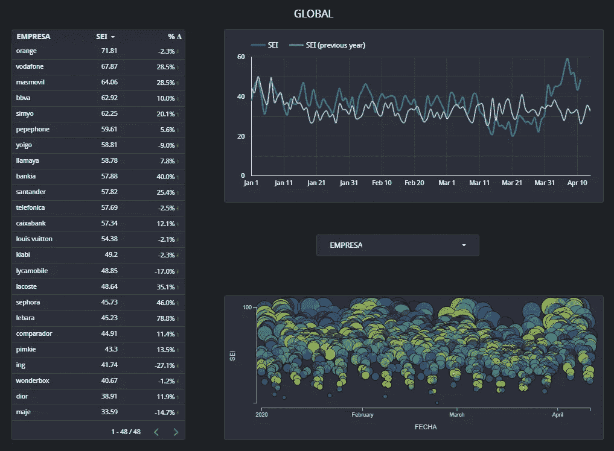

基于 PyTrends 数据的最终报告

*首先要提到的是，这篇文章是由* [*阿尔贝托·巴尔加斯*](https://medium.com/@a.vargas.pina) *和亚历克斯·马斯普合著的。Medium 还没有合著选项，所以你应该怪我们俩:)*

我们都是 [Labelium](https://www.labelium.com/) 数据部门的一员。作为一家媒体机构的数据部门，我们经常需要开发和更新各种类型的报告，并且需要选择各种各样的数据源。

因此，我们迫切需要开发一个标准的 ETL 过程来满足以下需求:

*   完全自动化，一旦提交报告，无需数据部门资源的干预。
*   能够接收任何类型的数据源和任何更新条件。
*   把它留在 GCP，因为它是我们的主要工作栈。

我们在本文中解释的是我们如何实现它的一步一步，选择每种不同工具的原因以及一些有用的技巧。将有助于说明整个过程的用例是使用 PyTrends 从 Google Trends 中提取的搜索引擎索引的自动化报告。所选择的品牌和关键词是一个广泛的选择，旨在显示 Covid 危机对西班牙互联网用户搜索习惯的影响。该报告在每周一西班牙时间 08:05(GMT+1)自动更新。

值得注意的是，这个特定的报告可以使用更简单的解决方案自动生成，例如，通过启动一个带有启动脚本的虚拟机来执行所需的 python 代码。但是我们的目标是开发和测试一个可以在任何场景下工作的 ETL，不管具体的更新条件如何。

这是 ETL 的基本模式:

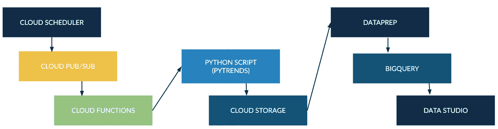

抽取、转换、加载至目的端（extract-transform-load 的缩写）

在下一节中，我们将详细介绍这个特定报告的 PyTrends 实现的所有相关内容。如果你只是对自动化部分感兴趣，可以直接跳到自动化部分。

# PyTrends

你可以在这个 GitHub 上找到所有的代码。

如果你喜欢一步一步的指导，就跟着我们吧。

为了更好地理解 Pytrends 是什么，它是如何工作的，以及它的局限性，我们强烈推荐这些文章:C [分类](https://github.com/pat310/google-trends-api/wiki/Google-Trends-Categories)， [Pytrends 文档](https://pypi.org/project/pytrends/)，[一个很棒的教程](https://searchengineland.com/learn-how-to-chart-and-track-google-trends-in-data-studio-using-python-329119)，[它是如何工作的](https://www.karinakumykova.com/2019/03/calculate-search-interest-with-pytrends-api-and-python/)和/或[这篇文章](/google-trends-api-for-python-a84bc25db88f)。

万岁！既然你已经是 Pytrends 的专家了，那我们就来写脚本吧。

要记住的最重要的事情是，对于这个或任何其他你想通过云函数激活的代码，你是在一个完全无服务器的架构上工作。如果你不习惯典型的软件开发最佳实践，并且想要在基于笔记本的工作流程中应用最佳实践，我们强烈推荐 [Jupyter 笔记本宣言](https://cloud.google.com/blog/products/ai-machine-learning/best-practices-that-can-improve-the-life-of-any-developer-using-jupyter-notebooks)。这些是云功能*强制*架构标准:

*   忽略子文件夹，所有脚本必须在同一个文件夹中。
*   输出文件夹必须名为"**../tmp** ”，所以在开发的时候，在你当前的上面创建一个 tmp 文件夹。你最终不需要它，因为云功能会创建一个。

我们的选择是使用 4 个脚本:

*   main.py 通过*runpy 调用工作脚本。*
*   download_pytrends.py 向 *pytrends* 请求所需信息。
*   upload_gcs.py 通过 *gcsfs 将新信息上传到 gcs。*
*   删除所有收集的数据。

# 剧本

记住创建一个 requirements.txt 文件来指定您需要的库:

以及所有的进口:

main.py

*   download_pytrends.py

使用关键字类别代码，我们确保每个关键字都与其类别中的顶级关键字进行比较。创建一个包含几个关键词的列表会给你相对于那个关键词的结果，而不是那些没有列出的。

*   该函数请求 info，基于 [**这一个**](https://searchengineland.com/learn-how-to-chart-and-track-google-trends-in-data-studio-using-python-329119) :

*Unstack(level=-1)* 用于构造同一列中的所有关键字。在 Data Studio 中绘制结果时，这将非常有用。

我们现在可以与谷歌云存储互动。这需要一点时间，因为 gcsfs 库文档中并没有记录所有内容:

*   remove_files.py 清除所有收集的数据:

出于我们的目的，我们有几个 CSV，所以我们创建了一个列表。

我们现在有了一个完整的 PyTrends 实现，可以将 csv 推送到 Google 云存储中。

在进入自动化部分之前，有几个快速提示:

*   请记住您通过 PyTrends 请求的数据量以及您使用的超时时间，以免被暂时禁止。
*   谷歌趋势信息是嘈杂的，并不完全稳定。那是有意的；如果相同的查询产生不同的结果，不要感到惊讶。请记住，谷歌趋势信息对于发现全球趋势非常有用，除此之外别无它用。它不是为深度数据分析提供高度依赖的信息而设计的。

# 自动化

## 提取阶段

主管道是:

云调度器>云发布/订阅>云功能

正如我们在开始时所讨论的，对于这个特定的用例来说，它确实是过度工程化了。没有必要使用云发布/订阅，我们可以使用更简单或更传统和紧凑的解决方案。但我们希望创建一个管道，允许我们在非常广泛的场景中触发报告的更新，并且非常容易扩展。

Cloud Pub/Sub 是来自 GCP 的事件和全球消息系统。它提供完全自动化的扩展和配置。这对我们很有帮助，因为它允许我们轻松地将报告自动化集成为任何应用程序的全局工作流的一部分。如果您需要简化任何类型的实时分析，它值得一看。

管道中的另一个关键元素是云功能。在这个特定的用例中，Cloud Functions 执行触发 PyTrends 更新 Google 云存储上的数据的 python 代码，正如我们在上一节中看到的。Cloud Functions 是 GCP 的事件驱动的无服务器计算平台。我相信你现在已经非常清楚地看到了趋势:目标是一个完全无服务器的事件驱动架构。

这些是设置此阶段的分步说明；这非常容易做到:

*   在云调度程序上创建作业:

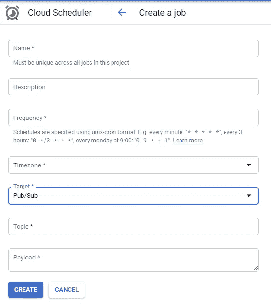

在云调度程序上创建作业

这里只需要记住两件事:1)对于频率，您需要使用传统的 unix-cron 格式；2)记住将发布/订阅指定为您的目标。

*   根据您在 Cloud Scheduler 上建立的主题，转到 Pub/Sub 并创建一个新主题:

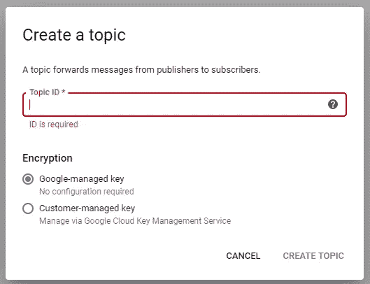

在发布/订阅上创建主题

这将由云调度程序触发，并进而触发云功能。

剩下唯一要做的就是设置云功能。云函数允许我们执行 python、Node.js 或 Go 中的代码。在我们的例子中，我们使用的是 python 脚本，因此我们需要相应地设置选项:

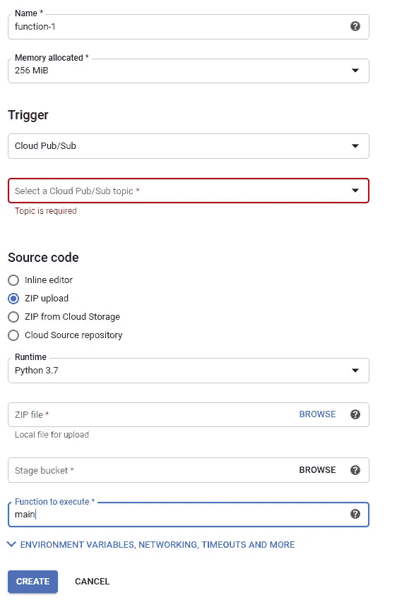

创建云函数

您需要将发布/订阅指定为触发器。选择您之前在 pub/sub 上创建的主题，上传带有 python 代码的 zip 文件，并选择 main 作为您的函数。请记住，还要在 GCS 上指向您要用于暂存的正确暂存存储桶。

还要记住，zip 文件必须包含根文件夹中的所有脚本(没有额外的文件夹！)，包括 requirements.txt 文件。此外，main.py 是您的启动器脚本。

顺便提一下，根据其设计的用例，云功能有局限性，这一点很重要。例如，最大超时是 540 秒。如果你需要长时间执行代码，云函数并不是你理想的工具。查看 App Engine 可能是有意义的(如果您需要灵活性，可能由云功能触发)。

您可以在这里看到高级选项:

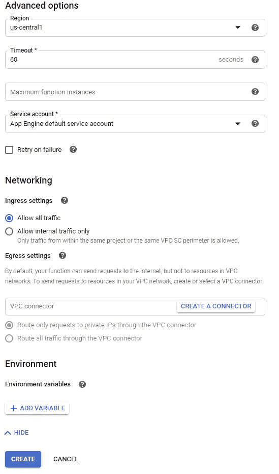

云功能高级选项

如您所见，您可以更改超时、更改网络选项、添加环境变量等。对于这个特定的用例，默认选项对我们来说很好。

## 为可视化转换和加载数据

随着数据被提取、更新并存储在我们想要的位置，我们可以进入下一个阶段:为报告准备好数据。

我们将使用 Dataprep 从云存储中提取数据，安排其在 BigQuery 上的发布，并从 BigQuery 生成我们的 Data Studio 报告。

Dataprep 是基于 [Trifacta Wrangler](https://www.trifacta.com/products/wrangler-editions/) 的数据准备解决方案，它完全集成在 GCP 上。很直观，很好用。如果您喜欢直接使用 SQL 方法，并且有需要自动化的复杂数据转换需求，我们强烈推荐 [Dbt](https://www.getdbt.com/) 。我们在内部使用它来转换 Google Ads 数据，以便在 BigQuery 中使用，这很棒。

但是对于这个特定的用例，Dataprep 将很好地为我们服务。

首先创建一个新流程:

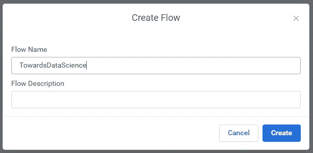

在 Dataprep 中创建流

然后，导入要使用的数据:

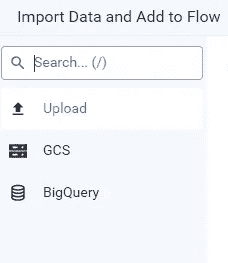

在 Dataprep 上导入数据

你可以直接从你的电脑、云存储或 BigQuery 上传数据。

对于我们的用例，我们将在 GCS 中选择我们的 python 脚本(由云函数执行)正在生成的文件。

这将在 Dataprep 中打开一个新的流。我们将看到一个小预览，并开始添加我们的食谱:

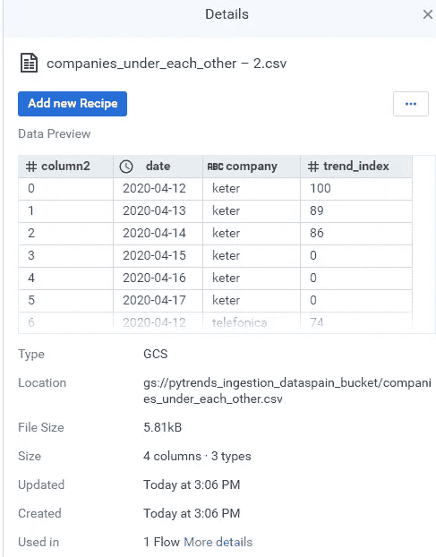

Dataprep 上的导入数据

一旦我们开始编辑食谱，我们就可以开始处理数据。我们将获得包含一些描述性信息的 csv 的不同列，我们可以根据需要编辑数据。这将生成配方(我们转换数据所采取的完整步骤序列)。

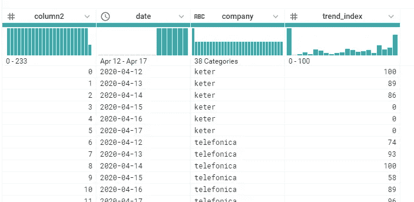

Dataprep 上的 csv

当我们准备好的时候，我们可以点击*运行作业*，它将在数据流上执行我们的指令:

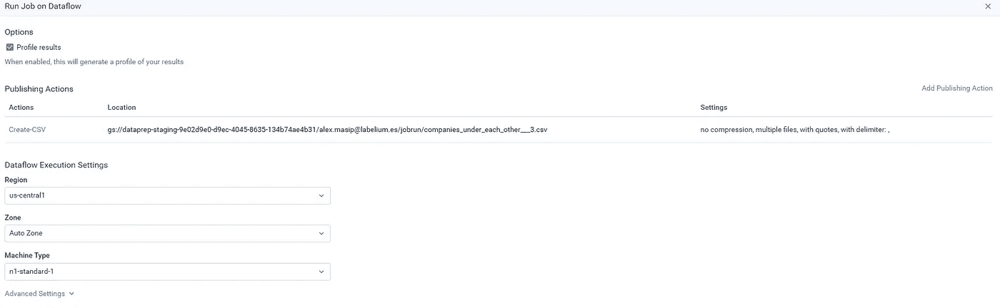

默认情况下，它会生成一个 csv，但是我们希望结果在 BigQuery 中。为此，我们只需选择*添加发布动作*并在 BigQuery 上选择一个数据集。

我们还可以根据需要选择创建/替换、追加或截断。因为我们希望在 BigQuery 上连续更新相同的数据集，所以我们将安排作业并选择 append。

我们现在已经自动更新了 BigQuery 上的数据集，我们将使用它作为 Data Studio 报告的基础。剩下的唯一一件事就是在 Data Studio 上添加数据源(Resources 菜单—管理数据源):

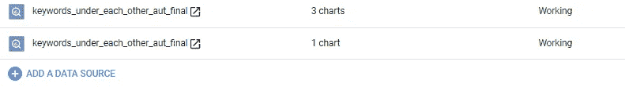

在 Data Studio 上添加新的数据源

使用 BigQuery 作为 Data Studio 的数据源的好处是，我们可以使用 BigQuery BI Engine，这是一个内存中的分析服务。它提供了极快的查询响应，而且，对于报表应用程序来说，最重要的是，它允许高并发性。

您可以在这里查看最终报告:[2020–2019 搜索引擎指数对比—西班牙](https://datastudio.google.com/open/1qyJweNLTKll6VLq1h2G8HRYMwHd-oUUC)

在第一页上，您有相关西班牙公司的简短选择，并可以按公司进行筛选。在第二页上，您可以使用代表不同部门的关键字进行同样的操作。我们的目标基本上是让人们快速了解新冠肺炎效应对不同行业搜索习惯的影响。每周一西班牙时间 08:05(GMT+1)自动更新。正如 PyTrends 部分提到的，你必须记住 Google Trends 数据的质量，特别是在一致性方面。它只是为了给出一个主要趋势的非常广泛的概述，在这方面，它是伟大的。

# 结论

我们希望这个小练习对你有所帮助。我们的主要目标是展示 GCP 在报告自动化方面提供的可能性，以及建立一个完全自动化的无服务器和可扩展的架构是多么容易，该架构可以针对各种各样的使用案例和数据源进行定制。

不用说，您可以使用许多不同的方法或工具来完成类似的任务，其中许多方法在架构方面并不复杂。但是在我们看来，这个练习是一个很好的起点，可以帮助你自己探索和设计你的理想解决方案。