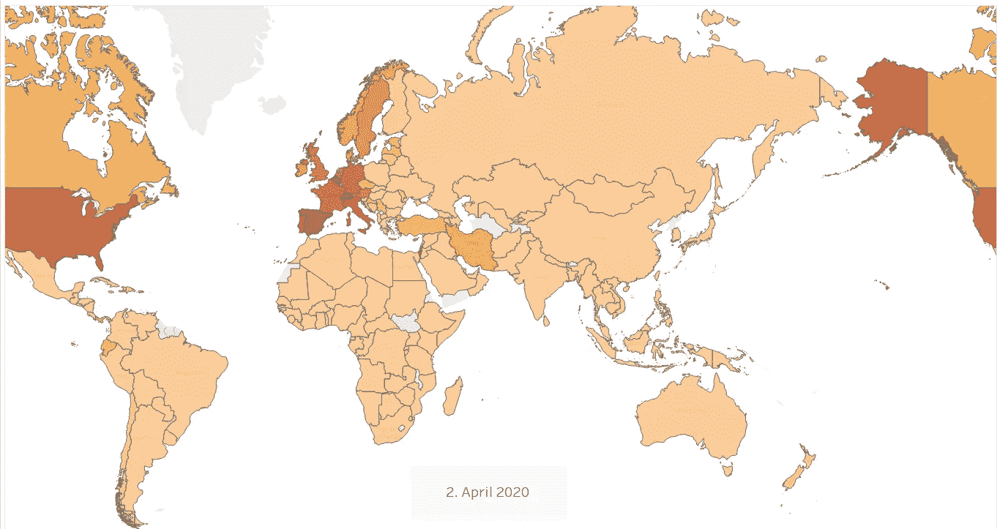

# 用 Tableau 制作信息图形动画

> 原文：<https://towardsdatascience.com/creation-of-information-graphic-animations-with-tableau-21cfc7660189?source=collection_archive---------62----------------------->

## 使用关于 COVID19 感染的当前数据的例子

在我之前的文章“[动画信息图形](/animated-information-graphics-4531de620ce7)”中，我讨论了如何使用“Python”和“Plotly”将依赖于时间的数据显示为动画。在这篇文章中，我想展示如何用软件 [Tableau](http://www.tableau.com) 的 2020 年新版本创建信息图形动画。

作者图片

## **数据:**

为了举例，我使用了各个国家的 COVID19 感染数据，这些数据可以从“欧洲疾病预防和控制中心”下载。
可以用免费版的 [Tableau Public](https://public.tableau.com/) 来跟例子。

## **《赛车排行榜》**

在 YouTube 上很受欢迎的动画版条形图是所谓的“赛车条形图”。在这里，动画是由一系列单独的条形图创建的，这些条形图根据一个顺序进行排序，并随着时间的推移遵循这个顺序(“比赛”)。

以下示例显示了每个国家每 100，000 名居民中 COVID19 感染总数的发展情况。在每种情况下，从 3 月 1 日起全球排名前 15 的国家。2020 年，并且只考虑人口超过 100 万的国家。

每个国家 COVID19 感染情况的竞赛条形图

创建这种动画的说明可以在例如

 [## 在 5 分钟内建立一个关于新冠肺炎案件的 Tableau 条形图比赛

### 使用新的 Tableau 版本 2020.1

towardsdatascience.com](/how-to-build-a-bar-chart-race-on-covid-19-cases-in-tableau-4c45b08cdafe) 

或者

## 动画地图

“Choropleth 地图”是地图的表现形式，其中各个国家根据颜色代码进行着色。这个颜色代码代表一个数值。在我们的例子中，这是每 100，000 名居民中的感染人数。如果现在将单个日期的地图表示连接在一起，则获得动画，该动画不仅显示了时间进程，还显示了感染的地理分布。

COVID19 感染的地图动画

在本报告所述期间(从 2020 年 3 月开始)，感染扩散的中心位于欧洲和北美。在所示时间段的末尾(4 月底)，可以观察到在南美和东欧的传播。然而，Choropleth 表示法的一个缺点是，人口众多的小国只能稍微看得见，而像俄罗斯、加拿大和美国这样的大国则占主导地位。

在 Tableau 中创建“Choropleth 地图”的介绍可在此处找到:

如果您现在将当天的数据字段放在 Tableau 的“页面架”上，并使用菜单项“格式/动画”打开动画功能，您可以轻松获得所需的动画。然后，对色阶进行单独调整，即可获得所需的外观。