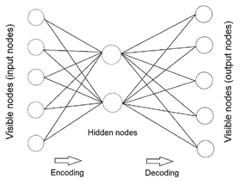
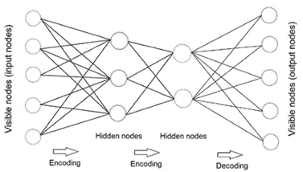
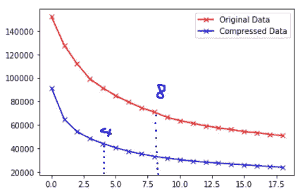
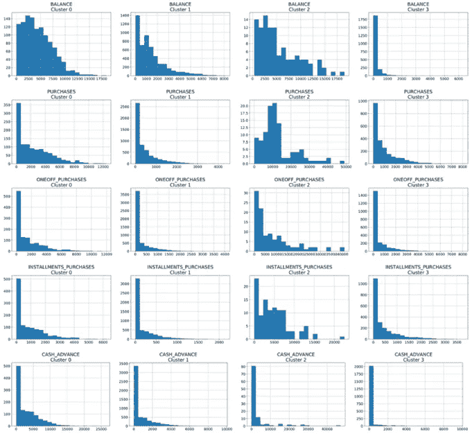
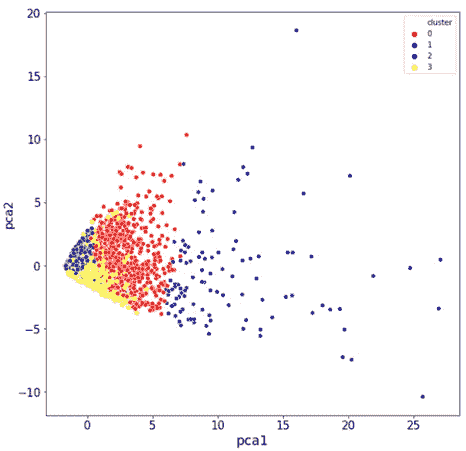

# 基于自动编码器和 K-means 的信用卡客户聚类

> 原文：<https://towardsdatascience.com/credit-card-customer-clustering-with-autoencoder-and-k-means-16654d54e64e?source=collection_archive---------17----------------------->

## 通过改进模型进一步挖掘客户营销的商业智能


来自 pixabay 的 Img 通过[链接](https://pixabay.com/photos/marketing-customer-polaroid-center-2483867/)

在之前的[文章](/stacked-auto-encoder-as-a-recommendation-system-for-movie-rating-prediction-33842386338)中，我们为电影分级预测创建了一个堆栈式自动编码器模型。但正如我们所知，通过编码器部分，自动编码器模型也可以帮助进行特征提取。因此，在本文中，我们将继续使用自动编码器和 k-means 进行客户聚类。像往常一样，它被分成 4 个部分。

1.  自动编码器简介
2.  自动编码器建模
3.  k 均值建模
4.  外卖食品

让我们开始旅程吧🏃‍♂️🏃‍♀️!

**1。自动编码器简介**

自动编码器是一种人工神经网络，用于以无监督的方式学习特征表示。它使用相同的数据进行输入和输出。如图 1 所示，通过在网络中添加瓶颈，它迫使网络创建输入数据的压缩版本，这就是编码器的工作方式。同时，解码器将编码特征重构为其原始输入。



图 1 自动编码器模型结构(图片由作者提供)

有不同类型的自动编码器模型。这里我们将创建一个堆栈式自动编码。在堆叠自动编码器模型中，编码器和解码器具有用于编码和解码的多个隐藏层，如图 2 所示



图 2 堆叠式自动编码器模型结构(图片由作者提供)

**2。自动编码器建模**

简单介绍之后，让我们继续创建一个用于特征提取的自动编码器模型。

**2.1 创建模型**

我们将使用 Keras 来创建模型架构。具体来说，

```
input_df = Input( shape = (17, ))
x = Dense(7, activation = ‘relu’)(input_df)
x = Dense(500, activation = ‘relu’, kernel_initializer=’glorot_uniform’)(x)
x = Dense(500, activation = ‘relu’, kernel_initializer=’glorot_uniform’)(x)
x = Dense(2000, activation = ‘relu’, kernel_initializer=’glorot_uniform’)(x)
encoded = Dense(10, activation = ‘relu’, kernel_initializer=’glorot_uniform’)(x)x = Dense(2000, activation = ‘relu’, kernel_initializer=’glorot_uniform’)(encoded)
x = Dense(500, activation = ‘relu’, kernel_initializer=’glorot_uniform’)(x)
decoded = Dense(17, kernel_initializer=’glorot_uniform’)(x)autoencoder = Model(input_df, decoded)
encoder = Model(input_df, encoded)
autoencoder.compile(optimizer = ‘adam’, loss = ‘mean_squared_error’)
```

对 mention✨✨:来说有几分价值

*   输入张量是一批 17 维向量，因为我们的数据有 17 个特征。
*   网络瓶颈的输出维度是 10，因为我们的目标是将 17 个特征压缩到 10 个特征。
*   网络的最终输出解码后的维数为 17，与输入维数相同。
*   Autoencoder 模型将 input_df 作为输入，解码后作为输出。
*   编码器模型将 *input_df* 作为输入，将*编码后的*作为输出。
*   我们使用 **glorot_uniform** 通过从均匀分布中抽取样本来初始化层权重。

**2.2 拟合&提取**

创建好模型后，让我们来拟合模型。注意，我们对模型输入和输出使用相同的数据！

```
autoencoder.fit(creditcard_df_scaled, creditcard_df_scaled, batch_size= 120, epochs = 25, verbose = 1)
```

然后，我们可以使用编码器部分来提取特征表示。

```
pred = encoder.predict(creditcard_df_scaled)
```

**3。k 均值建模**

**3.1 找 K**

k-means 的第一步是挑选聚类数。我们将使用肘法。为了实现它，我们对不同数量的聚类应用 k-means。具体来说，

```
score_2 = []
range_values = range(1, 20)
for i in range_values:
    kmeans = KMeans(n_clusters = i)
    kmeans.fit(pred)
    score_2.append(kmeans.inertia_)
```

如果您还记得在之前的[文章](https://medium.com/@vistaxjtu/credit-card-customer-clustering-with-k-means-b9ec023a7d6e)中，我们也应用了肘方法，但是使用了原始的特性。图 3 比较了原始数据集和编码数据集的 WCSS 变化。我们发现最佳的 K 是 4。



图 3 WCSS 随聚类数的变化(图片由作者提供)

**3.2 应用 k 均值**

决定了 k 之后，让我们对压缩数据集应用 k-means。

```
kmeans = KMeans(4)
kmeans.fit(pred)
labels = kmeans.labels_
df_cluster_dr = pd.concat([creditcard_df, pd.DataFrame({‘cluster’: labels})], axis = 1)
```

**3.3 可视化集群**

有趣的部分来了！

第一个可视化是比较集群特征。由于功能太多，这里只分析 5 个关键功能，*'余额'，'购买'，'一次性购买'，'分期付款 _ 购买'，'现金 _ 预付'。这里我们将进行一些定性观察。*

仔细看看图 4📣📣。你可以在下面找到:

*   聚类 3 中的客户余额最低，与其他组相比，他们没有进行太多的购买和现金预支。所以，他们对信用卡并不积极或热衷。
*   聚类 2 中的客户是一个余额非常高的群体，与聚类 0 和 1 相比，他们倾向于进行更多的购买，包括一次性购买和分期购买。
*   聚类 1 中的客户的平均余额低于聚类 0。他们的购买模式相似，但聚类 0 中的客户倾向于进行更多的一次性和分期付款购买，尽管他们的平均信用限额低于聚类 1。



图 4 比较聚类特征(图片由作者提供)

这些发现可以使营销策略更有针对性和洞察力📣📣。

**3.4 PCA 可视化**

如果我们想可视化聚类分布，我们的数据集与 10 个特征是不可能做到这一点。但是我们可以使用主成分分析进一步将特征压缩到 2D 空间。具体来说，

```
pca = PCA(n_components = 2)
prin_comp = pca.fit_transform(pred)
```

现在我们可以查看如图 5 所示的集群分布。很好，现在我们可以看到 4 个没有太多重叠的集群。



图 5 主成分分析空间上的聚类分布(图片由作者提供)

**4。外卖**

最初，我们使用 k-means 进行客户聚类，创建了 8 个组。这里，我们进一步重新创建了特性，并使用自动编码器模型将特性总数从 17 个压缩到 10 个。

我们发现每一组都有一些有趣的特征。例如，分类 3(上面的黄点)显示没有低余额的频繁购买。根据营销目的的不同，这些客户可以根据他们的习惯很好地定位。

此外，我们只做了一些定性的观察。我们更好地对每个集群的特征进行定量分析，这可以给我们更多有见地的发现。

太好了！这是所有的旅程。希望你喜欢它。如果你需要代码，请访问我的 Github [repos](https://github.com/luke4u/Credit-Card-Prediction/tree/master/customer_clustering) 💕💕。