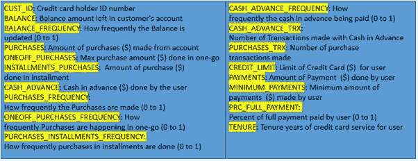
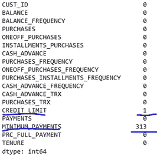
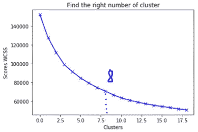
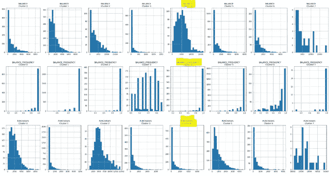
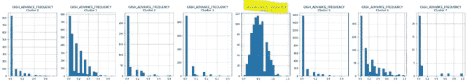
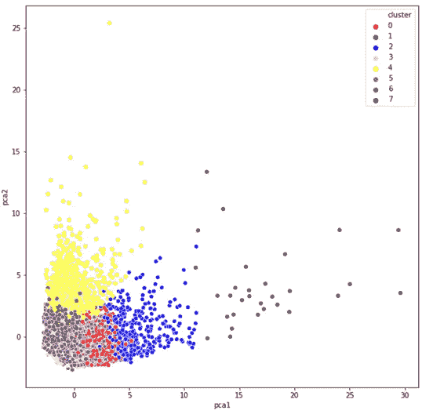

# 基于 K 均值的信用卡客户聚类

> 原文：<https://towardsdatascience.com/credit-card-customer-clustering-with-k-means-b9ec023a7d6e?source=collection_archive---------16----------------------->

## 基于信用卡数据集的 k-means 聚类和 PCA 的商业智能营销


来自 pixabay 的 Img 通过[链接](https://pixabay.com/illustrations/tent-leaves-camping-icons-5635679/)

在之前的[帖子](/credit-card-fraud-detection-9bc8db79b956)中，我们试图使用各种模型来检测信用卡交易中的欺诈。这里我们将转向另一个热门话题——客户聚类。这个帖子旨在帮助市场部的朋友。像往常一样，它被分成 5 个部分。

1.  问题陈述
2.  数据审查
3.  数据处理
4.  k 均值聚类
5.  外卖食品

现在让我们开始旅程🏃‍♀️🏃‍♂️.

**1。问题陈述**

众所周知，营销对于任何企业的发展和可持续性都是至关重要的。然而，对于任何营销专业人士来说，一个关键的痛点是了解客户并确定他们的需求。市场部的同事分配给你的任务是创建一个模型来执行客户分组。

**2。数据回顾**

数据集包含 17 个要素和 8，950 条记录。如图 1 所示，它是关于客户的购买和支付习惯，例如客户多久进行一次一次性或分期付款购买，或者他们多久进行一次现金预付，支付多少，等等。通过检查每个顾客，我们可以发现他/她喜欢哪种类型的购买，或者他/她是否喜欢预付现金而不是购买。



图 1 数据集列定义概述(图片由作者提供)

**3。数据处理**

一般来说，为了深入了解任何原始数据并获得初步发现，我们会执行探索性数据分析(EDA)。我在几篇文章中讨论了这个主题和一般步骤。如果你是 EDA 新手，看看我之前的[文章](/demystify-employee-leaving-with-eda-2ed96525f3a7)。在这里，我们将重点关注以下建模所需的一些步骤。

**3.1 填充缺失值**

由于各种原因，原始数据中经常出现缺失值。要检查每列中缺少多少值，

```
creditcard_df = pd.read_csv(‘Marketing_data.csv’)
creditcard_df.isnull().sum()
```

如图 2 所示，列*‘信用额度’*有 1 个缺失值，而‘最小支付’有 313 个缺失值。



图 2 缺失值计数(作者图片)

处理缺失值的方法有很多，包括:

*   删除缺少值的列
*   插补，用某个数字填充缺失值，例如每列的平均值。
*   插补的扩展。插补是标准方法。但是，估算值可能高于或低于其实际值。为了帮助 model 做出更好的预测，我们可以添加一个列，将缺失的值标记为 True 或 False。

在这种情况下，我们将填充缺失值列的平均值。具体来说，

```
creditcard_df.loc[(creditcard_df[‘MINIMUM_PAYMENTS’].isnull() == True), ‘MINIMUM_PAYMENTS’] = creditcard_df[‘MINIMUM_PAYMENTS’].mean()creditcard_df.loc[(creditcard_df[‘MINIMUM_PAYMENTS’].isnull() == True), ‘MINIMUM_PAYMENTS’] = creditcard_df[‘MINIMUM_PAYMENTS’].mean()
```

**3.2 跌落特性**

数据集包含 17 个要素。现在我们需要考虑是否所有这些都是训练模型所必需的。在我们这种情况下，*‘CUST _ ID’*是无济于事的。所以我们会放弃。

```
creditcard_df.drop(‘CUST_ID’, axis = 1, inplace = True)
```

**3.3 秤特点**

有些特征如*‘购买’*变化范围很大，而其他特征如*‘购买 _ 频率’*在 0 到 1 之间变化。我们需要在同一范围内缩放所有功能。这里我们使用来自 **sklearn** 的 **StandardScaler()** 来移除平均值并缩放至单位方差。

```
scaler = StandardScaler()
creditcard_df_scaled = scaler.fit_transform(creditcard_df)
```

**4。k 均值聚类**

k-means 聚类是一种无监督的机器学习算法。根据维基百科，它旨在将观测值划分为 k 个集合，以最小化组内平方和(WCSS)。WCSS 表示聚类中所有点到质心的距离的总和。它从一组随机初始化的质心开始，然后执行迭代计算以优化质心的位置，直到质心稳定，或者达到定义的迭代次数。

**4.1 找 K**

k-means 的第一步是挑选聚类数。肘法是最受欢迎的方法之一。为了实现它，我们对不同数量的聚类应用 k-means 并比较它们的 WCSS。具体来说，

```
score_1 = []
range_values = range(1, 20)
for i in range_values:
    kmeans = KMeans(n_clusters = i)
    kmeans.fit(creditcard_df_scaled)
    score_1.append(kmeans.inertia_)
```

图 3 显示了 WCSS 随集群数量的变化。为了确定聚类的最佳数量，**我们必须选择“弯头”处的 k 值，即在该点之后失真/惯性开始以线性方式降低**。因此，我们得出结论，最佳聚类数是 8。



图 3 WCSS 随聚类数的变化(图片由作者提供)

**4.2 应用 k 均值**

确定了最佳聚类数后，让我们应用 k-means 并预测每个样本的聚类。具体来说，

```
kmeans = KMeans(n_clusters = 8, init = ‘k-means++’, max_iter = 300, n_init = 10, random_state = 0)labels = kmeans.fit_predict(creditcard_df_scaled)
```

注意，我们将 k 均值的运行次数设置为 10。这意味着 k-means 将使用不同的质心种子运行 10 次，最终结果将是 WCSS 方面的最佳输出。此外，我们将单次运行的 k 均值的最大迭代次数设置为 300。

**4.3 可视化集群**

有了预测结果，第一个可视化是检查每个聚类的特征分布。

例如，让我们以集群 4 为例进行分析。**如图 4 所示，与其他聚类相比，我们发现聚类 4 中的客户倾向于具有高账户余额，并且非常频繁地更新余额，但是他们的购买金额非常偏向 0。这表明客户对预借现金更感兴趣，如图 5** 所示。



图 4 将聚类 3 的特征与其余聚类进行比较



图 5 比较集群之间的*‘CASH _ ADVANCE’*(图片由作者提供)

作为一名信用卡用户，我经常购物，但不喜欢预支现金。因此，我发现自己可能属于第 0 类，它代表经常进行一次性购买，但不热衷于分期付款和预付现金的客户。但是如果你分期付款购物，而不是预付现金，你可能属于第二类。

就我个人而言，我发现分析不同客户群体在交易中的表现非常有趣✨✨.也许试一试，看看你适合哪里📣📣？

**4.4 PCA**

显然，直方图对于分析聚类特征很有用，但对于可视化总体聚类分布却没那么有用。因为我们有 17 个特征，所以我们必须压缩自由度的维度，以便直观地观察集群分布。为此，我们使用主成分分析(PCA)将特征压缩到 2D 空间中。

对于那些不熟悉 PCA 的人来说，PCA 通常用于降维，通过将数据仅投影到第一主分量上来获得低维数据，同时保留或最大化沿投影方向的方差(顺便说一句，这来自[维基百科](https://en.wikipedia.org/wiki/Principal_component_analysis)🤭).

所以，为了实现 PCA，

```
from sklearn.decomposition import PCA
pca = PCA(n_components = 2)
principal_comp = pca.fit_transform(creditcard_df_scaled)
pca_df = pd.DataFrame(data = principal_comp, columns = [‘pca1’, ‘pca2’])
pca_df = pd.concat([pca_df, pd.DataFrame({‘cluster’: labels})], axis = 1)
```

最后，将 17 个特征压缩为 2 个特征，图 6 显示了 k 均值预测结果的散点图。你可能会注意到红色星团分散在蓝色星团、粉色星团和绿色星团中。这可能表明红色聚类与其他聚类具有特征相似性。也许我们可以用新技术再造一个新的集群🤔🤔？



图 6 主成分分析空间上的聚类分布(图片由作者提供)

**5。外卖**

我们创建了一个 k-means 模型，成功地将信用卡客户分为 8 类。我们发现集群 0、2 和 4 的一些有趣的购买和支付模式，还有更多有待探索。我们还注意到集群之间有一些重叠，表明还有改进的空间。

太好了。希望你觉得这次旅行很有趣。为了继续这个话题，我将在下一篇文章中进一步挖掘，看看我们是否可以改进聚类结果。在那里见💕💕。