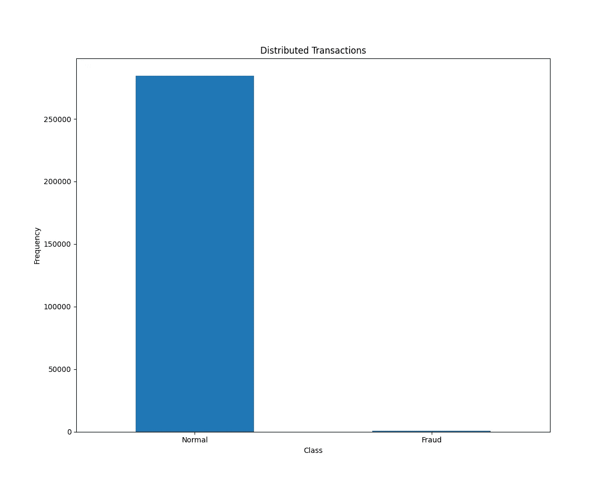
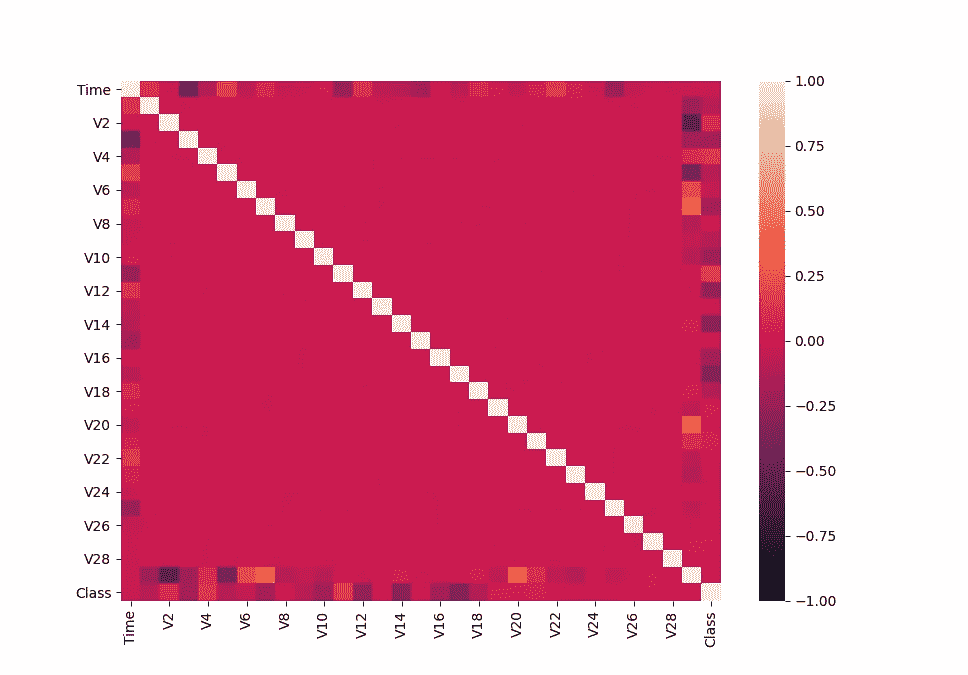
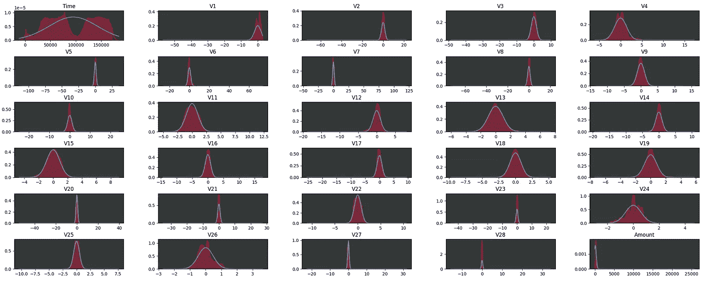
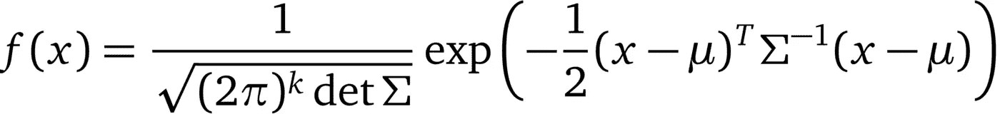

# 信用卡欺诈检测

> 原文：<https://towardsdatascience.com/credit-card-fraud-detection-1b3b3b44109b?source=collection_archive---------27----------------------->

## 使用多元高斯分布的欺诈检测


图片由[穆罕默德·哈桑](https://pixabay.com/users/mohamed_hassan-5229782/?utm_source=link-attribution&utm_medium=referral&utm_campaign=image&utm_content=3696073)拍摄，来自[皮克斯拜](https://pixabay.com/?utm_source=link-attribution&utm_medium=referral&utm_campaign=image&utm_content=3696073)

# 动机

如今，大多数交易都在网上进行，这意味着信用卡和其他在线支付系统也参与其中。这种方法对公司和消费者都很方便。消费者节省了时间，因为他们不必去商店购物，公司通过不欠实体店和避免昂贵的租金来节省资金。数字时代似乎带来了一些非常有用的功能，这些功能改变了公司和消费者之间的互动方式，但只有一个成本…公司需要雇用熟练的软件工程师和渗透测试人员，以确保所有交易都是合法的、非欺诈性的。这些人在设计公司的服务器时，让客户无法控制关键的交易部分，如支付金额。通过精心设计，大多数(如果不是全部)问题都可以消除，但即使是用来创建服务器的框架也不是完美的。例如，如果你遵循 django 框架发布说明，你会发现在不同的版本中有许多错误修正，因此一个公司不应该仅仅依赖于它的工程技术。

# Python 中的信用卡欺诈检测

在本文中，我将介绍一种方法来检测是否有人绕过安全墙进行非法交易。你可以在我的 [github repo](https://github.com/christk1/anomaly-detection) 中找到代码和数据集，但是我强烈建议你按照本文的说明来构建它。

数据集由信用卡交易组成，其特征是 PCA 分析的产物，因此除了“金额”、“时间”和“类别”之外，我们不知道它们代表什么。“金额”是每笔交易的价格，“时间”是<<seconds elapsed="" between="" each="" transaction="" and="" the="" first="">>“类别”在其值等于 **1** 时表示一笔**欺诈交易**，在其值等于 **0** 时表示一笔**有效交易**。最初，我们将安装所需的包，以便从我的 GitHub repo 中找到“requirements.txt”文件，创建一个虚拟环境安装它们:</seconds>

```
pip install -r requirements.txt
```

最初创建一个“main.py”文件并导入以下内容:

```
import numpy as np
import pandas as pd
import sklearn
from scipy.stats import norm
from scipy.stats import multivariate_normal
from sklearn.preprocessing import MinMaxScaler
import matplotlib.pyplot as plt
import seaborn as sns
```

现在，我们将读取数据集并检查是否有任何缺失值:

```
df = pd.read_csv('creditcardfraud/creditcard.csv')# missing values
print("missing values:", df.isnull().values.any())
```

没有丢失的值，所以我们可以继续进行可视化，以更好地理解我们的数据。让我们画出数据集的平衡程度:

```
# plot normal and fraud
count_classes = pd.value_counts(df['Class'], sort=True)
count_classes.plot(kind='bar', rot=0)
plt.title("Distributed Transactions")
plt.xticks(range(2), ['Normal', 'Fraud'])
plt.xlabel("Class")
plt.ylabel("Frequency")
plt.show()
```



我们发现我们的数据非常不平衡。因此，我们不能直接使用任何监督学习算法，因为它会基于“正常”的例子过度拟合。此时，我们仍处于数据调查分析阶段，因此让我们绘制热图:

```
# heatmap
sns.heatmap(df.corr(), vmin=-1)
plt.show()
```



我们似乎没有高度相关的特征，尽管“V2”和“金额”之间存在轻微的负相关(标签*未显示在上面的热图中，但它接近“类别”特征*)特征。“Amount”功能与其他功能也略有关联，这意味着它可以部分地由他们计算，所以我们可以尝试放弃它(从我的测试来看，这给了最终分数一个很好的改善)。“时间”和其他特性之间也有一点关联，但是在这篇文章之后，我们会看到一个更重要的理由来放弃它。

到目前为止，我们做了一些不错的数据分析，但我们没有做最重要的部分，即了解“我们的数据来自哪里”。因此，下一张图将是数据分布图:

```
fig, axs = plt.subplots(6, 5, squeeze=False)
for i, ax in enumerate(axs.flatten()):
    ax.set_facecolor('xkcd:charcoal')
    ax.set_title(df.columns[i])
    sns.distplot(df.iloc[:, i], ax=ax, fit=norm,
                 color="#DC143C", fit_kws={"color": "#4e8ef5"})
    ax.set_xlabel('')
fig.tight_layout(h_pad=-1.5, w_pad=-1.5)
plt.show()
```



我鼓励您在本地机器上执行上述代码片段，以便更好地查看结果。蓝线表示实际的高斯分布，而红线表示数据的概率密度函数。我们看到几乎每个特征都来自**正态(或高斯)分布**，除了来自“时间”分布。因此，这将是我们使用多元高斯分布进行**欺诈检测的动机。这种方法只适用于高斯分布的特征，因此如果你的数据不像高斯分布，你可以用我在这篇文章中描述的方法将其转换。例如，你可以在“第 26 版”、“第 4 版”、“V1”上尝试这种技巧，看看你是否能在我们的最终得分上有所提高。“时间”特征来自于**双峰分布**，其不能被转换为类高斯分布，因此我们将丢弃它。放弃“时间”特性的另一个原因是，它似乎不像其他图表中显示的特性那样包含极值**。****

此外，我们将使用的算法对距离度量很敏感，因此如果我们将特征缩放到固定范围，我们将获得更好的结果。添加下面的代码片段，该代码片段将删除上面提到的功能，并缩放其他功能，使它们的值介于 0 和 1 之间:

```
classes = df['Class']
df.drop(['Time', 'Class', 'Amount'], axis=1, inplace=True)
cols = df.columns.difference(['Class'])
MMscaller = MinMaxScaler()
df = MMscaller.fit_transform(df)
df = pd.DataFrame(data=df, columns=cols)
df = pd.concat([df, classes], axis=1)
```

**注意**minmax scaler 不会改变分布的形状，因此异常值仍会在正确的位置。

至此，我们完成了数据分析和预处理，并准备深入研究算法的实现细节。该算法的步骤如下:

1.  查找可能包含异常示例的要素(完成)
2.  计算训练集中每个特征的平均值，训练集中通常包含**正常**交易的 **60%**
3.  计算训练集的协方差矩阵
4.  计算训练集上的多元正态 pdf(概率密度函数)(下面给出的*)*
5.  *计算验证集上的多元正态 pdf(包含**欺诈**交易的 **50%** ，通常包含**正常**交易的 **20%***
6.  *在测试集上计算多元正态 pdf(包含**欺诈**交易的 **50%** ，通常包含**正常**交易的 **20%***
7.  *基于来自**验证**集合的 **pdf** 找到一个阈值，该阈值表明比**阈值**小**的 **pdf 值**是**异常值*****
8.  *计算测试集上的**异常值**，这些异常值是比先前阈值小**的 **pdf 值**的**和*****

**

**多元正态 pdf**

*其中 **μ** 为均值， **det** 为行列式，**σ**为协方差矩阵， **κ** 为 **x** 取值所在空间的维数。*

> **通常，该 pdf 返回交易正常的< <置信度> >。如果该数字低于阈值，则该交易是异常值。**

*是的，我知道上面的 pdf 伤了你的眼睛(就像我的一样)，但它已经在 scipy 包中实现了…*

*继续我们的代码，创建一个名为“functions.py”的文件，我们将在其中添加有用的函数来实现算法的某些阶段，并放置以下函数，该函数将我们的数据集分为训练集、验证集和测试集:*

```
*import pandas as pd
import numpy as npdef train_validation_splits(df):
    # Fraud Transactions
    fraud = df[df['Class'] == 1]
    # Normal Transactions
    normal = df[df['Class'] == 0]
    print('normal:', normal.shape[0])
    print('fraud:', fraud.shape[0]) normal_test_start = int(normal.shape[0] * .2)
    fraud_test_start = int(fraud.shape[0] * .5)
    normal_train_start = normal_test_start * 2 val_normal = normal[:normal_test_start]
    val_fraud = fraud[:fraud_test_start]
    validation_set = pd.concat([val_normal, val_fraud], axis=0) test_normal = normal[normal_test_start:normal_train_start]
    test_fraud = fraud[fraud_test_start:fraud.shape[0]]
    test_set = pd.concat([test_normal, test_fraud], axis=0) Xval = validation_set.iloc[:, :-1]
    Yval = validation_set.iloc[:, -1] Xtest = test_set.iloc[:, :-1]
    Ytest = test_set.iloc[:, -1] train_set = normal[normal_train_start:normal.shape[0]]
    Xtrain = train_set.iloc[:, :-1] return Xtrain.to_numpy(), Xtest.to_numpy(), Xval.to_numpy(), Ytest.to_numpy(), Yval.to_numpy()*
```

*现在添加下面的函数来计算平均值和协方差矩阵:*

```
*def estimate_gaussian_params(X):
    """
    Calculates the mean and the covariance for each feature. Arguments:
    X: dataset
    """
    mu = np.mean(X, axis=0)
    sigma = np.cov(X.T) return mu, sigma*
```

*回到我们的“main.py ”,导入并调用上述函数以及我们每组的多元正态 pdf:*

```
*(Xtrain, Xtest, Xval, Ytest, Yval) = train_validation_splits(df)(mu, sigma) = estimate_gaussian_params(Xtrain)# calculate gaussian pdf
p = multivariate_normal.pdf(Xtrain, mu, sigma)
pval = multivariate_normal.pdf(Xval, mu, sigma)
ptest = multivariate_normal.pdf(Xtest, mu, sigma)*
```

*现在是时候参考阈值(或“ε”)了。一般来说，一个好的做法是用 pdf 的最小值初始化阈值，并以一小步递增，直到达到最大 pdf，同时将每个阈值保存在一个向量中。对于我们的问题，我发现来自 pdf 的值可以有效地用于创建阈值向量。创建向量后，我们创建一个“for”循环，并对其进行迭代。在每次迭代中，我们将当前阈值与产生我们预测的 pdf 值进行比较。然后，我们根据我们的**预测**和**地面实况**值计算 **F1 分数**，如果我们发现 F1 分数大于之前的分数，我们将覆盖一个“最佳阈值”变量。在“for”循环结束时，我们得到了产生最佳 F1 分数的ε值。*

***注意**我们不能用准确性作为我们的衡量标准！如果我们确定所有的交易都是“正常”的，我们可能有 99%的准确率和一个无用的算法。*

*要实现上述功能，请将以下函数添加到“functions.py”中:*

```
*def metrics(y, predictions):
    fp = np.sum(np.all([predictions == 1, y == 0], axis=0))
    tp = np.sum(np.all([predictions == 1, y == 1], axis=0))
    fn = np.sum(np.all([predictions == 0, y == 1], axis=0)) precision = (tp / (tp + fp)) if (tp + fp) > 0 else 0
    recall = (tp / (tp + fn)) if (tp + fn) > 0 else 0
    F1 = (2 * precision * recall) / (precision +
                                     recall) if (precision + recall) > 0 else 0
    return precision, recall, F1def selectThreshold(yval, pval):
    e_values = pval
    bestF1 = 0
    bestEpsilon = 0 for epsilon in e_values:
        predictions = pval < epsilon (precision, recall, F1) = metrics(yval, predictions) if F1 > bestF1:
            bestF1 = F1
            bestEpsilon = epsilon return bestEpsilon, bestF1*
```

*最后，在我们的“main.py”文件中导入函数，并调用它们来返回我们的阈值和验证集的 F1 分数，并在我们的测试集上评估我们的模型:*

```
*(epsilon, F1) = selectThreshold(Yval, pval)print("Best epsilon found:", epsilon)
print("Best F1 on cross validation set:", F1)(test_precision, test_recall, test_F1) = metrics(Ytest, ptest < epsilon)
print("Outliers found:", np.sum(ptest < epsilon))
print("Test set Precision:", test_precision)
print("Test set Recall:", test_recall)
print("Test set F1 score:", test_F1)*
```

*结果是:*

```
*Best epsilon found: 5e-324 
Best F1 on cross validation set: 0.7852998065764023

Outliers found: 210 
Test set Precision: 0.9095238095238095 
Test set Recall: 0.7764227642276422 
Test set F1 score: 0.837719298245614*
```

*哪个挺好的！*

> **本教程已经结束，希望这些信息对您有用。请不吝赐教，并询问您不明白的事情，我会尽快回复您！**

**最初发表于*[Python 中的欺诈检测(devnal.com)](https://devnal.com/articles/7/fraud-detection-in-python/)*。**