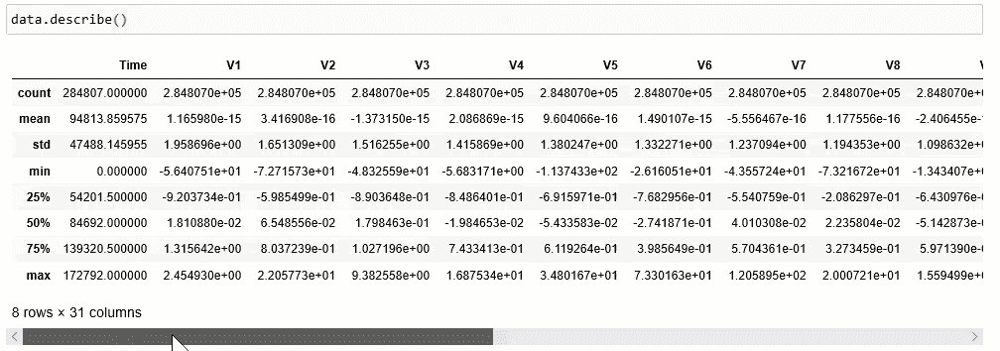
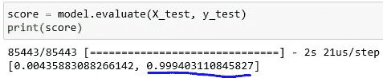
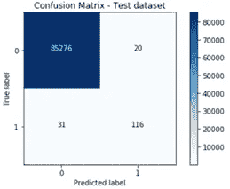
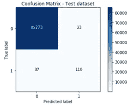
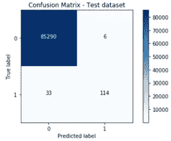
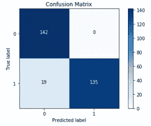
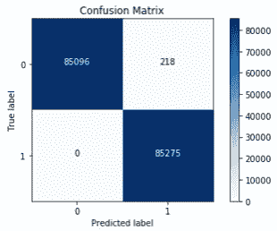
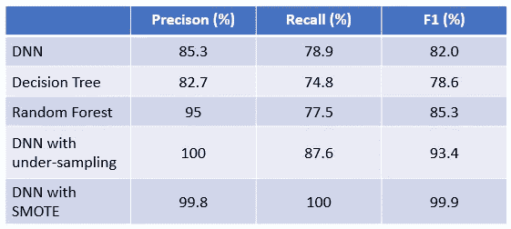

# 信用卡欺诈检测

> 原文：<https://towardsdatascience.com/credit-card-fraud-detection-9bc8db79b956?source=collection_archive---------7----------------------->

## 机器学习模型和深度神经网络比较和采样技术来提高性能


来自 Stockvault 的 Img 通过[链接](https://www.stockvault.net/photo/254493/hacking-credit-card-illustration#)

在本文中，让我们带您经历一场关于信用卡欺诈检测的 Kaggle 竞赛。**将建立一个深度神经网络和两个机器学习模型来应对挑战，并比较不同模型的性能。**此外，将实施数据采样技术来改进模型。像往常一样，分成 9 个部分:

1.  商业挑战
2.  数据审查
3.  数据处理
4.  DNN 模型建筑
5.  DNN 模型评估
6.  决策图表
7.  随机森林
8.  抽样
9.  摘要

现在让我们开始旅程🏃‍♂️🏃‍♀️.

**1。业务挑战**

检测欺诈交易对任何信用卡公司都非常重要。一家知名公司让我们负责检测潜在的欺诈行为，这样客户就不会为他们没有购买的商品付费。因此，我们的目标是建立一个分类器，判断一项交易是不是欺诈。

**2。数据回顾**

数据集是 Kaggle 信用卡欺诈检测数据集[这里是](https://www.kaggle.com/mlg-ulb/creditcardfraud)。它包含欧洲持卡人在 2013 年 9 月进行的两天交易。该数据集包含 284，807 笔交易中的 492 笔欺诈。因此，它是高度不平衡的，正面(欺诈)仅占 0.17%。

查看视频中显示的数据，您可能会发现它只包含数字变量。特征 *V1，V2，… V28* 是 PCA 变换得到的主要成分。唯一没有被转换的特征是*‘时间’*和*‘金额’*。*“时间”*是每次交易与第一次交易之间经过的秒数。“金额”是交易金额。 ***【类】*为响应变量，1 为欺诈，0 为非欺诈**。

原始输入数据集的视频简要视图

**3。数据处理**

要快速了解每个变量的分布，下面我们来试试。



Gif 数据分布的简要视图

正如您所注意到的，变量*‘Amount’*的范围是从 0 到 25，691.16。为了缩小其较大的范围，我们使用**标准化**来移除平均值并缩放至单位方差，以便 68%的值位于(-1，1)之间。如果你想了解这个话题的更多细节，请阅读这篇文章。

具体来说，

```
scaler = StandardScaler()data[‘NormalizedAmount’] = scaler.fit_transform(data[‘Amount’].values.reshape(-1, 1))
```

注意我们必须使用*" . values . shape(-1，1)"* 将**系列**转换为**数组**，并整形为 2D 数组。尝试删除这一部分，看看你得到的错误。这是一个常见的📣📣！！

现在让我们将数据分成 X 和 y 两部分，具体来说，

```
data = data.drop([‘Amount’, ‘Time’], axis = 1)
y = data[‘Class’]
X = data.drop([‘Class’], axis = 1)
```

列 *['Amount '，' Time']* 被删除，因为建模不需要它们。注意，我们在删除列时设置**轴= 1** 。如果您不熟悉 drop 函数，这是另一个常见错误📣📣！

最后，让我们将数据分成训练和测试数据集。具体来说，

```
from sklearn.model_selection import train_test_split
X_train, X_test, y_train, y_test = train_test_split(X, y, test_size = 0.3, random_state = 0)
```

**4。DNN 模型建筑**

在这里，我们将使用 **Keras** 中的顺序模型构建一个 5 层深度神经网络。具体来说，

```
model = Sequential([
Dense(input_dim = 29, units = 16, activation = ‘relu’),
Dense(units = 24, activation = ‘relu’),
Dropout(0.5),
Dense(units = 20, activation = ‘relu’),
Dense(units = 24, activation = ‘relu’),
Dense(units =1, activation = ‘sigmoid’),])
```

对于第一个隐藏层， *input_dim* 是输入变量的数量。*units’的*是每层中节点或神经元的数量。

我们使用校正线性单元( *ReLU* )作为隐藏层的激活函数。 ***ReLU* 在构建深度神经网络时，通常表现优于 Sigmoid 和双曲线正切函数。这是因为当输入值过大或过小时，Sigmoid 和 Tanh 会趋于饱和。此外，它们仅在其中点周围显示高梯度，例如对于 sigmoid 为 0.5，对于 tanh 为 0。如果你想要更多关于 *ReLU* 的细节，请随意阅读这篇[文章](https://machinelearningmastery.com/rectified-linear-activation-function-for-deep-learning-neural-networks/)。**

我们在二进制分类问题的输出层使用 Sigmoid 函数。如果你想了解更多关于如何创建神经网络的知识，请阅读这篇文章。

**5。DNN 车型评测**

有了模型架构，让我们编译和训练模型。具体来说，

```
model.compile(optimizer = ‘adam’, loss = ‘binary_crossentropy’, metrics = [‘accuracy’])
model.fit(X_train, y_train, batch_size = 15, epochs = 5)
```

注意，上面我们使用“*二元交叉熵*作为损失函数，并使用“*Adam”*来更新网络权重。*‘Adam’*是深度学习领域快速取得好结果的流行算法。如果你想知道更多关于亚当的细节，请随意阅读这篇文章。

模型权重每 15 个样本更新一次。如果你不清楚 epoch 和 batch 的概念。一个时期代表整个训练集通过网络输入的一个时间。批次定义了在更新内部模型参数之前要迭代的样本数。在批次结束时，将预测与预期输出进行比较，并计算误差。利用这个误差，优化器通过降低误差梯度来改进模型。

太好了。现在我们来评价一下模型。具体来说，



图 2 DNN 评估

请记住，我们使用“**准确性”**作为衡量标准。该模型以 99.94%的准确率找到了✨✨！

*现在有一个问题要问你:如此高的精度是否意味着良好的性能？*如果您还记得的话，准确度是真阴性和真阳性之和除以总数据集大小。如果 95%的数据集是负面的(非欺诈)，网络将巧妙地预测所有都是负面的，导致 95%的准确性。**然而，对于欺诈检测来说，检测正面比检测负面更重要。因此，我们需要更好的指标。**

图 3 显示了使用测试数据集的混淆矩阵。DNN 的准确率为 85.3%，召回率为 78.9%，F1 得分为 82.0%。大约 20%的欺诈被错误分类为非欺诈，导致客户额外付费，尽管准确率为 99.94%。因此，有足够的空间来改进 DNN 模式📣📣。



图 3 DNN 混淆矩阵

**6。决策树**

> 正如 [Wikipedia](https://en.wikipedia.org/wiki/Decision_tree) 所述，决策树是一个类似流程图的结构，其中每个内部节点代表对一个特征的测试(例如，天气是晴是雨)，每个叶子节点是所有测试后得到的类别标签。决策树旨在学习基于条件分割数据集的方法。所以，它是非参数的。

现在让我们建立一个决策树模型。具体来说，

```
from sklearn.tree import DecisionTreeClassifier
decision_tree_model = DecisionTreeClassifier()
decision_tree_model.fit(X_train, y_train)
y_pred = decision_tree_model.predict(X_test)
```

图 4 显示了模型的混淆矩阵。决策树给出的准确率为 82.7%，召回率为 74.8%，F1 值为 78.6%，比 DNN 模型差😥😥！



图 3 决策树混淆矩阵

**7。随机森林**

> 从概念上讲，随机森林(RF)是决策树的集合。每棵树投票给一个类，得到最多投票的类是预测的类。决策树是在整个数据集上构建的，而随机森林随机选择要素来构建多个决策树并对结果进行平均。如果你想了解更多关于射频工作原理和参数优化的信息，请阅读这篇[文章](/comparison-and-optimization-on-ml-models-for-loan-application-prediction-675923d83d04)。

具体来说，

```
from sklearn.ensemble import RandomForestClassifier
rf_model = RandomForestClassifier(n_estimators = 100)
rf_model.fit(X_train, y_train)
y_pred = rf_model.predict(X_test)
```

训练模型需要几分钟时间。最终，RF 的准确率为 95%，召回率为 77.5%，F1 值为 85.3%，优于 DNN 和决策树模型🤪！



图 3 随机森林混淆矩阵

**8。采样**

**关于我们这里的数据集，一个问题是阶级不平衡。**284，807 笔交易中只有 0.17%是欺诈。可悲的是，该模型对检测多数类比少数类更敏感。一般来说，有两种技术可以解决类不平衡，欠采样和过采样。

8.1 欠采样

最简单的策略是随机选择多数阶级来平衡少数阶级。但局限性在于，从多数类中随机移除的数据可能有助于创建稳健的模型。

我们先实施这个策略。具体来说，

```
fraud_ind = np.array(data[data.Class == 1].index)
normal_ind = data[data.Class == 0].index
random_normal_ind = np.random.choice(normal_ind, num_frauds, replace = False)
random_normal_ind = np.array(random_normal_ind)
under_sample_data = data.iloc[under_sample_ind, :]X_undersample = under_sample_data.iloc[:, under_sample_data.columns != ‘Class’]
y_undersample = under_sample_data.iloc[:, under_sample_data.columns == ‘Class’]
```

上面，我们随机选择了与欺诈相同数量的非欺诈，并创建了一个新的数据集。使用缩减后的数据，重新训练 DNN 模型。最终，欠采样给出的准确率为 100%，召回率为 87.6%，f 1 值为 93.4%。比没有欠采样的 DNN 好得多😇！



图 4 欠采样混淆矩阵下的 DNN

8.2 SMOTE

最简单的过采样方法是复制少数类中的数据，但不会向模型中添加新信息。或者，我们可以从现有数据中合成数据，称为合成少数过采样，简称 SMOTE。

> **SMOTE，最初由 Nitesh Chawla 于 2002 年提出，其工作原理是选择特征空间中接近或相似的数据，并在数据之间画一条线，并在该线上的一点制作新数据。**这是有效的，因为新数据接近特征空间中的少数类。如果你想了解 SMOTE，请随意阅读 Nitesh 的[文章](https://arxiv.org/abs/1106.1813)。

现在，让我们实现 SMOTE 并重新训练模型。具体来说，

```
from imblearn.over_sampling import SMOTE
X_resample, y_resample = SMOTE().fit_sample(X, y)
```

上面的代码创建了一个平衡的' *y_resample'* ，其中有 284，315 个欺诈和 284，315 个非欺诈。在重新训练 DNN 模型之后，SMOTE 给出了 99.8%的精确度、100%的召回率和 99.9%的 f 1 分数。无论有无欠采样，都比 DNN 好得多😇😇！



图 5 DNN 与 SMOTE 混淆矩阵

**9。总结**

作为总结，我们创建了 5 个模型，DNN，决策树和随机森林，DNN 欠采样，DNN SMOTE。如下表所示，使用 SMOTE 的 DNN 性能最佳。



**太好了！这是所有的旅程。如果你想看代码，看我的资源库** [**这里**](https://github.com/luke4u/Credit-Card-Fraud-Detection) **🤞🤞。**