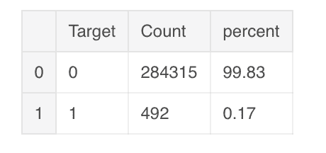
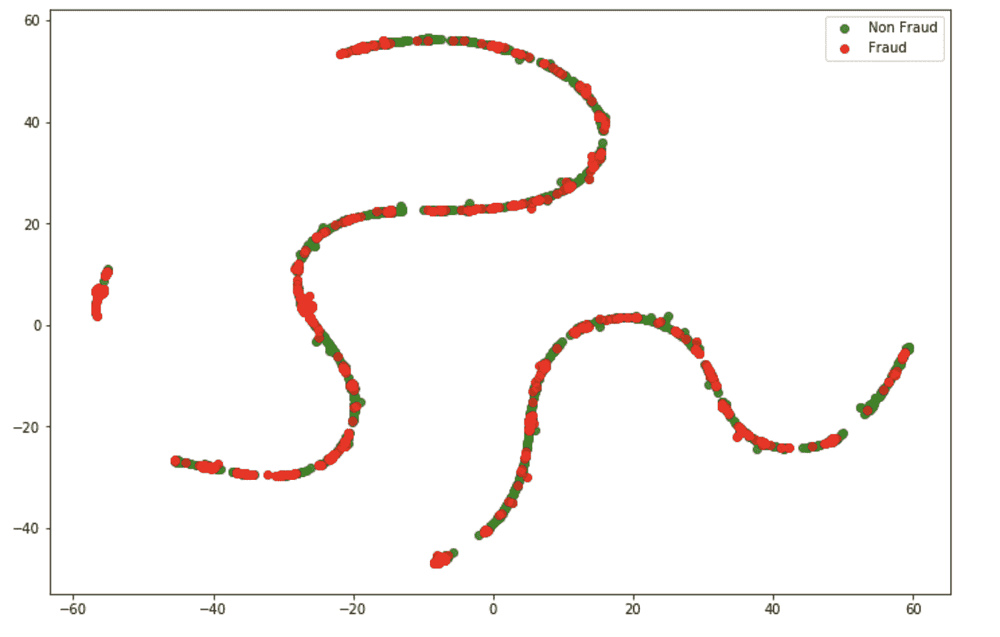
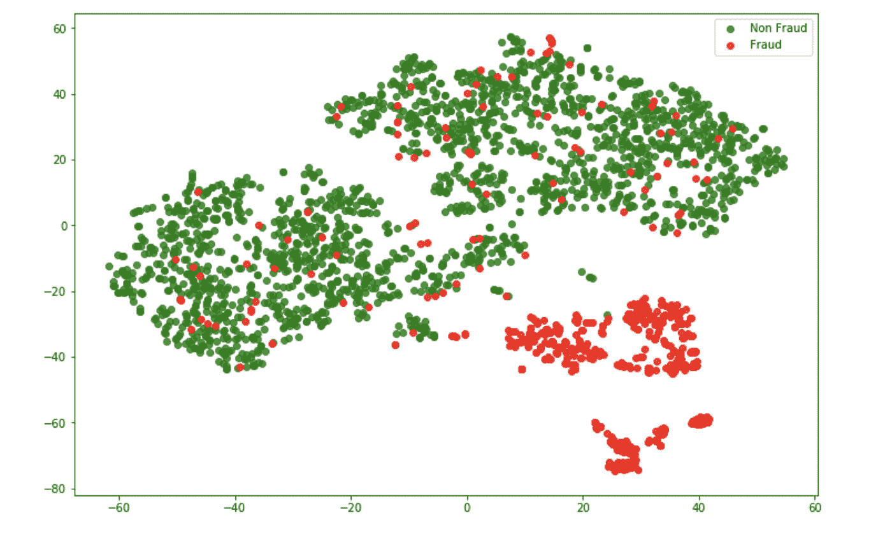

# 基于机器学习的信用卡欺诈检测

> 原文：<https://towardsdatascience.com/credit-card-fraud-detection-with-machine-learning-6cf8e7c78639?source=collection_archive---------34----------------------->

## 使用编码器-解码器架构检测欺诈交易

由 [Ales Nesetril](https://unsplash.com/@alesnesetril?utm_source=medium&utm_medium=referral) 在 [Unsplash](https://unsplash.com?utm_source=medium&utm_medium=referral) 上拍摄的照片

欺诈检测是异常检测的众多案例之一，是金融市场的一个重要方面。有什么办法可以根据交易历史来预测一笔交易是不是欺诈？让我们探索一个神经网络架构，因为它试图预测案件是否为欺诈。到本文结束时，我们将能够使用 Keras 从头构建一个编码器-解码器架构，并将交易分类为欺诈性或非欺诈性。

# 资料组

我们使用 ULB 机器学习小组的数据集信用卡欺诈检测。该数据集包含 28 个匿名变量、1 个“数量”变量、1 个“时间”变量和 1 个目标变量—类。变量被匿名化，以保护客户的隐私，因为数据集是在公共领域。数据集可以在这里找到[。作为目标变量的“0”对应于非欺诈案例，而目标变量中的“1”对应欺诈案例。](https://www.kaggle.com/mlg-ulb/creditcardfraud)

我们导入所需的包

在执行了极简探索性数据分析并测量了数据集是否偏斜之后，我们得出了以下分布结果。

数据集的分布

从上图可以明显看出，我们面临的最大挑战之一是数据集的偏斜。目标阶层高度不平衡，只有 0.17%的数据属于欺诈交易。

对于我们的用例，为了使我们的生活更简单，我们将只取大约 1000 行非欺诈性交易。你可以从[这里](/top-3-methods-for-handling-skewed-data-1334e0debf45)阅读如何统计偏斜的数据点。

# 可视化数据

为了形象化我们的数据分布，我们使用了 T-SNE。T-SNE 或 T-分布式随机邻居嵌入是一种数据分解技术，它将数据减少到特定的维度，并显示具有最大信息的前 n 个维度，这种技术类似于[主成分分析](https://en.wikipedia.org/wiki/Principal_component_analysis)

下图中的每个点代表一个事务。非欺诈交易用绿色表示，而欺诈交易用红色表示。T-SNE 提取的成分用两个轴表示，如下所示。

二维平面中数据点的表示

从上图中，我们可以观察到许多非欺诈交易与欺诈交易以这种螺旋形状重叠，因此很难使用决策边界进行分类。我们将使用一种称为自动编码器的神经网络架构来解决这个问题。

# 编码器-解码器架构

自动编码器或编码器-解码器架构是一种特殊类型的神经网络，其中我们在输入和输出层中具有相同数量的属性，即在输入和输出层中具有相同数量的神经元的架构。自动编码器使用无监督学习下的回归技术来学习输入数据的低级/潜在表示。这些低级表示或“编码”表示被变形或“解码”回原始形状，以投影实际数据。换句话说，期望网络预测它的实际输入。自动编码器在中间包含一个少数神经元的紧密瓶颈，从那里可以获得编码的表示。实际上，在自动编码器中，数据被压缩成低维代码，从这里被解压缩回输入时的实际维度。

我们将创建一个自动编码器模型，在这个模型中，我们将尝试学习非欺诈案例的潜在表示。同样的模型也将用于欺诈案件，我们希望欺诈数据点与非欺诈案件有所不同。

请注意，输入和输出维度是相等的。该架构试图模拟输入的输出。正如我们所见，编码层和解码层之间存在对称性，这是该架构背后的主要思想。

为了避免任何数据管理不当，我们应用数据标准化，并将数据拟合到我们的神经网络中。

这种方法的美妙之处在于，我们不需要太多的数据样本来学习好的表示。

小样本的概念是基于这样一种直觉，即一个类别随后不同于另一个目标类别。我们向我们的网络显示单一类别的数据，以便我们的网络能够区别其他类别。

# 潜在表象

在训练我们的模型之后，我们对找到输入的隐藏或编码表示感兴趣。这可以通过编码层的权重来获得。我们创建另一个仅包含编码层的顺序模型。我们将只添加训练的权重，直到存在潜在表示的第三层。这是为了确保我们能够获得特定情况下的编码，无论是欺诈/非欺诈作为输出。

我们现在的目标是使用获得的隐藏表示创建一个数据集。

“rep_x”包含由相应的“rep_y”变量表示的目标类的编码表示。

现在让我们试着想象这些编码的表示，不管它们是否被区分，既然我们已经获得了编码的表示。

二维平面中编码数据点的表示

我们可以清楚地观察到欺诈和非欺诈交易是可以区分的，事实上在某种程度上是线性可分的。我们现在甚至可以使用更简单的线性模型来预测所需的类别。

选择一个简单的线性分类器是一个想法，可以根据底层算法、计算效率和内存限制进行调整。

由此，我们已经成功地创建了一种编码器-解码器架构，该架构可以被证明是有效的，并且在采用合适的分类器时具有相当的准确性。您可以跟随[这个](https://github.com/milindsahay/Credit_card_fraud_detection) GitHub 库，获得完整的代码和输出。

你还在等什么？出去抓那些坏人。一定要留意好人(误报)，他们可能会被诬告，我们都知道“**权力越大，责任越大**”！