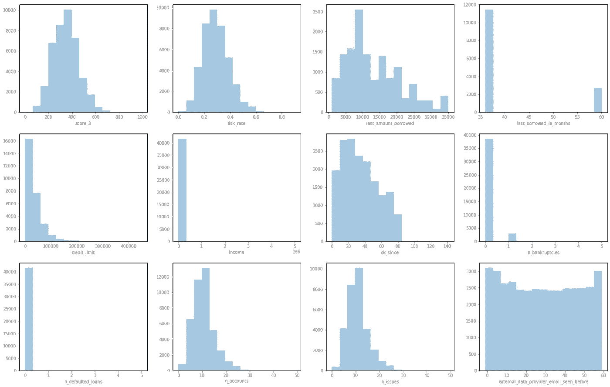
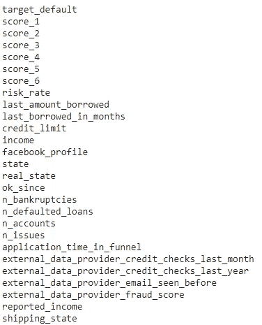
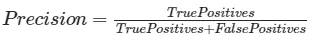
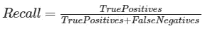
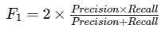
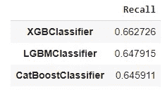
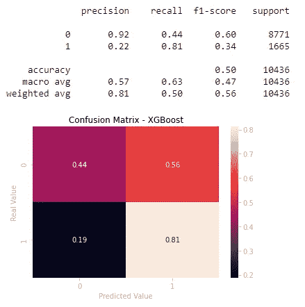
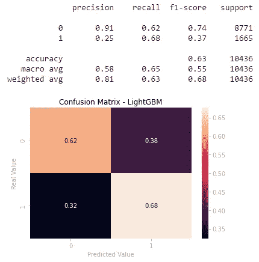
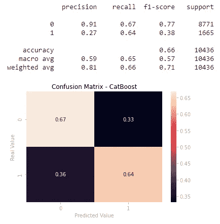

# 基于机器学习的信用风险分析

> 原文：<https://towardsdatascience.com/credit-risk-analysis-with-machine-learning-736e87e95996?source=collection_archive---------10----------------------->


迈克尔·朗米尔在 Unsplash[上的照片](https://unsplash.com/)

## 使用 XGBoost、LightGBM 和 CatBoost 预测客户违约风险

***来自《走向数据科学》编辑的提示:*** *虽然我们允许独立作者根据我们的* [*规则和指南*](/questions-96667b06af5) *发表文章，但我们并不认可每个作者的贡献。你不应该在没有寻求专业建议的情况下依赖一个作者的作品。详见我们的* [*读者术语*](/readers-terms-b5d780a700a4) *。*

**信用风险**与客户无法履行合同义务的可能性有关，如抵押贷款、信用卡债务和其他类型的贷款。

最大限度地降低违约风险是金融机构主要关心的问题。出于这个原因，商业和投资银行、风险投资基金、资产管理公司和保险公司等越来越依赖技术来预测哪些客户更有可能停止偿还债务。

机器学习模型一直在帮助这些公司提高信用风险分析的准确性，提供了一种提前识别潜在债务人的科学方法。

在本文中，我们将建立一个模型来预测 [Nubank](https://nubank.com.br/en/about-us/) 的客户违约风险，Nubank 是一家著名的巴西金融科技公司。

# 关于数据

Nubank 是一家巴西数字银行，也是拉丁美洲最大的金融科技公司之一。众所周知，它是一家数据驱动的公司，利用技术来制定决策和改善服务。

数据集可以在[这里](http://dl.dropboxusercontent.com/s/xn2a4kzf0zer0xu/acquisition_train.csv?dl=0)下载。一些私人信息被散列以保持数据匿名。

# 数据分析

我们正在为 45，000 名客户处理包含 43 个特征的数据集。`target_default`是一个真/假特征，是我们试图预测的目标变量。在探索数据集之后，我们发现一些特征具有异常值和缺失值。其他不会给模型增加价值的变量都被删除了(你可以在这里查看代码和完整的解释)。

下面的直方图有助于我们可视化数字特征的分布:



图一。数字特征的直方图

上述要素具有需要处理的缺失值。如我们所见，它们呈偏态分布，这表明我们应该用每个要素的中值来填充缺失值。

是时候处理剩余列中缺失的值了。我们根据每个特性的特殊性填充这些值，如下所示:

*   分类变量将用最常出现的值填充。
*   数值变量将用它们的中值填充。
*   在某些特定的情况下，我们将用零填充缺失的值，因为有理由相信不是每个客户端都有分配给这些变量的值。

清理数据集并处理缺失值后，我们现在使用以下功能:



图二。功能列表

在设置机器学习算法之前，我们需要执行一些预处理。考虑到大多数机器学习算法在处理数字输入时效果更好，我们将使用 Scikit Learn 的`LabelEncoder`对二进制变量和 pandas 的`get_dummies`对其他分类变量进行预处理。

# 机器学习模型

我们正在试验以下 3 种梯度增强算法，以确定哪一种能产生更好的结果:

*   XGBoost
*   LightGBM
*   CatBoost

在建立模型之前，我们需要将数据分成训练集和测试集。之后，由于我们正在处理一个不平衡的数据集，我们将分别使用`StandardScaler`和`RandomUnderSampler`对训练集进行标准化和重新采样。

**评估指标**

关于模型的评估，值得一提的是，我们应该考虑将`Precision`、`Recall`和`F1 Score`作为评估指标，原因如下:

*   精度将会给我们正确的肯定识别的比例。它可以定义为:



*   **回忆**将确定被正确识别的真实阳性的比例，它可以被定义为:



*   **F1 分数**是一个有用的指标，当我们需要在精确度和召回率之间寻求平衡时。该公式定义为:



由于我们的目标是最小化公司损失，预测客户违约的风险，良好的召回率是可取的，因为我们想要确定确实倾向于停止支付债务的客户的最大数量，因此，我们正在追求少量的*假阴性*。

此外，我们还寻求尽量减少误报的数量，因为我们不希望客户被错误地认定为违约者。因此，良好的精确率也是期望的。

然而，在精确度和召回率之间总是有一个折衷。对于本文，我们选择更加强调回忆，将其作为我们的评估标准。

我们还使用交叉验证来获得更好的结果。`cross_validate`方法不是简单地将数据分成训练和测试集，而是将我们的训练数据分成 k 个折叠，从而更好地利用数据。在我们的例子中，我们将执行 5 重交叉验证，因为我们让默认的 k 值。



图三。回忆价值观

请注意，所有三个模型都产生了相似的结果。我们现在将调整模型上的一些超参数，看看我们是否可以实现更高的分值。这里使用的方法是`GridSearchCV`，它将搜索每个估计器的指定参数值。

每个模型的超参数调整如下:

## XGBoost

对于 XGBoost 模型，我们将根据[官方文档](https://xgboost.readthedocs.io/en/latest/parameter.html)调整以下超参数:

*   `n_estimators` -模型中的树木数量
*   `max_depth` -一棵树的最大深度
*   `min_child_weight` -一个孩子所需实例重量的最小总和
*   `gamma` -在树的叶节点上进行进一步划分所需的最小损失减少
*   `learning_rate` -更新中使用步长收缩来防止过度拟合

```
param_grid = {'n_estimators': range(0,1000,50),
              'max_depth': [1, 3, 5],
              'min_child_weight': [1, 3, 6],
              'gamma': [0, 1, 5],
              'learning_rate': [0.0001, 0.001, 0.01, 0.1]}
```

*最佳召回率:{'n_estimators': 50，'* max_depth': 3，' min_child_weight': 6，' gamma': 1，' learning _ rate ':0.0001*}*

## LightGBM

现在，转到 LightGBM 模型，另一个基于树的学习算法，我们将参考[文档](https://lightgbm.readthedocs.io/en/latest/Parameters.html)调整以下超参数:

*   `max_depth` -一棵树的最大深度
*   `learning_rate` -收缩率
*   `num_leaves` -一棵树的最大叶子数量
*   `min_data_in_leaf` -一片树叶中的最小数据量

```
param_grid = {'max_depth': np.arange(5, 75, 10),
              'learning_rate' : [0.001, 0.01, 0.1],
              'num_leaves': np.arange(20, 220, 50),
              'min_data_in_leaf': np.arange(100, 1000, 100)}
```

*最佳召回率:{*' learning _ rate ':0.69，' max _ depth ':0.01，' num_leaves': 70，' min _ data _ in _ leaf ':400*}*

## CatBoost

最后，我们将搜索 CatBoost 的超参数值，这是我们的第三个梯度增强算法。根据[文档](https://catboost.ai/docs/concepts/parameter-tuning.html)，将调整以下超参数:

*   `depth` -树的深度
*   `learning_rate`——我们已经知道，学习率
*   `l2_leaf_reg` -成本函数的 L2 正则化项的系数

```
param_grid = {'depth': [6, 8, 10],
              'learning_rate': [0.03, 0.1],
              'l2_leaf_reg': [1, 5, 10]}
```

*最佳召回率:{*' depth ':0.65，' l2_leaf_reg': 5，' learning_rate': 0.03 *}*

## 在测试集上评估模型

调整超参数后，所有三个模型都显示出更好的结果。值得一提的是，XGBoost 的得分有了很大的提高，而 LightGBM 和 CatBoost 的得分则略有提高。

现在，我们可以检查这些模型在**测试集**上的表现。为了帮助我们将结果可视化，我们为每个人绘制了一个**混淆矩阵**。

**XGBoost**



图 4。XGBoost 混淆矩阵

**灯 GBM**



图五。LightGBM 混淆矩阵

**CatBoost**



图六。CatBoost 混淆矩阵

# 结论

这篇文章的主要目标是建立机器学习算法，能够识别潜在的违约者，从而减少公司损失。可能的最佳模式是能够最大限度地减少假阴性，识别客户群中的所有违约者，同时最大限度地减少假阳性，防止客户被错误地归类为违约者。

满足这些要求可能非常棘手，因为在精确度和召回率之间存在权衡，这意味着增加其中一个指标的值通常会降低另一个指标的值。考虑到最小化公司损失的重要性，我们决定更加重视减少假阳性，搜索可以提高召回率的最佳超参数。

在测试的三个**梯度增强算法**中， **XGBoost** 产生了最好的结果，召回率为 81%，尽管它产生了不希望的 56%的假阳性。另一方面， **LightGBM** 和 **CatBoost** 提供了更好的假阳性计数，分别为 38%和 33%，但它们的假阴性大大高于 XGBoost，导致召回率较低。

本文呈现了一个经典的评估指标困境。在这种情况下，将由公司的决策者在机器学习算法的帮助下分析大局，并决定最佳的后续计划。当然，在未来的文章中，我们可以测试不同的方法来实现更理想的结果，例如利用深度学习模型。

完整代码请参考[笔记本](https://github.com/rmpbastos/data_science/blob/master/Credit_Risk_Analysis.ipynb)。