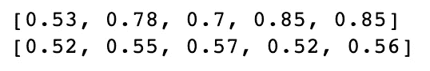
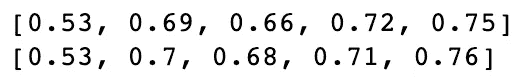
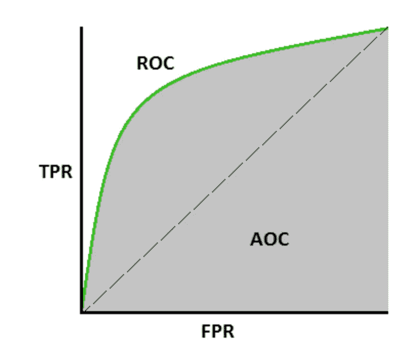
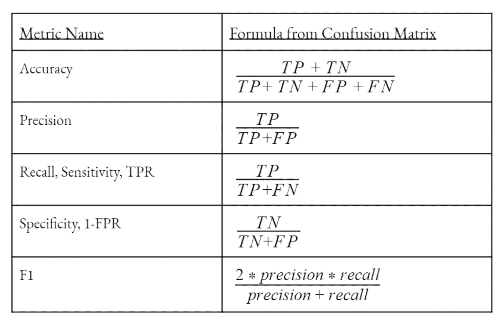
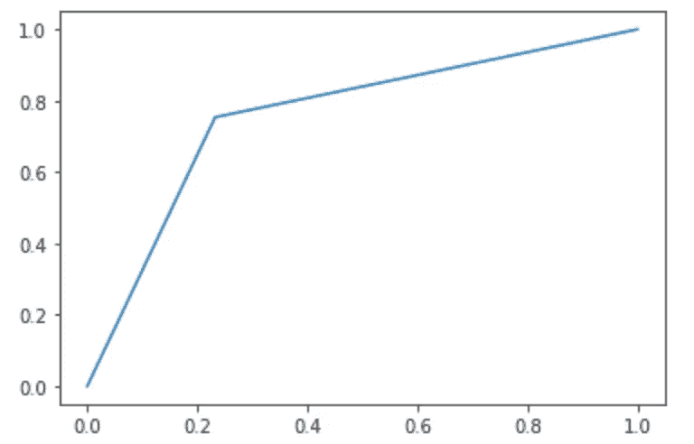
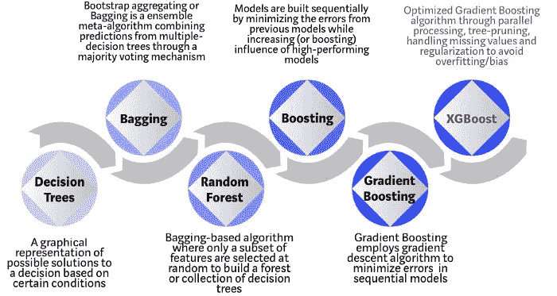
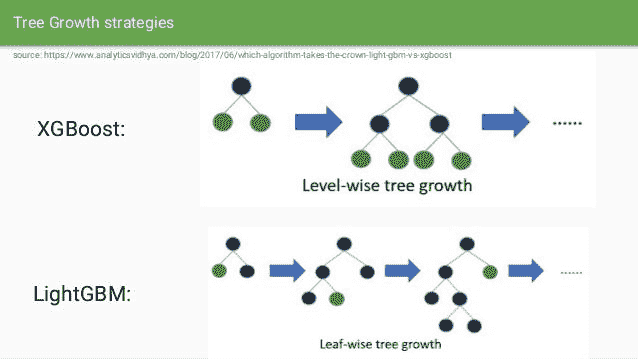

# 信用风险管理:分类模型和超参数调整

> 原文：<https://towardsdatascience.com/credit-risk-management-classification-models-hyperparameter-tuning-d3785edd8371?source=collection_archive---------22----------------------->

最后一部分旨在向您介绍在我们的转换数据集上应用不同分类算法的过程，以及使用超参数调整生成最佳性能模型的过程。


图片来源:[https://unsplash.com/photos/w7ZyuGYNpRQ](https://unsplash.com/photos/w7ZyuGYNpRQ)

提醒一下，这个端到端项目旨在解决数据科学(尤其是金融行业)中的分类问题，分为 3 个部分:

1.  解释性数据分析(EDA)和特征工程
2.  特征缩放和选择(奖励:不平衡数据处理)
3.  **机器学习建模(分类)**

如果您错过了前两个部分，请随意查看这里的[](/credit-risk-management-eda-feature-engineering-81cc34efc428)****和这里的[](/credit-risk-management-feature-scaling-selection-b734049867ea)**，然后再看最后一个部分，它利用它们的输出来生成最佳分类模型。******

# ******A.分类模型******

*******应该使用哪种算法来建立一个模型来处理和解决分类问题？*******

******当谈到分类时，我们有相当多的不同算法可以使用，不像回归。举例来说，逻辑回归、K-邻居、SVC、决策树和随机森林是解决这类问题的最常见和最广泛使用的算法。******

******以下是每种算法的功能以及它与其他算法的区别:******

*   ********逻辑回归**:该算法利用回归 ***预测一个数据样本的连续概率*** (从 0 到 1)，然后将该样本归类到更可能的目标(0 或 1)。但是，它假设输入和目标之间存在线性关系，如果数据集不遵循高斯分布，这可能不是一个好的选择。******
*   ******K-Neighbors** :该算法假设彼此非常接近的数据点属于同一类。特别地，它通过 ***距离其较近的邻居*** 的多个投票来对数据样本的目标(0 或 1)进行分类。****
*   ******SVC** :该算法通过 ***定义一个决策边界*** 进行分类，然后通过查看数据样本落在边界的哪一侧，将数据样本分类到目标(0 或 1)。本质上，该算法旨在最大化决策边界和每个类中的点之间的距离，以减少错误分类的机会。****
*   ******决策树**:顾名思义，这个算法 ***将树的根*** (整个数据集)拆分成决策节点，每个决策节点将被拆分，直到没有进一步的节点可拆分。然后，该算法通过从根到叶/终端节点沿着树对数据样本进行分类，并查看它落在哪个目标节点上。****
*   ******随机森林**:该算法是从决策树发展而来的集成技术，其中涉及到许多协同工作的决策树。特别地，随机森林将该数据样本给予每个决策树，并且 ***返回最流行的分类*** 以将目标分配给该数据样本。该算法有助于避免决策树可能出现的过拟合，因为它从多个树而不是一个树聚集分类。****

****让我们比较一下它们如何处理我们的数据集:****

```
**from sklearn.linear_model import LogisticRegression
from sklearn.neighbors import KNeighborsClassifier
from sklearn.svm import SVC
from sklearn.tree import DecisionTreeClassifier
from sklearn.ensemble import RandomForestClassifierclassifiers = {
    "LogisticRegression" : LogisticRegression(),
    "KNeighbors" : KNeighborsClassifier(),
    "SVC" : SVC(),
    "DecisionTree" : DecisionTreeClassifier(),
    "RandomForest" : RandomForestClassifier()
}**
```

****从 sklearn 导入算法后，我 ***创建了一个字典，将所有算法合并到一个地方*** ，这样更容易将它们一次应用到数据上，而不需要手动逐个迭代。****

```
**#Compute the training score of each modelstrain_scores = []
test_scores = []for key, classifier in classifiers.items():
    classifier.fit(x_a_train_rs_over_pca, y_a_train_over)
    train_score = round(classifier.score(x_a_train_rs_over_pca, y_a_train_over),2)
    train_scores.append(train_score)
    test_score = round(classifier.score(x_a_test_rs_over_pca, y_a_test_over),2)
    test_scores.append(test_score)print(train_scores)
print(test_scores)**
```

****在对训练集和测试集应用算法之后，似乎逻辑回归对数据集不太适用，因为分数相对较低(大约 50%，这表明该模型不能对目标进行分类)。这很容易理解，也证明了我们的原始数据集不是正态分布的。****

********

****相比之下，决策树和随机森林在训练集上产生了非常高的准确度分数(85%)。然而，当分数非常低(超过 50%)时，测试集就不同了。解释大差距的可能原因是(1)过度适应训练组，(2)目标泄漏到测试组。然而，经过反复核对，情况似乎并非如此。****

****因此，我决定研究另一个评分标准，**交叉验证分数，**来看看是否有任何差异。基本上，这种技术将训练集分成 n 层(默认值= 5)，然后在 n-1 层上拟合数据，并在另一层上评分。这个过程重复 n 次，从中计算出平均分数。与标准准确度分数相比，交叉验证分数 ***带来了关于模型如何工作的更加客观的分析*** 。****

```
**from sklearn.model_selection import cross_val_scoretrain_cross_scores = []
test_cross_scores = []for key, classifier in classifiers.items():
    classifier.fit(x_a_train_rs_over_pca, y_a_train_over)
    train_score = cross_val_score(classifier, x_a_train_rs_over_pca, y_a_train_over, cv=5)
    train_cross_scores.append(round(train_score.mean(),2))
    test_score = cross_val_score(classifier, x_a_test_rs_over_pca, y_a_test_over, cv=5)
    test_cross_scores.append(round(test_score.mean(),2))

print(train_cross_scores)
print(test_cross_scores)**
```

********

****正如所见，培训和测试分数之间的差距明显缩小了！****

****由于随机森林模型产生了最高的交叉验证分数，我们将根据另一个名为 **ROC AUC 分数**的分数指标对其进行测试，并查看其在 **ROC 曲线**上的表现。****

****本质上， **ROC 曲线**是假阳性率(x 轴)相对于真阳性率(y 轴)在阈值 0 和 1 之间的图，而 **AUC** 代表可分离性的程度或度量(简单地说，区分靶的能力)。****

********

****图片鸣谢:[https://towardsdatascience . com/understanding-AUC-roc-curve-68b 2303 cc9 C5](/understanding-auc-roc-curve-68b2303cc9c5)****

****以下是如何计算 **FPR** (特异性反转)和 **TPR** (也称为灵敏度)的快速汇总表:****

********

****图片来源:[https://towardsdatascience.com/hackcvilleds-4636c6c1ba53](/hackcvilleds-4636c6c1ba53)****

```
**from sklearn.model_selection import cross_val_predict
from sklearn.metrics import roc_curve
from sklearn.metrics import roc_auc_scorerf = RandomForestClassifier()
rf.fit(x_a_train_rs_over_pca, y_a_train_over)
rf_pred = cross_val_predict(rf, x_a_test_rs_over_pca, y_a_test_over, cv=5)
print(roc_auc_score(y_a_test_over, rf_pred))#Plot the ROC Curve
fpr, tpr, _ = roc_curve(y_a_test_over, rf_pred)
plt.plot(fpr, tpr)
plt.show()**
```

********

****ROC AUC 得分= 76%的 ROC 曲线****

****因为我已经证明了交叉验证在这个数据集上有效，所以我应用了另一种交叉验证技术，称为“ **cross_val_predict** ”，它遵循类似的方法，即分割 n 个折叠并相应地预测值。****

# ****B.超参数调谐****

*****什么是超参数调整，它如何帮助提高模型的精度？*****

****在根据每个算法的默认估计量计算出模型之后，我希望看到是否可以进一步改进，这可以归结为超参数调整。本质上，这种技术 ***从每个算法中选择一组最优估计器*** ，该算法(可能)在给定的数据集上产生最高的准确度分数。****

****我把(可能)放在定义中的原因是，在某些情况下，很少或没有改善取决于数据集以及最初做的准备(加上它需要永远运行)。但是，应该考虑超参数调整，以期找到性能最佳的模型。****

```
**#Use GridSearchCV to find the best parametersfrom sklearn.model_selection import GridSearchCV#Logistic Regression
lr = LogisticRegression()
lr_params = {"penalty": ['l1', 'l2'], "C": [0.001, 0.01, 0.1, 1, 10, 100, 1000], "solver": ['newton-cg', 'lbfgs', 'liblinear', 'sag', 'saga']}
grid_logistic = GridSearchCV(lr, lr_params)
grid_logistic.fit(x_a_train_rs_over_pca, y_a_train_over)
lr_best = grid_logistic.best_estimator_#KNearest Neighbors
knear = KNeighborsClassifier()
knear_params = {"n_neighbors": list(range(2,7,1)), "algorithm": ['auto', 'ball_tree', 'kd_tree', 'brutle']}
grid_knear = GridSearchCV(knear, knear_params)
grid_knear.fit(x_a_train_rs_over_pca, y_a_train_over)
knear_best = grid_knear.best_estimator_#SVCsvc = SVC()
svc_params = {"C": [0.5, 0.7, 0.9, 1], "kernel":['rbf', 'poly', 'sigmoid', 'linear']}
grid_svc = GridSearchCV(svc, svc_params)
grid_svc.fit(x_a_train_rs_over_pca, y_a_train_over)
svc_best = grid_svc.best_estimator_#Decision Treetree = DecisionTreeClassifier()
tree_params = {"criterion": ['gini', 'entropy'], "max_depth":list(range(2,5,1)), "min_samples_leaf":list(range(5,7,1))}
grid_tree = GridSearchCV(tree, tree_params)
grid_tree.fit(x_a_train_rs_over_pca, y_a_train_over)
tree_best = grid_tree.best_estimator_**
```

******GridSearchCV** 是在每个算法中找到最优估计量集合的关键，因为它仔细检查并组合不同的估计量以适应数据集，然后返回所有估计量中的最佳集合。****

****值得注意的一点是，我们必须记住每种算法的所有可用估计量，以便能够使用。例如，对于逻辑回归，我们有一组不属于其他算法的“惩罚”、“C”和“求解器”。****

****找到**后。每个算法的 best_estimator_** 使用每个算法的最佳集合来拟合和预测数据。但是，我们需要将新的分数与原始分数进行比较，以确定是否有任何改进，或者继续再次微调估计值。****

# ****奖励:XGBoost 和 LightGBM****

****【XGBoost 和 LightGBM 是什么？与传统算法相比，这些算法的性能有多好？****

****除了我听说过的常见分类算法，我还知道一些源于传统的高级算法。在这种情况下， **XGBoost 和 LightGBM** 可以被认为是*决策和随机森林的继承者。*为了更好地理解这些算法是如何开发出来的，请看下面的时间表:****

****************

****图片鸣谢:[https://www . slide share . net/GabrielCyprianoSaca/xgboost-light GBM](https://www.slideshare.net/GabrielCyprianoSaca/xgboost-lightgbm)****

****我不打算详细说明这些算法在数学上有何不同，但总的来说，它们能够在处理缺失值的同时更好地 ***修剪决策树+同时避免过度拟合。*******

```
**#XGBoost
import xgboost as xgbxgb_model = xgb.XGBClassifier()
xgb_model.fit(x_a_train_rs_over_pca, y_a_train_over)
xgb_train_score = cross_val_score(xgb_model, x_a_train_rs_over_pca, y_a_train_over, cv=5)
xgb_test_score = cross_val_score(xgb_model, x_a_test_rs_over_pca, y_a_test_over, cv=5)print(round(xgb_train_score.mean(),2))
print(round(xgb_test_score.mean(),2))#LightGBM
import lightgbm as lgblgb_model = lgb.LGBMClassifier()
lgb_model.fit(x_a_train_rs_over_pca, y_a_train_over)
lgb_train_score = cross_val_score(lgb_model, x_a_train_rs_over_pca, y_a_train_over, cv=5)
lgb_test_score = cross_val_score(lgb_model, x_a_test_rs_over_pca, y_a_test_over, cv=5)print(round(lgb_train_score.mean(),2))
print(round(lgb_test_score.mean(),2))**
```

****经过计算，每个模型的训练和集合分数分别为 72% & 73% (XGBoost)和 69% & 72% (LightGBM)，与上面计算的随机森林模型相对相同。然而，我们仍然能够通过对这些高级模型进行超参数调整来进行进一步优化，但要注意，这可能需要很长时间，因为 XGBoost 和 LightGBM 由于其算法的复杂性而具有更长的运行时间。****

****瞧啊。这就是这个端到端项目关于分类的总结！如果您热衷于探索整个代码，请随时查看我下面的 Github:****

****知识库:[https://github.com/andrewnguyen07/credit-risk-management](https://github.com/andrewnguyen07/credit-risk-management)领英:[www.linkedin.com/in/andrewnguyen07](http://www.linkedin.com/in/andrewnguyen07)****

****关注我的媒体，关注即将到来的未来项目！****