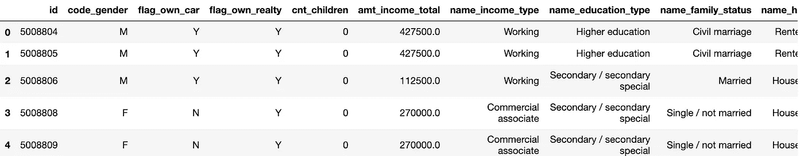
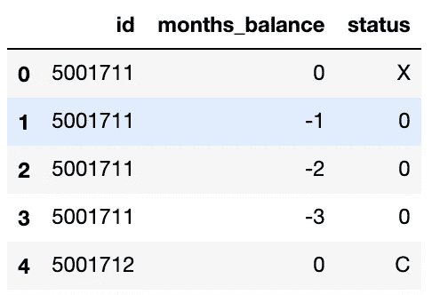
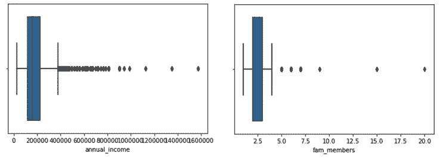
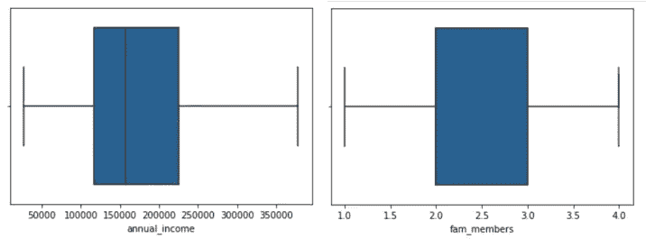
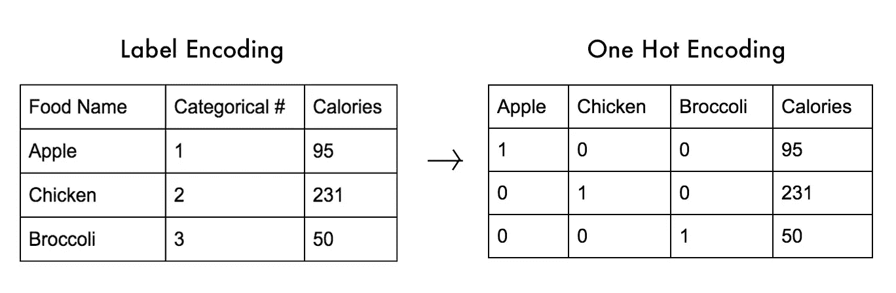
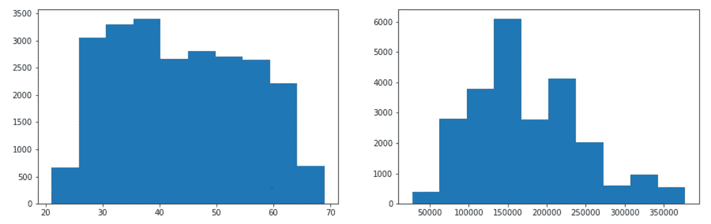
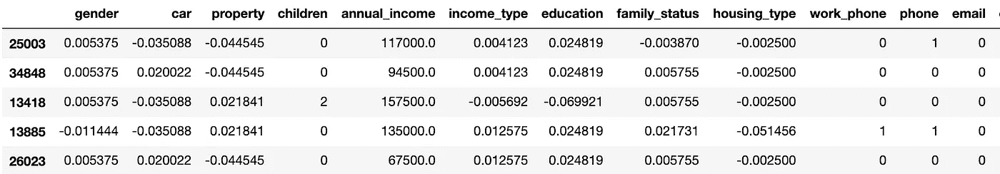
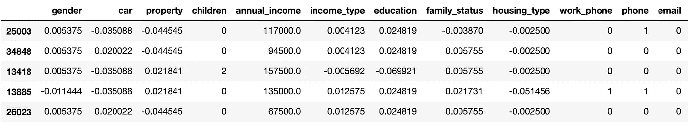

# 信用风险管理:EDA 和特征工程

> 原文：<https://towardsdatascience.com/credit-risk-management-eda-feature-engineering-81cc34efc428?source=collection_archive---------20----------------------->

## 这一部分从如何使用 EDA 和特征工程技术对数据进行清理和预处理开始，特别是在接触和不接触“目标”变量的情况下。


图片来源:[https://unsplash.com/photos/g7NfqV6C074](https://unsplash.com/photos/g7NfqV6C074)

# 语境

*在金融行业中，数据科学可以提供巨大帮助的常见用例有哪些？*

信用评分卡是金融行业中常见的风险控制方法之一，它使用个人信息和交易记录来识别和评估现有和潜在客户的信誉。有许多不同的用例利用这种方法，如贷款管理、信用卡审批、信用额度扩展等。

也就是说，这个项目的适用性因金融机构面临的问题而异。使该项目可用的核心引擎是输入数据的处理和转换，以从现有/新输入中产生高度可预测性的输出，从而最好地解决问题。

# 目录

该端到端项目分为 3 个部分:

1.  解释性数据分析(EDA)和特征工程
2.  特征缩放和选择(奖励:不平衡数据处理)
3.  机器学习建模(分类)

***注* :** 由于该项目旨在提高我在数据科学方面的能力，简而言之，为了自学和自我提高，该项目将把数据集分成 2 个更小的子集来测试哪个产生更好的结果，而不是只应用性能最好的技术。

因此，让我们从项目的第一部分开始:EDA &特性工程

# A.解释性数据分析(EDA)

让我们导入必要的库和两个数据集:

```
import pandas as pd
import numpy as np
import matplotlib.pyplot as plt
import seaborn as snsapplication = pd.read_csv("application_record.csv")
credit = pd.read_csv("credit_record.csv")
```



应用数据集



信用数据集

如上所述，应用数据集提供现有银行客户提交的*个人信息中的所有数据点(如身份证、性别、收入等。)，信用数据集将每个对应的 id 与他/她的 ***贷款偿还状态*** 进行映射(例如，X 表示当月无贷款，C 表示已还清，> 0 表示逾期还款月数)。*

*为了更好地使用信用信息，我清理了数据集，将“Status”列转换为数字，并按客户 ID 和最近一个月进行分组:*

```
*credit.status = credit.status.replace({'X':-2, 'C': -1})
credit.status = credit.status.astype('int')
credit.status = credit.status.apply(lambda x:x+1) credit_month = credit.groupby('id').months_balance.max().reset_index()record = pd.merge(credit_month, credit, how="inner", on=["id", "months_balance"])record.head()*
```

*当一切都设置好后，我就利用“内部合并”将新处理的数据集与应用程序结合起来。在此之上，如果你回头参考原始数据集，“出生日期”和“就业”是从今天开始向后算的天数，这在最初有点难以理解。因此，我决定将这些变量转换成正数和年份。*

```
*df['age'] = df.birth_date.apply(lambda x: round(x/-365,0))
df['year_of_employment'] = df.employment.apply(lambda x: round(x/-365,0) if x<0 else 0)df = df.drop(columns=["birth_date","employment"])*
```

*继续，我建议你永远不要忽略的每个 EDA 的两个亮点是(1) ***检查空值*** 和(2) ***处理异常值*** 。前者确保我们在处理和插入建模之前有一个 100%干净的数据集，而后者有助于避免您的数据集因边缘极端异常值而过度倾斜。*

```
*df.isnull().sum()
df.occupation_type = df.occupation_type.fillna("Others")*
```

*“职业类型”是唯一具有空值(NaN)的变量，所以我继续用“其他”填充这些值。*

*使用 **df.describe** 和 **sns.boxplot** ，我能够发现“年收入”和“Fam 成员”是数据集中有异常值的两个变量，直观显示如下:*

**

*为了消除异常值，我编写了一个函数，它可以很容易地应用于具有类似问题的变量:*

```
*def remove_outlier(col):
    q25 = col.quantile(0.25)
    q75 = col.quantile(0.75)
    iqr = q75 - q25
    cutoff = iqr*1.5
    lower = q25 - cutoff
    upper = q75 + cutoff
    return lower, upper#Remove outliers for Annual Incomelower_1, upper_1 = remove_outlier(df.annual_income)
df = df.loc[(df.annual_income > lower_1) & (df.annual_income < upper_1)] #Remove outliers for Fam Memberslower_2, upper_2 = remove_outlier(df.fam_members)
df = df.loc[(df.annual_fam_members > lower_2) & (df.fam_members < upper_2)]*
```

**

*我们几乎已经完成了 EDA，接下来要定义“目标”变量，您可能在大多数分类课程中听过这个变量。*

*回到这个项目的主题，信用风险管理，我们需要确定我们应该如何处理客户的贷款偿还状态。有了这个数据集，我为那些当月没有任何贷款或没有还清贷款的人定义了“target = 0”，而剩余的数据(任何逾期贷款)被映射到“target = 1”。*

```
*df['target'] = None
df.loc[df.status < 1,'target']=0
df.loc[df.status >= 1,'target']=1
df.target = pd.to_numeric(df.target)*
```

# *B.特征工程*

**什么是特征工程，它在建模前对数据预处理有什么帮助？**

*根据[维基百科](https://en.wikipedia.org/wiki/Feature_engineering)，*

> *特征工程是利用领域知识通过数据挖掘技术从原始数据中提取特征的过程。这些特征可以用来提高机器学习算法的性能。*

*事实上，特征工程不仅需要领域知识，还需要对数据集的理解和实现的目标。特别地，对于我们的数据集，有相当多的不同特征，我们称之为**自变量**，它们与还款状态相关，这就是**目标变量(0 或 1)** 。因此，为了调整出一个有洞察力和可操作的模型，我们需要通过转换现有的和/或添加支持数据来“工程化”那些特性，这使得特性工程不同于 EDA。*

*正如我从一开始就提到的，我们永远不会知道哪种方法更好，直到我们进行测试。也就是说，我决定测试两个场景，有的**和没有**接触目标变量的**，然后看看以后产生的结果是否有任何显著的不同。***

*在深入实现之前，我们应该意识到，对于特征工程来说，没有“一刀切”的技术，因为它取决于您如何处理您的特征。在这个项目中，我在我的数据集中利用了“**类别编码**，因为大多数数据都是分类的，应该转换为数字，以便在大多数机器学习模型中更容易处理。*

```
*df_a = df #for encoding without target
df_b = df #for encoding with targetx_a = df_a.iloc[:, 1:-1]
y_a = df_a.iloc[:, -1]from sklearn.model_selection import train_test_splitx_a_train, x_a_test, y_a_train, y_a_test = train_test_split(x_a, y_a, test_size=0.3, random_state=1)*
```

*我们为两个场景创建了两个独立的数据集，这样我们就可以操作每个数据集，而不用担心会混淆。*

*此外，**在处理之前需要注意的一个重要亮点是，强烈建议我们**将数据集**拆分为训练集和测试集**，以避免数据泄露**。本质上，如果我们在处理后进行分割，测试集的数据就会暴露出来，因此在建模阶段与训练集进行比较时不够客观。***

# *1.无目标分类编码*

**根据变量类型，我们将对每个变量应用合适的技术。**

*如果你回头参考数据集，有 3 种类型的变量:(1)二元，(2)名义和(3)连续。虽然二进制和连续变量是不言自明的，但名义变量指的是一组不同的类别，它们之间没有内在的顺序。*

## *1.1.二元变量*

*对于我们数据集中的二进制变量(如性别、汽车、财产)，我们可以从 sklearn 库中选择**标签编码器**或**标签二进制化器**，这将 ***将原始数据映射为 0 或 1:****

```
*#Option 1: Label Encoder (applied to >2 categories per variable)
from sklearn.preprocessing import LabelEncoder, LabelBinarizerle = LabelEncoder()
gender_le = le.fit_transform(x_a_train.gender)#Option 2: LabelBinarizer (applied to 2 categories per variable)bn = LabelBinarizer()
gender_bn = np.array(x_a_train.gender).reshape(-1,1)
gender_bn = bn.fit_transform(gender_bn)*
```

## *1.2.名义可变因素*

*名义变量(如收入类型、教育、家庭状况、住房类型、职业类型)是分类变量，需要在建模前转换为数字变量。对类别进行编码的两种常见方法是(1) **虚拟编码**和(2) **一个热编码器**，它基本上创建 n 列作为该变量内的 n 个唯一类别，并根据每列中每个类别的存在与否分配 0 或 1。*

**

*图片来源:[https://deepai . org/machine-learning-glossary-and-terms/dummy-variable](https://deepai.org/machine-learning-glossary-and-terms/dummy-variable)*

*这些方法之间的区别在于伪编码转换成 n-1 个子变量，而一个热编码器转换成 n 个子变量。*

```
*#Option 1: Dummy Encoding: kn - k variablesincome_type_dummy = pd.get_dummies(x_a_train.income_type)#Option 2: OneHotEcnoder: kn variablesfrom sklearn.preprocessing import OneHotEncoderonehot = OneHotEncoder(sparse=False, drop='first', handle_unknown='error')income_type_onehot = onehot.fit_transform(x_a_train.income_type.to_numpy().reshape(-1,1))
income_type_onehot = pd.DataFrame(income_type_onehot, columns=onehot.get_feature_names(['income_type']))* 
```

*虚拟编码可以通过 **pd.get_dummies()** 轻松完成，因为它已经是 pandas 库的一部分。对于一个 Hot 编码器，我们需要从 sklearn 库中导入它，并单独或同时转换每个变量。*

*一个热编码器被设计为保持跨训练和测试集的类别数量的一致性(例如，处理没有出现在任何一个集合中的类别)，因此它比哑编码更值得推荐，因为它更容易用“ **handle_unknown= "error"** ”来控制。*

*然而，一个热门编码器的缺点之一是**多重共线性**，它指的是变量或子变量之间高度线性相关，因此降低了我们模型的准确性。这可以通过分配参数“**drop =‘first’**”来纠正或避免，这有助于在编码后删除其中一个子变量。*

## *1.3.连续变量*

*连续变量是在任意两个值之间有无限个值的数值变量。从本质上来说，它需要永远计数！让我们直观地看看数据集中每个连续变量的分布情况:*

**

*左图显示了客户的年龄范围，而右图显示了不同收入群体的分布情况。处理这类变量的两种常用方法是(1) **固定宽度宁滨**和(2) **自适应宁滨**。特别是，前者从预定义的箱(例如年龄-10-20、20-30、30-40 等)创建子类别，而后者依赖于数据的分布。*

*固定宽度宁滨的优点和缺点是:对变量进行编码**容易且简单**但是相对主观而不考虑数据本身。因此，我建议选择密切关注数据分布的自适应宁滨。根据我的观察，我决定采用“**分位数**”，而不是转换成 2-bin 类别，因为原始分布范围很广，**之后应用了标签编码**。*

```
*#Convert each variable into 5 equal categories/eachx_a_train['age_binned'] = pd.qcut(x_a_train.age, q=[0, .25, .50, .75, 1])
x_a_train['annual_income_binned'] = pd.qcut(x_a_train.annual_income, q=[0, .25, .50, .75, 1])#Apply Label Encoder to assign the label to each category without biasx_a_train['age'] = le.fit_transform(x_a_train['age_binned'])
x_a_train['annual_income'] = le.fit_transform(x_a_train['annual_income_binned'])*
```

*Tada！我们已经设计了所有必要的变量，但从未触及目标变量！现在，让我们在将每一个拟合到建模阶段之前，移动到另一个。*

# *2.带目标的类别编码*

*由于在这种方法中利用了与目标变量的相关性，为了更好的客观性，我们应该以相同的方式对所有自变量进行编码。*

*同样，必须遵循先决条件:处理前的训练测试分割*

```
*x_b = df_b.iloc[:, 1:-1]
y_b = df_b.iloc[:, -1]from sklearn.model_selection import train_test_splitx_b_train, x_b_test, y_b_train, y_b_test = train_test_split(x_b, y_b, test_size=0.3, random_state=1)*
```

*在涉及目标的类别编码技术中，我发现了 3 个普遍使用的选项:(1) **证据权重编码器(WOE)** , (2) **目标编码器**,( 3)**留一编码器(LOO)** 。*

*简而言之，*

*   ***WOE 编码器**:证据权重编码是信用风险建模中广泛使用的一种技术，它可以获得与目标相关的每个变量中不同类别之间的最大差异。这很容易理解，其数学计算如下——好的百分比(在这种情况下，目标= 0) /坏的百分比(目标= 1)的自然对数:*

**

*   ***目标编码器& LOO 编码器**:前一种方法用数据集中所有行的目标变量的平均值替换分类值，后一种方法做了同样的事情，但排除了行本身。原因是为了避免在建模前使用太多信息而导致直接目标泄漏。*

```
*#Option 1: WOE Encoder
import category_encoders as cewoe = ce.WOEEncoder()def woe_encoder(col, target):
    for i in range(len(x_b_train.columns)):
        col.iloc[:,i] = woe.fit_transform(col, target)
    return coldf_woe_train = woe_encoder(x_b_train, y_b_train) #Option 2: Target Encoder
from category_encoders import TargetEncoderte = TargetEncoder()def target_encoder(col, target):
    for i in range(len(x_b_train.columns)):
        col.iloc[:,i] = te.fit_transform(col, target)
    return coldf_te_train = target_encoder(x_b_train, y_b_train)*
```

*在测试了这两种方法之后，两者之间新编码的数据集似乎没有太大的区别。因此，对于这个项目的后续步骤，我选择了带有 WOE 编码器的数据集。**但是**，请在其他数据集上进行测试，这可能会由于不同的数据分布而产生不同的结果。*

**

*WOE 编码器*

**

*目标编码器*

*瞧啊。这是这个项目第一部分的总结！*

*如上所述，该项目是作为学习笔记和提高我的数据科学技能的过程中的亮点的存储库而创建的。因此，我在每一部分都测试了多种方法，以便找出最好的执行技术。*

*请务必注意接下来的两个部分，它们涵盖了**特征缩放/选择**和**机器学习建模**！与此同时，我们来连线:*

*github:[https://github.com/andrewnguyen07](https://github.com/andrewnguyen07)
领英:[www.linkedin.com/in/andrewnguyen07](http://www.linkedin.com/in/andrewnguyen07)*

*谢谢！*