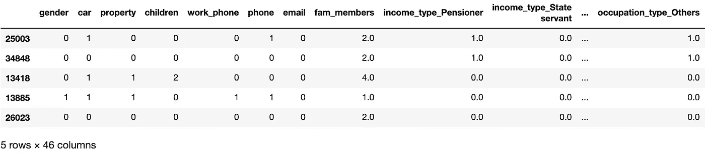
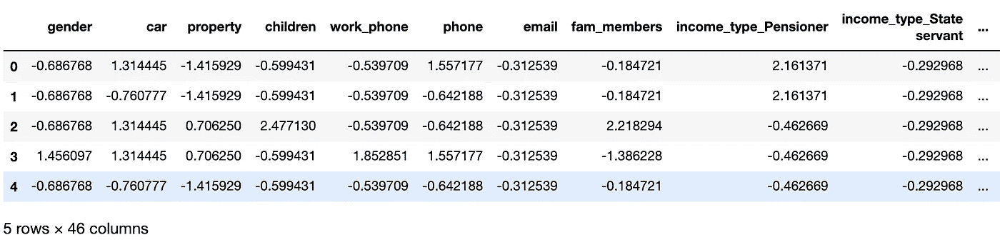
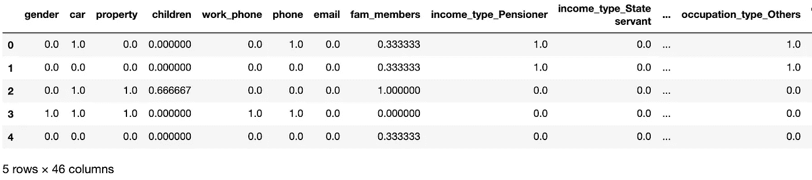
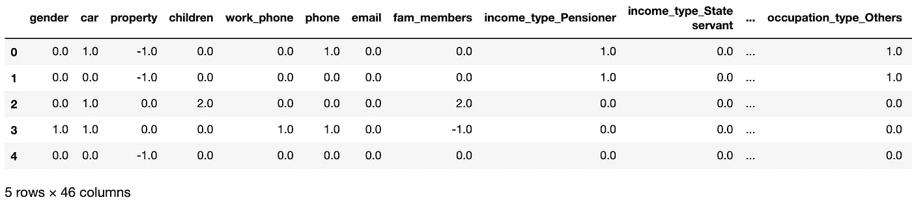
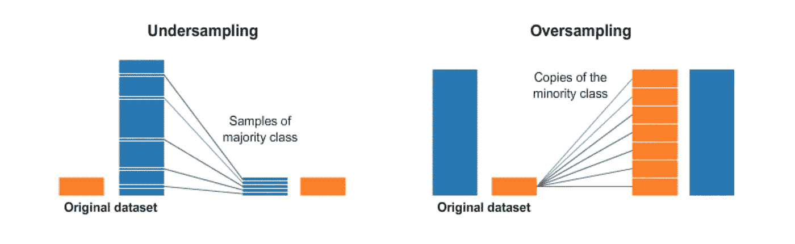
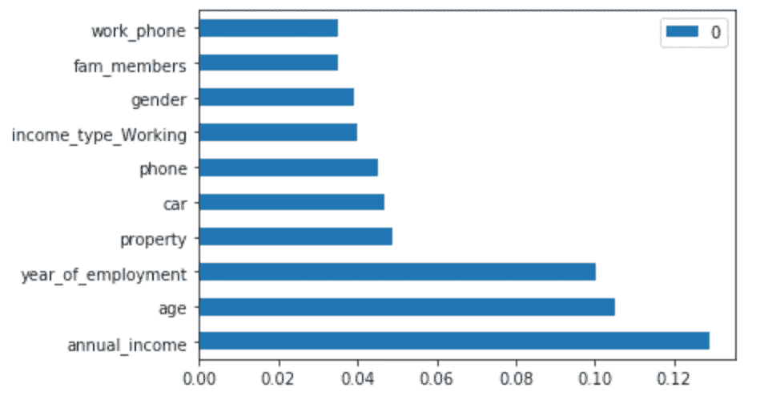
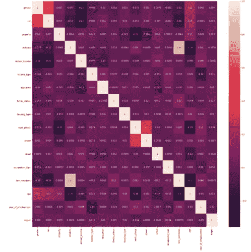
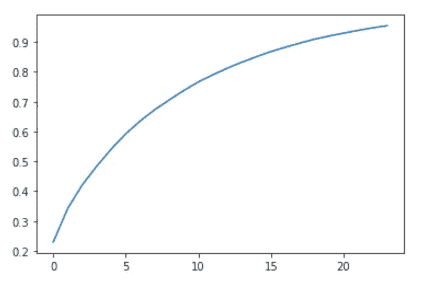
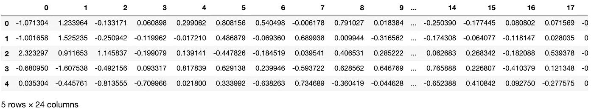
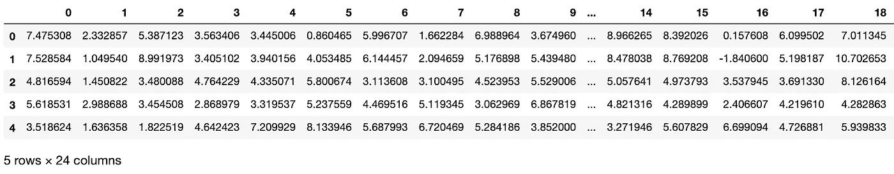

# 信用风险管理:特征缩放和选择

> 原文：<https://towardsdatascience.com/credit-risk-management-feature-scaling-selection-b734049867ea?source=collection_archive---------26----------------------->

在特征工程之后，这一部分进入数据准备过程的下一步:特征缩放和选择，在建模之前将数据集转换为更易消化的数据集。


图片来源:[https://unsplash.com/photos/JG35CpZLfVs](https://unsplash.com/photos/JG35CpZLfVs)

提醒一下，这个端到端项目旨在解决数据科学(尤其是金融行业)中的分类问题，分为 3 个部分:

1.  解释性数据分析(EDA)和特征工程
2.  **特征缩放和选择(奖励:不平衡数据处理)**
3.  机器学习建模(分类)

如果你错过了第一部分，在阅读接下来的第二部分之前，请在这里查看[](/credit-risk-management-eda-feature-engineering-81cc34efc428)**，以便更好地理解上下文。**

# **A.特征缩放**

***什么是特征缩放，为什么我们在建模之前需要它？***

**根据维基百科，**

> **特征缩放是一种用于**标准化**独立变量或数据特征范围的方法。在数据处理中，它也被称为数据规范化，通常在数据预处理步骤中执行。**

**如果您还记得第一部分，我们已经在两个数据集(A & B)上完成了所有特征的工程设计，如下所示:**

****

**数据集 A(无目标编码)**

****

**数据集 B(用目标编码)**

**如上所述，所有特征之间的数据范围和分布彼此相对不同，更不用说一些带有异常值的变量了。也就是说，强烈建议我们对整个数据集一致地应用特征缩放，以使其更容易被机器学习算法消化。**

**事实上，市场上有许多不同的方法，但我将只关注我认为相对有特色的三种:**标准缩放器**、**最小最大缩放器**和**鲁棒缩放器**。简而言之，**

*   ****StandardScaler** :该方法移除平均值，并将数据缩放至单位方差(平均值= 0，标准差= 1)。然而，它受异常值的影响很大，特别是那些边缘极端的异常值，这些异常值会将缩放后的数据范围扩展到超过 1 个标准偏差。**
*   ****MinMaxScaler** :该方法减去特征中的最小值，再除以范围(即原始最大值和最小值之差)。本质上，它将数据集重新调整到 0 和 1 的范围内。然而，这种方法相对有限，因为它将所有数据点压缩到一个狭窄的范围内，并且在存在异常值的情况下帮助不大。**
*   ****RobustScaler** :该方法基于百分位数，减去中位数，除以四分位数范围(75% — 25%)。它通常比其他两种缩放器更可取，因为它不会受到大的边缘异常值(如果有的话)的很大影响。**

**让我们看看三个定标器在我们的数据集中有何不同:**

```
from sklearn.preprocessing import StandardScaler, RobustScaler, MinMaxScaler#StandardScaler
x_a_train_ss = pd.DataFrame(StandardScaler().fit_transform(x_a_train), columns=x_a_train.columns)#MinMaxScaler
x_a_train_mm = pd.DataFrame(MinMaxScaler().fit_transform(x_a_train), columns=x_a_train.columns)#RobustScaler
x_a_train_rs = pd.DataFrame(RobustScaler().fit_transform(x_a_train), columns=x_a_train.columns)
```

****

**标准缩放器**

****

**最小最大缩放器**

****

**鲁棒定标器**

**如上所述，RobustScaler 的缩放数据范围看起来比其他两个缩放器更容易理解，这可能有助于机器学习算法更快、更有效地推动处理运行时间。然而，这是我在建模之前的假设，但是我们可以在那个阶段进行试验。**

# **B.不平衡数据处理**

***什么是不平衡数据，我们应该如何处理？***

**简而言之，不平衡数据集是指目标分布存在严重偏差的数据集，这对于建模来说可能并不理想。作为一个更清楚的例子，让我们看看我们的数据集是否不平衡:**

```
a_target_0 = df_a[df_a.target == 0].target.count() / df_a.target.count()
a_target_1 = df_a[df_a.target == 1].target.count() / df_a.target.count()
```

**结果是 76%的数据被归类为目标 0，而剩余的 24%被归类为目标 1。**

**事实上，没有一个清晰的基准，我们可以依靠它来准确地确定我们的数据集是否不平衡。有些人说是 9:1，而有些人说是 8:2，这实际上取决于数据集的性质以及您正在解决的环境/问题。在我的例子中，我认为上述结果是不平衡的，并将对数据集进行“重新采样”以使其相对平衡。**

*****只是一个免责声明*** ，我在这里采取的所有预处理步骤并不意味着它们都是必须要做的，并且对我们以后的模型的准确性有积极的影响。这意味着我的目标是测试所有可能有助于改进我的模型的场景。**

**回到重采样，我们可能听说过两种常见的方法:过采样和欠采样。简而言之，**

*   ****过采样**:该方法从少数类中复制样本，并将它们添加到数据集(训练集)。**
*   ****欠采样**:这与上面从多数类中删除一些样本相反。**

**视觉上，你可以想象成这样:**

****

**图片鸣谢:[https://towards data science . com/having-an-unbalanced-dataset-here-is-how-you-can-solve-it-1640568947 EB](/having-an-imbalanced-dataset-here-is-how-you-can-solve-it-1640568947eb)**

**让我们测试一下这两者:**

```
# Under-sampling
from imblearn.under_sampling import RandomUnderSamplerundersample = RandomUnderSampler()x_a_train_rs_under, y_a_train_under = undersample.fit_resample(x_a_train_rs, y_a_train)
print(Counter(y_a_train_under))# Over-sampling
from imblearn.over_sampling import SMOTE
from collections import Counteroversample = SMOTE()x_a_train_rs_over, y_a_train_over = oversample.fit_resample(x_a_train_rs, y_a_train)
print(Counter(y_a_train_over))
```

**对于每种方法，都有多种选择来对数据集进行重采样，但我选择了最常用的一种，即 **RandomUnderSampler** (欠采样)和 **SMOTE** (过采样)。重采样后的类分布为:**

*   **随机欠采样:0: 5814，1: 5814**
*   **SMOTE: 1: 18324，0: 18324**

**两者各有利弊，但是顾名思义，RandomUnderSampler 从多数类中“随机”选择要移除的数据，这可能会导致信息丢失，因为不是整个数据集都被纳入建模。也就是说，我选择了 SMOTE。**

# **C.特征选择**

**什么是功能选择，有哪些选项可供我们参考？**

**简而言之，特征选择是在数据集中选择与目标变量有很大关联/影响的变量的过程。特别是，当涉及到更大的数据集时，我们可能会面对数百个特征，其中一些可能不相关，甚至与输出无关。因此，我们需要在建模之前进行特征选择，以达到最高的精度。**

**事实上，有一些不同的技术可以归为两大类:(1) **特征选择**和(2) **维度缩减**。我相信这些名字对你来说听起来很熟悉，但本质上它们是相同的，只是为每一个做的技术相对不同。**

## **1.特征选择**

**如果你正在寻找一个完整的技巧列表，请随意参考[这篇博客文章](https://www.analyticsvidhya.com/blog/2018/08/dimensionality-reduction-techniques-python/)，它列出了所有可能的试验方法。在这个项目中，为了简单起见，我将只应用两个:(a) **特征重要性**和(b) **相关矩阵**。**

**对于**特征重要性**，顾名思义，我们将选择与目标变量相关率最高的前几个特征(如前 10 或 15，取决于特征总数)。具体来说，该技术部署了 ExtraTreeClassifier 算法的属性: **feature_importances_****

```
from sklearn.ensemble import ExtraTreesClassifierfi = ExtraTreesClassifier()
fi_a = fi.fit(x_a_train_rs_over, y_a_train_over)df_fi_a = pd.DataFrame(fi_a.feature_importances_,index=x_a_train_rs_over.columns)
df_fi_a.nlargest(10,df_fi_a.columns).plot(kind='barh')
plt.show()
```

****

**。功能 _ 重要性 _**

**如你所见，年收入是最重要的特征，其次是年龄和就业年份。事实上，这真的取决于你要选择的特性的数量。**

**转到特征选择的第二种方法，**相关矩阵**是显示数据集中变量之间相关系数的表格。本质上，数字越高，任何两个变量之间的相关性越强。**

**为了更好地展示，让我们更直观地看看:**

```
df_b_train_processed = pd.concat([x_b_train_rs_over, y_b_train_over], axis=1) #combine processed features with their targetcm_b = df_b_train_processed.corr()print(cm_b.target.sort_values().tail(10))plt.figure(figsize=(20,20))
sns.heatmap(cm_b, xticklabels=df_b_train_processed.columns, yticklabels=df_b_train_processed.columns,annot=True)
```

****

**df.corr()**

**如上所述，我们只需要考虑表中的最后一列，即所有自变量与目标的相关性。看起来所有的特征与相同色调的目标共享相似的系数。这可能与我们刚刚提到的(1)特性重要性略有不同。然而，没有明确的对错答案，因为每种技术的设计和功能都不同。**

## **2.降维**

**降维基本类似于特征选择，但有自己的技术。我经常使用的常见选项可以分为基于组件的(PCA)和基于投影的(t-SNE 和 UMAP)。**

*   ****基于组件(PCA)** :顾名思义，它基于数据集中的原始特征，这些特征被转换成一组与目标具有更好相关性的新变量。**
*   ****基于投影(t-SNE 和 UMAP)** :这种技术背后的数学概念很复杂，但简而言之，它指的是将多维数据投影到一个更低维的空间，这有助于减少数据集中的特征数量。**

**请记住，使用这些技术时需要进行特征缩放！**

```
from sklearn.decomposition import PCApca = PCA(.95)pca_a_train = pca.fit(x_a_train_rs_over, y_a_train_over)
print(pca_a_train.n_components_)plt.plot(np.cumsum(pca_a_train.explained_variance_ratio_))
plt.show()x_a_train_rs_over_pca = pd.DataFrame(pca_a_train.transform(x_a_train_rs_over))
x_a_train_rs_over_pca.head()
```

****

**至于 PCA，当我调用语法时，我将 PCA 的解释方差设置为. 95，这意味着我希望得到一组新的变量，它与原始变量相比有 95%的方差。在这种情况下，在我们将训练数据拟合到 PCA 之后，计算出我们只需要 46 个特征中的 24 个。此外，查看解释方差比率图，在 24 个特征之后，线停止增加，这可能是应用 PCA 后的理想特征数。**

****

**pca.fit_transform()**

**至于基于投影的，t-SNE 对大数据集很好，但它被证明有局限性，特别是计算时间低和大规模信息丢失，而 UMAP 在运行时方面表现更好，同时保留了信息。**

**简而言之，UMAP 的工作原理是，它先计算高维空间中的点与点之间的距离，投影到低维空间中，再计算这个低维空间中的点与点之间的距离。然后，它使用随机梯度下降来最小化这些距离之间的差异。**

```
import umapum = umap.UMAP(n_components=24)umap_a_train = um.fit_transform(x_a_train_rs_over)
x_a_train_rs_over_umap = pd.DataFrame(umap_a_train)
x_a_train_rs_over_umap.head()
```

****

**umap。UMAP.fit_transform()**

**为了在性能方面比较 PCA 和 UMAP，它依赖于我们的数据集的规模和复杂性，以便确定使用哪一个。然而，为了简单和更好的运行时间，我选择在数据集之间应用 PCA，并在建模阶段利用它。**

**瞧啊。我们已经完成了这个端到端项目的第二部分，重点是功能缩放和选择！**

**我真的希望你能发现它内容丰富且易于理解，所以请在这里留下你的评论吧！请注意这个项目的第三个最后部分，它利用所有的数据准备步骤来应用**机器学习算法**。**

**与此同时，我们来连线:**

**github:[https://github.com/andrewnguyen07](https://github.com/andrewnguyen07)
领英:[www.linkedin.com/in/andrewnguyen07](http://www.linkedin.com/in/andrewnguyen07)**

**谢谢！**