# 基于机器学习的信用风险建模

> 原文：<https://towardsdatascience.com/credit-risk-modeling-with-machine-learning-8c8a2657b4c4?source=collection_archive---------0----------------------->

## 真实世界的机器学习解决方案是什么样的——不需要背景知识

***注来自《走向数据科学》的编辑:*** *虽然我们允许独立作者根据我们的* [*规则和指导方针*](/questions-96667b06af5) *发表文章，但我们不认可每个作者的贡献。你不应该在没有寻求专业建议的情况下依赖一个作者的作品。详见我们的* [*读者术语*](/readers-terms-b5d780a700a4) *。*

**信用风险建模**——估计某人偿还贷款的概率的过程——是现代世界最重要的数学问题之一。在本文中，我们将从头开始探索如何将**机器学习**应用于信用风险建模。你不需要了解任何关于机器学习的知识就能理解这篇文章！

为了用机器学习解释信用风险建模，我们将首先发展关于信用风险建模的领域知识。然后，我们将介绍四种可用于信用风险建模的基本机器学习系统:

*   k-最近邻
*   逻辑回归
*   决策树
*   神经网络

到本文结束时，您将理解这些算法如何应用于信用风险建模的现实世界问题，并且您将在总体上理解机器学习领域！

让我们从一个简单的例子开始学习什么是信用风险建模。

# 形势

假设你的朋友泰德需要十块钱。你会想要回那些钱的，所以他保证明天你再见到他时会还你的。

作者创建的图像

但是你听说过 Ted 有一段难以回报他人的历史。结果，你知道有可能你再也看不到你的十美元了。

你会借钱给他吗？

要做这个决定，你需要另一条信息。

泰德过去有多困难？

如果他只是忘了还钱给一个不该还钱的人，那么你可能是个好人。另一方面，如果他有深陷债务和逃往其他国家的习惯，那么你可能应该把你的钱留给自己。

泰德的历史告诉我们一些关于借钱给他的风险。

如果他过去值得信任，那么借钱给他的风险相对较低。如果他过去不值得信任，那么借钱给他的风险就相对较高。

风险的概念给了你一个合理的方法来决定是否借钱给泰德。首先，确定你可以接受多大的风险。然后，弄清楚泰德的历史让借钱给他有多大风险。如果借钱给泰德的风险不超过你的最大承受风险，那么你可以继续借钱给他。

如果只是 ted 向你要钱，你可能会依靠你的直觉和感觉来判断借钱给 Ted 的风险。这对一个人来说已经足够了。

作者创建的图像

但是如果有上百个 ted 向你要钱呢？

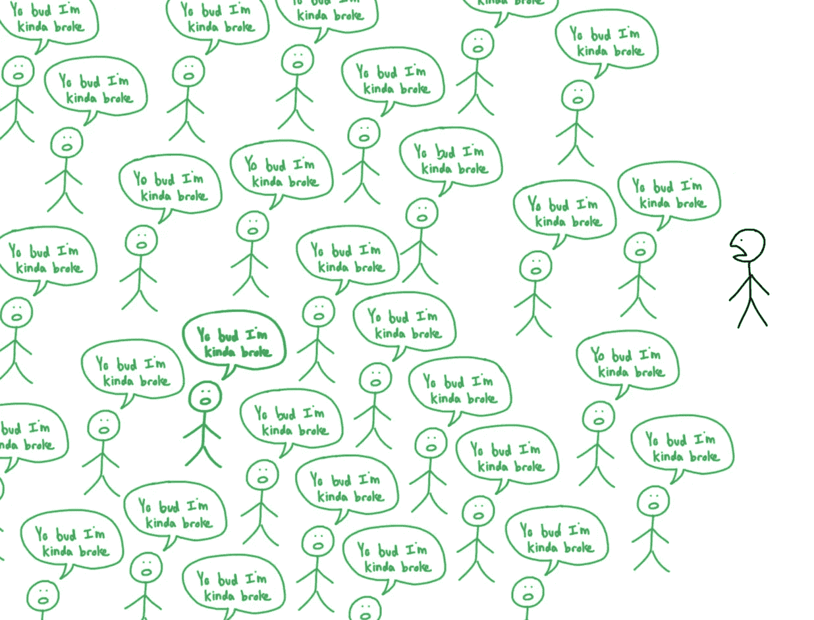

作者创建的图像

你不可能了解这些人中的每一个人，这样你就可以决定借钱给他们是不是一个好主意。但是如果你只是随便借给他们，你可能会借钱给一些永远不会还你钱的人。你也可能拒绝一些非常负责任的人，他们会很快还你钱。相反，你会想用一个更科学的过程。

这个科学过程被称为**信用风险建模**，这也是我们将在本文中探讨的内容。

从形式上来说，**信用风险建模**是利用一个人的数据来确定这个人偿还贷款的可能性的过程。根据流程的名称，信用卡公司一直在进行信用风险建模就不足为奇了。但是信用风险建模并不一定与信用卡有任何关系，即使“信用”在名称中。信用风险建模适用于*任何*贷款，而不仅仅是与信用卡相关的贷款。

无数组织使用信用风险建模，包括保险公司、银行、投资公司和政府财政部。有时，个人利用信用风险模型战略性地借出他们自己的钱来谋生。信用风险建模在人们借钱的任何地方都是极其重要的。

更重要的是，理解信用风险建模的过程将使理解任何涉及概率的建模变得更加容易。

但是现在，让我们回到 Ted，这样我们就能对贷款的基本原理有一个坚实的把握。

# **什么是利率？**

如果你只是出于好意借钱给泰德，你可能会要求他还你同样多的钱。但是你也可以借此机会赚点外快。

你可以告诉泰德，他必须还你和你给他一样多的钱，外加百分之十。

这意味着如果你给泰德 10 美元，他必须还你 11 美元。他多给你的钱叫做利息。在这种情况下，Ted 付给你 1 美元的利息，而**利率**是百分之十。如果你把利率提高到 20%，特德将不得不付给你 2 美元的利息，这意味着他总共要付给你 12 美元。

如果泰德真的需要钱，那么他可能会同意支付一些利息。*支付贷款利息基本上是购买你未来花钱的能力。*

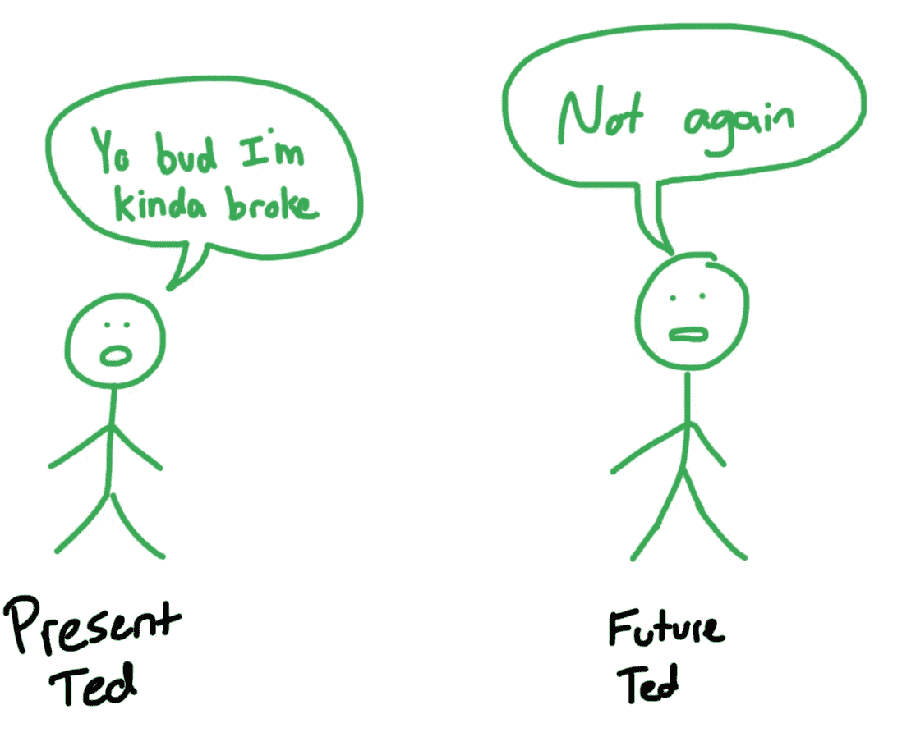

作者创建的图像

把未来的钱花在现在是一件方便的事情，就像商业世界中所有方便的事情一样，它是有代价的。

关于利率，你可以看到 500 个泰德同时向你要钱是多么有用。如果你向他们收取 20%的利息，那么借给他们每个人 10 美元可以让你赚 1000 美元。

但我们通过一个相当大的——也是无效的——假设得出了 1000 美元的数字:每个人都会还你钱。

如果有人不还你钱，你就永远失去了你给他们的 10 美元。你也错过了他们会付给你的 2 美元利息。这意味着，每有一个人不还你钱，你就少了 12 美元。

如果 500 人中只有 84 人不还你钱，那么实际上你会在整个借贷过程中赔钱。令人惊讶的是，只有不到 17%的人把整个系统搞砸了。

为了以此为生，你需要一个更好的系统。

# **什么是违约风险？**

幸运的是，信用风险模型可以让你估计每个人无法偿还你的概率。**拖欠**贷款意味着无法偿还，所以每个人无法偿还贷款的概率被称为他们的**违约风险**。

确定某人的违约风险很重要。一旦你知道某人的违约风险，有一种方法可以校准他们的利率，以减轻借钱给他们的风险。

但在我们理解如何利用违约风险来校准某人的利率之前，理解一个基本的统计学概念是很重要的:大数定律。

# **大数定律**

先说一个简单的情况:抛硬币。

我们都听说过有 50%的机会得到正面和 50%的机会得到反面。这叫做**理论概率**。

如果你抛一次硬币，那么你要么是正面要么是反面。如果你掷硬币 10 次，你会得到 5 个正面和 5 个反面(50%正面)。但也完全有可能你得到 6 头 4 尾(60%正面)，甚至 9 头 1 尾(90%正面)。

这些观察到的结果被称为**实验概率**。实验概率不一定等于理论概率。

那么，50%的正面机会到底意味着什么呢？

这意味着如果你抛硬币很多很多次，总的结果是 50%的硬币都是正面朝上。

让我们一步步来看这个。

让我们掷硬币五次。我们得到的正面数量是红点的数量，我们得到的反面数量是蓝点的数量。

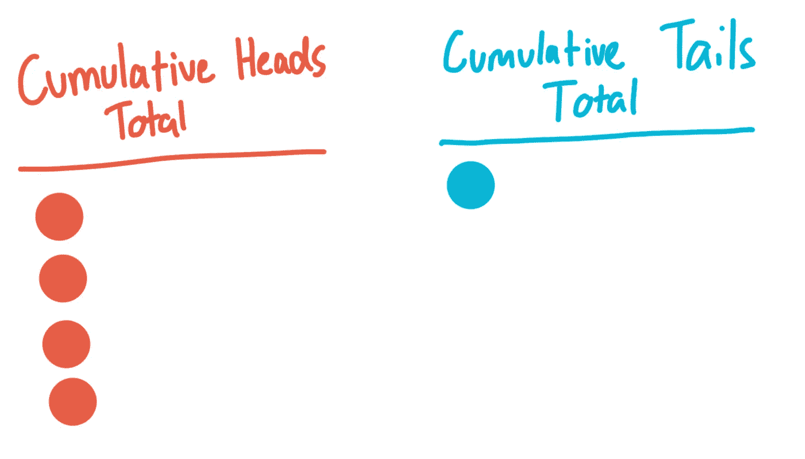

作者创建的图像

到目前为止，这看起来相当不平衡，我们 80%的翻转都是正面朝上。这是 80%的实验概率，与我们 50%的理论概率相差甚远。但是让我们继续翻转。这是我们抛了 15 次硬币后得到的结果。

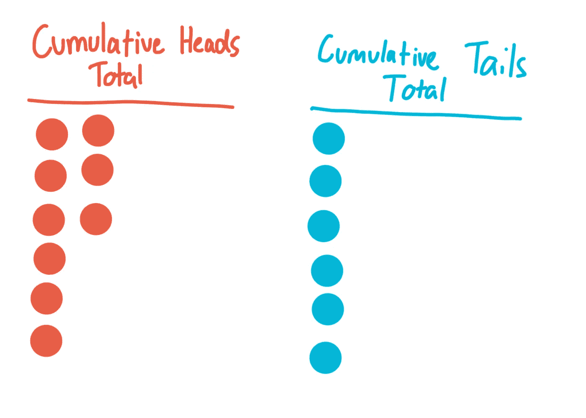

作者创建的图像

现在我们总共有 60%的结果是正面的，接近 50%。如果我们继续抛硬币，直到我们已经抛了 50 次，这就是我们得到的结果。

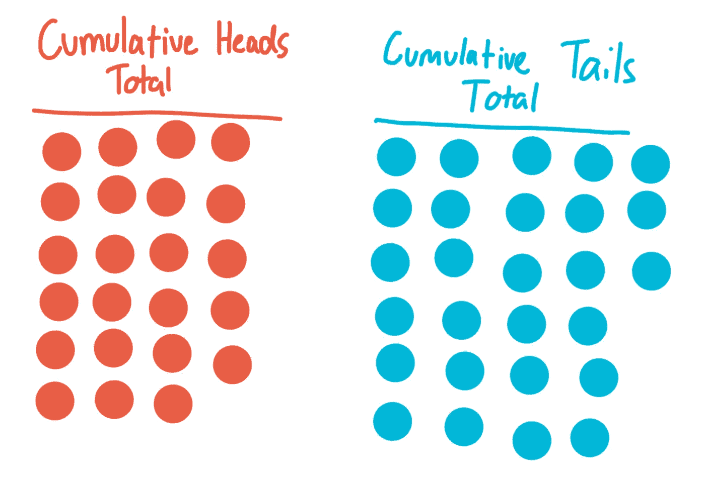

作者创建的图像

这是我们总失误数的 46%,接近 50%。如果我们一遍又一遍地抛硬币，那么我们会看到这个正面百分比越来越接近理论概率的 50%。它可能不会每次翻转都接近 50%，但通常会接近 50%。

如果我们继续翻转，直到我们达到 100 次翻转，蓝线代表一段时间内头的累积百分比。红线是 50%。

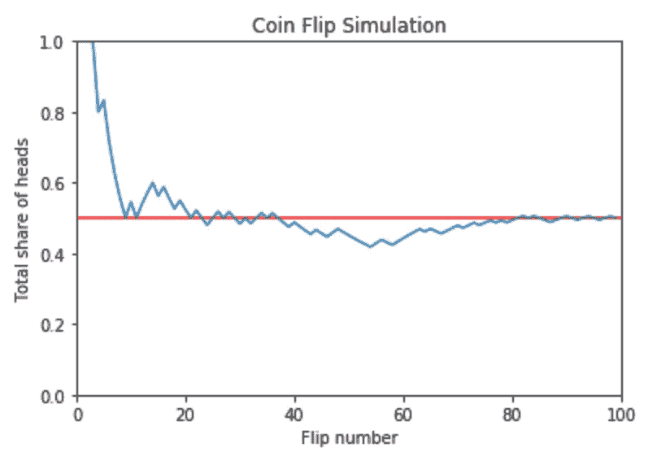

作者创建的图像

蓝线的起点非常高，因为我们的前四次投掷都是正面，这意味着我们 100%的累积投掷都是正面朝上。但是当我们在混合中得到一些尾部时，蓝线倾向于靠近红线。

正如你所看到的，当我们抛硬币的次数越来越多时，代表我们实验概率的蓝线接近红线，也就是我们的理论概率。

这就是我们如何定义一个理论概率，比如在掷出六面骰子时，有 50%的机会得到正面，或者有 16.7%的机会得到 1。

**大数定律就是当我们做大量试验的时候，实验概率会趋向于接近理论概率。**我们做的试验越多，实验概率就越接近理论概率。

为了说明这个概念，这里有一个五万次抛硬币的模拟图:

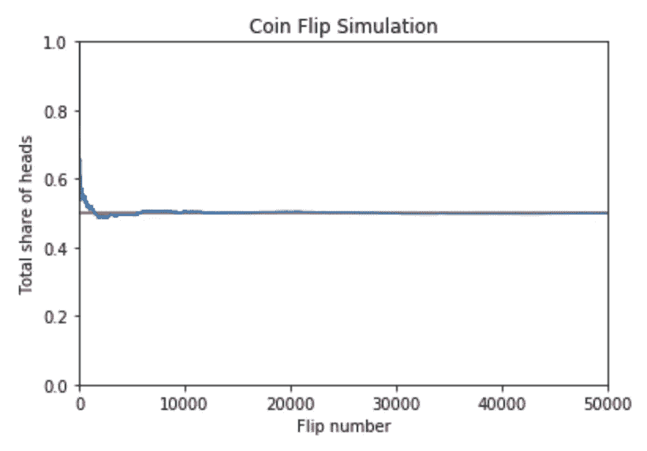

作者创建的图像

最后，实验概率与理论概率如此接近，以至于蓝线和红线几乎在彼此之上。

这意味着当我们处理大量的试验时，我们可以假设实验概率基本上等于理论概率。在这种情况下，如果我们掷硬币五万次，实验概率将超级接近 50%。

重要的是要强调，每次你抛硬币，*得到正面的概率总是 50%，不管在它之前的是什么*。即使你已经连续得到 10 个头像，下一次得到另一个头像的概率仍然是*50%。*

这有助于解释为什么上图中的蓝线并不总是直对红线。即使接近翻转 30，000，您也可以看到蓝线仍有一点摆动。但随着时间的推移，蓝线一般倾向于接近红线。

从大数定律中学到的重要的一点是，大量的试验得到的实验概率非常接近理论概率。

如果你认为这个想法有点道理，你就已经准备好理解基于违约风险校准利率的过程了。

# **利用违约风险校准利率**

假设你正在考虑向很多人，比如 10，000 人，发放 10 美元的贷款。使用信用风险模型，你发现平均来说，每个人的理论违约风险是 15%。大数定律告诉你，大量试验，实验概率接近理论概率。鉴于你这里有大量的人(10，000 人)，可以有把握地假设，你贷款的人中大约 15%真的会违约，85%会还你钱。

如果你知道大约 15%的人可能不会还你钱，那么你就知道你将永远失去你借的 10 美元贷款中的 15%。因为 10，000 人中的 15%是 1500 人，你借给每个人 10 美元，你知道你可能会损失 15，000 美元。

但你不需要对失去 15000 美元无动于衷。这里有几件事你可以做。

## **1。提高每个人的利率来弥补那 15000 美元。**

这样，85%真正还贷的人最终将多付 15，000 美元。因为 10，000 人中的 85%是 8，500 人，这相当于每人多得 1.76 美元的利息。在这种情况下，这相当于将利率提高了 17.6 个百分点。

问题来了:如果利率已经定在 20%了，这样你就可以获利，那么再加息 17.6 个百分点，总利率就是 37.6%。这是一个很大的增幅，像这样提高利率可能会阻止一些潜在的借款人。

## **2。只接受最安全的借款人。**

信用风险建模让你可以分别看到每个人的违约风险。有些人可能有 40%的违约风险，而其他人可能只有 1%的违约风险。如果你只把贷款给违约风险低于某个阈值的人，比如说 2%，那么愿意还你钱的人的比例会高得多。这意味着违约的人会更少，你损失的钱也会更少。

因此，你可以收取较低的利率，因为你不必弥补因违约而损失的钱。这种策略的问题是，你可能不得不拒绝一大部分想要贷款的人，这将减少你的利润。

## **3。收取与违约风险成比例的利率。**

这是现实世界中最重要的策略。当我们检查所有的借款人时，我们称每个借款人为“借款人 x”。**对于每个借款人 x，你向借款人 x 收取一定的利率，这样如果每个借款人都有借款人 x 的违约风险，你也不会损失任何钱。**

这是一个密集的想法，所以让我们打开它。

在分析第一个策略时，我们发现，如果每个借款人有 15%的违约风险，我们应该给每个借款人的利率增加 17.6 个百分点。(这相当于 15%的平均违约风险。)这样，那 85%不违约的人多付的利息，就弥补了那 15%违约的人。

如果你借钱给的每个人都有相同的违约风险，那么每个借款人的利率总会增加一定的金额，以抵消那些违约的人。

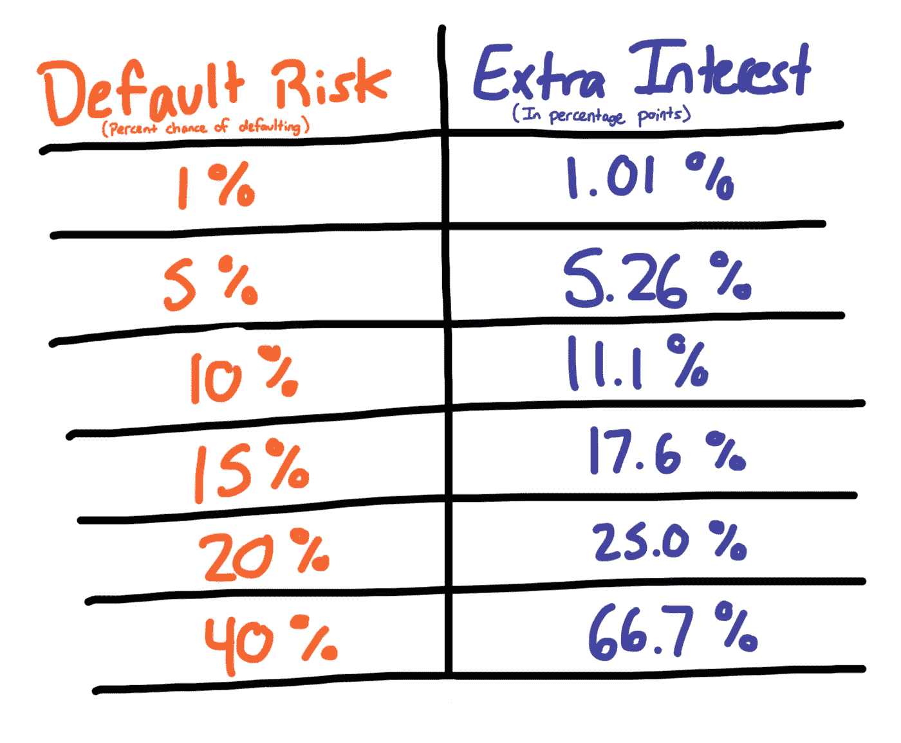

作者创建的图像

事实上，每个借款人的利率应增加的金额可以用以下公式计算:

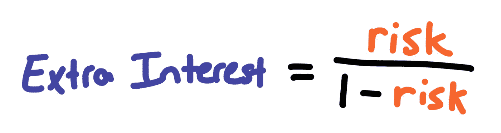

作者创建的图像

如果你不想的话，没有必要去钻研这个公式，但是如果你想知道它是如何工作的，这一段将会告诉你。上面的风险项代表将要违约的人的比例。违约是一种二元结果；这意味着每个人要么会违约，要么不会违约。没有中间地带。数字 1 代表 100%的人，所以术语 1-风险(一减去风险)是没有违约的人的比例。你用违约者除以非违约者来确定非违约者需要偿还每个违约者贷款的百分比。

即使每个借款人的违约风险不同，你也可以用这个公式准确计算出你应该给每个借款人增加多少利率来平衡他们的风险。如果你把这个金额加到每个借款人的利率上，你有大量的借款人，大数定律告诉我们，从长期来看，你几乎肯定不会亏损。

简单回顾一下，这是你借钱给某人后，他可能会还你的钱的明细。

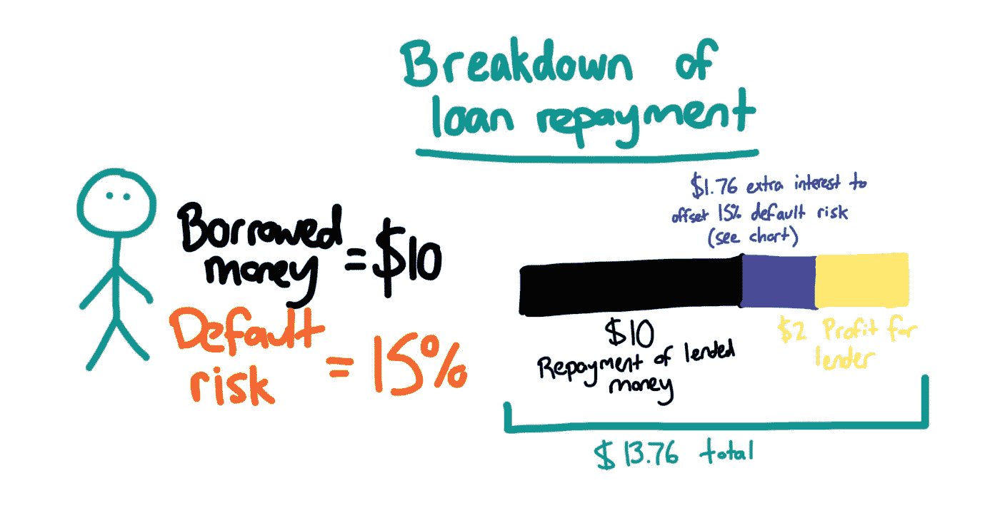

作者创建的图像

在现实世界中，这些策略是结合在一起的。按照策略 1，贷款人通常以小额固定利率提高每个人的利率，而不考虑违约风险，以弥补其模型中的不确定性。按照策略二，贷款人往往是有风险门槛的，所以不会接受所有人。最后，根据策略 3，贷款人利用每个借款人的违约风险给每个人的利率增加一定数量的百分点。

如果你掌握了这三个策略，那么你就已经牢牢掌握了贷款的基本原则。

在这一点上，我们已经探索了为什么发现某人的违约风险如此有用。现在，我们准备进入信用风险建模中使用的机器学习模型来计算这些违约风险。

# **什么是机器学习？**

现在人们经常讨论“机器学习”这个术语，有时很难知道它是什么意思。

简单来说，机器学习模型是一种数学预测模型，当它看到更多数据时会变得更好。

要做机器学习，你需要两样东西:一个模型，和数据。

有大量不同类型的机器学习模型。机器学习模型是用于根据数据进行预测的一组步骤的名称。下面，我们将探索在信用风险建模中很重要的四个基本机器学习模型。

你还需要大量的历史数据。这些数据需要包含你试图预测的事物(称为**目标**)和与你试图预测的事物相关的其他特征(称为**特征**)。在信用风险建模的情况下，你需要许多个人的历史数据。这里的目标数据是每个人是否违约。这里的特征数据由每个人的统计数据组成，比如他们的收入、年龄和就业状况。

一旦你有了数据，你需要**通过输入历史数据来训练**模型。建立机器学习模型是为了将特征数据与目标数据联系起来。训练后，模型可以查看已知要素数据和未知目标数据的情况，并且模型可以进行预测。

这种情况在现实生活中很常见。当你试图决定是否给某人贷款时，你通常有他们所有的特征数据，比如收入和年龄。你只是不知道目标数据:他们拖欠贷款的概率。

计算这个概率是机器学习模型的闪光点。

让我们从一个简单但功能惊人的模型开始。

# **K 近邻模型**

假设我们有一堆具有两个特征的历史贷款数据:每个人的收入和年龄。我们也知道每个人是否拖欠贷款。如果他们违约了，那么他们的点在图表上就会变成红色。如果他们偿还了贷款，他们的点在图上是蓝色的。

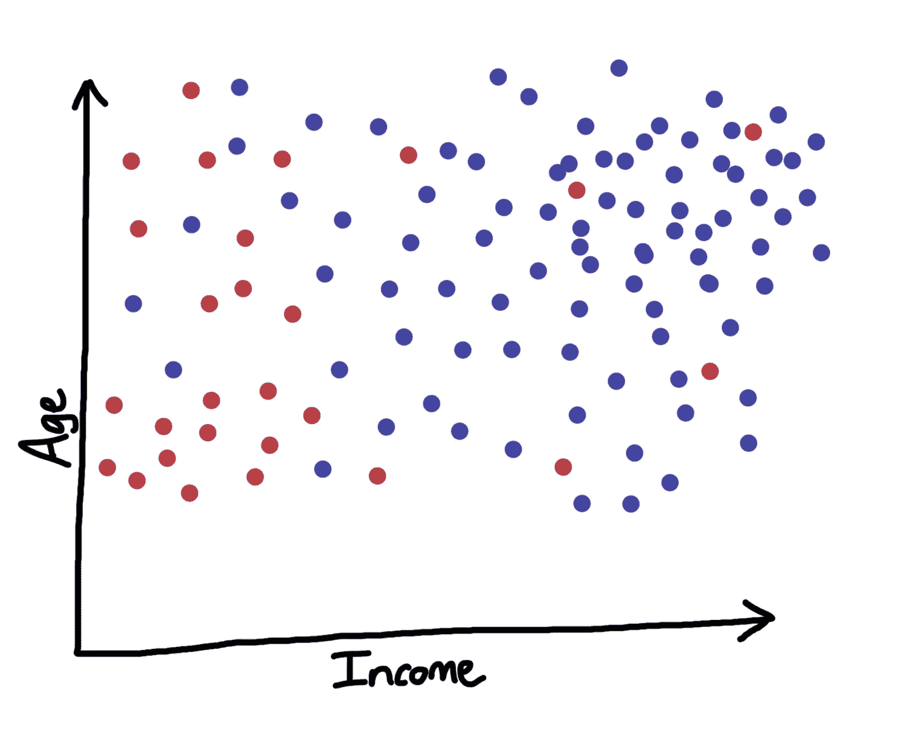

作者创建的图像

现在让我们假设特德再次要求贷款。我们想知道他偿还贷款的可能性有多大，现在我们有了一个比我们的感觉更强大的工具。如果我们知道泰德的收入和年龄，那么我们可以在同一张图上用绿色标出他。

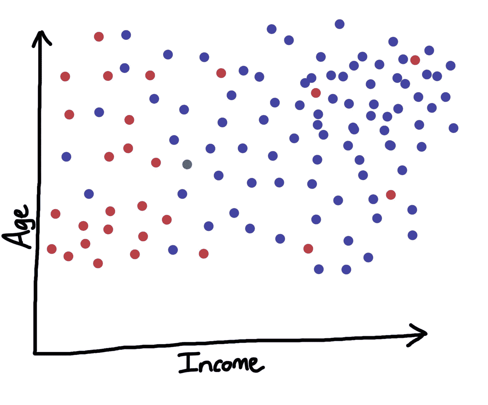

作者创建的图像

然后，我们选择一些我们要查看的“最近邻居”。这个数字称为 K。如果 K = 5，那么我们将选择最接近 Ted 点的 5 个点，并计算出它们的违约百分比。

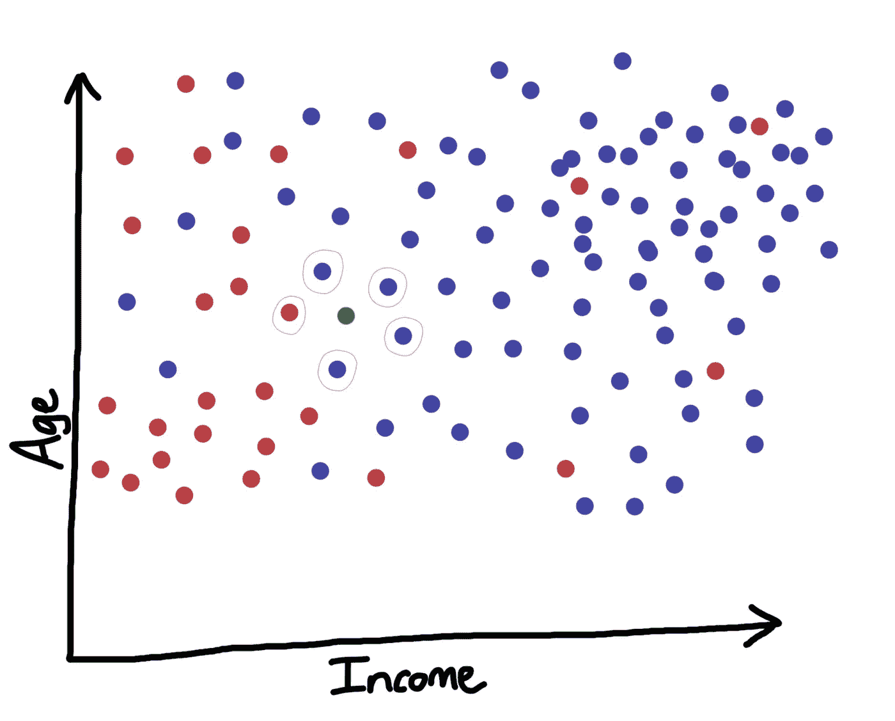

作者创建的图像

在这种情况下，80%离 Ted 最近的人偿还了贷款(4 人)，20%的人违约(1 人)。这意味着我们暂定 Ted 的违约风险为 20%。

当然，您可能认为将 K 设置为等于 5 似乎很武断。有一种方法可以优化我们的 K 值，那就是**测试**模型。

为了测试模型，我们将历史数据分成两部分:T2 的训练数据和 T4 的测试数据。然后，我们将 K 值设置为一个任意值，比如 10，并将我们的训练数据提供给模型，以生成一个如上图所示的图表。然后，对于测试数据中的每个人，我们让训练好的模型猜测这个人是否拖欠贷款。模型看不到测试数据的目标列；它只看到特征。在测试过程中，模型必须仅根据特征做出预测，就像在现实生活中一样。

每次模型做出预测时，我们都会记录模型的预测是否正确。然后，我们通过找到它正确预测的案例的百分比来计算模型的**准确度分数**。

为了优化我们的 K 值，我们用不同的 K 值一遍又一遍地测试这个模型，直到我们找到一个效果最好的。有时候理想 K 值是 1，而其他时候理想 K 值是巨大的。(当然，对于信用风险建模，K 值为 1 是愚蠢的，因为这会给我们带来 0%或 100%的违约风险。)

在上面的 2D 图表中，我们只有两个特征变量:收入和年龄。但是 k-最近邻算法对于 2 个以上的特征变量也非常有效。如果我们有 3 个特征变量，我们可以在一个 3D 框中而不是 2D 方块中绘制这些点。

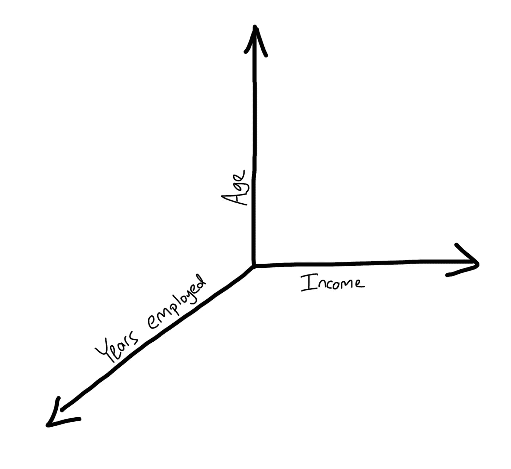

作者创建的图像

对于 3 个变量，同样的步骤也适用。训练模型给了我们一个 3D 图，上面有一堆蓝点和红点。当我们试图预测一个人的违约风险时，我们会把他们画在图上。为了计算他们的违约风险，我们找到这个人的 K 个最近的邻居，我们计算这些邻居违约的百分比。我们说这个百分比就是新人的违约风险。

一旦我们有了 4 个变量，图表就变得难以想象了。但是计算机可以处理几乎无限多的变量。事实上，使用毕达哥拉斯定理，用 4 个或更多变量手动用代数方法计算最近邻并不太困难。(有兴趣可以谷歌一下！)

k-最近邻可能看起来是一个非常简单的模型，但是由于有数千个数据点和许多功能，它可能非常强大。

然而，在某些情况下，其他模型更有效。我们来讨论另一个经典的机器学习模型:逻辑回归。

# **逻辑回归模型**

最简单的逻辑回归形式是包含一个目标列和一个要素列的数据集。例如，包含借款人收入和他们是否拖欠贷款的历史数据集将非常容易用于逻辑回归。

对于逻辑回归，目标数据必须是**二进制**，这意味着它只能有两种结果。在信用风险建模中，目标数据实际上是二元的:一个人可以拖欠或不拖欠贷款。

为了制作一个图表，我们可以将这个二元结果表示为*一个人在过去*偿还贷款的概率。如果有人在过去拖欠贷款，那么我们可以说他们偿还贷款的概率为 0。如果有人真的偿还了贷款，那么我们可以说他们偿还贷款的概率是 1。给过去的事件分配概率可能会感觉怪怪的，但 0%或 100%的概率只是另一种说法，即我们知道某事要么肯定没有发生，要么肯定发生了。

以下是收入与历史违约概率的关系图:

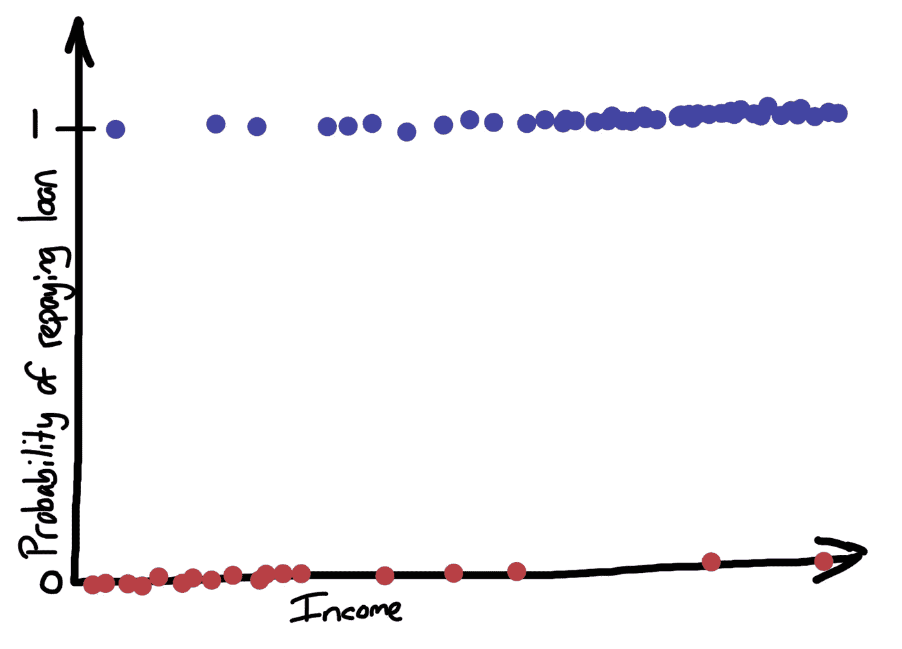

作者创建的图像

因为我们正在处理明确的过去的数据，所有的点不是在顶部，就是在底部。顶部的蓝点代表偿还贷款的人，而底部的红点代表违约的人。

这是事情变酷的地方。逻辑回归算法使用一些有趣的数学方法(我们不会在这里深入探讨)计算出一条类似如下的直线:

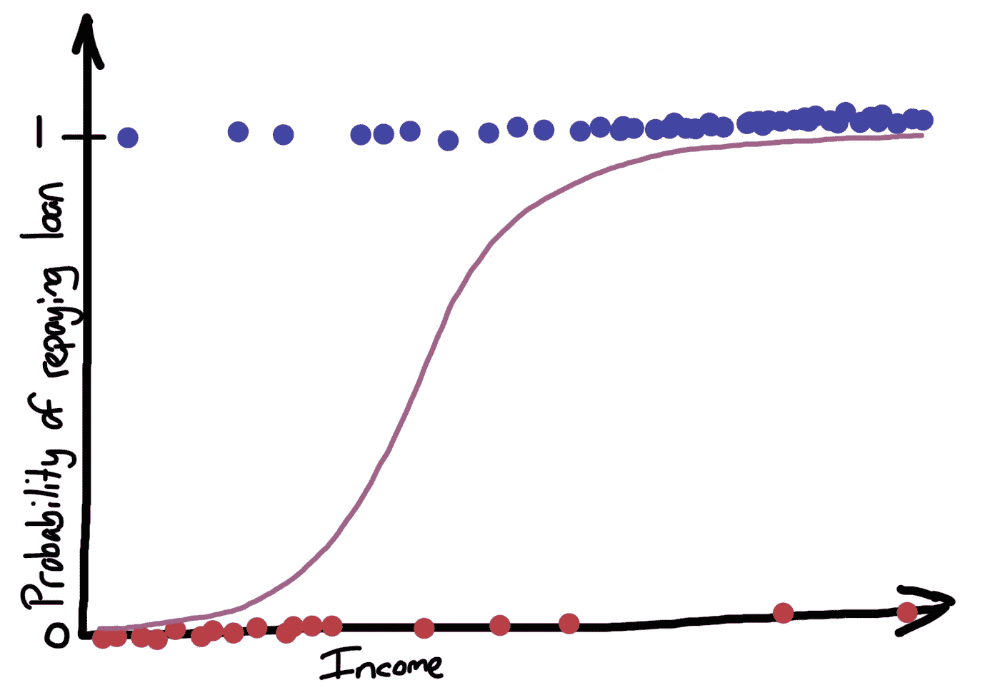

作者创建的图像

这条线告诉我们一个给定收入水平的新人偿还贷款的概率。

用逻辑回归预测一个新人的违约风险非常简单。你只需找到收入轴上与新人收入相对应的点，与该点相对应的逻辑回归线的 y 值就会给出他们偿还贷款的概率。从 1 中减去这个值就是他们的违约风险。

假设 Ted 的收入就在这里:

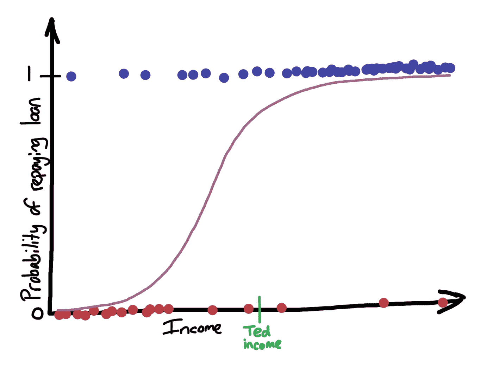

作者创建的图像

为了找出泰德偿还贷款的概率，我们向上走，遇到逻辑回归趋势线。

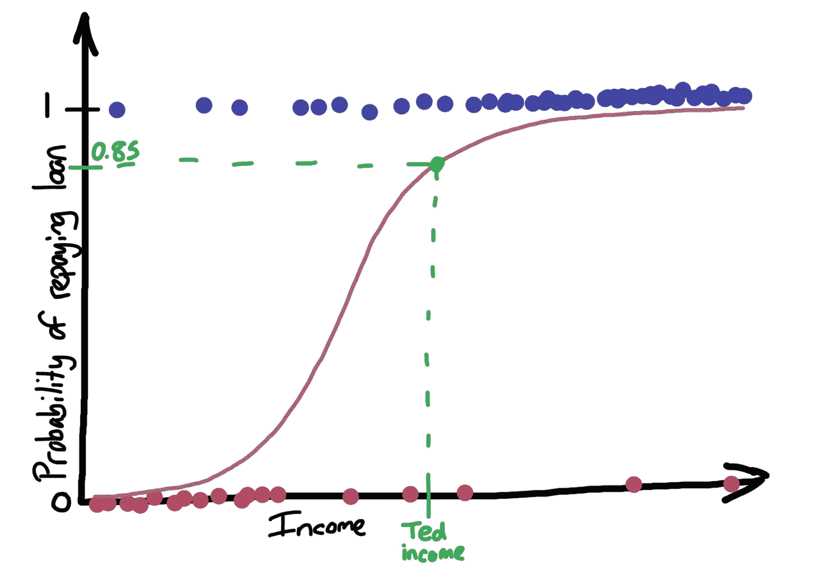

作者创建的图像

根据这个模型，看起来他有大约 85%的机会偿还贷款。这意味着他的违约风险是 15%。

值得注意的是，这个版本的逻辑回归将 Ted 的违约风险设为 15%，而我们的 k 近邻模型将 Ted 的违约风险设为 20%。从不同的模型中获得不同的预测在机器学习的世界中是完全正常的。为了决定使用哪个模型，我们必须使用历史数据进行一系列训练/测试循环，以查看哪个模型在这种情况下始终表现最佳。

逻辑回归模型的 2D 版本非常简单，就像 2D k 近邻一样。但是就像 K 近邻一样，一台电脑(或者一个拿着铅笔的人！)可以毫无问题地将逻辑回归推广到无穷多个维度。

k-最近邻和逻辑回归都是很好的近似模型，尤其是当数据遵循线性模式时。但有时，有一个模型来捕捉数据中微妙的非线性模式也不错。决策树模型是一个简单的模型，在寻找这种模式方面非常出色。

# **决策树**

为了理解决策树，让我们回到我们用来说明 k 近邻如何工作的图。

作者创建的图像

正如我们所见，理解该图的一种方法是使用 k-最近邻算法。然而，我们也可以制定一些简单的规则，根据点的位置对它们进行分类。例如，我们可以画一条线将图表分成两半，如下所示:

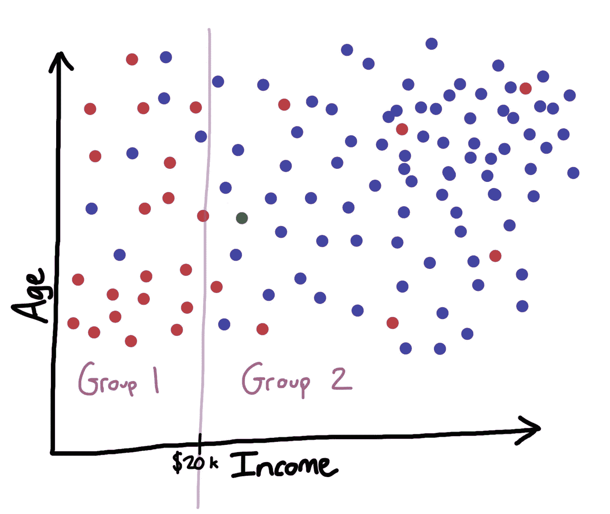

作者创建的图像

画这条线会将数据分成两半。表示这一点的一种方法是使用树形图，如下图所示。

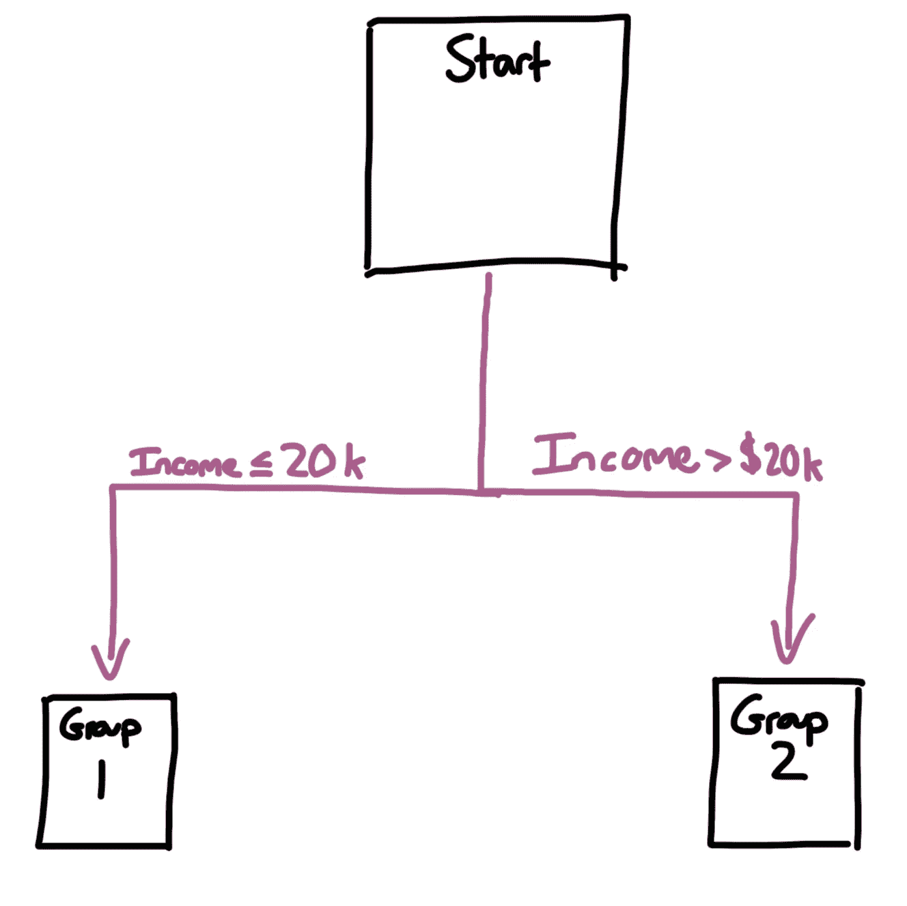

作者创建的图像

然后，我们可以再次分割这些分割，这样它们在图上看起来就像这样:

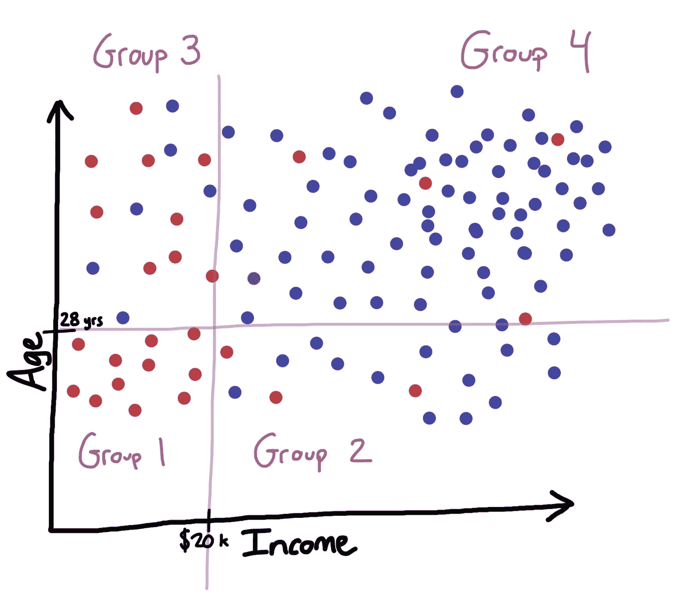

作者创建的图像

这是第二次分裂的树形图:

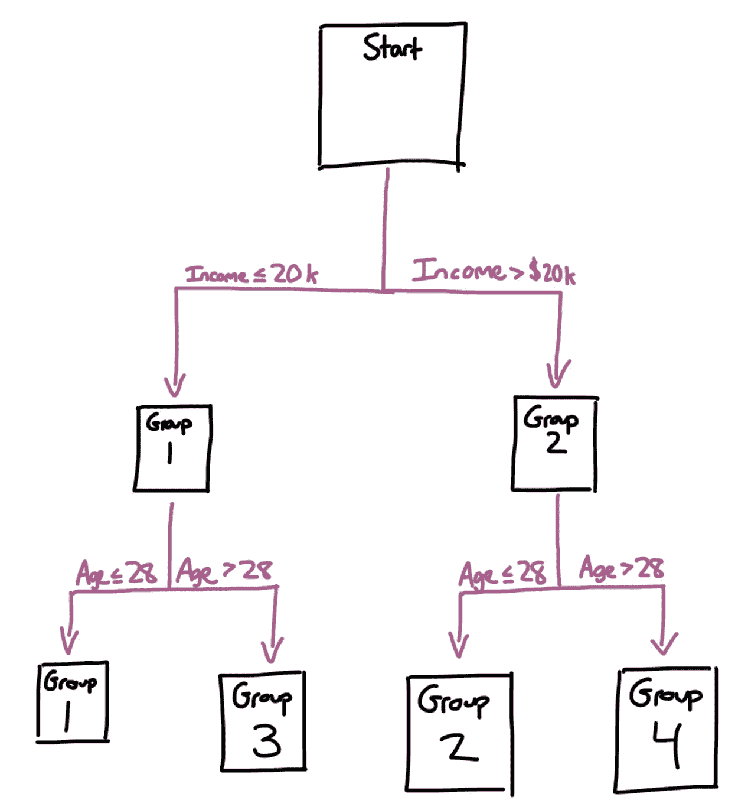

作者创建的图像

我们可以像这样不断进行越来越小的拆分，直到我们在每个分支的底部只剩下一个结果——违约或不违约。另一种看待这个问题的方式是，我们不断地把图上的方框变得越来越小，直到每个方框只包含一种颜色的点。

对于每一次分割，计算机通过使用一个有趣的数学过程找到分割的最佳值，我们在这里不会深入研究。

要使用决策树算法测试一个新案例，您只需从头开始，沿着分支向下。

假设 Ted 一年挣 5 万美元，30 岁。我们从树的顶端开始。

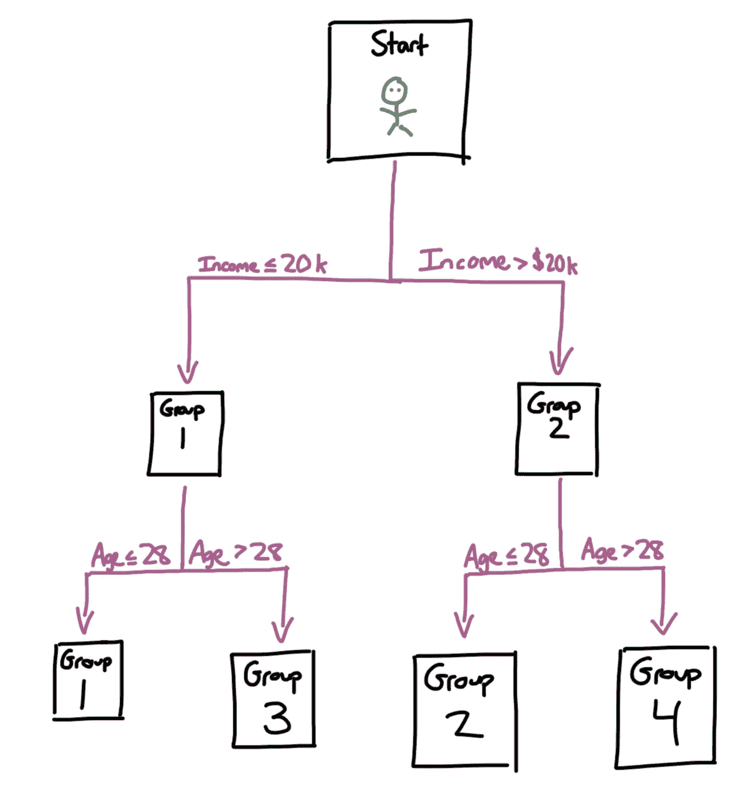

作者创建的图像

然后，我们向右下方移动，因为 Ted 每年挣 2 万多美元。

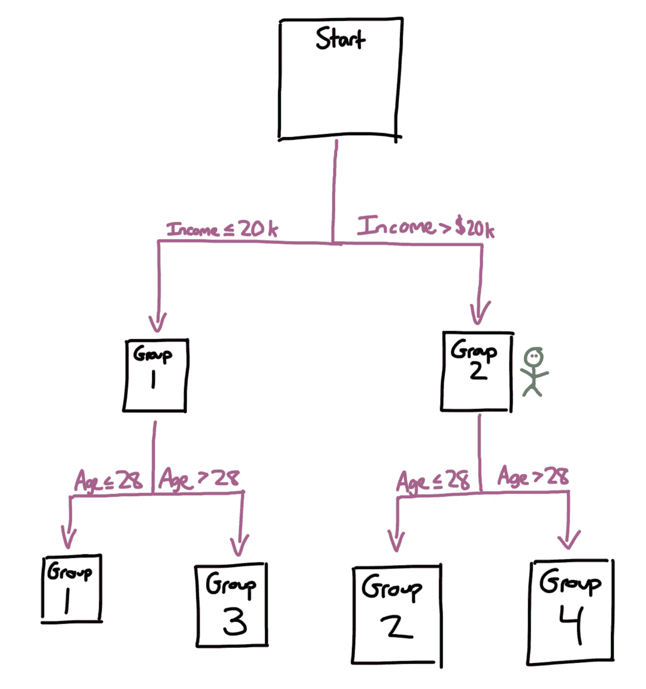

作者创建的图像

从这里开始，我们向右移动，因为 Ted 大于 28 岁。

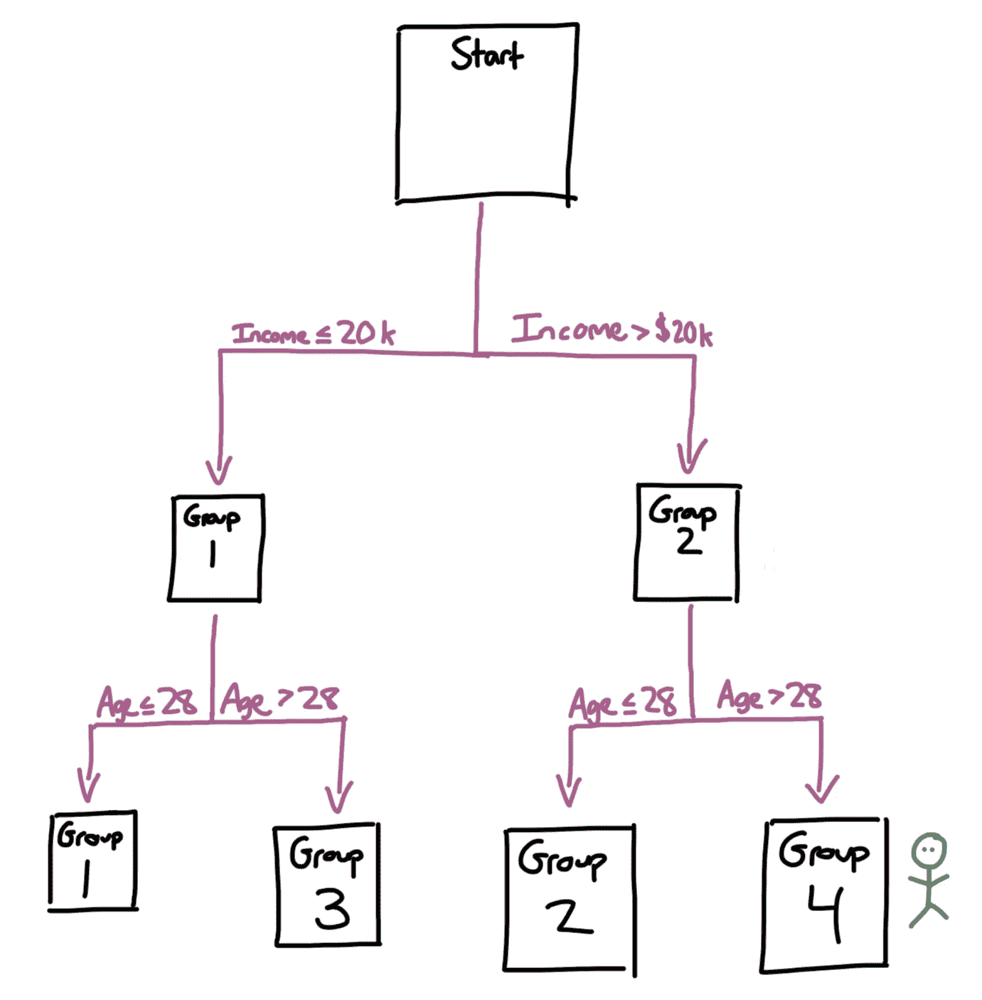

作者创建的图像

这个过程一直持续，直到我们到达树的底部，在那里一片叶子上只有一种可能的结果。在真正的决策树中，会有比这里显示的两层更多的分支。

这个算法的问题是它返回一个二元结果:要么 Ted 违约，要么 Ted 不违约。鉴于任何模型本质上都是不完美的，这种二元结果对于信用建模来说并不那么有用。我们不能用一个二进制的结果来设定 Ted 的利率。

解决方法是使用**随机森林**。随机森林只是决策树的集合，所有的结构都稍有不同。为了进行预测，森林中的每棵树都“投票”决定它是否认为 Ted 会拖欠贷款。泰德的信用风险是说他会违约的树的百分比。

像我们讨论的其他算法一样，决策树算法可以扩展到任意多的维度。决策树算法的一个优点是它非常擅长捕捉非线性数据。然而，决策树有时会对有噪声的数据看得太远，认为它们看到了在统计上不存在的重要模式。

还有一种机器学习算法，我们将在这里简单介绍一下。

# **神经网络**

神经网络比我们已经讨论过的三种算法要复杂得多。它们是模仿人脑的迷人算法，也是大多数可被视为“人工智能”的系统的核心。

对于简单的信用风险建模问题，神经网络通常是多余的，但在某些情况下，它们可能非常有用。

如果你想了解更多关于神经网络的知识，你可以在这里阅读它们的详细解释[。](https://medium.com/@a.jeremymah/behind-the-eyeballs-of-ai-how-neural-networks-work-207c31e0b1ff)

# **风险建模流程总结**

这四类算法(k 近邻、逻辑回归、决策树和神经网络)只是信用风险建模中使用的机器学习的开始。但是理解这些算法的基础知识会让你对整个信用风险建模过程有一点了解，这种理解会给你提供一个完美的跳板来学习更多关于机器学习的知识。

首先，我们开发了一些关于贷款和利率在现实世界中如何使用的领域知识。然后，我们将数据分成训练集和测试集来分析各种模型。最后，我们分析了几个可以测试的模型，我们知道我们会使用最有效的模型输出来进行预测。

类似的过程适用于几乎任何涉及机器学习的问题。

首先，发展一些关于你正在处理的问题的领域知识是很重要的，这样你就知道如何提出正确的问题。然后，您必须清理和准备您的数据(这个主题我们在这里没有深入探讨)。接下来，您将训练和测试各种模型，完善模型以最大限度地提高预测准确性。最后，你向他人展示你的结果，并将它们应用到现实世界的问题中，不断重复这个过程。

如果你对这个一般过程有了更好的理解，那么你就可以更好地理解信用风险建模和机器学习作为一个整体！