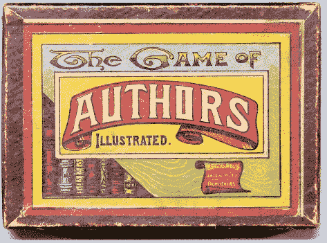

# 适时给予的应得的赞扬

> 原文：<https://towardsdatascience.com/credit-where-credit-is-due-ff9d3c38c940?source=collection_archive---------34----------------------->

## 导航学术信用和作者

来源:[谷歌艺术与文化](https://artsandculture.google.com/asset/card-game-the-game-of-authors-illustrated-parker-brothers/4QEi7RBrTSOkFA)

学分分配和关于论文作者的决定是一个令人惊讶的难以驾驭的话题，尤其是对初级研究人员来说。我清楚地记得在我的第一篇论文上非常努力地工作，本能地将自己列为最后一名作者——鉴于我的名字缩写，我习惯于在名单上最后一名——并通过我的合著者的间接评论发现，论文上的姓名排序实际上是一件事。那个想法当时对我来说似乎很滑稽，但我很快了解到，奇怪的是，[真的很关心这个问题。](http://phdcomics.com/comics/archive.php?comicid=562)

# 总则

大多数专业组织都有作者身份的标准(例如 [ACM](https://www.acm.org/publications/policies/authorship) 、 [IEEE](https://journals.ieeeauthorcenter.ieee.org/become-an-ieee-journal-author/publishing-ethics/definition-of-authorship/) 、 [APA](https://www.apa.org/science/leadership/students/authorship-paper.pdf) 、 [ICMJE](http://www.icmje.org/recommendations/browse/roles-and-responsibilities/defining-the-role-of-authors-and-contributors.html) )。在我自己的机构，黄金法则是:

> 公平，倾向于包容性。

这种宽泛的、故意不具体的政策让研究人员决定遵守哪些标准，这些标准通常是由他们自己的社区设定的。我们还为研究人员提供了寻求建议和处理升级的机制。标准以微妙的方式变化，从作为论文的活跃作者是否是作者身份的必要条件，到围绕致谢和引用的实践。

我对初级研究人员的主要建议是谈论学分分配:尽早谈论它，并根据需要经常重复对话。

> “成功与你愿意进行多少尴尬的对话成正比。”——蒂姆·费里斯

我遇到的大多数问题都与不匹配的期望有关:‘你说我会成为合著者/但你什么都没做/但你说…’，或者‘你提交了这篇文章却没有承认我？!'。谈论它是最好的解药。关于作者身份的早期对话不需要理解为合同:事情会发生变化，人们会忙于其他事情，也会有新人加入。这就是为什么养成定期进行这些对话的习惯是有帮助的，只要参与的每个人都愿意参与，正如他们应该做的那样。有一件事非常有助于奠定这些对话的基础，那就是共享的进度文档，其中每个人对项目的投入都被记录下来。

而且这些都是很难的对话！有人会说“[至关重要的对话](https://www.amazon.com/Crucial-Conversations-Talking-Stakes-Second/dp/1469266822)”拖延拥有它们是非常诱人的，因此错过了早期发现问题的机会。我见过这样的情况，作者名单只有在准备好的论文到期的那天才能确定，这给合作者带来了过度的压力，尤其是那些初级角色。

关于如何进行这些对话，没有通用的模板，因为这在很大程度上取决于参与者各自的角色以及当时工作的成熟程度。一个好的起点是，一旦研究的叙述开始成形。当合作者开始讨论潜在出版物的“内容”和“时间”时，这是一个将对话引向“谁”的机会，同时设定这将是一个持续过程的预期。

不要轻易将你的名字与任何作品联系在一起。慷慨地使用致谢——对某人的工作表示感谢通常是一种赞赏的认可，但在没有询问他们的情况下，永远不要在论文中承认或添加某人为合著者。有很多人采取措施不在网上公开他们的名字或关系，尊重他们的隐私选择是很重要的。我也拒绝成为名义上由我投稿的论文的合著者，因为我不同意该成果的质量或作为独立出版物的价值。还要注意的是，专利申请的作者标准往往比学术出版物更为严格，因为一项专利的共同发明人要证明没有参与该发明，这可能是该专利完全无效的理由。

# 常见模式

有一些常见的场景往往是围绕信贷问题的丰富来源。一个是团队经理、领导或其他学术顾问的角色。简单地说，在我的团队中，我们不实行“荣誉作者”制度。线索不应被添加为提供人数、资金、参加会议或仅仅是有脉搏的作者。有一些无形的贡献，如指导研究，以特定的方式提供建议或使其有组织地进行，这些都值得认可，但我不认为在每篇论文上添加实验室领导的常见做法是健康的，特别是因为它在某种程度上贬低了高级团队成员的贡献。

另一个经常出现的问题是如何认识到软件工程师的影响，他们为支持研究贡献了基础设施。任何专门为研究项目服务的工程工作都是被邀请投稿的明确理由。当有相应的出版物时，更为横向的工作，以及在没有工具和框架等专门化的情况下对多个项目做出贡献的工作，通常是值得承认或引用的。值得注意的是，对于那些没有围绕研究成果建立职业生涯的人来说，学术学分并没有得到一致的重视。尝试并理解如何以对自己重要的方式奖励自己的工作是很重要的。

现有技术的问题是另一个常见的问题，特别是当它建立在你的同事的工作之上时，他们可能会感到某种程度的所有权。这里的一般标准是，任何发表的作品都是被引用的理由，而不是合著。要求成为自己作品的任何衍生作品的合著者是一种常见的冲动，但除非涉及未发表的作品，否则会受到抵制。许多社区试图通过非自我引用的数量来衡量影响，从而实现标准化，尽管该标准并未统一应用。

另一方面，使用具体的、可操作的、以前未发表的想法保证了提出想法的个人被邀请共同撰写论文。当人们寻求对他们共享的一般概念的信任时，问题往往会出现，但不仅仅是在高层次上讨论它们。很容易写下并传播一个想法，而不需要限定或试图发表它，希望也许有人会从事类似的工作，并且现在有义务信任你。但这是一种非常有害的动态，尤其是在绿地领域，那里有许多“显而易见”的想法可以尝试，而艰难的工作是验证它们。对此，我的解决办法是将任何关于一般的、非特定的想法的现有技术的主张视为承认的理由，而不是合著。这是一种微妙的平衡，因为你仍想激励思想的自由流动，但又不想让一个人口中的每一个概念胚胎都成为插在研究领域的一面旗帜，上面写着“不进则退”。

在大型团队中，长时间的工作涉及到许多人和问题的各个方面，一个非常常见的问题是优化整个团队的信誉，而不是希望更快地发布他们自己的问题。经常有一种“独家新闻”的诱惑:迅速发表一篇论文，要么与更大的努力竞争，解决其中的一部分，而不解决项目的更大范围，要么使用为项目建造的新基础设施，但未发表。这是为数不多的完全可靠和可发表的研究可能需要被阻止的情况之一，而且更大项目的利益可能会理所当然地优先于少数人的利益。

# 无意识的偏见和激励

我发现在项目合作中，尝试并理解潜在的偏见和动机是非常有用的，因为很容易出于良好的意图而无意中造成困难的局面。例如图片:

1.  一个高级贡献者向项目添加第二个初级贡献者，威胁“第一作者身份”，
2.  相反，初级成员向另一个高级贡献者寻求建议，威胁“最后作者身份”，
3.  一位合作者为项目添加了#名人，很高兴有机会与他们合作撰写论文。其他团队成员不高兴，因为现在这是一个“名人项目”，他们自己的贡献将会黯然失色。
4.  作者在某些期望的基础上预先就作者顺序达成一致，但是项目不断发展，
5.  Aaron Aappy 建议按字母顺序排列，Zoe Zzzywk 并不觉得有趣。

在许多领域，博士是由第一作者的论文组成的，终身职位案例是由最后作者的论文组成的，一个人建立个人档案的机会是有限的，这就产生了支持或反对某些类型合作的强烈动机。一个人的个人经历还有许多其他方式可以影响到某人对公平的看法:如果你来自一个在你的领域中代表性不足的群体，也许“平等作者身份”对你来说并不平等。或者，如果你是一名工程师，其对研究工作的贡献在过去被忽视了，仅仅承认你的工作，而不是合作，可能会让人觉得又是一种轻视。

这就是为什么我强调从一开始就在工作组中公开谈论这些问题，因为只要这些偏见仍然是无意识的，无论是对你自己还是对他人，它们甚至会妨碍定义公平对每个人意味着什么。无论我们多么希望公平可以被客观地定义，在这种情况下，它在很大程度上仍然是一种主观的衡量标准。

> 信用不是一个附加的数量

我经常遇到的最后一个常见的认知偏见是，在论文中增加另一位作者总是会稀释一个人的贡献，好像荣誉是一个固定的馅饼，要在合著者之间瓜分。这是完全不真实的:没有人会在意你是 4 人还是 5 人论文的合著者——在单作者论文的背景下很可能完全相反。事实上，如果你有一位非常知名的研究人员作为合著者，在某种程度上，他们可能会提高你论文的可信度，有效地增加整体信用，而不是拿走。

# 疑难病例

事情也有很多不太好的方式变得复杂。想象一下这些:

1.  爱丽丝在团队会议上提出了一些想法。几个月后，Bob 提交了一篇非常相似的论文。爱丽丝没有意识到。
2.  顾问建议一组项目。Alice 和 Bob 独立地获得了相同的想法，并且彼此不说话，独立地执行它。
3.  Bob 开始与 Alice 合作，但是没有时间继续工作。论文是在他有机会腾出足够的时间来投稿之前写的。
4.  鲍勃提出了一个想法。Alice 说“几个月前我也有同样的想法，让我把它写下来”，然后迅速拿出一份描述这个想法的文档。
5.  爱丽丝和鲍勃，分别是第一和第二作者，向会议提交了一篇论文，但被拒绝。Alice 有其他事情要做，但是 Bob 和 Chris 一起工作，对它进行实质性的修改，重新提交，它被接受了。
6.  Bob 为这个项目做了很多工作，但是这些工作最终没有被包括在报告中。

在每一种情况下，都有相互冲突的观点的自然设置，或实际指责的空间，正确的做法可能取决于许多因素。这可能是坦诚对话最重要的地方，包括事实和人们对这些事实的解释和感受。这也是某种形式的独立裁决特别有用的地方。

作者的问题也可能最终成为决策点之一，在这种情况下，达到每个参与者都能接受的封闭程度比实际结果更重要。到了紧要关头，如果真到了那一步，抛硬币并不是做出决定的最糟糕方式。特别是，它没有“包袱”来解释为什么做出一个特定的决定，并使每个人都能继续前进。

# 我应该在乎吗？

许多人会认为围绕着作者身份的问题微不足道，不值得他们关注。我承认，在我职业生涯的大部分时间里，我都是在那个阵营中度过的，我把更多的注意力放在了推动科学发展上，而不是信贷拨款的细节上。但随着我的角色逐渐变成一名研究负责人，我开始意识到，不想关心并不能免除我关注的责任，因为这对我周围的人来说确实很重要，原因也是我不能轻易忽视的。尽管我很希望自我和职业发展仅仅是非凡研究成果的次要驱动力，但我明白它们本身也推动了很大一部分科学进步。

人们会对各种各样的内在和外在激励因素做出反应，但他们的自我形象往往总是他们动机的核心，不可回避的事实是，看到自己的名字在公共领域得到认可是其中的一个重要部分。所以我转过身来，决定拥抱人们对适当和公平的认可的渴望，并帮助促进学术信用的公平和透明是值得关注的，只要这样人们的注意力可以自信地转向更重要的问题，即共同产生良好的科学。如果好篱笆造就好邻居，公平和包容的信贷造就好的研究，这是值得关注的理由。

*感谢* [*亚历山大·浮士德*](https://www.afaust.info) *帮助整理本文所依据的材料，并感谢乔伊斯·诺亚-万霍克进行大量编辑。*