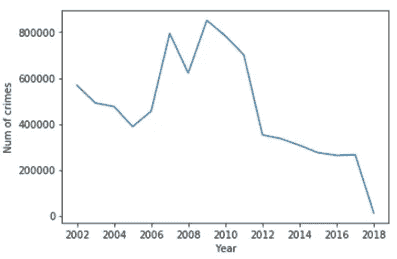
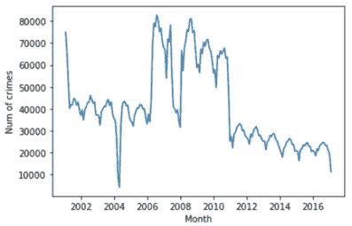

# 利用脸书先知预测犯罪率

> 原文：<https://towardsdatascience.com/crime-rate-prediction-using-facebook-prophet-5348e21273d?source=collection_archive---------39----------------------->

## 充分利用 FB Prophet 进行时间序列预测的指南


[I](https://unsplash.com/photos/4dKy7d3lkKM) mg 通过[链接从 unsplash】](https://unsplash.com/photos/Q2-EQDwxFtw)

> 时间序列预测是任何数据科学家都必须知道的技术之一。像预测天气、产品销售、购物中心的客户访问或要维护的库存数量等问题都与时间序列预测有关，这使它成为数据科学家技能组合的重要补充。

在这篇文章中，我将介绍**如何使用脸书预言家预测芝加哥的犯罪率。**分成 5 部分:

1.先知游戏攻略

2.电子设计自动化(Electronic Design Automation)

3.数据处理

4.模型预测法

5.外卖食品

让我们开始旅程吧🏃‍♀️🏃‍♂️.

**1。先知介绍**

2017 年，脸书核心数据科学团队开源 Prophet🎉🎉。正如其 [Github](https://github.com/facebook/prophet) 页面所述，Prophet 是:

*   预测时间序列数据的程序；
*   基于附加模型；
*   用每年、每周和每天的季节性以及假日效应来拟合非线性趋势。

Prophet 使用一个可分解模型，该模型有三个主要部分，包括趋势、季节性和假期，组合如下:


其中:

*   *g(t)* 是对非周期性变化建模的趋势函数；
*   *s(t)* 表示周期性变化(例如，每周和每年的季节性)；
*   *h(t)* 表示节假日对潜在不规则时间表的影响；
*   误差项表示模型不适应的任何特殊变化。

> 因此，使用时间作为回归变量，Prophet 试图将时间的线性和非线性函数拟合为组件。实际上，Prophet 将预测问题框定为曲线拟合练习，而不是查看每个观察的基于时间的依赖性，这带来了灵活性、快速拟合和可解释的参数。

> Prophet 最适用于具有强烈季节效应的时间序列和几个季节的历史数据。

**2。EDA**

这里使用的数据是来自 [Kaggle](https://www.kaggle.com/currie32/crimes-in-chicago) 的芝加哥犯罪数据集。它包含了 2001 年至 2017 年发生在芝加哥市的已报告犯罪的汇总。

快速查看下面的数据，您会注意到数据集有 23 列和 7，941，282 条记录，包括 ID、案例号、块、主要类型、描述等。

芝加哥原始犯罪数据集一览

首先，让我们删除未使用的列。具体来说，

```
df.drop([‘Unnamed: 0’, ‘ID’, ‘Case Number’, ‘IUCR’, ‘X Coordinate’,  ‘Y Coordinate’,’Updated On’,’Year’, ‘FBI Code’, ‘Beat’,’Ward’,’Community Area’,‘Location’, ‘District’, ‘Latitude’, ‘Longitude’],
axis = 1, inplace=True)
```


图 1 删除列后的数据视图

如图 1 所示，*【日期】*栏为日期格式。让我们将它转换成熊猫可以理解的日期格式，并将其设置为索引。具体来说，

```
df.Date = pd.to_datetime(df.Date, format = ‘%m/%d/%Y %I:%M:%S %p’)
df.index = pd.DatetimeIndex(df.Date)
df.drop(‘Date’, inplace = True, axis = 1)
```

现在，数据可以进行可视化了。**首先，让我们看看每年的犯罪分布。**具体来说，

```
plt.plot(df.resample(‘Y’).size())
plt.xlabel(‘Year’)
plt.ylabel(‘Num of crimes’)
```

注意上面的 *df.resample('Y ')。size()* 产生年度犯罪计数。

如图 2 所示，从 2002 年到 2005 年，犯罪率开始下降。但是从 2006 年开始，犯罪率开始上升，在 2009 年达到顶峰，然后一直下降到 2018 年。这条曲线可能反映了经济对社会犯罪的影响。金融危机前后，犯罪率逐年下降，但金融危机导致的经济不景气导致犯罪率上升。



图 2 犯罪率的年度分布

**其次，我们来看一下季度犯罪率分布。如图 3 所示，犯罪率呈周期性起伏的下降趋势。**


图 3 犯罪率的月度分布

同样，如图 4 所示，月度犯罪率显示出与季度分析相同的模式。



图 4 犯罪率的季度分布

**3。数据处理**

*Prophet 的输入始终是包含两列的数据帧:“ds”和“y”。“ds”(datestamp)列应该是 Pandas 所期望的格式，最好是 YYYY-MM-DD 表示日期，或者 YYYY-MM-DD HH:MM:SS 表示时间戳。“y”列必须是数字，代表我们希望预测的测量值。*

具体来说，

```
df_m = df.resample(‘M’).size().reset_index()
df_m.columns = [‘Date’, ‘Monthly Crime Count’]
df_m_final = df_m.rename(columns = {‘Date’: ‘ds’, ‘Monthly Crime Count’: ‘y’})
```

**4。模型预测**

*从 EDA 分析中，我们发现有***的月度和季度季节性，而没有* ***的年度季节性。*** *默认情况下，如果时间序列超过两个周期，Prophet 适合每周和每年的季节性。用户可以使用“添加季节性”方法添加季节性，如每小时、每月和每季度。**

*要进行预测，请实例化一个新的 Prophet 对象，并调用 fit 方法对数据进行训练。具体来说，*

```
*m = Prophet(interval_width=0.95, yearly_seasonality=False)
m.add_seasonality(name=’monthly’, period=30.5, fourier_order=10)
m.add_seasonality(name=’quarterly’, period=91.5, fourier_order=10)
m.fit(df_m_final)*
```

*注意 *'interval_width=0.95'* ，产生一个围绕预测的置信区间。Prophet 使用部分傅立叶和来近似周期信号。傅立叶级数决定了季节性变化的速度。*

*预测是在一个数据帧上进行的，该数据帧有一列*‘ds’*包含要进行预测的日期。例如，要预测接下来的 24 个月，请尝试以下方法:*

```
*future = m.make_future_dataframe(periods = 24, freq = ‘M’)
pred = m.predict(future)*
```

*如图 5 所示，预测值' *yhat'* 被分配给具有下限和上限的每个日期。*

**

*图 5 预测结果*

*如图 6 所示，黑点是历史数据，深蓝线是模型预测。浅蓝色阴影是预测值周围 95%的置信区间。**蓝线显示与图 3 中的模式匹配良好，表明对历史数据的预测良好。😇😇***

**

*图 6 预测图*

*最后，图 7 显示了✨✨.犯罪率模式的非周期性趋势以及月度和季度季节性成分*

**

*图 7 预测模式组件图*

***5。外卖***

*我们介绍了如何充分利用脸书先知。具体来说，*

*   *使用 EDA 来探索历史数据模式，帮助创建最合适的模型*
*   *使用数据处理为建模准备数据*
*   *利用 Prophet 拟合历史数据，预测未来犯罪率*

***如果你觉得这篇文章有帮助，请随意点击👏s！如果想看用 Python 实现的代码，看我的仓库** [**这里**](https://github.com/luke4u/Time_Series_Forecasting/tree/main/Forecasting-FB-Prophet) **。🤞🤞🤞***

***参考:***

*1.[脸书先知官方文件](https://facebook.github.io/prophet/docs/quick_start.html)*

*2.先知论文:Sean J. Taylor，Benjamin Letham (2018)大规模预测。美国统计学家 72(1):37–45([https://peerj.com/preprints/3190.pdf](https://peerj.com/preprints/3190.pdf))。*