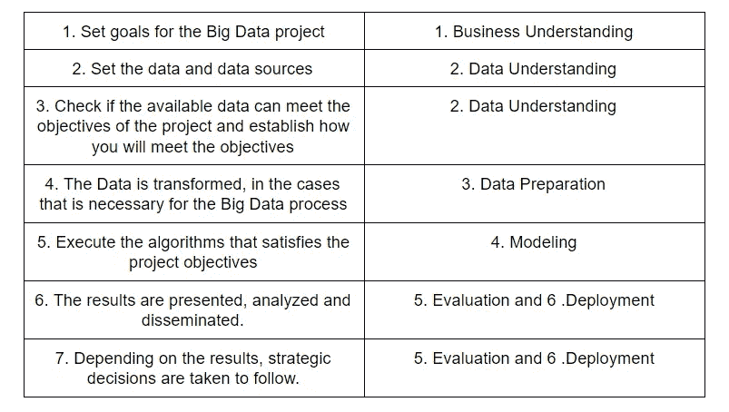
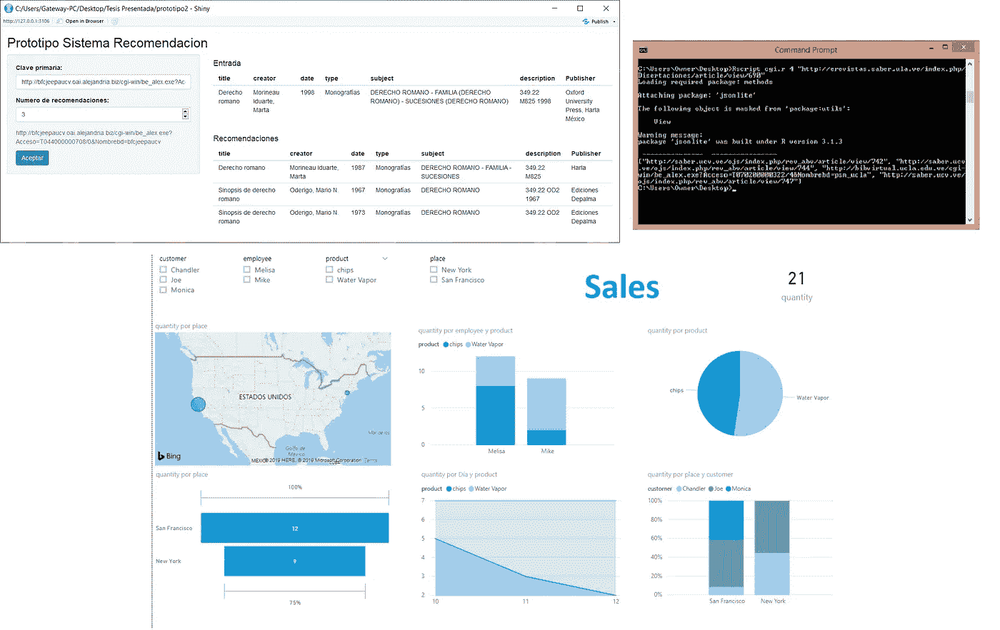

# CRISP-数据挖掘和大数据领域的数据挖掘方法领导者

> 原文：<https://towardsdatascience.com/crisp-dm-methodology-leader-in-data-mining-and-big-data-467efd3d3781?source=collection_archive---------3----------------------->

## 机器学习方法的一步一步的简短指南

图片来自[Pixabay](https://pixabay.com/?utm_source=link-attribution&utm_medium=referral&utm_campaign=image&utm_content=4503157)【1】的[二面体](https://pixabay.com/users/algedroid-9286107/?utm_source=link-attribution&utm_medium=referral&utm_campaign=image&utm_content=4503157)

2015 年 3 月，我与 Alberto Cavadia 和 Juan Gómez 合作撰写了一篇名为“大数据项目开发的方法论商业建议”的论文[2]。当时，我们意识到大数据项目通常有 7 个部分。

不久之后，我在论文中使用了 CRISP-DM 方法，因为它是一个开放的标准，[在市场上广泛使用](https://www.kdnuggets.com/2014/10/crisp-dm-top-methodology-analytics-data-mining-data-science-projects.html) [3]，而且(感谢之前的论文)我知道它与其他方法非常相似。

论文结论与 CRISP-DM 步骤之间的比较 [Israel Rodrigues](https://medium.com/@lwjirl)

随着我的数据层职业生涯的发展，我不可避免地注意到 CRISP-DM 方法仍然非常相关。实际上，数据管理单元和 IT 配置文件是围绕这种方法的步骤构建的。所以我决定，写一个小故事，来描述长期成功方法的步骤。

[肯尼斯·简森的图片](https://creativecommons.org/licenses/by-sa/3.0/)描述了步骤【4】

CRISP-DM 代表数据挖掘的跨行业标准过程，是 1996 年为塑造数据挖掘项目而创建的方法。构思一个数据挖掘项目包括 6 个步骤，并且可以根据开发人员的需要进行循环迭代。这些步骤是业务理解、数据理解、数据准备、建模、评估和部署。

第一步是**业务理解**，其目标是给出目标和数据的上下文，以便开发人员/工程师了解特定业务模型中数据的相关性。

它包括会议、在线会议、文档阅读、特定的现场学习，以及他们帮助开发团队的一长串方法，提出关于相关上下文的问题。

这一步的结果是开发团队理解了项目的上下文。项目的目标应该在项目开始前定义。例如，开发团队现在应该知道目标是增加销售，在这一步结束后，了解客户销售什么以及他们如何销售。

第二步是**数据理解**，其目标是了解从数据中可以预期和实现什么。它从几个方面检查数据质量，如数据完整性、值分布、数据治理合规性。

这是项目的关键部分，因为它定义了最终结果的可行性和可信度。在这一步，团队成员就如何提取信息的最佳价值进行头脑风暴。如果开发团队不清楚某些数据的用途或相关性，他们可以暂时后退一步，了解业务以及它如何从这些信息中受益。

由于这一步骤，数据科学家现在知道，就数据而言，结果应该满足项目的目标，什么算法和过程产生该结果，数据的当前状态如何，以及它应该如何，以便对所涉及的算法和过程有用。

[伊斯罗德里格](https://medium.com/@lwjirl)的一些数据理解技巧

第三步是**数据准备**，涉及 ETLs 或 ELTs 过程，通过算法和过程将数据片段转化为有用的东西。

有时，数据治理策略在组织中没有得到尊重或设置，为了赋予数据真正的意义，标准化信息成为数据工程师和数据科学家的工作。

同样，一些算法在某些参数下表现更好，一些算法不接受非数字值，另一些算法在值的方差很大的情况下不能正常工作。话又说回来，标准化信息是开发团队的责任。

大多数项目在这一步花费了大部分时间。这一步，我相信，是有一个 IT 概况称为数据工程师的原因。由于这非常耗时，在处理大量数据时会变得非常复杂，因此 IT 部门可以利用专门的资源来执行这些任务。

第四步是**建模**，是任何机器学习项目的核心。这一步负责应该满足或帮助满足项目目标的结果。

虽然这是项目中最吸引人的部分，但也是时间最短的部分，就好像之前的一切都做得很好，几乎没有什么需要调整的。如果结果是可改进的，该方法将返回到数据准备并改进可用数据。

一些算法，如 k-means、层次聚类、时间序列、线性回归、k-最近邻等，是该方法中这一步的核心代码行。

以色列罗德里格斯的一些建模技巧

第五步是**评估**，由它来验证结果是否有效和正确。如果结果是错误的，该方法允许回顾第一步，以了解为什么结果是错误的。

通常，在数据科学项目中，数据科学家将数据分为训练和测试。在这一步中，使用测试数据，其目的是验证模型(建模步骤的产品)是否与现实相符。

根据任务和环境的不同，有不同的技术。例如，在监督学习的环境中，对于分类项目的任务，一种验证结果的方法是使用混淆矩阵。对于无监督学习，进行评估变得更加困难，因为没有静态值来区分“正确”和“不正确”，例如，对项目进行分类的任务将通过计算(一些)聚类中元素之间的内部和内部距离来评估。

在任何情况下，指定一些误差测量源都是很重要的。这个误差度量告诉用户他们如何对结果有信心，或者是“肯定这将工作”或者“肯定它不会”。如果在所有情况下，误差度量恰好为 0 或没有，这将表明模型过拟合，而现实可能表现不同。

第六步也是最后一步是部署，它包括以有用和可理解的方式呈现结果，通过实现这一点，项目应该实现其目标。这是唯一不属于循环的步骤。

根据最终用户的不同，有用和可理解的方式可能会有所不同。例如，如果最终用户是另一个软件，就像销售网站程序询问其推荐系统向购买者推荐什么一样，一种有用的方式是 JSON 携带对特定查询的响应。在另一种情况下，就像一位高层管理人员需要计划的信息来进行决策一样，呈现这些发现的最佳方式是将其存储在分析数据库中，并作为商业智能解决方案的仪表板来呈现。

一些部署**的**例子由[以罗德里格](https://medium.com/@lwjirl)

我决定写这篇简短的描述/解释，因为我对这种方法的长期相关性感到惊讶。这种方法已经存在很长时间了，而且看起来它会流行更久。

这种方法非常符合逻辑，并且向前推进了一步。因为它评估数据挖掘项目的所有方面，并允许对其执行进行循环，所以是健壮的和可信的。毫不奇怪，大多数开发人员和项目经理都选择它，而且备选方法非常相似。

我希望这篇简短的介绍，能够帮助 IT 专业人员对他们的任务的方法开发进行论证。信息学的其他几个领域可以阅读这个故事，并基本了解数据科学家正在做什么，以及它与数据工程师和商业智能等其他方面的关系。

我希望你喜欢它，因为这是我的第一个故事:)。

参考资料:

[1] algedroid，Team，Work，Business，Cooperation (2019)，URL:[https://pix abay . com/photos/Team-Work-Business-Cooperation-4503157/](https://pixabay.com/photos/team-work-business-cooperation-4503157/)

[2] Alberto Cavadia，Juan Gómez，e . Israel rodríguez，大数据项目发展的方法建议(2015 年)，《数据科学论文》

[3] [Gregory Piatetsky](https://www.kdnuggets.com/author/gregory-piatetsky) **，** CRISP-DM，仍然是分析、数据挖掘或数据科学项目的顶级方法论(2014)，URL:[https://www . kdnugges . com/2014/10/CRISP-DM-top-methodology-analytics-data-mining-data-science-projects . html](https://www.kdnuggets.com/2014/10/crisp-dm-top-methodology-analytics-data-mining-data-science-projects.html)

[4] Kenneth Jensens，显示 CRISP-DM (2012)不同阶段之间关系的流程图，URL:[https://es . Wikipedia . org/wiki/Cross _ Industry _ Standard _ Process _ for _ Data _ Mining #/media/Archivo:CRISP-DM _ Process _ diagram . png](https://en.wikipedia.org/wiki/Cross-industry_standard_process_for_data_mining#/media/File:CRISP-DM_Process_Diagram.png)