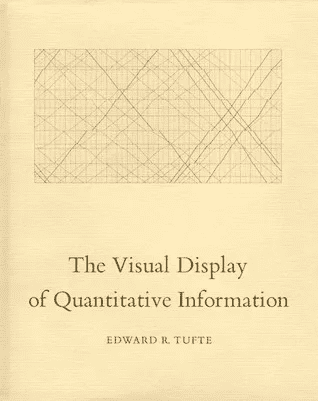
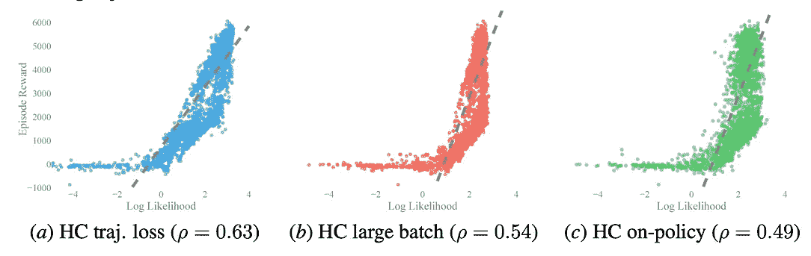
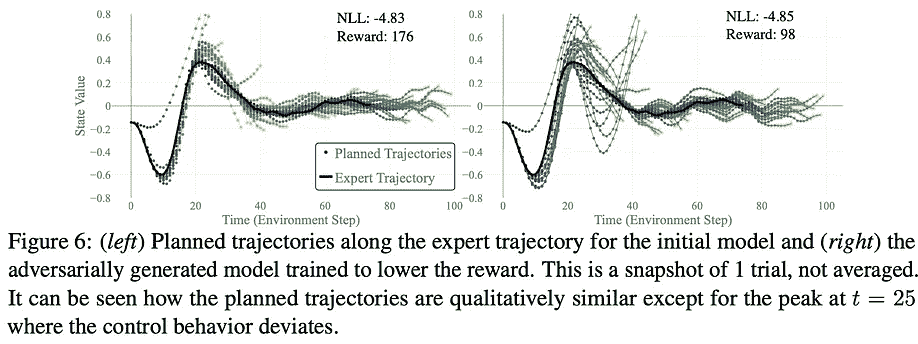
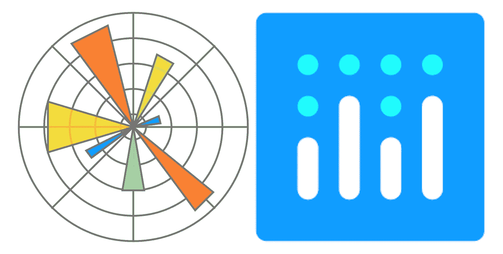
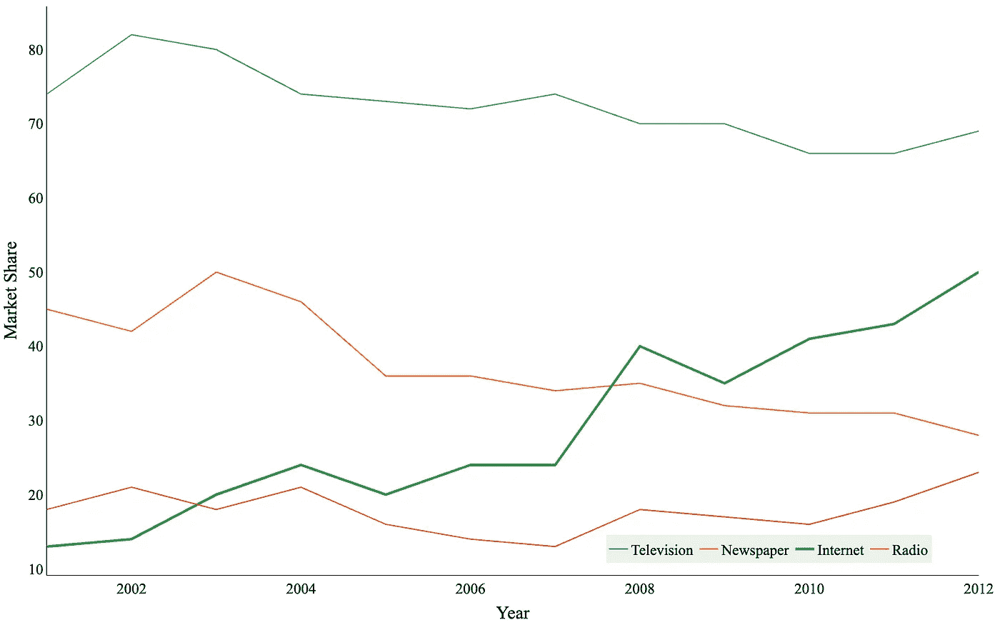
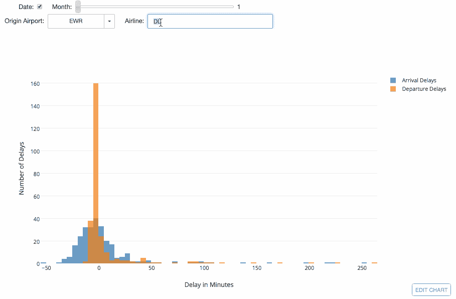
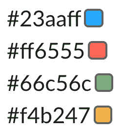
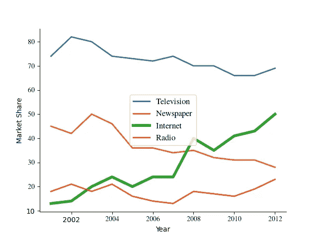
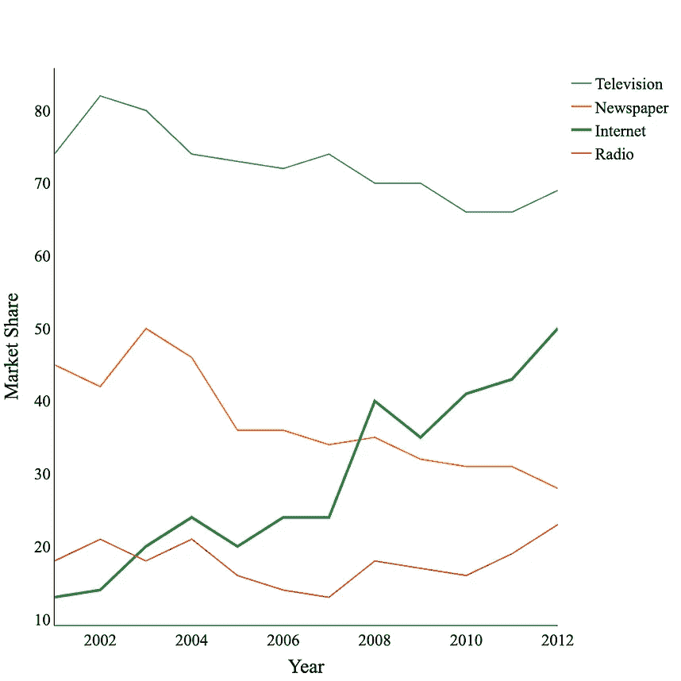

# 基于可视化理论的清晰 python 绘图

> 原文：<https://towardsdatascience.com/crisp-python-plots-based-on-visualization-theory-5ac3a82c398e?source=collection_archive---------15----------------------->

## 是时候从 Matplotlib 升级到 **Plotly** 了——下面是方法和原因。

P 实际上，这个帖子是我们都可以从经典中学习到的一大块东西，*量化信息的可视化展示* —爱德华·塔夫特。我还介绍了如何用 Python 实现它。

# 展示信息的支柱

## 卓越的图形

这就是演示文稿的**质量**。通过删除多余的形状、分散注意力的颜色和不一致的字体，您的数据将更容易被查看。根据我的经验(以及爱德华·塔夫特的经验)，优秀的图形来自于许多小变化的累积收益。你地块上的每一滴墨水都很重要。

## 图形完整性

这就是演讲的**真相**。通过确保您的坐标轴正确缩放并反映趋势，您的数据将得到更真实的解释。从长远来看， ***真相总是更有价值*** 。每个人都见过其中一个用非线性 y 轴使假设看起来更强的图——发誓永远不这样做。

*本教程是你需要的几行代码，可以清晰真实地显示你的数据。*



如果你对你的数据感兴趣，我会拿一份。

对于所有的数据科学家和信息书呆子来说， [*定量信息的可视化显示*](https://www.goodreads.com/book/show/17744.The_Visual_Display_of_Quantitative_Information) 是最终的茶几书。它是展示信息书籍中无可争议的王者，这是有原因的，而且阅读起来也很愉快。

我一直在使用其中概述的方法，在我的机器人和机器学习研究论文中创建强大的情节。下面是几个摘录，由于 Medium 缺乏渲染 pdf 图像(目前)，请进行缩减采样。



左)散点图具有内在的密度感。右图)通过线条+标记绘制的彩色轨迹分散对象。

这个职位有三个目标。

1.  我想确保每个人都理解他们在使用默认绘图功能时犯的一些关键错误。
2.  **向我的听众介绍 Plotly** ，他与数据打交道，并在人工智能和数据领域探索自我完善的文章。
3.  涵盖**可视化理论**的基础知识，以及在拥挤的数字领域中让你的作品吸引眼球的先进技术。

包含的代码摘自我的教程报告中的`plot.py`,我将扩展它以包含 3d 绘图、动画等的最佳实践。

 [## NATO Lambert/绘图-基础

### Plotly 和 Matplotlib 中干净地块基础的代码行集合— natolambert/plotting-basics

github.com](https://github.com/natolambert/plotting-basics) 

T *utorial 从这里开始*。本教程将同时使用两种绘图工具— Matplotlib 和 Plotly。



左— Matplotlib 徽标，右— Plotly 徽标。

1.  [**Matplotlib**](https://matplotlib.org/) :老旧的绘图引擎驱动着那么多遗留的实验代码，工程师的拐杖卡在了过去。
2.  [**plottly**](https://plotly.com/):数据科学、分析学以及我的职业生涯的未来。

自始至终，我认为 plotly 为用户提供了更多的工具来保持图形的优秀和完整性。

# 0.设置



这是我们要建立的情节。小杂乱，简单的数据。更高级表现的平台。

我在这篇文章的最后包括了设置(导入和数据加载)，所以人们可以根据需要复制它。依赖性的障碍很低，所以我们可以很容易地获得顶层绘图和安全保存机制。更少的依赖意味着更多的人会借鉴、复制和构建你的作品。

*   易于开发的绘图工具:`matplotlib`、`matplotlib.pyplot`、`plotly`、 `plotly.graph_objects`
*   数学和数据工具:`numpy`，`pandas`
*   系统工具:`os`，`sys`

## 初始化绘图

创建新数据可视化的第一步可能会给用户带来失败。 ***总是创建一个轴或一个特定的图形对象*** 。这允许完全控制数据以何种方式发送到哪里。

Plotly 已经领先一步。使用**子图**时，图形会根据每一行和每一列进行索引，而不是根据 matplotlib 中必须跟踪的轴列表进行索引(当 n=1 时，`plt.subplots`调用有效)。

```
###### Init plot / subplots ######
# mpl
fig_mpl, ax = plt.subplots()# plotly
fig_plo = plotly.subplots.make_subplots(rows=1, cols=1)###### add data ######
for i in range(0, 4):
    # mpl
    ax.plot(...)

    # plotly
    fig_plo.add_trace(go.Scatter(...))
```

# 1.删除额外信息

## 网格线应该消失

数字和印刷混乱的最终来源是网格线。即使渲染成 PDF 格式，网格线看起来也不是很好(缩小来看看网格线是什么样子)，而且它们很少帮助专注的读者理解。让趋势自己说话。

```
# mpl
ax.grid(False)#plotly
fig.update_layout(xaxis_showgrid=False, yaxis_showgrid=False)
```

## 多余的框线是没有用的

使用空白。在任何媒介中，空间都是有限的。将您的数据装箱会从页面中移除宝贵的空间，而您可以在这些空间中呈现数据。右边和上面的线应该去掉，但是有时候左边和下面的线很漂亮。

```
# mpl
ax.spines['right'].set_visible(False)
ax.spines['top'].set_visible(False)
ax.set_xlabel("Year")
ax.set_ylabel("Market Share (%)")# plotly
fig_plo.update_xaxes(title_text="Year", linecolor='black', 
                     row=1, col=1, zeroline=True,)
fig_plo.update_yaxes(title_text="Market Share", linecolor='black',
                     row=1, col=1, zeroline=True,)
```

## 掌控你的传奇

总会有快速读者在剧情中跳跃。总是有一个传奇人物来回答他们的问题。Plotly 拥有令人难以置信的图例工具，如分组、始终可见的隐藏项目，以及显示所选图例条目子集的交互式绘图。

使用**交互式 plotly 仪表板，让您的用户看到完整的数据，并了解他们想要的内容。**

```
# mpl
ax.legend()# plotly
fig_plo.update_layout(showlegend=True,)
```



plotly 仪表盘的一个例子— [来源](https://plotly.com/python/figurewidget-app/)。

# 2.一致的字体

## 尺寸很重要&与你的媒介相匹配

字体往往被忽视。将 Arial 字体的字体放入 Times 字体的复杂报表中，看起来总是不合适。缩放字体大小以匹配文本(几乎)并始终匹配字体。

```
# mpl
font = {'size': 24, 'family': 'serif', 'serif': ['Times']}
matplotlib.rc('font', **font)
matplotlib.rc('text', usetex=True)# plotly
fig_plo.update_layout(font=dict(
                            family="Times New Roman, Times, serif",
                            size=24,
                            color="black"
                            ),
                  )
```

# 3.可印刷的

## 移除背景并使用高分辨率

总是在你的图上提高分辨率。默认情况下，它们是低 dpi 和小尺寸的，所以把它们投影到屏幕上几乎没有用。 *Plotly 允许您设置查看和保存的分辨率，因此您可以在显示时准确地看到将要保存的图形，*这是一个成功之处，当您尝试它时就会明白。

Matplotlib 将保存和查看分开，这使您生成与使用`savefig()`不同的图`with show()`，并导致头痛。

```
# mpl
ax.set_facecolor((1, 1, 1))
# no resolution tool until saving :(# plotly
fig_plo.update_layout(plot_bgcolor='white',)
fig_plo.update_layout(width=1000, height=1000,)
```

# 4.在头脑中使用屏幕

## 另存为 PDF

可移植文档格式(PDF)将您的绘图保存为一系列彩色矢量对象，因此当它在屏幕上移动或移动到新设备时，它会被再次渲染。 *PDF 将使你在演示文稿或手稿中再也不会有像素化的情节。*

```
# mpl
plt.savefig(os.getcwd()+"plop_mpl.pdf", dpi=300)
plt.show()# plotly
fig_plo.write_image(os.getcwd()+"plot_plotly.pdf")
fig_plo.show()
```

## 低对比度颜色



屏幕上漂亮的颜色。柔软，独特，由我独特设计。

屏幕绘图的一个微妙之处是使用哪种颜色。颜色应该是 1)可区分的和 2)悦目的。这最终被*淘汰，*核心色。看看下面可用的颜色图，但首先我有一些经过测试的颜色。

我的颜色**天蓝色**T2、**红苹果**T3、**苔绿**、**芥末黄**T5。下面是查看 matplotlib 和 plotly 中一些颜色的链接。

[](https://matplotlib.org/3.1.0/tutorials/colors/colormaps.html) [## 在 Matplotlib - Matplotlib 3.1.0 文档中选择色彩映射表

### Matplotlib 有许多内置的色彩映射表，可以通过。还有外部库，如[palettable]和…

matplotlib.org](https://matplotlib.org/3.1.0/tutorials/colors/colormaps.html) [](https://plotly.com/python/discrete-color/) [## 离散颜色

### 同样，笛卡尔坐标中标记的 X 或 Y 位置可以用来表示连续值…

plotly.com](https://plotly.com/python/discrete-color/) 

# 输出

在继续滚动之前，仔细看看这些图。看哪个更一致，更无 bug。然后你就可以决定用哪个平台了。**其中一个里面的 bug 来自源头，无法避免**，这对于我来说是不成立的立场。



左)Matplotlib，右)Plotly。Matplotlib 版本的 auto-legend location 是一个彻底的失败，一些字体没有得到正确的转换，并且总的来说不够清晰。

我是 team plotly(右上方)，无 bug 且敏锐。

## Plotly 的改进版本

[Plotly 的 API](https://plotly.com/python-api-reference/) 有一个很容易访问的工具，几乎可以用于绘图中的每个设置，你可以通过一两行代码批量传递它们。这里是我喜欢的情节中的调整(偏好)的集合。它允许您 a)控制图例形状和位置，b)删除绘图周围的空白。试一试，看看 API——您会发现大量的工具。

```
# advanced 
fig_plo.update_layout(legend_orientation="h",
                  legend=dict(x=.6, y=0.07,
                              bgcolor='rgba(205, 223, 212, .4)',
                              bordercolor="Black",
                              ),
                  margin=dict(r=10, l=10, b=10, t=10),
                  )
```

 [## plotly - 4.6.0 文档的 Python API 参考

### 这是 plotly 的 API 的参考。另请参见 plotly 的文档网站。

plotly.com](https://plotly.com/python-api-reference/) 

通过更好的可视化向前迈出一步。来源—作者。

不太花哨的细节:

## 进口

下面是我如何为绘图脚本/模块构建我的导入。

```
# file tools
import os
import sys# plotting tools
import plotly
import plotly.graph_objects as go
import seaborn as sns
import matplotlib
import matplotlib.pyplot as plt# Core
import numpy as np
```

## 数据

我从本教程中使用的数据是从一个 plotly 线绘图的例子。你可以在这里查看。值得注意的一点是，plotly 有很好的色彩科学——*柔和的颜色在数字观看时更容易被眼睛看到*(较低的总颜色数 r+g+b)。

```
# Frome [https://plotly.com/python/line-charts/](https://plotly.com/python/line-charts/)
title = 'Main Source for News'
labels = ['Television', 'Newspaper', 'Internet', 'Radio']
colors = ['#1f77b4',  # muted blue
          '#ff7f0e',  # safety orange
          '#2ca02c',  # cooked asparagus green
          '#d62728',  # brick red
          ]mode_size = [8, 8, 12, 8]
line_size = [2, 2, 4, 2]x_data = np.vstack((np.arange(2001, 2014),)*4)y_data = np.array([
                   [74, 82, 80, 74, 73, 72, 74, 70, 70, 66, 66, 69],
                   [45, 42, 50, 46, 36, 36, 34, 35, 32, 31, 31, 28],
                   [13, 14, 20, 24, 20, 24, 24, 40, 35, 41, 43, 50],
                   [18, 21, 18, 21, 16, 14, 13, 18, 17, 16, 19, 23],
                   ])
```

敬美丽的情节！

更多？订阅我关于机器人、人工智能和社会的时事通讯！

[](https://robotic.substack.com/) [## 自动化大众化

### 一个关于机器人和人工智能的博客，让它们对每个人都有益，以及即将到来的自动化浪潮…

robotic.substack.com](https://robotic.substack.com/)