# 从数据科学的角度看促成秋粘虫传播的关键因素

> 原文：<https://towardsdatascience.com/critical-factors-contributing-to-the-spread-of-fall-armyworms-from-a-data-science-perspective-a1fec38cff32?source=collection_archive---------43----------------------->

## Shravani Basu 博士、Á·安赫尔·德贾恩·戈塔雷多纳博士、Sébastien Foucaud 博士和 Mukti Sadhan Basu 博士——SBSF 咨询公司

# 研究的目标

尽管在美国本土的热带和亚热带地区已经存在了几十年，秋粘虫(*草地夜蛾*)；一汽)在开始传播到非洲和世界其他地方之前，并没有被深入研究。因此，从这种害虫的爆发中获得的信息非常有限，这种害虫正在各大洲迅速变得难以根除。减轻虫害带来的巨大损失的唯一方法是详细了解虫害，并制定多管齐下的作物保护和虫害控制策略。

这项研究试图通过结合三个不同的数据集，提供 FAW 潜在爆发的补充信息，阐明有利于 FAW 传播的条件。

由于粮农组织使用的数据收集方法的局限性，综合数据集不允许建立预测模型。因此，这项研究的重点是提取推动一汽在非洲传播的特征，因为大部分数据都是在非洲收集的。

虽然基于非洲数据集，但我们进行分析的方式使得研究结果可以扩展到全球任何一汽事故。

# 秋季粘虫:全球威胁

FAW 蛾的幼虫期是一种害虫，以 350 多种植物物种为食，对重要的经济作物如玉米、水稻、高粱等造成广泛损害；棉花、甘蔗、花生等经济作物；水果作物，如苹果和橘子，以及蔬菜作物等。然而，玉米仍然是优选的宿主。因为毛虫吃了太多的植物，它们对作物的存活和产量非常有害。

据粮农组织称，非洲每年损失多达 1800 万吨玉米，足以养活数千万以玉米为主要作物的人，这意味着非洲大陆的经济损失高达 46 亿美元。此外，针对具体国家的研究表明，一汽暴露与杀虫剂使用强度之间存在[正相关](https://academic.oup.com/erae/advance-article/doi/10.1093/erae/jbz048/5698630)。有几种控制一汽虫害的措施，但并没有显著减少损失。

一汽疫情于 2016 年在非洲发现，此后蔓延至包括中东和大洋洲在内的亚洲。这种昆虫繁殖迅速，每年繁殖几代，饮食多样化，可以通过迁移到不同的地方(跨洲)或躲藏起来，在条件更有利的时候跳回来，在恶劣的条件下生存。这种蛾每晚能飞 100 公里。雌蛾在产卵前可以迁移 500 公里。然而，这种昆虫不适应低温。它们不能在低于 0℃的温度下迁徙和繁殖。由于全球变暖，暖冬为一汽大规模繁殖创造了良好的条件。

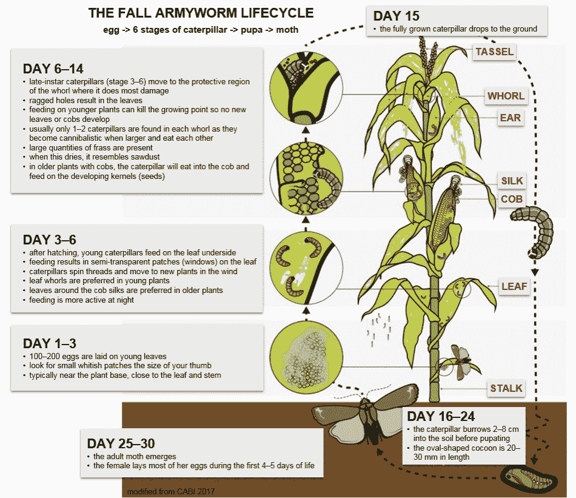

**图 1:** 秋粘虫生活史图。节选自 [FAO 的一汽指南](http://www.fao.org/fao-stories/article/en/c/1104446/)。

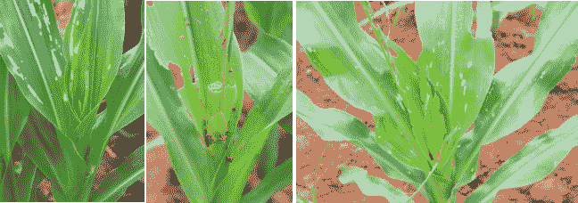

**图 2:** 一汽虫害的早期在植物上留下白色斑块(照片由印度班加罗尔农业科学大学 G. Keshavareddy 博士提供)。

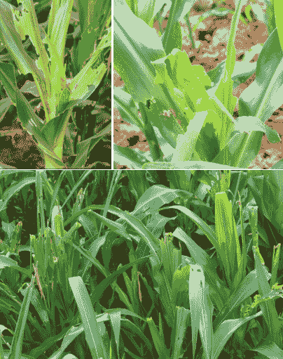

**图 3:** 晚熟幼虫破坏轮纹，使其外观粗糙(照片由印度班加罗尔农业科学大学 G. Keshavareddy 博士提供)。

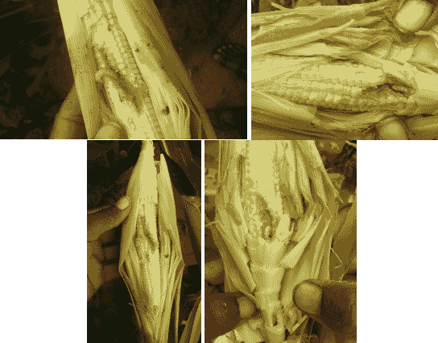

**图 4:** 相对早期阶段玉米棒的发病率(照片由印度班加罗尔农业科学大学 G. Keshavareddy 博士提供)。

FAW 造成的全球虫害和国家损害的程度详见粮农组织 2020 年 1 月至 3 月的《食物链危机预警公报》 [№34](http://www.fao.org/3/ca7582en/ca7582en.pdf) 。这里简要介绍了风险最大的国家的情况以及所报告的破坏规模。

## **在非洲**:

**安哥拉** -据报道，2017 年，一汽有超过 19，000 公顷的玉米、小米和高粱作物被毁，造成约。180 万美元的损失。

**埃塞俄比亚**——FAW 攻击四季种植的玉米:主雨季、短雨季、灌溉玉米。在该国，超过 458 个玉米种植区受到一汽的影响。

**马拉维**——在 2016/17 年主雨季(11 月-3 月)首次报道了一汽的存在。这种害虫对全国的玉米、反季节灌溉玉米(4 月-10 月)和小麦等其他作物造成了严重损害。在 2017/18 年准备收获季节(11 月至 3 月)，政府宣布因虫害而进入灾难状态。

乌干达——乌干达所有 121 个地区(100%的领土)都证实了这种害虫的存在。

**南苏丹** -全国各地(全国所有前 10 个州)都证实了一汽的存在。实地观察和农民报告表明，当作物受到水分胁迫时，FAW 虫害严重。

**斯威士兰**——2016/17 赛季首次报道了一汽的存在。这种害虫对全国各地的高粱、小米和玉米造成了严重损害，一直持续到 2017/18 赛季。

**埃及**(北非)- 一汽自 2019 年 5 月起在埃及南部玉米地正式报道。法奥得以穿越撒哈拉沙漠的天然屏障。因此，北非国家面临风险。

**苏丹-** 自 2017 年以来，已有来自苏丹的 FAW 报告，尼罗河流域可能被认为是传入埃及的可能途径。埃及和苏丹的气候允许许多寄主植物连续种植，这增加了害虫传播和破坏的可能性。

**坦桑尼亚、赞比亚和津巴布韦**——在 2016/17 年度首次报告了一汽的存在，该虫害在 2017/18 年度生产季节(11 月至 3 月)继续对玉米造成损害。

## 在亚洲:

**孟加拉-** 一汽于 2018 年 8 月首次被检出。从那以后，它传播到了全国的几个地方。

**柬埔寨-** 截至 2019 年 6 月 11 日，柬埔寨共有 11，142 公顷的玉米作物被销毁，其中拜林省 2，544 公顷，马德望省 3，033 公顷，班迭棉吉省 4，715 公顷，以及 Tboung Khmum 省 850 公顷。

**缅甸** -根据农业、畜牧业和灌溉部的数据，自 2019 年 1 月的第一周以来，一汽入侵了该国的玉米田。FAW 在伊洛瓦底地区得到确认，然后在同一年的短时间内传播到 9 个邦/地区。伊洛瓦底省大约有 4 046 公顷的土地受到影响。

**印度尼西亚-**2019 年 3 月在西苏门答腊首次检出一汽。在四个月内，这种害虫已经蔓延到苏门答腊、爪哇和加里曼丹部分地区的 12 个省。

**菲律宾-** 到 2019 年 6 月，东内格罗斯省马比奈当地政府宣布，一汽袭击了这个山城 32 个镇中的 28 个。

**斯里兰卡** - FAW 主要在阿努拉德普勒、莫纳拉加拉和安帕赖地区感染玉米，但在该国几乎所有地区的农场中都发现了。FAW 在上述三个地区种植玉米的总面积分别为 61，010 公顷和 34，856 公顷。此外，据报道，一汽已蔓延到水稻、番茄、小米、绿豆和一些牧草品种，如甘蔗。在斯里兰卡种植的 82，000 公顷中，据报道有 43，037 公顷被 FAW 侵染。该国的作物总损失估计在 10%到 25%之间。

**也门**(西亚)-自 2018 年以来，一汽的传入和存在一直被报道，这增加了传入阿曼和沙特等邻国的风险。

**中国**——未列入粮农组织报告，但据[新闻报道](https://www.taiwannews.com.tw/en/news/3880336)2020 年 3 月 5 日，中国政府在新闻发布会上承认一汽于 2018 年首次入侵中国。南部和西南部省份受影响最大。中国当局发现，从 11 月到 2019 年 1 月，中国南部和西南部的小鹿数量正在增加。受灾面积达 4 万公顷，是去年同期的 90 倍。由于这种害虫已经侵袭了邻国老挝的 80，000 多公顷土地，当局预测中国可能会出现更糟糕的情况。

根据中国农业和农村事务部发布的指导方针，一汽北移将比去年提前一个月。一旦他们向北移动，黄河和淮河周围地区 50%的玉米地将受到威胁。

一汽也从 2019 年 6 月开始在[台被举报。根据动植物卫生检验检疫局(BAPHIQ)的数据，截至 2019 年 7 月 10 日，台湾已有](https://www.taipeitimes.com/News/taiwan/archives/2019/06/17/2003717082) [199 起确认的一汽目击事件](https://www.taiwannews.com.tw/en/news/3745382)，超过 50 公顷的玉米地受到影响。

**印度**——不是来自粮农组织的报告，而是独立核实，根据国家农业昆虫资源局(NBAIR)2018 年 7 月进行的一项调查，第一次报道 FAW 是在卡纳塔克邦(印度南部)的 Chikkaballapur 区的田地里。这种害虫已经摧毁了卡纳塔克邦 70%以上的农作物，现在已经蔓延到印度南部、西部、北部和东北部。玉米种植面积约为 930 万公顷，年产量接近 2800 万吨。

**澳大利亚**——FAW 没有被包括在粮农组织的报告中，它已经在北领地和西澳大利亚北部的多个地区被检测到，并可能很快威胁昆士兰州 Wide Bay 地区的农作物。农业和渔业部表示，自今年 2 月在澳大利亚发现 FAW 以来，仅在玉米、高粱和大豆作物中发现过 FAW。如果成立，一汽有可能成为澳大利亚北部棉花的害虫。

# 数据集

我们为这项研究合并了三个互补的、公开的数据集。

1.  本研究中使用的核心数据集是在联合国粮食及农业组织(FAO)为**全球秋季粘虫控制行动(** [秋季粘虫](http://www.fao.org/fall-armyworm/en/))发起的项目下收集的数据，该项目对 FAW 爆发的病例进行了分类，主要发生在非洲国家。**一汽监测预警系统(FAMEWS)** 由一个分发给农民用于数据收集的移动应用程序和一个用于绘制当前情况的全球平台组成。这些数据大多由农民自己直接在 FAMEWS 应用程序中收集，使用两种检测技术:使用信息素陷阱收集昆虫([一汽指导说明 3](http://www.fao.org/3/I8322EN/i8322en.pdf) )或侦察田地([秋粘虫侦察](http://www.fao.org/3/I8321EN/i8321en.pdf))。本研究使用的数据集版本涵盖了 2018 年 2 月 27 日至 2019 年 9 月 30 日之间登记的病例。所选数据集包括 39013 个案例，每个案例测量了 44 个变量。不幸的是，粮农组织的这个数据集不再在他们的网站上免费提供了。
2.  结合 FAW 疫情数据集，我们使用了饥荒预警系统网络(FEWS 网)陆地数据同化系统(FLDAS)中 VIC 模型的再分析天气数据。这些数据的分辨率为 0.25 度，覆盖了从 2001 年 1 月到现在的整个非洲大陆(在这项研究中，我们使用了 2018 年 2 月到 2019 年 10 月之间的可用数据)。时间分辨率是每日的。有关数据集的更多信息，请访问: [FLDAS:项目目标](https://ldas.gsfc.nasa.gov/fldas)。从模型中总共提取了 21 个变量，包括降水量、温度和风速，并在 [FLDAS 模型数据描述| LDAS](https://ldas.gsfc.nasa.gov/fldas/model-data-description) 中描述。
3.  使用的最后一个数据集是来自统一的世界土壤数据库(HWSD)的土壤数据。这是一个 30 角秒的栅格数据库，有 15 000 多个不同的土壤制图单元，结合了世界各地现有的区域和国家土壤信息更新(SOTER、ESD、中国土壤图、WISE)。数据可通过粮农组织门户网站获取:[世界土壤数据库 1.2 版|粮农组织土壤门户网站](http://www.fao.org/soils-portal/soil-survey/soil-maps-and-databases/harmonized-world-soil-database-v12/en/)。数据集包括 58 个变量，描述了土壤单位的组成和土壤参数的特征(有机碳、pH 值、蓄水能力、土壤深度、土壤和粘土部分的阳离子交换能力、总可交换养分、石灰和石膏含量、钠交换百分比、盐度、结构等级和粒度)。变量的更多细节可以在:[http://www.fao.org/3/aq361e/aq361e.pdf](http://www.fao.org/3/aq361e/aq361e.pdf)找到。

这三个数据集根据 FAMEWS 数据中提供的作物田地的地理坐标进行合并。

# 方法

## A.选择

在 FAMEWS 数据集中使用了两种不同的检查方法:侦察和信息素陷阱。不同的检测方法，无论是单独使用还是组合使用，都可能产生意想不到的偏差。因此，我们将研究限于使用 Scouting 检测的样本，因为它代表了最大的样本(69%的病例，即 26901 例——见图 5)。

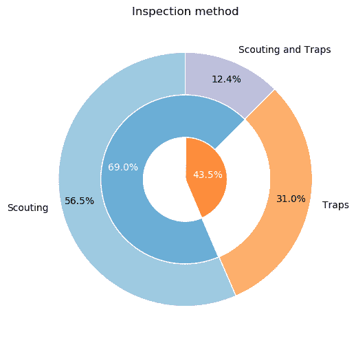

**图 5:**fame ws 数据集中不同检查方法的份额。

如图 6 所示，在 FAMEWS 的搜索样本中，当观察 FAW 阳性和阴性检测的相对分布时，阳性病例占样本的 85.9%。数据集中非常强的阳性检测偏倚实际上表明，通过移动应用程序收集数据是在 FAW 实际爆发后开始的。如果数据收集来自给定地区的系统调查(调查期间该地区所有农民的输入，不考虑 FAW 的发生率)，我们预计在数据集中发现的比例会小得多。

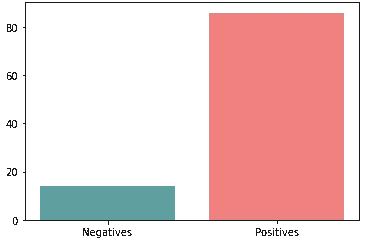

**图 6:**FAMEWS 数据集中阳性和阴性检查的分布。

这一观察结果实际上被侦察检查随时间的分布所证实，如图 7 所示:缺乏时间一致性是反应模式的症状，而不是系统的数据收集。

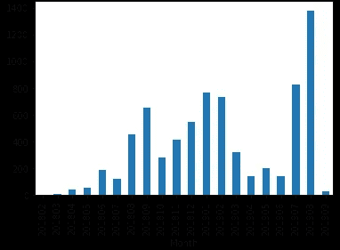

**图 7:**fame ws 数据集中过去几个月检查次数的总体分布。

关注图 8 中所示的非洲特定区域，支持类似的结论:检查数量的分布因位置而异(对于图 8 中红色的选定区域- *左*，2019 年的检查数量接近于零)。

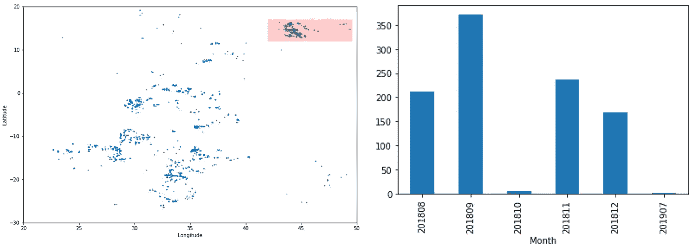

**图 8: *左* :** 侦察检查的空间分布；红色区域中的检验用于相邻地块。 ***右侧*** :所选区域当月检验次数分布。

正如所展示的，基于侦察检查的数据集高度偏向于阳性检测。这很可能是由于疫情爆发后数据收集的反应性质(农民只在他们的田地被感染后才使用该应用程序)。这样一个不平衡的数据集不允许我们在给定的日期为给定的领域建立一汽爆发的预测模型。为了实现这一目标，有必要进行更加系统和公正的数据收集，以提供疫情病例的现实表现。

因此，我们决定将我们的研究重点放在一汽在玉米作物中传播的驱动因素和加重因素上。在实践中，我们正在使用机器学习建模来提取一组具有预测能力的特征，以识别一汽的存在。我们希望确保这些特征的预测重要性可以通过位置和时间来推断，以便我们从非洲过去的疫情中获得的见解在未来对其他国家(如印度)也有效。

## B.模型、预处理和验证策略

我们决定训练一个极端梯度增强( [XGBoost](https://github.com/dmlc/xgboost) )优化来预测，作为一个目标变量，在一个给定的检测点被一汽侵染的植物的百分比。如前一节所述，害虫传播的预测(例如，田地是否会受到影响？)是不可能的，因为检测样本中存在偏差。因此，我们选择将重点放在虫害程度的预测上(即，知道田地已经虫害，预计受影响的比例是多少？)

图 9 显示了每次侦察检查的潜在侵扰程度范围，表明二元目标变量(阳性，检测到，与阴性，未检测到)无法完全掌握问题。我们还从训练集中删除了虫害为 0%和 100%的案例，因为它们似乎与调查信息的缺乏更相关，因为输入是由农民键入的。

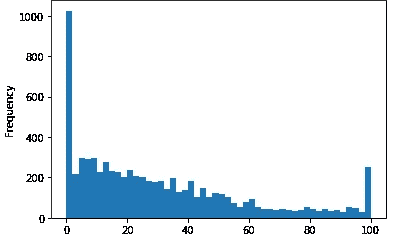

**图 9:** 每次检查中受侵染植物的比例(%)分布(基于侦察)

在任何模型训练之前，我们对数据集进行适当的预处理:

*   将数据集限于非洲大陆和玉米作物(因为其他作物的信息也存在于数据集中)——将总样本减少到 16705 个案例；
*   删除重复的行和常量列；
*   从 FLDAS、FAMEWS 和 HWDS 数据集中进行领域驱动的特征选择(仅关注相关信息，放弃不相关或重复的特征，例如数据库 IDs
*   某些字段的标准化(例如“cropFieldSize”，因为根据应用程序的用户使用不同的测量单位)；
*   手动特征工程，为我们的研究以更相关的方式组合特征；
*   汇总天气数据以反映每周平均水平。

鉴于 FAMEWS 数据集的性质，以及所使用的空间和时间要素(土壤和天气数据)的混合，我们必须实施特定的验证策略，以确保最重要的要素将在时间和位置上正确地概化。我们的验证策略基于时间分离，其中 2018 年的数据用于训练，2019 年的数据用于验证。然而，为了消除任何空间影响，我们对这一基本策略进行了如下改进:

*   对于 2019 年的验证集，我们定义了 3 个特定区域作为经度区间:A (-16，-1)，B (26，33)，C (35.5，46)。这些区域经过精心设计，以最大限度地提高培训和验证实例的数量。
*   然后，我们在训练/验证中分割我们的检查数据集三次，每次在 2018 数据集上训练模型，排除验证区域中的数据(例如，区域 A 外的所有 2018 数据)，并用验证区域内的 2019 数据集进行验证(例如，A 内的所有 2019 数据)。

通过这种验证策略，我们优化了最重要的超参数，首先是全局网格搜索，然后是更局部的网格搜索以进行微调。使用上述三个分割，在微调模型的超参数时，我们可以计算验证集之间的模型平均绝对误差(MAE)。MAE 越低，模型通过位置和时间进行概化的能力越高。

## C.特征选择

一旦模型被训练，我们可以为每个特征计算 XGBoost 目标函数中的增益，该增益是当模型的决策树之一使用该特征在数据集中进行分割时获得的。然后，我们将 XGBoost 模型中一个特性的重要性定义为所有这些收益的总和。

然而，特征的重要性可以通过隐藏的相关性或掩盖关于位置或时间的信息来人为地提高。为了确保所选择的特征正确地概括，对于每个特征，我们再次微调和训练模型，而不考虑该特征。然后，我们将排除该特性的新模型的 MAE 与包含该特性的旧模型进行比较。如果在不考虑该特征时 MAE 显著增加(大于 0.005)，我们丢弃该特征。在这种情况下，再次重新计算重要特征的集合，将被丢弃的特征从我们的预测器集合中去除。

被丢弃的功能示例:

*   instant _ yearly:MAE 中的 **0.7934** 移除后的改进
*   第一阶段:MAE 中的 **0.5037** 移除后的改进
*   cropFieldSize:对 MAE 中的 **0.0863** 的改进

从 FLDAS、HWSD 和 FAMEWS 数据集的原始组合变量集中选出的最终 14 个特征对 FAW 虫害具有最高的预测能力，它们是:

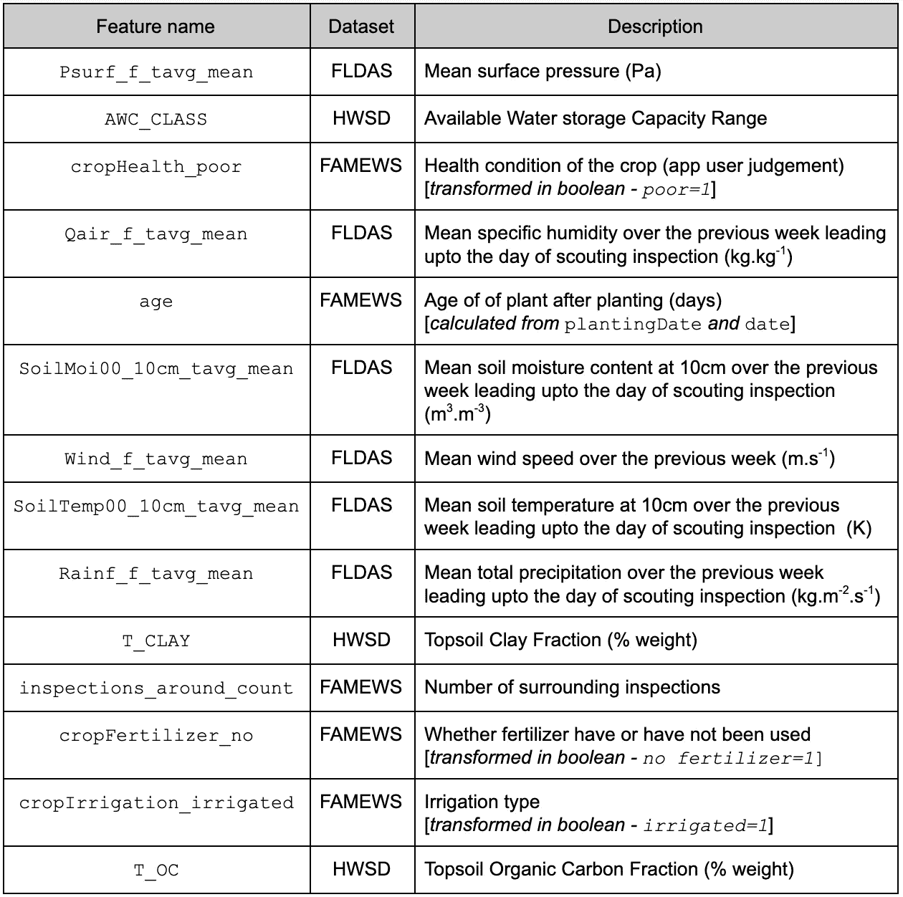

# 分析和结果

为了直观显示所选特征区分严重和轻微虫害作物的能力，我们使用二元目标构建了一个决策树，如果作物的 FAW 植物百分比超过中位数(大约 25%的虫害)，则该目标被定义为真，否则为假，如图 10 所示。

决策树从上到下如下所示:

*   每个单元格代表基于所述条件的样本分成两部分(例如，顶部单元格‘Psurf _ f _ tavg _ mean < 96627.656’)；如果条件得到满足(True ),则对照左边的下一级单元格检查相应的拆分样本，如果不满足(False ),则在右边检查；
*   在每个细胞中，阴性(在我们的情况下较少侵染)和阳性(在我们的情况下较多侵染)的分数在括号中表示(例如在顶部细胞上‘值=[0.513，0.487]’，因此 51.3%的阴性和 48.7%的阳性)；
*   每个单元所代表的完整样本的比例也同样被指示(例如在顶部单元中“样本= 100%”)；
*   阳性细胞比例越高(感染越多)，细胞越蓝，阴性细胞比例越高(感染越少)，细胞越红。

为了更好地理解如何读树，让我们来看两个最极端的例子:

1 -第一个实例对应于具有最暗蓝色阴影的单元，其占用于本研究的样本集的 5.7%(在非洲对玉米作物的侦察检查)，其中每个田地(在该子集中)的 85.4%受到侵害(“值=[0.146，0.854])，有利于以下条件:

*   低地面气压(' Psurf _ f _ tavg _ mean≤96627.656 ')；
*   粘土的低重量分数(尽管不极端)(' 10.5<t_clay></t_clay>
*   high fraction of Organic Content (‘T_OC>0.955 ')；
*   而没有下雨(' Rainf_f_tavg_mean≤0 ')。

2 -第二个实例对应于具有最暗红色阴影的单元，其占用于本研究的样本集的 5.5%(在非洲对玉米作物的侦察检查)，其中每个田地(在该子集中)只有 17.1%受到侵害(“值=[0.829，0.171])，有利于以下条件:

*   中间地面大气压力(' 96627.656<psurf_f_tavg_mean></psurf_f_tavg_mean>
*   high Humidity Rate (‘Qair_f_tavg_mean>0.015 ')；
*   田间施肥情况(“crop fertilizer _ no≤0.5”)；
*   和较老的作物(“年龄> 54.5”)。

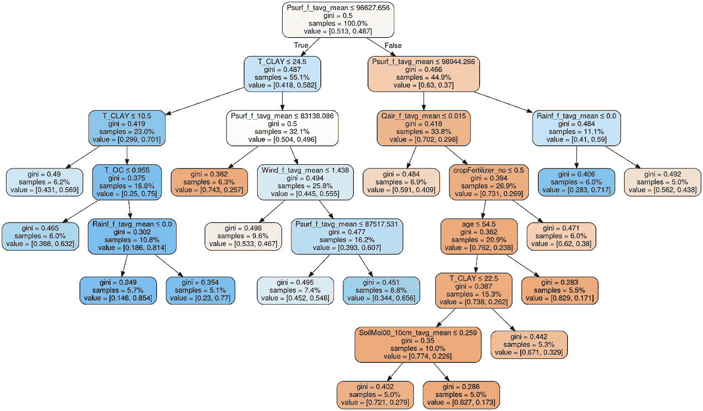

**图 10:** 决策树模型基于我们的 14 个高度预测特征来预测虫害程度。

尽管决策树对所选特征之间的重要性和相互作用提出了有趣的见解，但现在让我们尝试解释为什么这些所选特征中的一些具有高预测能力。我们将重点放在一些选定的分析上，并不打算进行详尽的研究。同样，我们的目标是证明所使用的方法使我们能够确定一汽传播背后最重要的驱动因素。

## 土壤密度的影响

在这里，我们需要强调的是，其中一些特征只有在与其他特征相结合时才具有真正的预测能力。例如，如图 11 所示，粘土的分数“T_CLAY”独立地与我们的目标具有相当弱的相关性。然而，图 11 中的第二个图显示，当与地面压力“Psurf_f_tavg_mean”结合时，其影响更大。这个事实已经可以通过决策树推导出来了。

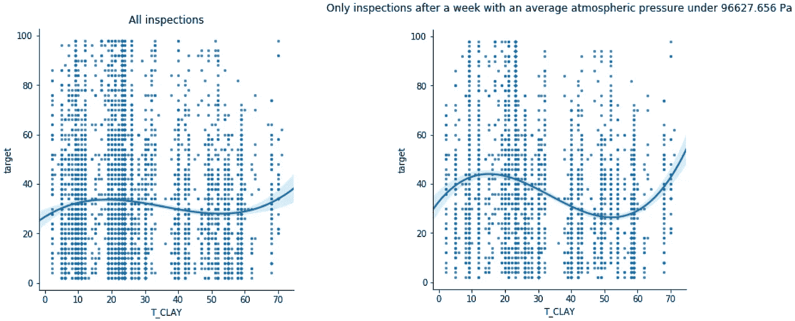

**图 11:** 对于所有检查(**左侧**)和在较低表面大气压力下进行的检查(**右侧**)(拟合三阶回归函数)，作为粘土重量分数函数的侵染率百分比。

一个初步的解释是，在较高的地面大气压力下，不管土壤的成分如何，土壤的密度都较大。在较低的大气压力下，土壤密度较低，那么粘土的质地将对密度产生更大的影响。由于土壤密度较低(因此大气压力较低，粘土含量较低)，一旦蛹羽化，FAW 成虫蛾更容易从土壤中出来，增加了感染的风险。

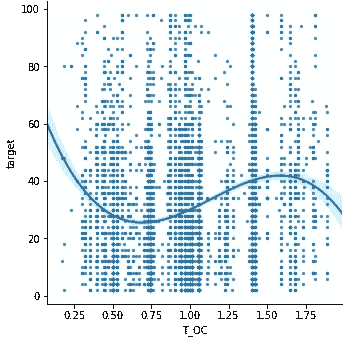

**图 12:** 作为有机物含量的重量分数的函数的侵染率百分比(拟合三阶回归函数)。

类似的解释也可以用图 12 所示的有机物含量部分来提出:有机物含量部分越高，土壤的密度越小，因此虫害的风险就越高。

请注意，在图 11 和图 12 中，我们使用了三阶回归。在粘土或有机物含量重量分数的极端情况下，测量中的低统计数据阻止了任何此类测量的解释，并且可能不够可靠。

## 作物生长阶段和作物健康的影响

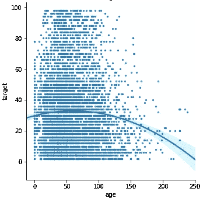

**图 13:** 作为作物年龄函数的侵染率百分比(拟合二阶回归函数)。

FAW 毛虫主要以玉米叶子和轮叶的嫩部分为食，这解释了幼龄作物感染风险较高，而老龄作物感染风险迅速降低的原因，如图 13 所示。虫害的高峰期大约是 30-80 天。玉米在种植后 130-135 天成熟，这解释了超过这个年龄的统计数据(和虫害案例)迅速减少的原因，因为这些案例可能主要与数据收集中的错误有关(因为年龄是根据农民直接收集的数据计算的)。

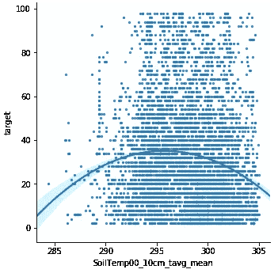

**图 14:** 作为土壤温度函数的侵害率百分比(拟合二阶回归函数)。

在图 14 中，我们研究了土壤温度对侵染率的影响(空气温度和土壤辐射温度与土壤温度密切相关，因此我们只关注这一变量)。在 20-25℃(293-298k)附近有一个明显的峰值，在 17℃ (290K)以下和 27℃ (300K)以上有强烈的下降。这些温度对应于玉米根有效生长的理想土壤温度，这意味着该变量与作物的内在健康相关(更健康的作物显然对应于更高的侵染率)。

## 天气条件的影响

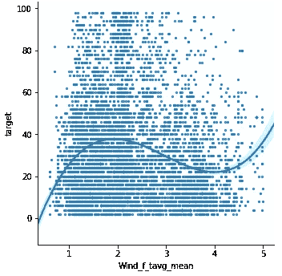

**图 15:** 作为平均风速的函数的侵害率百分比(拟合三阶回归函数)。

当显示风对虫害的影响时，如图 15 所示，一开始，当风更大时(高达 2 米/秒)，虫害会明显增加，但当风越来越大时，虫害会减少(高达 4 米/秒)。一种潜在的解释是，一些风增加了 FAW 蛾在农田的不同区域传播和恢复循环的机会，但更强的风阻止了 FAW 毛虫留在叶子上继续进食。

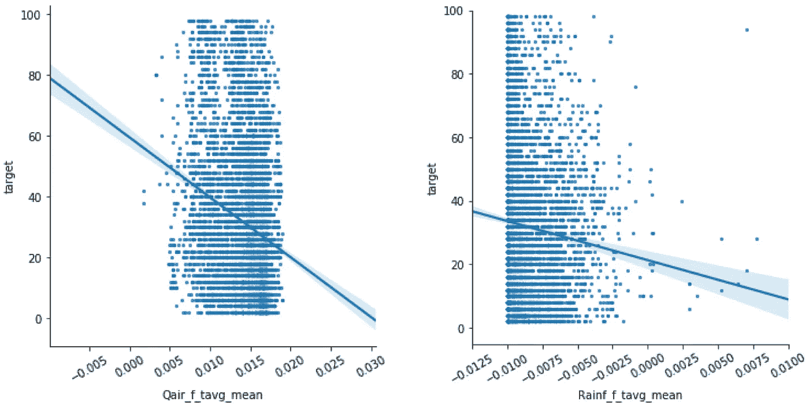

**图 16:** 作为空气湿度的函数(**左**)和作为前一周降雨量的函数(**右**)(拟合一阶回归函数)的侵害率百分比。

图 16 显示了虫害与空气比湿度和降雨量之间的负相关关系。这些结果表明，尽管湿度和降雨量有利于植物的发育，但过多的雨水会将幼虫从叶子上冲走，事实上降低了侵染率。这是一个有争议的结果，因为文献中的一些研究倾向于表明相反的情况。

## 灌溉的影响

**图 17: *左:*** 作为土壤湿度函数的侵染率百分比(拟合一阶回归函数)； ***中心:*** 基于灌溉类型(雨养/灌溉/未知)的感染率百分比； ***右:*** 基于灌溉类型的土壤湿度(雨养/灌溉/未知)。

如图 16 所示，降雨似乎减缓了虫害。我们进一步调查浇水的影响，看看降雨是否真的对一汽有害。

在图 17- *左图*中，土壤湿度与虫害发生率呈现出与空气湿度和降雨量相似的负相关关系。然而，在图 17- *中部*观察不同类型灌溉的效果时，很明显，虽然灌溉似乎有利于虫害，但雨水灌溉确实降低了虫害发生率，证实了上述结果。如图 17- *右图*所示，降雨条件下的土壤湿度平均高于灌溉条件下的土壤湿度，这意味着雨水也有利于植物的生长(事实上，土壤湿度还取决于土壤成分，这是由我们数据集中的有效水容量‘AWC _ CLASS’提供的信息。)

从这一分析中可以清楚地观察到，任何模拟降雨的灌溉系统(如洒水器)都可以再现雨养的效果(降低感染率)。

还值得注意的是，我们的分析中没有证据表明土壤水分缺乏(水分胁迫)会加剧 FAW 的侵扰，正如上述粮农组织报告中来自南苏丹的报告所述。要理解这种差异，需要更多的数据和更深入的调查。

# 结论和建议

所进行的工作，除了提供一些可操作的见解(例如，关于灌溉)，还证明了采用基于数据科学的方法来使用各种信息来源的重要性，超出了有限调查的范围，以支持全面和以结果为导向的农业项目的发展。

1.  我们强调整体方法的重要性，通过结合不同但高度互补的数据集(来自农民“FAMEWS”、天气“FLDAS”和土壤数据“HWSD”的输入)，得出一致和可靠的图像。正如在研究中所看到的，所有重要的特征都是从三个数据集中提取的，并且大多数洞察都是基于来自各种数据源的特征的组合而提供的(从决策树中可以看到)。
2.  这整个工作是基于开放存取数据的可用性。我们要感谢构建这些数据集的团队所做的工作(数据收集、数据分析、建模和模拟)。我们要再次强调自由分享此类数据的重要性，并对粮农组织最近从其网站上移除对 FAMEWS 数据集的访问感到难过(根据最新状态，截至 2019 年底仍可下载 csv/excel 格式)。
3.  我们已经确定了一组明确的重要特征(14 个特征)，可用于更好地了解一汽传播背后的驱动因素。虽然我们建议聚合尽可能多的数据，但是这些特性可以用作未来数据收集策略的指导原则。当然，这里进行的大多数分析结果都有以前的研究和常识的支持，但这种分析提供了可量化的信息，可用于建立预测模型和确定可操作的措施来限制害虫的传播。
4.  数据采集是任何研究的关键要素，FAMEWS 所做的出色工作值得在此强调。向农民提供一个应用程序来通知他们农田的状况，是防止 FAW 等害虫传播的一个主要武器。然而，由于农民的“非正式”输入，数据集存在自身的局限性，导致一定程度的准确性缺失，并产生不可控制的偏差。FAMEWS 采取的收集策略意味着对疫情爆发后的测量存在重大偏差，因为农民大多在虫害发生后使用该应用程序，这使得无法建立一汽传播的预测模型。

我们建议采用系统的调查策略，直接在农场一级收集信息，独立于几个季节的虫害，并将农民的投入与独立的天气和土壤信息相结合。调查的设计需要有预测性和规范性的模型作为目标，在此基础上可以采取措施尽可能消除偏见。这类项目从一开始就需要数据科学家和机器学习专家的参与。