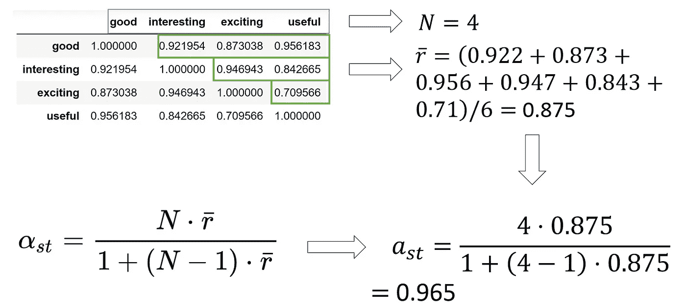

# Cronbach 的 Alpha:理论及其在 Python 中的应用

> 原文：<https://towardsdatascience.com/cronbachs-alpha-theory-and-application-in-python-d2915dd63586?source=collection_archive---------13----------------------->

## 理解并计算秤可靠性的最重要衡量标准。


图片来自 [bongkarn thanyakij](https://www.pexels.com/de-de/@bongkarn-thanyakij-683719)

*克朗巴赫的 Alpha* 是心理学和社会科学中衡量量表可靠性的主要标准。它的重要性怎么强调都不为过，你会在你读到的几乎所有定量实证研究中发现它。令人惊讶的是，还没有一篇关于 Medium 的文章报道它在 Python 中的应用。最重要的是，像 NumPy、Pandas 或 Sklearn 这样的公共数据科学库都没有 Cronbach alpha 度量。这篇文章将告诉你如何去做。

首先，我将解释克朗巴赫的阿尔法背后的一些理论和数学。然后，我们将快速着手动手编程。

# 克朗巴赫的阿尔法值是多少？

## 心理测验理论

每当我们使用多个项目来测量一个**潜在(不可观察)结构**，我们就称这套项目为**量表**。例如，在商业环境中，我们可能想要了解我们的客户对产品 p 的态度，这对营销人员来说非常有帮助。然而，与体重(例如 50 公斤)、收入(例如 100 万英镑)等概念相反。$)或出勤(真/假)，我们无法直接衡量态度。

简单地问他们“你对产品 P 的态度是什么？”一开始看起来是个不错的解决方案。然而，因为这是由你的客户来定义什么是真正的态度，你不会得到可靠的结果。相反，您应该自己定义该结构，并尝试使用多种客观且可观察的方法来度量它。如果一个顾客把一个产品评价为“好”、“有趣”、“令人兴奋”和“有用”，这可能是一种态度的衡量，尽管这个词本身并没有被使用。可以说，你可以用这 4 个问题作为衡量态度的尺度。

为了确保我们在构建量表方面做得很好，我们需要使用一些质量度量。总的来说，我们要测试一个量表的有效性**和可靠性**和**。如果秤实际测量了它应该测量的结构，那么它就是有效的。如果每次测的都是一样的，那就是可靠的。**

## ****克朗巴赫的阿尔法如何帮助？****

**克朗巴赫的阿尔法是对可靠性的一种衡量。确切地说，它告诉我们**内部如何一致**我们的规模。这是量表中所有项目测量相同结构的程度。如果“好的”、“有趣的”、“令人兴奋的”和“有用的”都有助于衡量同一件事，克朗巴赫的阿尔法就会很高。然而，如果我们试图用形容词“美味”、“丰富”、“沮丧”和“寒冷”来衡量态度，我认为克朗巴赫的阿尔法值会很低。这些项目看起来确实不一致。这正是克朗巴赫的阿尔法帮助我们的。**它回答了这样一个问题:我选择用来度量一个结构的项目排成一行了吗？****

**克朗巴赫的阿尔法值介于 0 和 1 之间。较高的值表示较高的内部一致性。一般来说，0.7 或更高的克朗巴赫α被认为是可接受的。现在，让我们来看看这些数字是如何产生的。如果你想直接进入编码领域，可以跳过这一部分。**

# **我们如何计算克朗巴赫的阿尔法值？**

**这是我们需要的公式:**

****

**这里，N 是项目(问题)的数量，r 是项目之间的平均相关性。让我们回到例子来理解这意味着什么。假设我们询问了 6 位顾客对产品 p 的看法，然后我们计算了“好”、“有趣”、“令人兴奋”和“有用”之间的相关性。假设有结果:**

****

**我们可以看到所有的相关性都很高。这应该会导致高克朗巴赫阿尔法值。下图说明了如何将公式应用于数据。**

****

**我们得到了一个**克朗巴赫的阿尔法值为. 965** ，这是异常的！**

**我们已经(在某种程度上)算完了！**让我们开始编码吧！****

# **我们如何在 Python 中应用这一点？**

**让我们编写自己的函数来计算克朗巴赫的阿尔法。首先，我们来进口熊猫和 numpy。**

```
import pandas as pd
import numpy as np
```

**现在，我们需要什么来“教授”这个函数呢？**

1.  **将数据帧输入转换成相关矩阵。**
2.  **计算 N 和 r。**
3.  **使用公式计算克朗巴赫的阿尔法值**

**你可以这样做:**

```
def cronbach_alpha(df): # 1\. Transform the df into a correlation matrix
    df_corr = df.corr()

    # 2.1 Calculate N
    # The number of variables equals the number of columns in the df
    N = df.shape[1]

    # 2.2 Calculate R
    # For this, we'll loop through the columns and append every
    # relevant correlation to an array calles "r_s". Then, we'll
    # calculate the mean of "r_s"
    rs = np.array([])
    for i, col in enumerate(df_corr.columns):
        sum_ = df_corr[col][i+1:].values
        rs = np.append(sum_, rs)
    mean_r = np.mean(rs)

   # 3\. Use the formula to calculate Cronbach's Alpha 
    cronbach_alpha = (N * mean_r) / (1 + (N - 1) * mean_r)
    return cronbach_alpha
```

**如果我们对样本数据使用该函数，我们将得到以下输出:**

****

**结果是 0.966。用手工计算，我们得到 0.965。这很可能是由于舍入。**

# **总有另一种方法…**

**听着，我要告诉你一些事。有另一种方法来计算克朗巴赫的阿尔法，更适合 numpy 计算。不过，有个原因我还没告诉你。您刚刚学习的方法更加直观，也更容易理解。最重要的是，除非您使用非常大的数据集，这在 Cronbach 的 Alpha 主要应用的调查统计中并不常见，否则您使用上面的函数不会有任何问题。我不会在本文中讨论这种方法。然而，我鼓励你利用你的新知识，自己做一些进一步的研究。**

**无论如何，我希望这篇文章对你有所帮助，教会你一个新的统计概念和/或改进你的工作流程！**

**非常感谢您的阅读！**