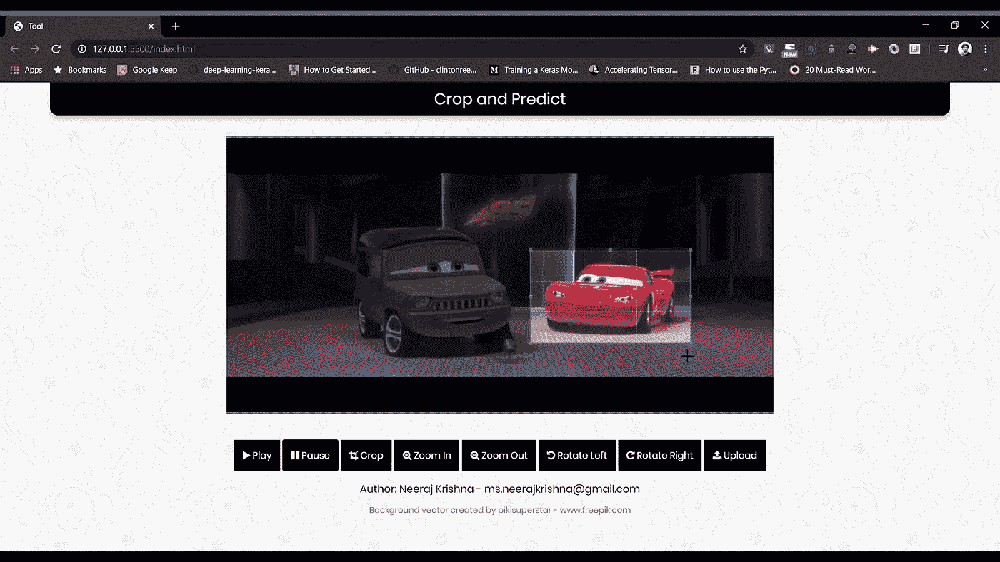
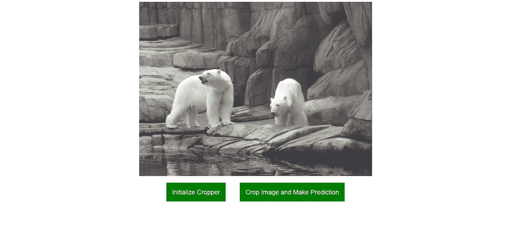
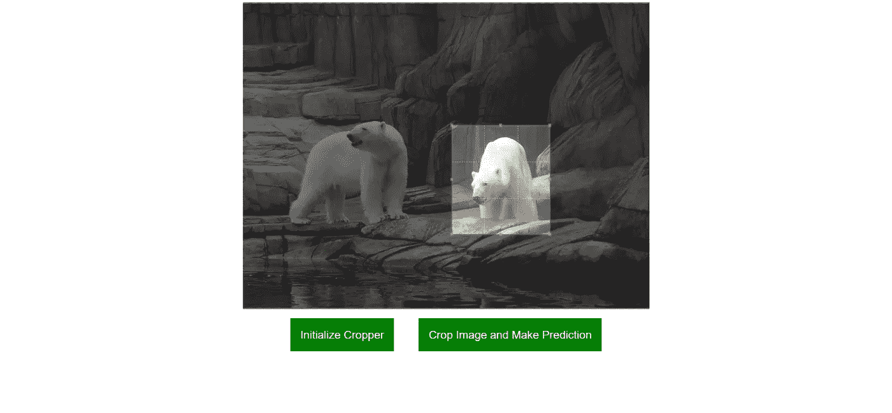
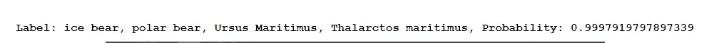
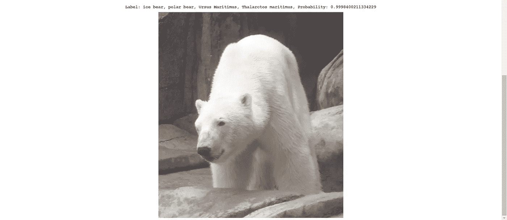

# 使用机器学习在浏览器中裁剪和识别图像或视频中的特定对象

> 原文：<https://towardsdatascience.com/crop-and-identify-specific-objects-in-an-image-or-video-in-the-browser-using-machine-learning-9b68780b2bb7?source=collection_archive---------33----------------------->

## 利用客户端机器学习的力量



视频来源:[https://www.youtube.com/watch?v=Yi_kDT5L5s4](https://www.youtube.com/watch?v=Yi_kDT5L5s4)

# 简介—浏览器中的机器学习

Tensorflow.js 允许我们在浏览器中完全在客户端训练模型和运行推理。这开启了一大堆新的机会！

在本文中，我们将构建一个工具，允许用户裁剪图像的特定部分，并对裁剪后的图像进行推理。我们将使用一个图像分类模型来帮助我们将图像分类到一个特定的类别，但理论上你可以使用任何模型。

# 演示

[**应用的现场演示**](https://vigorous-leavitt-67d07f.netlify.app/) 如上图 gif 所示。下面的*注释*中提到了使用说明。

[**Github 库**](https://github.com/wingedrasengan927/Identify-Specific-Objects-in-an-Image-or-Video-using-machine-learning-in-the-browser)

## **注:**

1.  要使用实时工具，单击*实时演示*链接，这将打开应用程序。接下来上传你选择的任何视频剪辑。此时屏幕仍将保持空白。要播放视频，点击*播放*按钮，视频将开始播放。接下来，在感兴趣的视频实例上点击*暂停*按钮。这将初始化框架上的裁剪器。选择感兴趣的区域进行裁剪，点击*裁剪*按钮。这将弹出一个显示裁剪图像的模态。点击*进行预测*按钮，对裁剪后的图像进行推断。结果将显示在模态中。
2.  演示中显示的工具是我们将在本文中构建的工具的扩展版本。您可以查看 github repo 以获取源代码。

# 我们开始吧

## 目录结构

我们将创建一个简单的目录结构，如下所示。

```
|-- index.html
|-- index.js
|-- style.css
|-- |-- Images
|   `-- image.jpg
```

## 超文本标记语言

这就是我们的 index.html 的样子

在 *head* 标签中，我们使用 cdn 导入 css 样式表和某些库来帮助我们。我们将使用的库是:

[**cropper . js**](https://fengyuanchen.github.io/cropperjs/)**:**一个Javascript 图像裁剪库。

[**tensor flow . js:**](https://www.tensorflow.org/js)JavaScript 中用于机器学习的库。

在主体中，我们有三个容器。第一个容器是我们将要测试的图像。第二个容器是我们放置按钮的地方，第一个按钮用于初始化图像的裁剪工具，第二个按钮用于裁剪选定的部分，并对图像的裁剪部分进行推理。第三个容器是空的，但是一旦我们运行推理，我们将使用 JavaScript 动态地填充结果。最后，我们导入 cropper.js 库和 index.js 脚本。

## 半铸钢ˌ钢性铸铁(Cast Semi-Steel)

我们的风格. css

接下来，我们添加一些 css 来限制边界内的图像，并使一切看起来很好。

html 和 css 完成后，页面看起来会像这样:



图片来源:[http://www . new thinktank . com/WP-content/uploads/2010/05/Animals _ 311 . jpg](http://www.newthinktank.com/wp-content/uploads/2010/05/Animals_311.jpg)

## Java Script 语言

这是最重要的部分。让我们了解一下代码是做什么的。

首先，我们抓住所有的元素，以便我们可以操纵它们。这包括图像、按钮等。

接下来，我们运行 *loadModel* 函数。该函数下载 MobileNet 预训练模型，该模型已经在具有数千个类别的大型数据集上进行了训练。MobileNet 指的是神经网络的特定架构。

我们给这两个按钮添加了事件监听器，这样它们就可以在*点击时做出响应。*

当我们点击第一个按钮——“初始化裁剪器”时，我们运行函数 *initializeCropper。*这个函数在我们的图像上创建一个*裁剪器*的新实例，并且清空我们的*结果*容器。

第二个按钮——“裁剪图像并进行预测”运行*预测*功能。该函数获取从 cropper 获得的裁剪后的图像数据，并将其提供给我们的 MobileNet 模型。然后，该模型输出裁剪图像所属的类别或种类以及置信度概率。然后，我们动态地创建一个 *img* 元素和一个 *h1* 元素，并将它们添加到我们的结果容器中以显示结果。

流程是:

1.  点击“初始化裁剪器”按钮
2.  点击“裁剪图像并进行预测”
3.  将显示结果



在上面的例子中，我裁剪了右边的北极熊，并对裁剪后的图像进行了推理。正如我们所见，该模型以相当高的可信度正确预测了它的类别。

# 结论

在本文中，我们构建了一个简单的工具，允许用户裁剪图像的特定部分，并对裁剪后的图像运行图像分类模型。

希望你喜欢它！尽管这是一个基本的例子，但它可以扩展到构建令人惊叹的东西。一个例子是在视频中使用它，正如我在演示中展示的( [github](https://github.com/wingedrasengan927/Identify-Specific-Objects-in-an-Image-or-Video-using-machine-learning-in-the-browser) )。

客户端的机器学习已经打开了许多可能性，我鼓励你去创造令人敬畏的东西。

> “如果你不创造东西，就没有东西”——埃隆·马斯克

如果您有任何反馈或想取得联系，请在 ms.neerajkrishna@gmail.com 的*上给我留言*

# 参考

1.  【tensorflow.org/js 
2.  [https://fengyuanchen.github.io/cropperjs/](https://fengyuanchen.github.io/cropperjs/)
3.  [https://code labs . developers . Google . com/code labs/tensor flow js-teacheble machine-code lab/index . html # 0](https://codelabs.developers.google.com/codelabs/tensorflowjs-teachablemachine-codelab/index.html#0)