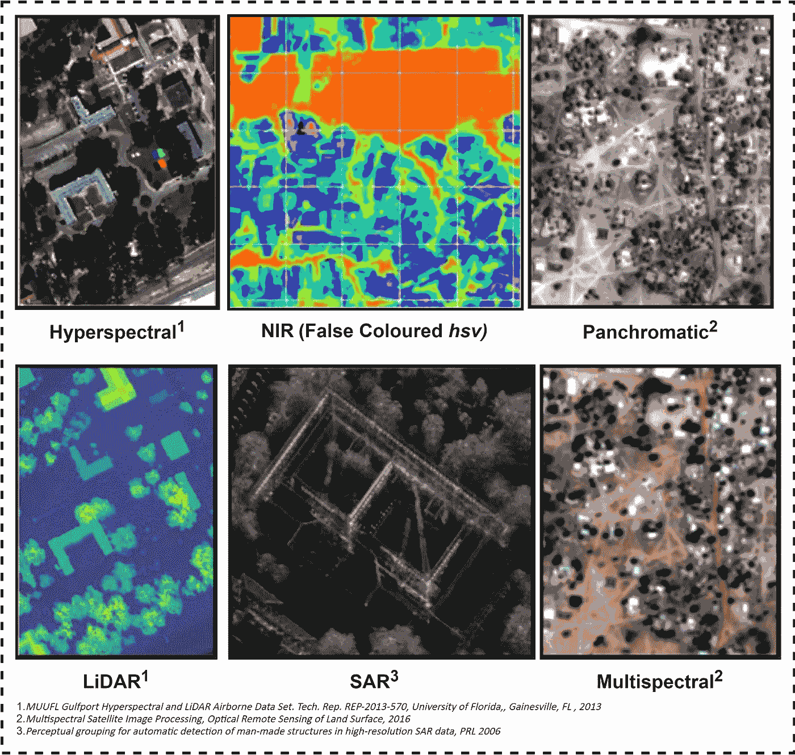

# 交叉注意力才是你需要的！

> 原文：<https://towardsdatascience.com/cross-attention-is-what-you-need-fusatnet-fusion-network-b8e6f673491?source=collection_archive---------13----------------------->

## [新成绩](http://cvpr2020.thecvf.com/) / CVPR 2020

## FusAtNet:用于高光谱和激光雷达分类的基于双注意的光谱空间多模态融合网络

> FusAtNet:用于高光谱和激光雷达分类的基于双注意的光谱空间多模态融合网络
> 
> ***萨蒂扬·莫拉*等。al，**IEEE/CVF 计算机视觉和模式识别会议(CVPR)研讨会，2020 年，第 92–93 页

如今，随着传感技术的进步，多模态数据正变得易于用于各种应用，特别是在遥感(RS)中，其中许多数据类型如多光谱(MSI)、超光谱(HSI)、激光雷达等。都是可用的。

今天，多模态数据很容易获得！

这些多源数据集的有效融合变得越来越重要，因为这些多模态特征已被证明能够生成高度精确的土地覆盖图。然而，考虑到数据中涉及的冗余和多种模态之间的大范围差异，RS 环境下的融合并不是微不足道的。此外，不同模态的特征提取模块之间很难交互，这进一步限制了它们的语义相关性。

> 为什么**单一融合表示很重要？**

组合多模态图像的几个优点包括:

1.  生成丰富、融合的表示有助于选择任务相关的特征
2.  改进分类，提高可信度，减少歧义
3.  补充缺失或有噪声的数据
4.  减少数据大小

有趣的是，今天大多数常见的方法往往只是使用早期连接、CNN 提取的特征级连接或多流决策级融合方法等方法，完全忽略了跨域特征。视觉**一个*注意*** *，*深度学习研究人员的工具箱中最近增加的一个是 ***在多模态领域中基本上未被探索。***

> 一个问题出现了:**如何最好地融合这些模态，形成一个联合的、丰富的表示，可以用于下游的任务？**

基于多模态融合的分类任务的一般示意图。目标是有效地组合两种模态(这里是 HSI 和 LiDAR ),使得结果表示具有丰富的、融合的特征，这些特征对于精确分类来说是足够相关和鲁棒的。

一个理想的融合方法是将两种模态协同地结合起来，并确保结果反映输入模态的显著特征。

# 一个新概念:交叉注意

在这项工作中，我们提出了“交叉注意”的新概念，并在土地覆盖分类的背景下提出了基于注意的 HSI-LiDAR 融合。

多通道融合中的自我注意与交叉注意。自我注意模块(左)仅在单一通道上工作，其中隐藏表征和注意屏蔽都来自同一通道(HSIs)。另一方面，在交叉注意模块(右)中，注意掩模来自不同的模态(LiDAR ),并且被利用来增强来自第一模态的潜在特征

交叉注意是一种新颖且直观的融合方法，其中来自一种模态(此处为 LiDAR)的注意掩模被用于突出显示另一种模态(此处为 HSI)中提取的特征。注意，这不同于自我注意，在自我注意中，来自 HSI 的注意屏蔽被用来突出它自己的光谱特征。

## **FusAtNet:在实践中使用交叉注意**

本文提出了一个用于 HSIs 和 LiDAR 数据的集体土地覆盖分类的特征融合和提取框架 FusAtNet。所提出的框架有效地利用了 HSI 通道，使用“自我注意”机制来生成强调其自身光谱特征的注意图。类似地，同时使用“交叉注意”方法来利用激光雷达导出的注意图，该注意图强调 HSI 的空间特征。然后，这些注意的光谱和空间表示与原始数据一起被进一步探索，以获得特定于模态的特征嵌入。由此获得的面向模态的联合光谱-空间信息随后被用于执行土地覆盖分类任务。

**fusat net 示意图(呈现在休斯顿数据集上)。**首先，高光谱训练样本 XH 被送到特征提取器 FHS 获取潜在表征，并送到光谱注意模块生成光谱注意掩模。同时，相应的激光雷达训练样本 XL 被发送到空间注意模块 AT 以获得空间注意掩模。注意屏蔽被单独乘以潜在 HSI 表示以获得 MS 和 MT。MS 和 MT 然后与 XH 和 XL 连接并被发送到模态特征提取器 FM 和模态注意模块 AM。然后将两者的输出相乘得到 FSS，然后将其发送到分类模块 C 进行像素分类。

# 结果

在三个 HSI-LiDAR 数据集上的实验评估表明，所提出的方法达到了最先进的分类性能，包括在现有最大的 HSI-LiDAR 基准数据集 Houston 上，为多模态特征融合分类开辟了新的途径。

> **休斯顿**

**带有分类地图的休斯顿超光谱和激光雷达数据集。**(a)HSI 的真彩色合成，(b)激光雷达图像，(c)地面实况。(d) SVM (H)，(e) SVM (H+L)，(f)两个分支的 CNN (H)，(g)两个分支的 CNN (H+L)，(h) FusAtNet (H)，(i) FusAtNet (H+L)

休斯顿数据集上的精度分析(单位为%)。‘H’仅代表 HSI，而‘H+L’代表融合的 HSI 和激光雷达

> **特伦托**

**带有分类地图的 Trento 高光谱和激光雷达数据集。**(a)HSI 的真彩色合成，(b)激光雷达图像，(c)地面实况。(d) SVM (H)，(e) SVM (H+L)，(f)两个分支的 CNN (H)，(g)两个分支的 CNN (H+L)，(h) FusAtNet (H)，(i) FusAtNet (H+L)

**Trento 数据集上的精度分析(以百分比表示)。**‘H’仅代表 HSI，而‘H+L’代表融合的 HSI 和激光雷达

> **MUUFL**

**带有分类地图的 MUUFL 高光谱和激光雷达数据集。**(a)HSI 的真彩色合成，(b)激光雷达图像，(c)地面实况。(d) SVM (H)，(e) SVM (H+L)，(f)两个分支的 CNN (H)，(g)两个分支的 CNN (H+L)，(h) FusAtNet (H)，(i) FusAtNet (H+L)

**mu ufl 数据集的精度分析(单位为%)。** H 仅代表 HSI，而 H+L 代表融合的 HSI 和激光雷达

可以清楚地看到，对于所有情况，我们的方法在所有途径中以显著的优势优于所有现有技术方法，无论是 OA(休斯顿、特伦托和穆弗勒数据集的相应准确度为 89.98%、99.06%和 91.48%)、AA(相应值为 94.65%、98.50%和 78.58%)还是κ。很容易观察到，在类/生产者的准确度的情况下，对于大多数类，我们的方法的性能优于其他方法，而对于少数类，我们的方法仅略微超过其他方法。对于休斯顿数据集，可以注意到，与其他方法相比，我们的方法对于“商业”类(92.12%)的准确性有显著提高。这可以归因于这样的事实，即商业区域通常具有可变的布局，并且频繁的海拔变化被基于 LiDAR 的注意力地图有效地捕捉到。在休斯顿分类地图中也观察到，诸如 SVM 和双分支 CNN 的方法倾向于将阴影区域分类为水(在地图的右边部分),因为它们的色调较暗。我们的方法也在很大程度上缓解了这个问题。

**从 FusAtNet 获得的分类图往往噪声较小，并且具有平滑的类间过渡(此处为 MUUFL 数据集)**HSI(左上)、激光雷达图像(左下)、分类图(右)的真彩色合成图。

类似地，在 Trento 数据集的情况下,“道路”类显示出显著的准确性提高(93.32%)。该增量也是由于道路轮廓相对于其高度的变化。

此外，例如在 MUUFL 中，可以从视觉上验证从 FusAtNet 获得的分类图往往噪声更小，并且具有平滑的类间过渡。

> **消融**

我们进一步进行了不同的消融研究，以突出我们模型的各个方面。

**表 4:** 通过改变所有数据集上的注意力层进行消融研究(精确度为%)

表 4 表示在网络中描述的各种注意层存在的情况下的性能，证明了对所有三个注意模块的需要。

**表 5:** 有和无数据增强的训练消融研究(准确度百分比)

表 5 显示了数据扩充的性能。

**表 6:** 通过改变 MUUFL 数据集上训练样本的分数来对性能建模(精度百分比)

表 6 表示训练数据减少后的性能。

除了明显的观察结果，即数据扩充&训练数据的增加增加了准确性，有趣的是注意到 ***我们的网络仅用 50%的训练数据就开始胜过现有的 SOTA 方法。***

## 结论

总之，我们的工作是在土地覆盖分类的背景下为 HSI-LiDAR 融合引入注意力学习概念的**首批方法之一。在这方面，**我们引入了基于“交叉注意”**的概念，在模态间进行特征学习，这是一种新颖直观的融合方法，它利用来自一个模态(此处为激光雷达)的注意来突出另一个模态(HSI)中的特征。我们**在三个基准 HSI-LiDAR 数据集上展示了最先进的分类性能**，优于所有现有的深度融合策略。**

****发表为*** *(点击下方)**

> *[***FusAtNet:用于高光谱和激光雷达分类的基于双注意的光谱空间多模态融合网络***](http://openaccess.thecvf.com/content_CVPRW_2020/html/w6/Mohla_FusAtNet_Dual_Attention_Based_SpectroSpatial_Multimodal_Fusion_Network_for_Hyperspectral_CVPRW_2020_paper.html)*
> 
> ****萨蒂扬·莫赫拉*，**希瓦姆·潘德，比普拉·班纳吉，苏哈西斯·乔杜里；IEEE/CVF 计算机视觉和模式识别会议(CVPR)研讨会，2020 年，第 92–93 页*