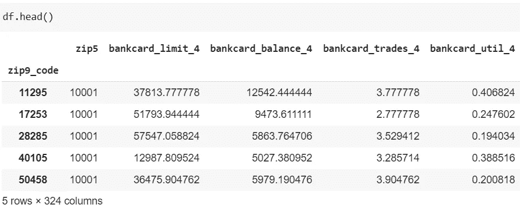
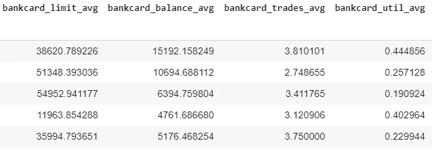
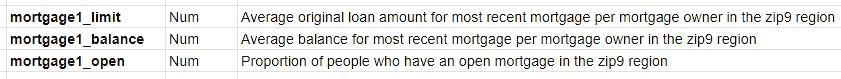
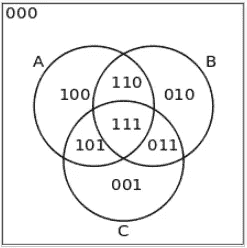

# Python 中基于跨列的数据操作

> 原文：<https://towardsdatascience.com/cross-column-based-data-manipulation-in-python-dfa5d8ffdd64?source=collection_archive---------57----------------------->

## 基于单个命令和 ETL 过程中的多列清理和特征工程数据

假设您的经理给了您一个随机数据集，并告诉您进行“基本”清理:“只保留在 A、B 和 C 列中有值的记录，或者在这三列中没有任何值的记录”。你会怎么做？


在 [Unsplash](https://unsplash.com?utm_source=medium&utm_medium=referral) 上拍摄的 [ThisisEngineering RAEng](https://unsplash.com/@thisisengineering?utm_source=medium&utm_medium=referral)

# 介绍

特征工程可以是非常基本的，例如缩放和编码，但有时很神秘。最近，我遇到了这种基于跨列的需求，这让我想到，**为什么清理逻辑听起来如此简单，但在数据清理和特性工程中却是内在复杂的？**

## 用词直白，用代码不那么直观

我们从现有课程中学到的大多数数据操作技能都集中在行方式应用程序上。这种类型的功能在数据分析包(如 Pandas)中写得很好，这意味着分析师或数据科学家不必从头开始创建新的应用程序。然而，当涉及到基于列的应用时，事情就没那么简单了，**尤其是涉及到多个列的时候**。如果我们想执行我在引言中提到的简单请求，我们必须在流程中混合一些更高级的东西，比如逻辑关系。

在这篇文章中，我将演示一个基本的用例以及一个关于跨列操作的更复杂的情况。我还将包括完整的操作函数，展示如何在常规 ETL 过程中应用这些函数。以下文章中分享的技术包括:

1.  **计算数值的跨列聚合指标**
2.  **用跨列逻辑运算验证记录**

# 数据集介绍

去年春天，我和我的朋友参加了布朗大学举办的 2020 年数据马拉松比赛。主题是根据信用局数据和邮政编码级别的人口统计数据预测潜在的购房者在哪里。这些特征包括诸如银行卡限额、打开的银行卡数量和最近抵押贷款的余额等指标。

所提供的数据集涵盖 2019 年 4 月至 9 月，CSV 文件也相应拆分。总共有 36，000，000 多行和 300 多列，它们的总大小约为 10GB。我会用这个来展示我的想法。



数据集的片段

# 问题 1:使用聚集方法减少跨数据集聚集指标

简单来说就是数据一塌糊涂。在对不同时间的数据集进行组合后，只要进行简单的计算，数据的总大小就可以冻结一台普通的笔记本电脑。因此，我想提出一种方法，将相同的指标推广到不同的月份(例如，每个月都有一个“未结银行卡数量”指标。我喜欢减少功能的总数，但保留这些信息)。

各种机器学习技术(例如，PCA、聚类)可以实现类似的效果。然而，我会用最直接的方式转换特征，这就是平均。

# 解决方案 1:谨慎使用熊猫内置计算

这只是说，我们需要在一段时间内对指标进行平均。我们可以通过`pd.DataFrame.mean()`轻松实现这一点。熊猫包还提供了`sum()`、`std()`等各种聚合功能。



预期的结果

这是一项相对容易的任务。然而，诀窍是设置正确的管道来组织新的列并构建新的数据帧。这里有几个值得一提的提示:

*   `pd.DataFrame()`不允许你像`pd.read_csv()`那样单独指定列的数据类型(我知道这很奇怪)。为了适应这些限制，建议在构建新的数据框后分配`astype()`功能。
*   此外，如果您同时要分配不同类型的数字数据，那么在使用值列表构建一个`pd.DataFrame()`时，要小心可能的信息丢失。整数和浮点之间的自动转换会在没有任何警告的情况下损坏值！(更不用说数值型数据转换成字符串值也会在这个过程中丢失几个数字)

整个功能如下所示。注意，“df”是要处理的数据，“df_col”只是用于构建列名的列表。

# 问题 2:清理跨列逻辑关系的数据

直到这一点，它没有太多的麻烦。但是困难来了。虽然我们缩小了数据范围，但还是有些不对劲。

一般来说，如果一条记录(一个区域)有一笔抵押贷款，那么在描述第一笔抵押贷款的每一列(平均贷款额、平均余额、比例)中都应该有一个值。如果一条记录根本没有抵押贷款，那么这三列中应该根本没有值(因为该区域没有抵押贷款)。然而，我只看了几行就发现了差异。有些行有平均贷款额但没有平均余额，有些行只有第二笔贷款的比例而没有其他两笔对应的贷款。



三个共存列的描述

如果模型不能识别高维数据的正确模式，这种类型的错误会严重损害模型。为了使模型或分析更加稳健，应该从数据集中排除有问题的记录。

## 用文氏图思考

为了理解这个问题，文氏图可能有助于理解。对于我在这里尝试做的，以及大多数一般类似的特别情况，我正在查看子集完全不相交部分和完全相交部分，它们分别是 000 (All - (A∪B∪C))和 111 (A⋂B⋂C)。



来源:https://en.wikipedia.org/wiki/Venn_diagram

有了这个想法，因为 Pandas 支持逻辑操作符(&，|，~)，我可以这样配置逻辑:

```
## 111
((df[col_1].astype(bool) & df[col_2].astype(bool) & df[col_3].astype(bool))## 000
(~df[col_1].astype(bool) & ~df[col_2].astype(bool) & ~df[col_3].astype(bool)))
```

> 注:如果你想知道，不，这不是你在做否定逻辑条件时需要把 AND 转换成 OR 的情况(因为这里的元素都是二进制的，真或假)。另一个例子见这个[螺纹](https://stackoverflow.com/a/52786447/12170001)。

然后，我将这些逻辑运算符整合成一行，形成一个系列:

```
## 111 or 000
s_bool = ((df[col_1].astype(bool) & df[col_2].astype(bool) & df[col_3].astype(bool))|(~df[col_1].astype(bool) & ~df[col_2].astype(bool) & ~df[col_3].astype(bool)))
```

在将所有的布尔序列连接成一个数据帧之后，我使用`all()`和`apply()`以及`lambda`创建一个短函数，同时沿着列轴应用它。更具体地说，`all(x)`将执行另一个逻辑操作来确保所有不同的部分(列组；例如，6 月份第三次贷款的一组列，8 月份第五次抵押贷款的一组列)遵守我首先设定的规则(在维恩图中是 111 或 000 关系)。这最终归结为一系列布尔函数:

```
s_agg_bool = df_bool.apply(lambda x: all(x), axis = 'columns')
# We can then use this series of booleans to subset the right records out of the raw data.
```

这是最后一个 ETL 函数，我对数据集进行了清理。请注意，它被设计为应用于多组列，例如来自不同月份或不同类别的指标:

> 在进行逻辑工作之前，我们必须将所有 NaN 值转换为 0，并将所有数值转换为布尔数据类型，这样我们就可以利用 Pandas 逻辑的机制(所有零值将为假，所有非零值将为真)。

# 结论

我快速浏览了一些基于交叉列的数据操作的技巧和例子。然而，我知道这很难成为类似用例的全面指南。

数据操作异常困难，因为我们经常面临动态问题，即在现实世界中，单个函数不足以估算缺失值或识别有偏差的数据。在试图找到相关资源后，我意识到没有系统的指导或讨论彻底覆盖实际的东西，因为它的本质是很难归类和非传统的。因此，这是分享可能的解决方案的一种尝试，我希望这篇文章能够激发新的想法，发现更多非常规的方法。


克里斯蒂安·埃斯科瓦尔在 [Unsplash](https://unsplash.com?utm_source=medium&utm_medium=referral) 上拍摄的照片

祝贺并感谢你的阅读！欢迎回复任何想法和意见，或者在我的 [Linkedin 页面](https://www.linkedin.com/in/jefflu-chia-ching-lu/)上留言！

附:如果你对新冠肺炎的一些州级信息感兴趣，一定要访问这个简洁的个人[仪表盘](https://coronavirus-in-us.herokuapp.com/)来跟踪曲线。

杰夫