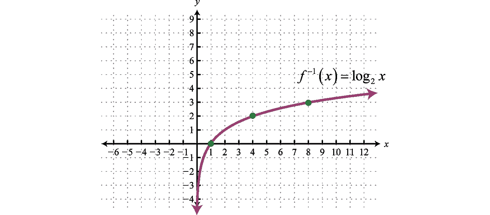

# 交叉熵去神秘化。

> 原文：<https://towardsdatascience.com/cross-entropy-demystified-f0886a64883f?source=collection_archive---------35----------------------->

## 深入研究交叉熵，其必要性和实用性背后的直觉和推理。

# 引言。

很长一段时间，我没有完全理解交叉熵损失。**我们为什么要取指数(softmax)？那我们为什么要拿走木头？我们为什么要拍下这个日志？我们是如何以必须最小化的正损失结束的？**

这些问题越来越让我困惑，以至于我只是接受了我必须使用交叉熵进行多标签分类，并没有想太多。

最近我开始浏览 fastai 的 2020 课程，Jeremy 在解释交叉熵，尽管我认为他做得很好，但我之前的问题没有得到很好的回答。于是我开始琢磨和摆弄笔记本，终于弄明白了。

在这篇文章中，我会问一些简单的问题，然后我会回答这些问题，希望之后你不会再有任何关于交叉熵的令人难以置信的问题。

## 损失函数的目标是什么？

损失函数的目标是简单地输出一个数字(我们如何得到这个数字很快就会清楚)，这个数字有 2 个要求。

1.  数字必须是正数。
2.  我们的模型越不准确，这个数字就应该越大。

我们的目标是最小化这个数字，我们的损失越接近零，我们的模型就越精确。

> 注意:我不会探究为什么会这样，我假设你知道神经网络的目标是最小化损失。如果你想了解更多，请访问 fast.ai，跟随杰里米的惊人深度学习课程。这适用于所有与交叉熵无关的问题，但是我愿意在评论中回答它们。

## 第一站，激活。

我们的第一站是激活。这些是神经网络的最后一层输出，是我们的网络对我们图像标签的猜测。激活离标签越近，我们的模型就越精确。

让我们考虑一个网球的图像，我们试图找出这个图像是否是以下三个事物之一:

1.  篮球
2.  网球
3.  足球

网球的标号将是[0，1，0]。这些预测是 100%准确的。猜测分别对应 0%篮球，100%网球，0%足球。

现在假设我们的激活是[0.001，4.334，2.90]。这些只是我凭空想象出来的随机数。然而，如果我们假设这些是激活，我们可以清楚地看到网球的激活是最高的，然而，我们如何量化呢？或者用百分比概率怎么说呢？

此外，如果我们有一组不同的激活，比如[4.334，2.90，0.01]，现在最高的激活是篮球，但我们的图像是一个网球，如何量化我们的模型有多错误？

# 这就是交叉熵的用武之地。

交叉熵是一个损失函数，它量化了我们的模型有多错误。

这种疯狂主要有 3 个步骤(尽管一旦你理解了它的超级简单和直观)。

## 1.Softmax

第一步是使我们的激活值在 0 和 1 之间。我们这样做，所有激活值对应于图像属于某个类别的概率，现在我们可以简单地最大化对应于正确类别的一个值，这将自动减少对应于错误类别的值。如果我们使用原始激活，这个过程会困难得多。

> 注意:当我说我们想要最大化激活时，不要混淆。我们确实想最大化激活，我们只想最小化损失。激活是我们的模型做出的猜测，损失是我们模型错误的度量。
> 我们想减少错误(丢失)，增加正确预测(正确标签对应的激活)。

***我们怎么做 softmax？***
对于每一项，取每一项的指数，除以所有项的指数之和。

对于我们的激活[4.334，2.90，0.01]，让我们计算每个项目的指数。

acts = [4.334，2.90，0.01]

exp_acts = [76.2487，18.1741，1.0101]

sum(exp_acts) = 95.4329

acts_softmax = [0.7990，0.1904，0.0106]

看看最高激活是如何对应最高概率的，这就是为什么我们做 softmax

> 侧边栏:我们为什么不干脆做 acts = acts/sum(acts)呢？
> 让我们试试:
> acts/sum(acts) = [0.5983，0.4003，0.0014]
> 将此与 softmax 进行比较，较高的激活对应于使用 softmax 的概率比使用归一化的概率高。在分类中，这个特性在大多数时候是需要的，因此我们使用 softmax。

## 2.原木

考虑 2 个交叉熵值，一个是 0.99，第二个是 0.999。他们看起来比较接近，如果我们根据 softmax 计算我们的损失，两者的损失不会相差太远。然而，这是不可取的。
考虑 10000 个项目，第一个 softmax 为 0.99，100 个项目被误分类，而第二个 softmax 为 0.999，只有 10 个项目被误分类。本质上 0.999 的 softmax 好了 10 倍，而不仅仅是好了一点点。这种质量上的差异最好用测井曲线来表示。

log(0.01)=-4.6051
log(0.001)=-6.9077

尽管 softmax 值接近，但 log 值中的 cast 差异非常有用。
也 log(1) = 0，所以当 softmax 概率为正确类的 100%时，损失(如果只是 log(softmax)为 0)。

我们计算损耗的方法是，其中 label ==1，我们取-log(softmax)，这就是损耗。

## 3.为什么是负的对数损失？

在我们的例子中，softmax 为 1，log softmax 为 0，因此损失为零。这是正确的。

但当我们的 softmax 为 0.01 时，我们的 log softmax 为- **4.6，**但我们知道我们的损失必须是一个必须最小化的高正数，所以我们取它的负值，使我们的-log(softmax)为正，这是损失的正确值。

由于曲线的性质，Log 为负。

许可证 [CC BY-NC-SA 3.0](https://creativecommons.org/licenses/by-nc-sa/3.0/) 下 x < 1 are negative. Image by [Saylor 学院](https://saylordotorg.github.io/text_intermediate-algebra/s10-03-logarithmic-functions-and-thei.html)的记录值

因为 softmax 值总是小于或等于 1，所以 log 总是负的，因此-log(softmax)是正的。

**重申一下:-Log(softmax)是我们的损失值。我们取数据集或小批量中每个损失值的平均值，以获得总损失，我们试图将其最小化。**

# 外卖想法

1.  我们采用激活指数使预测概率之间的差距更大。
2.  我们取 softmax 的对数，将 softmax 的小差异等同于损失的大差异，这是应该存在的。**在某种意义上，我们使用 softmax 对激活进行处理，以帮助预测，但我们使用 log 对激活进行反处理，以准确评估损失。**
3.  我们对 log 取负值以得到正损失，因为 log 对小于 1 的值返回负值(softmax 值就是这种情况)。

# 信用

1.  这里的许多想法来自杰瑞米·霍华德的 Fastai 课程，我只是试图解释我更好地理解的内容，并添加了我的一些想法。
2.  [https://saylordotorg . github . io/text _ intermediate-algebra/S10-03-logarithus-functions-and-the I . html](https://saylordotorg.github.io/text_intermediate-algebra/s10-03-logarithmic-functions-and-thei.html)，就是我得到对数图的地方。