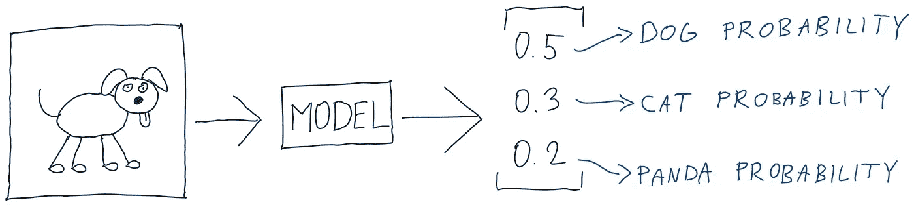

# 用于分类的交叉熵

> 原文：<https://towardsdatascience.com/cross-entropy-for-classification-d98e7f974451?source=collection_archive---------0----------------------->

[李建刚](https://unsplash.com/@lijiangang?utm_source=medium&utm_medium=referral)在 [Unsplash](https://unsplash.com?utm_source=medium&utm_medium=referral) 上拍照

## 二元、多类和多标签分类

**TL；博士在最后**

**交叉熵**是分类任务常用的损失函数。让我们看看为什么要使用它，在哪里使用它。我们将从一个典型的多类分类任务开始。

## 多类分类

图片上是哪一类——狗、猫还是熊猫？只能是其中之一。让我们想象一只狗。

预测是一个**概率向量**，这意味着它表示所有类别的预测概率，总计为 1。

在神经网络中，通常通过 softmax 函数激活最后一层来实现这种预测，但任何事情都可以，它只是必须是一个概率向量。

让我们计算这张图片的交叉熵损失。

> 损失是对模型性能的一种度量。越低越好。学习时，模型的目标是获得尽可能低的损失。

目标表示所有类别的概率—狗、猫和熊猫。

> 多类分类的目标是一个热点向量，这意味着它在单个位置上为 1，在其他位置上为 0。

对于 dog 类，我们希望概率为 1。对于其他类，我们希望它是 0。

我们将开始分别计算每个类别的**损失，然后将它们相加。每个单独类别的损耗计算如下:**

不要太担心公式，我们马上会谈到它。请注意，如果目标的职业概率是 0，那么它的损失也是 0。

最后——狗类的损失:

那个数字是什么意思？

让我们看看，如果预测的概率不同，损失会如何表现:

*   预测为 1 时损失为 0(与目标相同)。
*   如果预测值为 0(与我们的目标完全相反)，损失就是无穷大。
*   我们永远不会预测小于 0 或大于 1 的东西，所以我们不用担心这个。

如果我们预测中间的东西呢？

我们离目标越远，损失越大。
你可以把它想成一个类似于平方误差的概念——我们离目标越远，误差增长越快。

**为什么猫和熊猫类的损失为 0？**

看起来我们是在奖励低损失的模型，即使它预测了图像中不存在的类别的高概率。

我们不介意模型预测有一只猫有 80%的概率，如果没有，因为它只剩下 20%的概率来预测正确的类别。在那里，损失会大得多。换句话说，我们不关心模型在哪些类上浪费了预测的概率，只关心它如何正确地识别唯一的当前类。

该图像的总损失是每类损失的总和。

它可以被公式化为所有类的总和。

这就是**交叉熵**公式，可以作为任意两个概率向量的损失函数。这是我们损失了一张图片——我们一开始展示的一只狗的图片。如果我们想要我们的批次或整个数据集的损失，我们只需合计单个图像的损失。

假设我们有两个不同的模型给出以下预测:

在交叉熵的眼中，模型 B 更好——它的交叉熵损失更低。如果你能明白为什么——干得好！有一只熊猫。

照片由[杰瑞米 C](https://unsplash.com/@zuoanyixi?utm_source=medium&utm_medium=referral) 在 [Unsplash](https://unsplash.com?utm_source=medium&utm_medium=referral) 上拍摄

通过惩罚大错误比惩罚小错误多得多来训练模型，在机器学习中被证明是一个好主意。

如果大多数类别的损失为 0，为什么要对所有类别求和？
如果我们的目标是一个热点向量，我们确实可以忽略所有其他类别的目标和预测，只计算热点类别的损失。这是我们预测的负自然对数。

这被称为**分类交叉熵**——交叉熵的一个特例，其中我们的目标是一个热点向量。

事情是这样的——交叉熵损失甚至适用于非热点向量的分布。
即使对于这个任务，损失也会起作用:

有了交叉熵，我们仍然能够计算损失，如果所有的类都是正确的，损失将是最小的，并且仍然具有惩罚更大错误的属性。

在我们的单热目标例子中，熵是 0，所以最小损失是 0。如果你的目标是一个**而不是**的概率向量，熵(最小损失)将大于 0，但是你仍然可以使用交叉熵损失。

如果你更好奇熵是什么，我推荐你看这个[视频](https://www.youtube.com/watch?v=ErfnhcEV1O8)。

## 二元分类

**二进制交叉熵**是交叉熵的另一个特例——如果我们的目标是 0 或 1，就使用它。在神经网络中，通常通过激活 sigmoid 来实现这种预测。

目标是**而不是**一个概率向量。我们仍然可以用一点小技巧来使用交叉熵。

我们希望预测图像中是否包含熊猫。

这就好像我们将目标转换为一个热点向量，将我们的预测转换为一个概率向量——熊猫的概率将与预测相同，而非熊猫的概率将是 1-预测。换句话说，如果我们预测 0.6，这意味着我们说 60%是熊猫，40%不是熊猫。

这种损失可以用交叉熵函数来计算，因为我们现在只比较两个概率向量，或者甚至用分类交叉熵来计算，因为我们的目标是一个热点向量。它也可以在没有使用**二进制交叉熵**进行转换的情况下进行计算。

我们只是将自然对数应用于我们的预测和目标之间的差异。

这就是二元交叉熵的全部内容。

## 多标签分类

交叉熵也可以用作多标签问题的损失函数，方法很简单:

注意我们的目标和预测是**而不是**一个概率向量。有可能图像中有所有的类，也有可能没有。在神经网络中，通常通过激活乙状结肠来实现这一点。

我们可以把这个问题看作多个二元分类子任务。假设我们只想预测有没有狗。

我们知道我们的目标是 1，而我们预测的是 0.6

我们将计算这个子任务的二元交叉熵:

对其他班级也这样做。

对于猫，我们的目标是 0，所以二进制交叉熵的另一部分抵消了:

并合计每个子任务的损失:

这就是多标签分类的交叉熵损失。

# 结论/TL；速度三角形定位法(dead reckoning)

**交叉熵** —通用公式，用于计算两个概率向量之间的损失。我们离目标越远，误差就越大——类似于平方误差。

**多类分类** —我们使用多类交叉熵—交叉熵的一种特殊情况，其中目标是一个热点编码向量。它可以用交叉熵公式计算，但可以简化。

**二进制分类** —我们使用二进制交叉熵——交叉熵的一种特殊情况，我们的目标是 0 或 1。如果我们将目标分别转换为像[0，1]或[1，0]这样的单热点向量和预测，则可以使用交叉熵公式来计算。即使没有这种转换，我们也可以用简化的公式来计算。

**多标签分类** —我们的目标可以一次表示多个(甚至零个)类。我们分别计算每一类的二元交叉熵，然后将它们相加得到完全损失。

