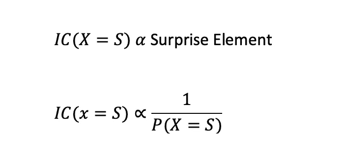
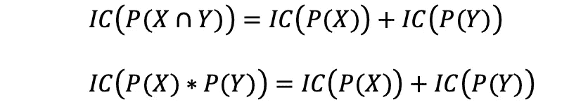
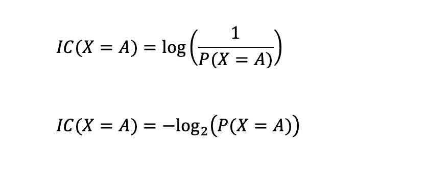
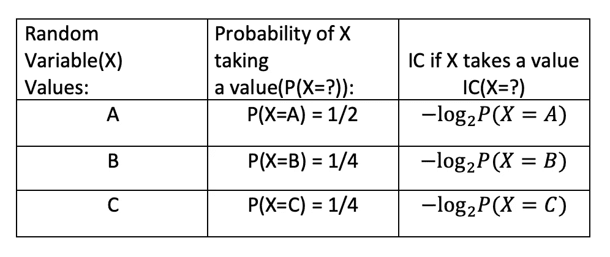
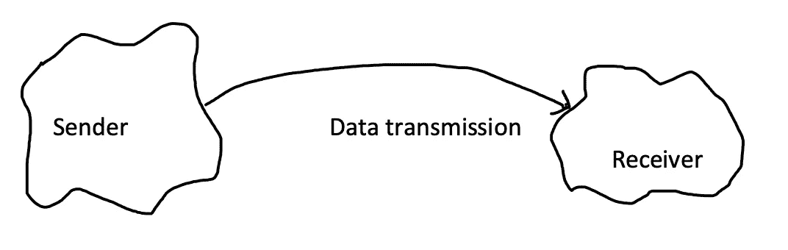
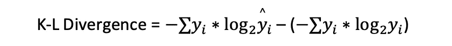
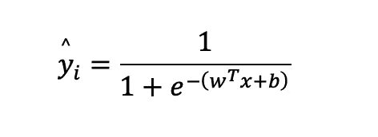
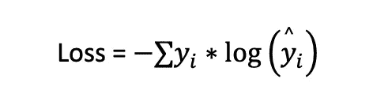

# 交叉熵、对数损失及其背后的直觉

> 原文：<https://towardsdatascience.com/cross-entropy-log-loss-and-intuition-behind-it-364558dca514?source=collection_archive---------42----------------------->

## 在这篇博客中，你会对交叉熵和对数损失在机器学习中的应用有一个直观的了解。

[absolute vision](https://unsplash.com/@freegraphictoday?utm_source=unsplash&utm_medium=referral&utm_content=creditCopyText)在 [Unsplash](https://unsplash.com/s/photos/compass?utm_source=unsplash&utm_medium=referral&utm_content=creditCopyText) 上拍摄的照片。

在浏览这个博客之前，你不需要知道任何事情，因为我将从基础开始。以下内容将在本博客中详细介绍和解释。

1.  **随机变量**
2.  **信息内容**
3.  **熵**
4.  **交叉熵和 K-L 散度**
5.  **日志丢失**

## **随机变量:**

这被定义为一个获取随机事件输出的变量。例如，我们可以定义一个变量 X，它取掷骰子的输出值。这里 X 可以取 1 到 6 的值。

我们有时也会计算随机变量取特定值的概率。例如，P(X=1)是 1/6，这对于其他值也是一样的，因为它们同样可能发生。

## **信息内容(IC):**

当我们讨论信息内容时，我们是在随机变量的背景下进行的。你可以这样想，如果你知道一个事件将要发生，而且这个事件经常发生，那么信息量就非常少。现在，如果你知道一个事件将要发生，而这个事件很少发生，那么信息量就很大。比如有两个随机变量 X 和 Y，这里 X 告诉太阳会不会升起，Y 告诉今天会不会有地震**(惊喜元素)**。你很容易得出 Y 包含更多信息的结论。

> 信息含量与惊喜元素成正比。

因此，我们可以得出结论，一个随机变量的信息含量取决于一个事件发生的概率。如果概率很低，信息量就很大。我们可以用数学方法写成如下:

信息内容

因此 IC 是概率的函数。这里 P(X=S)表示 X 取值 S 的概率，这将用于博客的其余部分。信息内容显示以下属性。

如果 X 和 Y 是独立事件，IC 的性质。

上图中的第二个性质见于对数函数族。这给了我们用对数作为函数来计算 IC 的直觉。因此，现在我们可以用数学方法定义 IC 如下:

IC 公式。

## **熵:**

随机变量的熵被定义为随机变量的期望信息量。我们会用电子学分支的信息论来更直观的解释。

在信息论中，发送值 X=某个值的比特数称为信息量。如果随机变量有 N 个值，那么我们说它是一个信号。事实上，我们将信号定义为取 N 个值的随机变量。一个信号在不同的时间间隔取不同的值，因此我们可以定义一个随机变量，它取信号可以取的 N 个可能的值。现在我们找到发送信号所需的比特数，这就是随机变量的预期信息内容。换句话说，我们称之为熵。下面的例子将使它更清楚。

举例说明如何计算熵。

使用以下公式计算熵/预期 IC

计算熵/预期 IC 的公式

使用这个公式我们得到熵= (1/2*1)+(1/4*2)+(1/4*2) = 3/2。因此，平均而言，我们将使用 1.5 位来发送该信号。

## **交叉熵和 K-L 散度:**

数据传送

在接收端，我们不知道随机变量的实际分布。我们将看到接收到 100 个信号，然后估计随机变量的分布。现在让我们假设发送方的实际分布是“y ”,估计是'y^'.在这里，分布意味着随机变量取特定值的概率。以下是发送数据所需的位数。

计算发送方和接收方位数的公式。

现在我们已经知道位数和熵是一样的。发送方的熵称为熵，接收方的估计熵称为**交叉熵**。现在，这被称为交叉熵，因为我们使用实际分布和估计分布来计算接收端的估计熵。你一定会想到的另一个问题是，为什么我们在接收端使用实际分布(y)。答案是，我们正在估计接收到的随机变量(-log(yi^).)的每个值所需的比特数所使用的比特数将取决于接收机接收到的随机变量的分布。如果在这之后还不清楚，那么让我们举个例子。

我们估计 P(X=A)是 1/4，而实际是 1/8，那么估计的比特数将是-(log(1/4)) = 2，但是对最终答案的贡献将是 1/8*(2) = 1/4，因为我们将在接收器接收这个值 1/8 次。现在我想这已经很清楚了。

**K-L 散度**等于交叉熵和熵之差。

K-L 散度。

## **日志丢失:**

现在我们将转到机器学习部分。我想我们知道 y^是什么意思。如果你不知道，那么 Y^就是给定数据点属于特定类别/标签的预测概率。例如，我们可以在机器学习中有一个模型，它将判断一个文本是否是滥用的。计算 y^的公式如下

数据点属于某一类的概率公式。

这里**‘w’是权重向量**，**‘x’是**数据点**的 d 维表示**，**‘b’是偏差项**。

> **我们在所有机器学习中的主要目标是正确估计训练数据集中数据点的分布**。

在这里，训练集可以被视为发送者，而模型可以被视为试图估计分布的接收者。

当 K-L 散度最小时，将出现最佳估计。因此我们将找到对应于最小 K-L 散度的(w，b)。在更新(w，b)时，我们忽略熵项，因为它是一个常数，只有交叉熵项变化。因此，我们的损失方程如下。

失败

这是损失项，我们通常称之为对数损失，因为它包含对数项。

对于**二进制分类**，其中‘yi’可以是 0 或 1。这个损失看起来将类似于**loss =-(y * log(y)+(1-y)* log(1-y))**。这是我们大多数人都熟悉的。暂时就这些了。我希望你都记下了。

如果你喜欢这个内容，请在下面的评论中告诉我。

参考资料:

[https://en.wikipedia.org/wiki/Cross_entropy](https://en.wikipedia.org/wiki/Cross_entropy)

[https://en.wikipedia.org/wiki/Information_content](https://en.wikipedia.org/wiki/Information_content)

[https://en.wikipedia.org/wiki/Random_variable](https://en.wikipedia.org/wiki/Random_variable)

如果你想了解什么是校准，那就去看看这个 [**博客**](https://medium.com/analytics-vidhya/calibration-in-machine-learning-e7972ac93555) 。

 [## 机器学习中的校准

### 在这篇博客中，我们将学习什么是校准，为什么以及何时应该使用它。

medium.com](https://medium.com/analytics-vidhya/calibration-in-machine-learning-e7972ac93555) 

想学习如何防止自己的模型欠拟合、欠拟合，那就去翻翻这篇 [**博客**](/overfitting-and-underfitting-in-machine-learning-89738c58f610) 。

 [## 机器学习中的过拟合和欠拟合

### 在这篇文章中，你将了解什么是过度拟合和欠拟合。您还将学习如何防止模型…

towardsdatascience.com](/overfitting-and-underfitting-in-machine-learning-89738c58f610)