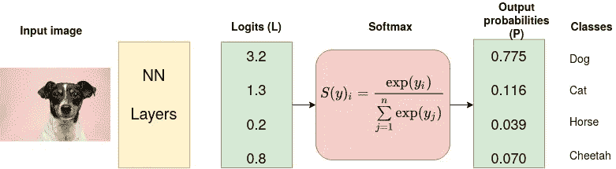
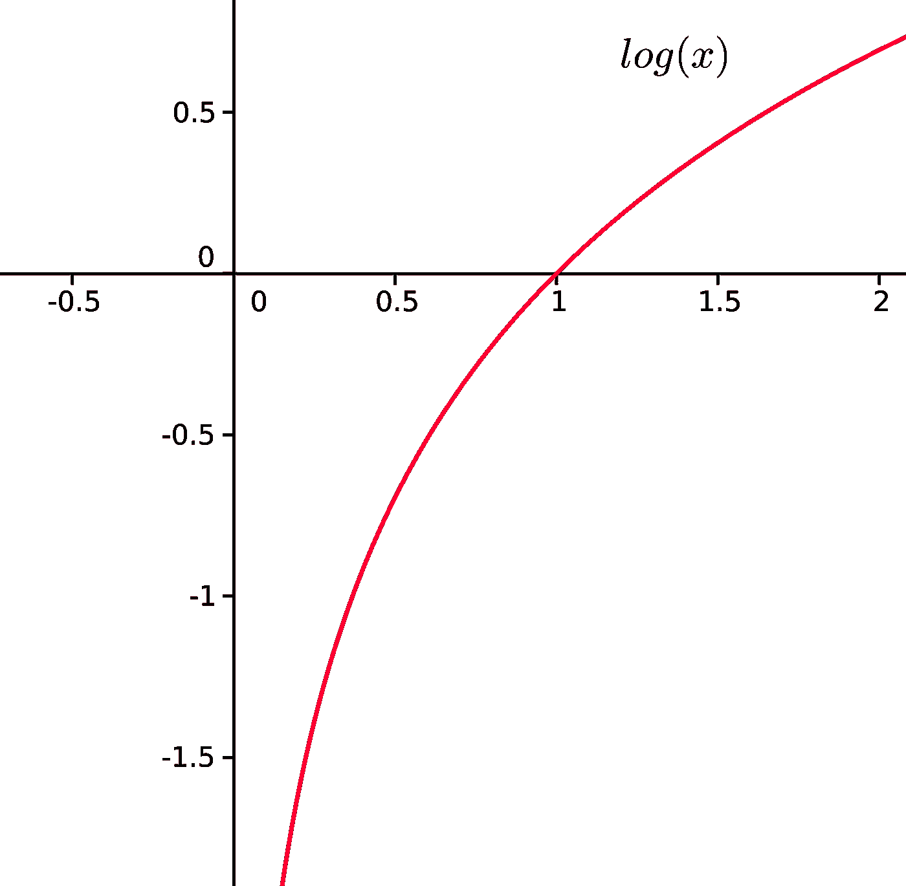
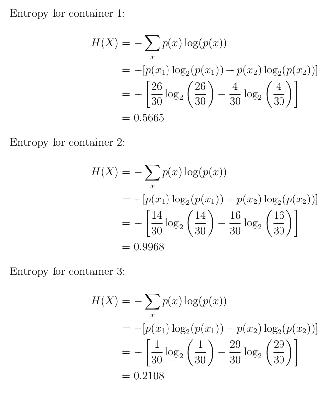

# 交叉熵损失函数

> 原文：<https://towardsdatascience.com/cross-entropy-loss-function-f38c4ec8643e?source=collection_archive---------0----------------------->

[法托斯 Bytyqi](https://unsplash.com/@fatosi?utm_source=unsplash&utm_medium=referral&utm_content=creditCopyText) 在 [Unsplash](https://unsplash.com/s/photos/machine-learning?utm_source=unsplash&utm_medium=referral&utm_content=creditCopyText) 上的照片

当处理机器学习或深度学习问题时，损失/成本函数用于在训练期间优化模型。目标几乎总是最小化损失函数。损失越低，模型越好。交叉熵损失是最重要的代价函数。它用于优化分类模型。交叉熵的理解依赖于对 Softmax 激活函数的理解。我在下面放了另一篇文章来讨论这个先决条件

 [## Softmax 激活功能——实际工作原理

### Softmax 是放置在深度学习网络末端的函数，用于将 logits 转换为分类概率。

towardsdatascience.com](/softmax-activation-function-how-it-actually-works-d292d335bd78) 

考虑一个`4`级分类任务，其中图像被分类为狗、猫、马或猎豹。

输入图片来源:Victor Grabarczyk 在 [Unsplash](https://unsplash.com/s/photos/dog?utm_source=unsplash&utm_medium=referral&utm_content=creditCopyText) 上拍摄的照片。作者图解。

在上图中，Softmax 将 logits 转换为概率。交叉熵的目的是获取输出概率(P)并测量与真值的距离(如下图所示)。

交叉熵(L)(来源:作者)。

对于上面的例子，对于类别`dog`的期望输出是`[1,0,0,0]`，但是模型输出是`[0.775, 0.116, 0.039, 0.070]`。

目标是使模型输出尽可能接近期望的输出(真值)。在模型训练期间，模型权重被相应地迭代调整，目的是最小化交叉熵损失。调整权重的过程就是定义*模型训练*的过程，随着模型不断训练并且损失最小化，我们说模型正在*学习*。

交叉熵的概念可以追溯到信息论领域，克劳德·香农在 1948 年引入了熵的概念。在深入交叉熵代价函数之前，让我们先介绍一下熵。

# 熵

随机变量 X 的熵是该变量可能结果中固有的不确定性水平。

对于`p(x)`——概率分布和随机变量 X，熵定义如下

等式 1:熵的定义。注对数以 2 为基数计算。

**负号原因:** `log(p(x))<0`为`(0,1)`中的所有`p(x)`。p(x)是一个概率分布，因此值必须在 0 和 1 之间。

log(x)的图。对于 0 到 1 之间的 x 值，log(x) <0 (is negative). (Source: Author).

The greater the value of entropy, 【 , the greater the uncertainty for probability distribution and the smaller the value the less the uncertainty.

**示例**

考虑以下三种形状的“容器”:三角形和圆形

3 个三角形和圆形容器。(来源:作者)。

**容器 1:** 拣出三角形的概率是 26/30，拣出圆形的概率是 4/30。由于这个原因，选择一种形状和/或不选择另一种形状的概率更确定。

**容器 2:** 选择三角形的概率为 14/30，否则为 16/30。几乎有 50–50%的机会选择任何特定的形状。选择给定形状的确定性比 1 中的低。

**容器 3:** 从容器 3 中选取的形状极有可能是圆形。选择圆形的概率是 29/30，选择三角形的概率是 1/30。很有可能选择的形状是圆形。

让我们计算熵，这样我们就能确定我们的断言，即选择一个给定的形状是确定的。

正如所料，第一个和第三个容器的熵小于第二个容器。这是因为在容器 1 和 3 中选择给定形状的概率比在容器 2 中更确定。我们现在可以继续讨论交叉熵损失函数。

# 交叉熵损失函数

又称**对数损失**、**对数损失**或**逻辑损失**。将每个预测类别概率与实际类别期望输出 0 或 1 进行比较，并计算得分/损失，该得分/损失基于该概率与实际期望值的差距来惩罚该概率。惩罚本质上是对数的，对于接近 1 的大差异产生大的分数，对于趋向于 0 的小差异产生小的分数。

当在训练期间调整模型权重时，使用交叉熵损失。目标是最小化损失，即损失越小，模型越好。完美模型的交叉熵损失为 0。

交叉熵被定义为

等式 2:交叉熵的数学定义。请注意，对数是以 2 为基数计算的，与 ln()相同。

# 二元交叉熵损失

对于二进制分类(具有两个类别 0 和 1 的分类任务)，我们将二进制交叉熵定义为

等式 3:数学二元交叉熵。

二进制交叉熵通常被计算为所有数据示例的平均交叉熵，即，

等式 4

**例子**

考虑具有以下软最大概率(S)和标签(T)的分类问题。目标是在给定这些信息的情况下计算交叉熵损失。

Logits)和具有分类交叉熵损失函数的一键编码真值标签(T ),用于测量预测概率和真值标签之间的“距离”。(来源:作者)

分类交叉熵的计算如下

Softmax 是连续可微函数。这使得计算损失函数相对于神经网络中每个权重的导数成为可能。该属性允许模型相应地调整权重以最小化损失函数(模型输出接近真实值)。

假设在模型训练的一些迭代之后，模型输出以下逻辑向量

`0.095`小于前次损失，即`0.3677`暗示模型正在学习。优化过程(调整权重以使输出接近真实值)一直持续到训练结束。

Keras 提供了以下交叉熵损失函数:二元、分类、稀疏分类交叉熵损失函数。

# 范畴交叉熵和稀疏范畴交叉熵

类别交叉熵和稀疏类别交叉熵都具有等式 2 中定义的相同损失函数。两者之间唯一的区别是如何定义真理标签。

*   当真实标签被一热编码时，使用分类交叉熵，例如，我们对于 3 类分类问题`[1,0,0]`、`[0,1,0]`和`[0,0,1].`具有以下真实值
*   在稀疏分类交叉熵中，真值标签是整数编码的，例如，3 类问题的`[1]`、`[2]`和`[3]`。

我希望这篇文章能帮助你更清楚地理解交叉熵损失函数。

 [## Softmax 激活功能——实际工作原理

### Softmax 是放置在深度学习网络末端的函数，用于将 logits 转换为分类概率。

towardsdatascience.com](/softmax-activation-function-how-it-actually-works-d292d335bd78) 

感谢阅读:-)