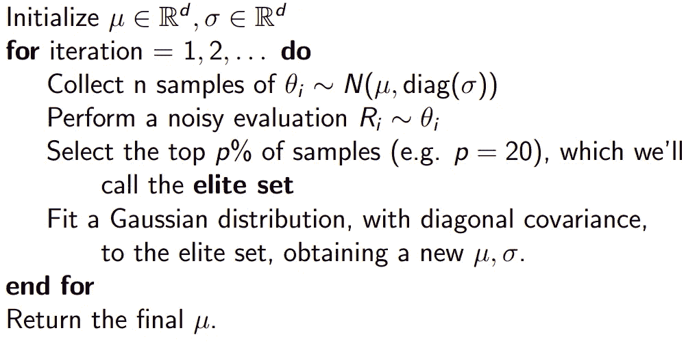

# 强化学习的交叉熵方法

> 原文：<https://towardsdatascience.com/cross-entropy-method-for-reinforcement-learning-2b6de2a4f3a0?source=collection_archive---------7----------------------->


在 [Unsplash](https://unsplash.com?utm_source=medium&utm_medium=referral) 上由 [Franck V.](https://unsplash.com/@franckinjapan?utm_source=medium&utm_medium=referral) 拍摄的照片

如果你曾经鼓起勇气探索强化学习领域，很有可能你会发现自己迷失在花哨的词汇中。大词，复杂算法的名字，背后有更复杂的数学。但是，如果有更简单、更直观、效率更高的算法能够很好地工作呢？

来看看交叉熵方法:一种用于参数化政策优化的进化算法，John Schulman 声称这种算法在复杂的 RL 问题上“令人尴尬地好”。

## 什么是交叉熵方法？

从生物学的角度来看，这是一种 T4 进化算法。一些个体是从群体中抽样出来的，只有最优秀的个体才能决定后代的特征。

在数学上，它可以被视为一种*无导数优化* (DFO)技术，即，它可以在没有计算导数的开销的情况下找到最优解(无反向传播！).

## 这种方法是如何工作的？

假设您不知道什么是代理、环境和策略。你只是得到了一个“黑匣子”，它接受一些数字作为输入，输出一些其他的数字。您只能选择输入值并观察输出。*如何猜测输入，使输出成为您想要的值？*

一种简单的方法是获取一组输入，观察产生的输出，选择产生最佳输出的输入，并对其进行调整，直到您对看到的输出满意为止。这本质上就是交叉熵方法所做的。

## 那么，我该如何用它来解决我的 RL 问题呢？

让我们通过一个例子来逐步理解 CEM 的工作原理。为了更好地理解实现，我在每个步骤中都添加了一些 python 代码片段。代码大量借用了 Udacity 关于深度强化学习的课程(惊人的 python RL 资源 btw，本文末尾 Github 链接)。

考虑你的政策网络。你想要找到最佳的权重，它可以基于你的代理的状态采取正确的“有意义的”行动。用于找到这些权重的基于 CEM 的方法如下:

**第一步:**从随机分布中抽取一串初始权重。尽管通常选择高斯分布，但您可以选择您认为权重来自的任何分布。假设我从具有均值 **μ** 和方差 **σ** 的高斯分布中抽取了 10 个权重候选值 **w1** 、 **w2** 、…、 **w10** 。

考虑μ=0，σ=1，n_weights=10(候选数)，weights_dim 表示权重向量的维数。

```
mean = 0.0       
std = 1.0
n_weights = 10weights_pop = [mean + std*np.random.randn(weights_dim) for i_weight in range(n_weights)]
```

**步骤 2:** 现在让代理根据这些权重从策略网络中选择行动，让代理运行一集并收集环境生成的奖励。对于我们的例子，比如说 **w1** 产生一个累积奖励 **r1** ， **w2** 产生 **r2** 等等。

用于代理的评估方法将权重候选作为输入，播放一集并输出来自该集的累积奖励。

```
rewards = [agent.evaluate(weights) for weights in weights_pop]
```

第三步:找出产生最佳回报的权重。假设最佳的 4 种重量是 **w1** 、 **w2** 、 **w5** 和 **w6** (也称为“精英”重量)。这里 4 是我们选择的一个数字。一般来说，你考虑最好的 *n* 权重，其中 *n* 由你选择。

```
n_elite = 4
elite_idxs = np.array(rewards).argsort()[-n_elite:]
elite_weights = [weights_pop[idx] for idx in elite_idxs]
```

**步骤 4:** 从*精英*权重定义的分布中选择新权重。说 **μ'** 是最佳权重的平均值( **w1** 、 **w2** 、 **w5** 和**w6**)**σ'**是它们的方差。我们现在从具有平均值**μ’**和方差**σ’**的高斯分布中抽取 10 名候选人。

```
mean = np.array(elite_weights).mean()
std = np.array(elite_weights).std()weights_pop = [mean + std*np.random.randn(weights_dim) for i_weight in range(n_weights)]
```

第五步:重复第二步到第四步，直到你对得到的奖励感到满意。

如果你不喜欢 python 代码，而你喜欢用数学术语阅读算法，这里有一些伪代码:



鸣谢:约翰·舒尔曼关于深度强化学习的 MLSS 2016

## 结论

交叉熵方法是一种简单的算法，可以用来训练 RL 代理。在包括 Tetris⁴.游戏在内的著名任务上，该方法已经胜过了几种 RL 技术在转向更复杂的 RL 算法(如 PPO、A3C 等)之前，您可以将此作为基线。CEM 有几种变体，但是，本文中定义的结构是所有变体的主干。

这篇关于交叉熵强化学习方法的文章到此结束。我希望您喜欢您刚刚阅读的内容，并感谢您的宝贵时间。

## 参考

[1][https://github . com/uda city/deep-reinforcement-learning/tree/master/cross-entropy](https://github.com/udacity/deep-reinforcement-learning/tree/master/cross-entropy)

[2] MLSS 2016 关于深度强化学习由约翰·舒尔曼([https://www.youtube.com/watch?v=aUrX-rP_ss4](https://www.youtube.com/watch?v=aUrX-rP_ss4))

[3]http://karpathy.github.io/2016/05/31/rl/

[4] I. Szita 和 A. Lorincz，[用有噪声的交叉熵方法学习俄罗斯方块](http://citeseerx.ist.psu.edu/viewdoc/download?doi=10.1.1.81.6579&rep=rep1&type=pdf) (2006)，神经计算