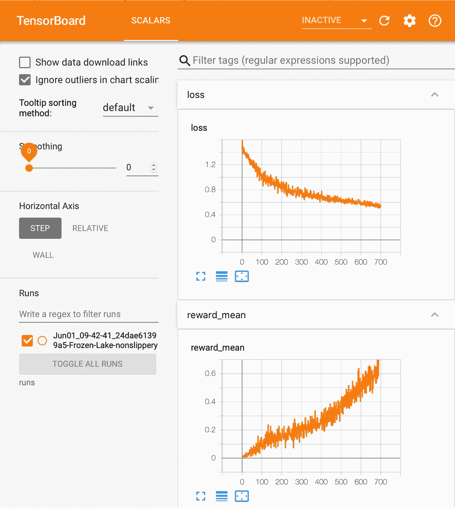
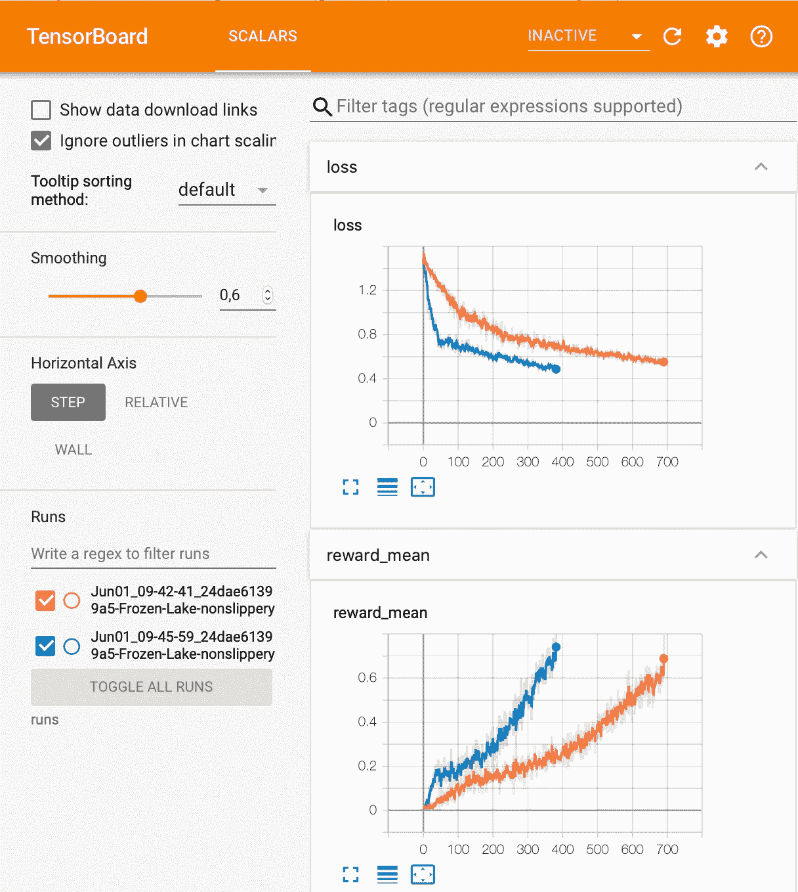
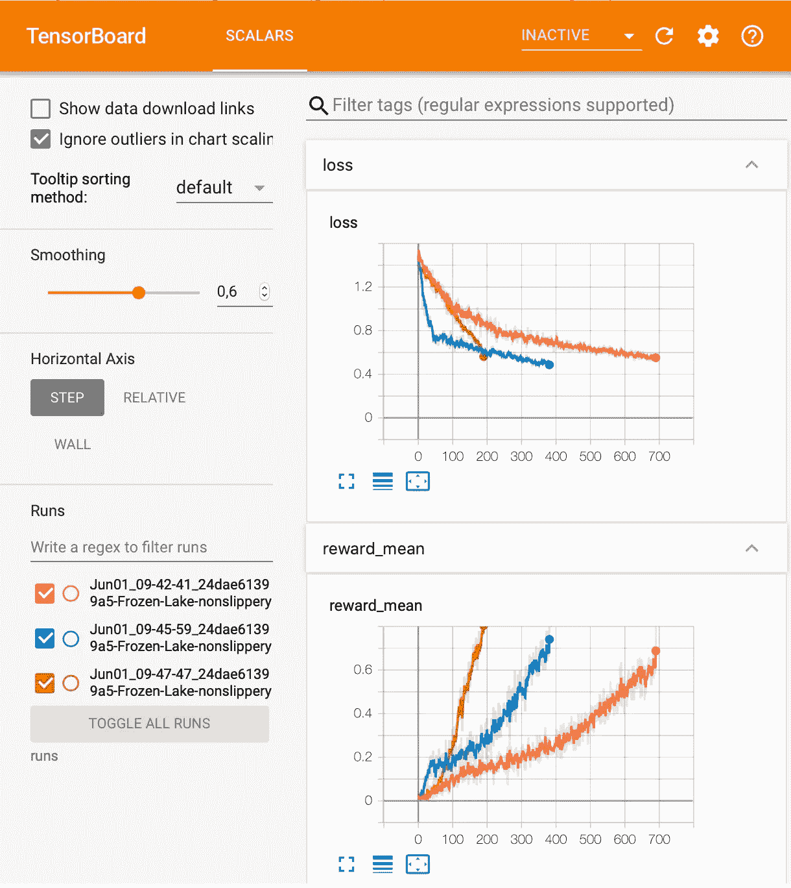
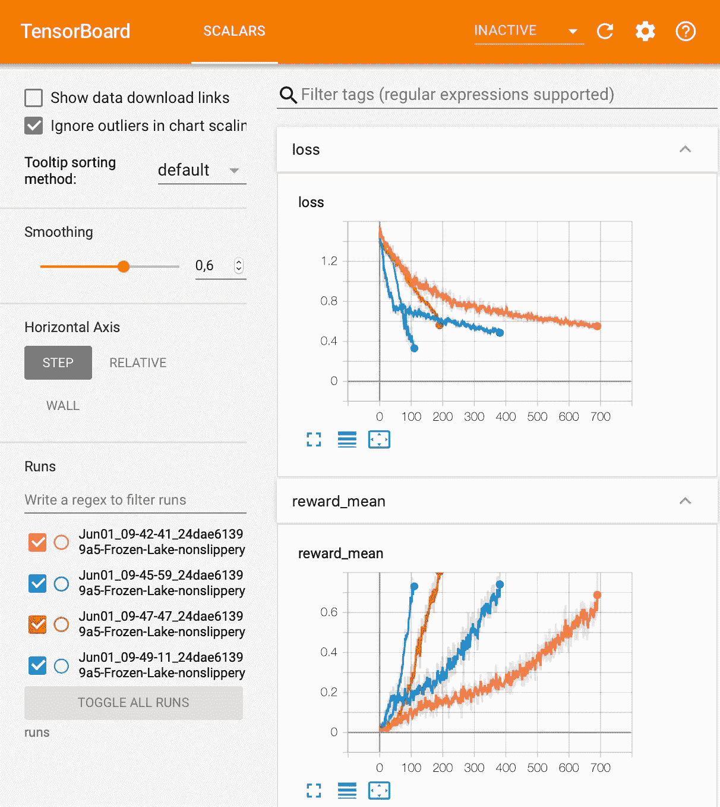
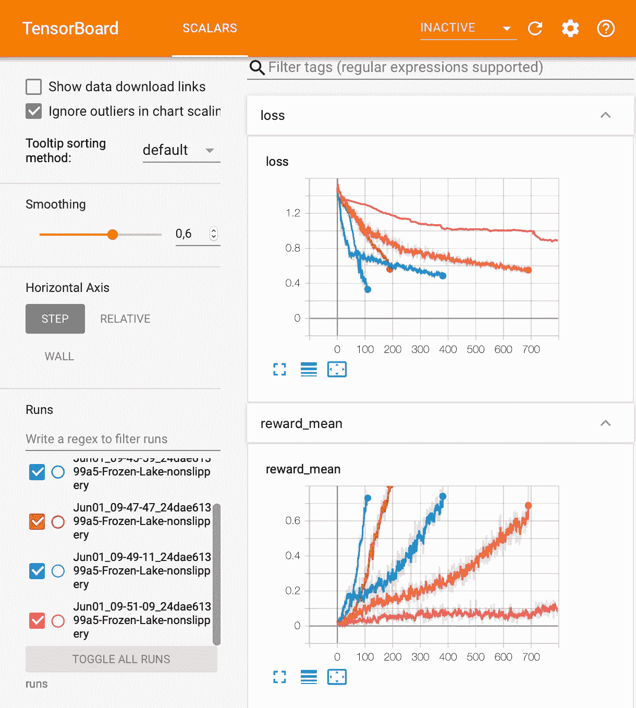
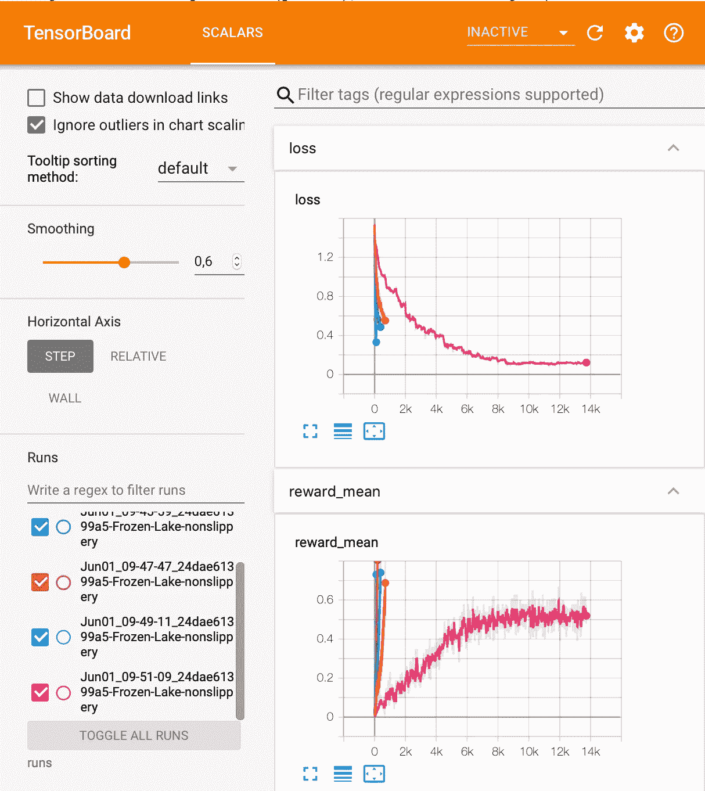
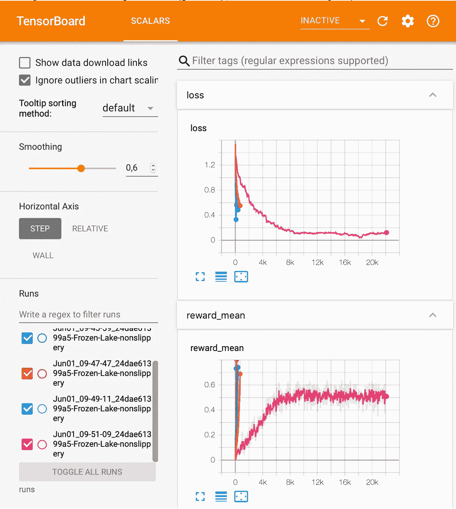

# 交叉熵方法性能分析

> 原文：<https://towardsdatascience.com/cross-entropy-method-performance-analysis-161a5faef5fc?source=collection_archive---------37----------------------->

## [深度强化学习讲解— 07](https://towardsdatascience.com/tagged/deep-r-l-explained)

## 交叉熵训练循环的实现


在这篇文章中，我们将详细描述交叉熵方法的训练循环，这是我们在上一篇文章中跳过的，同时看看我们如何在考虑更复杂的神经网络的情况下改进代理的学习。此外，我们将介绍该方法的改进变体，它为训练过程的多次迭代保留“精英”片段。最后，我们将展示交叉熵方法激励其他方法的局限性。

# 1.训练循环概述

接下来，我们将详细介绍构成我们在上一篇文章中介绍的训练循环的代码。

> *本帖的* [*完整代码可以在 GitHub*](https://github.com/jorditorresBCN/Deep-Reinforcement-Learning-Explained/blob/master/DRL_06_07_Cross_Entropy.ipynb) *和* [*上找到，使用此链接*](https://colab.research.google.com/github/jorditorresBCN/Deep-Reinforcement-Learning-Explained/blob/master/DRL_06_07_Cross_Entropy.ipynb) *可以作为 Colab 谷歌笔记本运行。*

## 主要变量

代码从定义方法的主要参数开始。

```
BATCH_SIZE = 100
GAMMA = 0.9PERCENTILE = 30
REWARD_GOAL = 0.8
```

## 助手类

我们建议使用两个助手类来简化代码的可解释性:

```
from collections import namedtupleEpisode = namedtuple(‘Episode’, field_names=[‘reward’, ‘steps’])EpisodeStep = namedtuple(‘EpisodeStep’, 
                          field_names=[‘observation’, ‘action’])
```

这里我们将定义两个助手类，它们被命名为标准库中的`collections`包中的元组:

*   `EpisodeStep`:这将用来表示我们的代理在剧集中做的一个单独的步骤，它存储了从环境中观察到的**状态**以及代理完成了什么**动作**。奖励没有被记录，因为它总是`0.0`，除了最后一个过渡。请记住，我们将使用“精英”剧集中的剧集步骤作为训练数据。
*   `Episode`:这是储存了总折扣奖励和 EpisodeStep 集合的单集。

## 变量的初始化

此时，我们将在训练循环中使用的一组变量被初始化。我们将按照循环中的要求逐一介绍:

```
iter_no = 0reward_mean = 0full_batch = []
batch = []episode_steps = []
episode_reward = 0.0state = env.reset()
```

## 训练循环

我们在上一篇文章中了解到，实现交叉熵算法的代理的训练循环重复 4 个主要步骤，直到我们对结果满意为止:

1 —播放 *N* 集数

2-计算每集的预期回报，并确定回报界限

3-丢弃所有回报低于界限的剧集。

4-使用“精英”剧集中的剧集步骤训练神经网络

我们已经决定，代理必须接受培训，直到达到一定的奖励阈值。具体来说，我们决定了一个 80%的阈值，如变量`REWARD_GOAL`所示:

```
while reward_mean < REWARD_GOAL:
```

## 步骤 1-播放 N 集

下一段代码是生成包含剧集的批处理的代码:

```
action = select_action(state)
next_state, reward, episode_is_done, _ = env.step(action)episode_steps.append(EpisodeStep(observation=state,action=action))episode_reward += rewardif episode_is_done: # Episode finished
    batch.append(Episode(reward=episode_reward,
                         steps=episode_steps))
    next_state = env.reset()
    episode_steps = []
    episode_reward = 0.0 <STEP 2> <STEP 3> <STEP 4>state = next_state
```

我们将使用的主要变量是:

*   `batch`累积`Episode`实例的列表(`BATCH_SIZE=100`)。
*   `episode_steps`累积当前剧集中的步骤列表。
*   `episode_reward`为当前剧集维护一个奖励计数器(在我们的例子中，我们只在剧集的结尾有奖励，但是该算法是针对更一般的情况描述的，其中我们不仅可以在最后一步有奖励)。

情节步骤列表增加了(观察、行动)对。值得注意的是，我们保存了用于选择动作的观察结果`state`(而不是作为动作结果由环境返回的观察结果`next_state`):

```
episode_steps.append(EpisodeStep(observation=state,action=action))
```

奖励将添加到当前剧集的总奖励中:

```
episode_reward += reward
```

当当前剧集结束时(洞或目标状态)，我们需要将最终完成的剧集添加到批处理中，保存我们已采取的总奖励和步骤。然后，我们重置环境以重新开始，我们重置变量`episode_steps`和`episode_reward`以开始跟踪下一集:

```
batch.append(Episode(reward=episode_reward, steps=episode_steps))next_obs = env.reset()
episode_steps = []
episode_reward = 0.0
```

## 第二步——计算每集的回报，并确定回报界限

下一段代码实现了步骤 2:

```
if len(batch) == BATCH_SIZE:
    reward_mean = float(np.mean(list(map(lambda s: 
                  s.reward, batch))))
    elite_candidates= batch
    ExpectedReturn = list(map(lambda s: s.reward * (GAMMA **          
                     len(s.steps)), elite_candidates))
    reward_bound = np.percentile(ExpectedReturn, PERCENTILE)
```

当运行了等于`BATCH_SIZE`的播放次数时，训练循环执行该步骤:

```
if len(batch) == BATCH_SIZE:
```

首先，代码计算当前批次中所有剧集的预期回报:

```
elite_candidates= batch
ExpectedReturn = list(map(lambda s: s.reward * (GAMMA **          
                 len(s.steps)), elite_candidates))
```

在此步骤中，根据给定的剧集批次和百分点值，我们计算边界奖励，该奖励将用于过滤“精英”剧集以训练代理神经网络:

```
reward_bound = np.percentile(ExpectedReturn, PERCENTILE)
```

为了获得边界奖励，我们将使用 NumPy 的 percentile 函数，该函数从值列表和所需的百分位数中计算百分位数的值。在这段代码中，我们将使用前 30%的剧集(由变量`PERCENTILE`表示)来创建“精英”剧集。

在此步骤中，我们计算用于决定何时结束训练循环的`reward_mean`:

```
reward_mean = float(np.mean(list(map(lambda s: s.reward, batch))))
```

## 第三步——扔掉所有回报低于界限的剧集

接下来，我们将使用以下代码过滤掉我们的剧集:

```
train_obs = []
train_act = []
elite_batch = []for example, discounted_reward in zip(elite_candidates, 
                                      ExpectedReturn):
    if discounted_reward > reward_bound:
       train_obs.extend(map(lambda step: step.observation, 
                            example.steps))
       train_act.extend(map(lambda step: step.action, 
                            example.steps))
       elite_batch.append(example)full_batch=elite_batch
state=train_obs
acts=train_act
```

对于批次中的每一集:

```
for example, discounted_reward in zip(elite_candidates,
                                      ExpectedReturn):
```

我们将检查这一集的总回报是否高于我们的界限:

```
if discounted_reward > reward_bound:
```

如果有，我们将填充我们将训练的观察状态和动作的列表，并跟踪精华片段:

```
train_obs.extend(map(lambda step: step.observation,example.steps))
train_act.extend(map(lambda step: step.action, example.steps))
elite_batch.append(example)
```

然后，我们将使用“精英”剧集更新该树变量，这些剧集是我们用来训练神经网络的状态和动作列表:

```
full_batch=elite_batch
state=train_obs
acts=train_act
```

## 步骤 4——使用“精英”剧集中的剧集步骤训练神经网络

每当我们的循环累积足够的片段(`BATCH_SIZE`)时，我们计算“精英”片段，并且在相同的迭代中，循环用以下代码训练代理的神经网络:

```
state_t = torch.FloatTensor(state)
acts_t = torch.LongTensor(acts)optimizer.zero_grad()
action_scores_t = net(state_t)
loss_t = objective(action_scores_t, acts_t)
loss_t.backward()
optimizer.step()

iter_no += 1
batch = []
```

这段代码使用“精英”剧集中的剧集步骤训练神经网络**，使用状态 ***s*** 作为输入，发出动作 ***a*** 作为标签(期望输出)。让我们更详细地注释所有代码行:**

首先，我们将变量转换成张量:

```
state_t = torch.FloatTensor(state)
acts_t = torch.LongTensor(acts)
```

我们将神经网络的梯度归零

```
optimizer.zero_grad()
```

并将观察到的状态传递给神经网络，获得其动作得分:

```
action_scores_t = net(state_t)
```

这些分数被传递给目标函数，该函数将计算神经网络输出和代理采取的动作之间的交叉熵

```
loss_t = objective(action_scores_t, acts_t)
```

请记住，我们只考虑“精英”行动。这种想法是为了加强我们的神经网络，以执行那些带来良好回报的“精英”行动。

最后，我们需要使用`backward`方法计算损失的梯度，并使用优化器的`step`方法调整神经网络的参数:

```
loss_t.backward()
optimizer.step()
```

## 监控代理的进度

为了监控代理的学习进度，我们在培训循环中加入了以下内容:

```
print(“%d: loss=%.3f, reward_mean=%.3f” % 
      (iter_no, loss_t.item(), reward_mean))
```

我们用它来显示迭代次数、损失和批次的平均回报(在下一节中，我们也将相同的值写入 TensorBoard 以获得一个漂亮的图表):

```
0: loss=1.384, reward_mean=0.020 
1: loss=1.353, reward_mean=0.040  
2: loss=1.332, reward_mean=0.010  
3: loss=1.362, reward_mean=0.020  
4: loss=1.337, reward_mean=0.020   
5: loss=1.378, reward_mean=0.020 . . .639: loss=0.471, reward_mean=0.730  
640: loss=0.511, reward_mean=0.730 
641: loss=0.472, reward_mean=0.760 
642: loss=0.481, reward_mean=0.650 
643: loss=0.472, reward_mean=0.750 
644: loss=0.492, reward_mean=0.720 
645: loss=0.480, reward_mean=0.660 
646: loss=0.479, reward_mean=0.740 
647: loss=0.474, reward_mean=0.660  
648: loss=0.517, reward_mean=0.830 
```

我们可以检查`reward_mean`变量的最后一个值是允许完成训练循环的值。

# 2.用更好的神经网络改进智能体

在之前的[帖子](/pytorch-performance-analysis-with-tensorboard-7c61f91071aa)中，我们已经介绍了 TensorBoard，这是一个有助于数据可视化过程的工具。取而代之的是上一节中使用的“打印”，我们可以用这两个句子来描绘这两个变量的行为:

```
writer.add_scalar(“loss”, loss_t.item(), iter_no)
writer.add_scalar(“reward_mean”, reward_mean, iter_no)
```

在这种情况下，输出是:



## 更复杂的神经网络

出现的一个问题是，我们是否可以改进代理的神经网络。例如，如果我们考虑一个具有更多神经元的隐藏层，比如说 128 个神经元，会发生什么情况:

```
HIDDEN_SIZE = 128
net= nn.Sequential(
           nn.Linear(obs_size, HIDDEN_SIZE),
           nn.Sigmoid(),
           nn.Linear(HIDDEN_SIZE, n_actions)
           )objective = nn.CrossEntropyLoss()
optimizer = optim.Adam(params=net.parameters(), lr=0.001)train_loop()
```

结果可以在这里显示(或者执行 [GitHub 代码](https://github.com/jorditorresBCN/Deep-Reinforcement-Learning-Explained/blob/master/DRL_06_07_Cross_Entropy.ipynb)):



我们可以看到，这个网络比前一个网络学习得更快。

## ReLU 激活功能

如果我们改变激活函数会发生什么？例如，用 ReLU 代替乙状结肠？

下面你可以看到发生了什么:网络收敛得更早，仅仅 200 次迭代就已经完成了。



# 3.交叉熵算法的改进

到目前为止，我们已经展示了如何改进神经网络架构。但我们也可以改进算法本身:我们可以将“精英”剧集保留更长时间。该算法的前一版本从环境中采样剧集，对最佳剧集进行训练，然后将其丢弃。然而，当成功剧集的数量很少时，可以将“精英”剧集保持更长时间，保持它们几次迭代以在其上进行训练。我们只需要修改代码中的一行:

```
elite_candidates= full_batch + batch#elite_candidates= batch
```

通过 TensorBoard 看到的结果是:



我们可以看到所需的迭代次数再次减少。

# 4.交叉熵方法的局限性

到目前为止，我们已经看到，通过所提出的改进，通过很少的训练循环迭代，我们可以找到一个好的神经网络。但这是因为我们在谈论一个非常简单的“防滑”环境。但是如果我们有一个“湿滑”的环境呢？

```
slippedy_env = gym.make(‘FrozenLake-v0’, is_slippery=True)class OneHotWrapper(gym.ObservationWrapper):
      def __init__(self, env):
          super(OneHotWrapper, self).__init__(env)
          self.observation_space = gym.spaces.Box(0.0, 1.0,
                (env.observation_space.n, ), dtype=np.float32)

      def observation(self, observation):
          r = np.copy(self.observation_space.low)
          r[observation] = 1.0
          return renv = OneHotWrapper(slippedy_env)
```

再次 TensorBoard 是一个大的帮助。在下图中，我们看到了算法在第一次迭代中的行为。它不能够脱去奖赏的价值:



但是，如果我们再等待 5000 次迭代，我们会看到它会有所改善，但从那里开始，它会停滞不前，不再能够超过某个阈值:



尽管我们已经等待了两个多小时，但它仍然没有改善，没有超过 60%的阈值:



# 5.摘要

在这两篇关于交叉熵方法的文章中，读者熟悉了这种方法。我们选择这种方法是因为它是一个很好的热身，因为它简单但非常强大，尽管它有局限性，并且合并了强化学习和深度学习。

我们将它应用于冰冻湖环境。我们已经看到，对于简单的“防滑”环境，with 可以找到一个很好的神经网络。但是如果我们考虑一个“光滑”的环境，交叉熵方法就无法找到(训练神经网络的)解决方案。在本系列的后面，您将熟悉解决这些限制的其他方法。

在开始本系列新部分的下一篇文章中，我们将转向对 RL 方法的更系统的研究，并讨论基于值的方法家族。

[下期](/the-bellman-equation-59258a0d3fa7)见！。

*[*这篇文章的全部代码可以在 GitHub*](https://github.com/jorditorresBCN/Deep-Reinforcement-Learning-Explained/blob/master/DRL_06_07_Cross_Entropy.ipynb)*[*上找到，使用这个链接*](https://colab.research.google.com/github/jorditorresBCN/Deep-Reinforcement-Learning-Explained/blob/master/DRL_06_07_Cross_Entropy.ipynb) *可以作为一个 Colab 谷歌笔记本运行。***

> **鸣谢:这篇文章中的代码是从 Maxim Lapan 的代码中得到启发的，他写了一本关于这个主题的优秀的实用书籍。**

# **深度强化学习讲解系列**

****由** [**UPC 巴塞罗那理工大学**](https://www.upc.edu/en) **和** [**巴塞罗那超级计算中心**](https://www.bsc.es/)**

**一个轻松的介绍性[系列](https://torres.ai/deep-reinforcement-learning-explained-series/)以一种实用的方式逐渐向读者介绍这项令人兴奋的技术，它是人工智能领域最新突破性进展的真正推动者。**

**[](https://torres.ai/deep-reinforcement-learning-explained-series/) [## 深度强化学习解释-乔迪托雷斯。人工智能

### 本系列的内容](https://torres.ai/deep-reinforcement-learning-explained-series/) 

# 关于这个系列

我在五月开始写这个系列，在巴塞罗那的**封锁期。**老实说，由于封锁，在业余时间写这些帖子帮助了我 [**#StayAtHome**](https://twitter.com/hashtag/StayAtHome?src=hashtag_click) 。感谢您当年阅读这份刊物；它证明了我所做的努力。

**免责声明** —这些帖子是在巴塞罗纳封锁期间写的，目的是分散个人注意力和传播科学知识，以防对某人有所帮助，但不是为了成为 DRL 地区的学术参考文献。如果读者需要更严谨的文档，本系列的最后一篇文章提供了大量的学术资源和书籍供读者参考。作者意识到这一系列的帖子可能包含一些错误，如果目的是一个学术文件，则需要对英文文本进行修订以改进它。但是，尽管作者想提高内容的数量和质量，他的职业承诺并没有留给他这样做的自由时间。然而，作者同意提炼所有那些读者可以尽快报告的错误。**