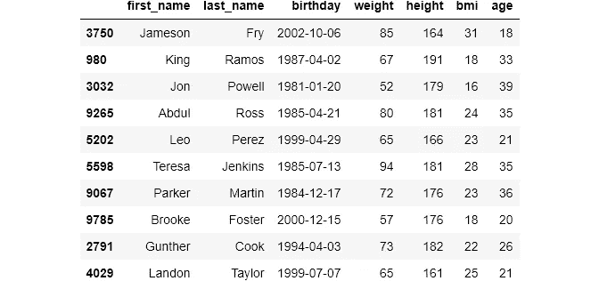
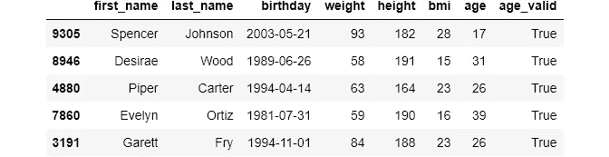
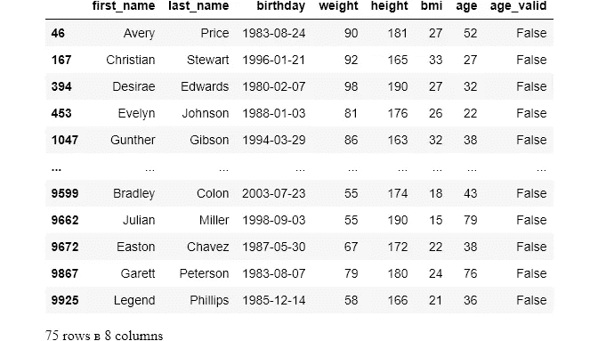
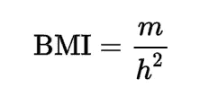

# 对脏数据的最后一击

> 原文：<https://towardsdatascience.com/cross-field-validation-using-pandas-f7a316fd37b7?source=collection_archive---------28----------------------->

## 用熊猫进行跨领域验证


**照片由** [**伊恩·贝克利**](https://www.pexels.com/@ian-beckley-1278367?utm_content=attributionCopyText&utm_medium=referral&utm_source=pexels) **上** [**像素**](https://www.pexels.com/photo/top-view-photography-of-roads-2440013/?utm_content=attributionCopyText&utm_medium=referral&utm_source=pexels)

## 介绍

如今，数据不再来自单一来源。通常情况下，它被收集在不同的位置，并合并在一起。合并数据时的一个常见挑战是数据完整性。简而言之，通过使用多个字段检查另一个字段的有效性来确保我们的数据是正确的。用更好的术语来说，这个过程叫做**交叉字段验证**。

对数据集的数据完整性进行健全性检查对于进行准确的分析和运行机器学习模型至关重要。交叉字段验证应该在您处理了大多数其他清理问题(如缺失值插补、确保字段约束到位等)之后进行。

我为这篇文章写了关于执行时间的代码片段。由于跨字段验证可能涉及对数百万个观察值跨多个列执行操作，因此执行速度非常重要。这里建议的解决方案应该具有足够的可伸缩性，甚至可以处理大规模数据集。

## 设置

我生成了假数据来进行跨领域验证:



## 交叉字段验证，示例 1

在设置部分，我们加载了一个假的`people`数据集。举例来说，我们将假设这些数据是从两个来源收集的:提供每个人的全名和生日的人口普查数据，这些数据后来与他们的医院记录合并在一起。

为了进行准确的分析，我们应该确保我们的数据是有效的。在这种情况下，我们可以检查两个字段的有效性:年龄和身体质量指数(身体质量指数)。

先说年龄。我们必须确保当我们从当前年份中减去他们的出生年份时，结果与`age`列相匹配。

当您执行跨字段验证时，速度应该是主要考虑的问题。与我们的小例子不同，您可能需要处理数百万次观察。对任何规模的数据集进行跨字段验证的最快方法之一是`pandas`的`apply`函数。

这里有一个简单的`apply`的例子:

上面是一个按列执行的例子。`apply`接受一个函数名作为参数，并在被调用的列的每个元素上调用该函数。该函数有一个额外的参数`axis`，默认设置为`0`或`rows`。如果我们将其设置为`1`或`columns`，该功能将转换为按行执行。

> 关于`axis`参数的说明:`axis='rows'`表示沿着垂直的行轴执行操作，因为行是垂直堆叠的。`axis='columns'`表示沿水平的列轴执行操作，因为列是水平堆叠的。这两个术语让很多人感到困惑，因为它们看起来像是在做与他们被告知的相反的事情。事实上，只需要改变视角，或者用你愿意的话来说。

让我们创建一个函数来验证一个人的年龄:

因为我们将使用`apply`进行逐行操作，所以它的输入将是数据集的每一行。这就是为什么我们可以像在正常情况下一样轻松地访问每一列的值。

使用我们之前导入的`datetime`包，我们将存储今天的日期。然后，我们通过相互减去年份来计算年龄。为此，您必须确保`birthday`列具有`datetime`数据类型。

在`return`语句中，我们比较了计算的年龄和给定的年龄，如果它们匹配，则返回`True`，否则返回`False`:



该功能按预期工作。现在，我们可以对无效年龄(如果有)的数据进行子集划分:

```
people[people['age_valid'] == False]
```



有 75 行的年龄无效。如果你算一下，年龄是不匹配的。为了纠正这些值，我们可以编写一个新的函数，但是这将涉及代码重复。我们可以更新`validate_age`来用有效值替换任何无效值:

我们可以使用`assert`语句来确保操作成功:

## 交叉字段验证，示例 2

接下来，我们将验证体重指数列。

> 体重指数是从一个人的体重和身高得出的数值。

快速的谷歌搜索给出了计算身体质量指数的公式:



**图片由** [**维基**](https://www.wikipedia.org/) 提供

使用第一个示例中的思想，我们将为身体质量指数创建用正确值替换无效身体质量指数的函数:

用`validate_`启动所有的验证函数是一个很好的实践。这向代码的读者发出了您正在执行验证的信号。

## 跨字段验证、速度比较

在本节中，我们将对不同的跨字段验证方法进行速度比较。我们将从验证`bmi`的`apply`函数开始:

10k 数据集大约需要 0.3 秒。接下来，我们将使用熊猫`iterrows()`的 for 循环:

花了 10 倍的时间！况且这个时间差不会是线性的。对于更大的数据集，这种差异变得越来越大。我不认为任何 for 循环能打败`apply`函数，但我们也试试一般比`iterrows()`更快的`itertuples`:

还是比`apply`慢很多。所以，跨字段验证的一般经验是总是使用`apply`函数。

# 如果你喜欢这篇文章，请分享并留下反馈。作为一名作家，你的支持对我来说意味着一切！

阅读更多与主题相关的文章:

[](/data-type-constraints-data-range-constraints-duplicate-data-with-pandas-44897a350b1e) [## 掌握 DS/ML 中最耗时的任务，#1

### 处理常见的数据问题

towardsdatascience.com](/data-type-constraints-data-range-constraints-duplicate-data-with-pandas-44897a350b1e) [](/master-the-most-hated-task-in-ds-ml-3b9779276d7c) [## 掌握 DS/ML 中最讨厌的任务

### 用 Pandas 清理分类数据

towardsdatascience.com](/master-the-most-hated-task-in-ds-ml-3b9779276d7c) [](/fuzzywuzzy-fuzzy-string-matching-in-python-beginners-guide-9adc0edf4b35) [## FuzzyWuzzy:Python 中的模糊字符串匹配，初学者指南

### …以及在真实数据集上的动手实践

towardsdatascience.com](/fuzzywuzzy-fuzzy-string-matching-in-python-beginners-guide-9adc0edf4b35) [](/data-uniformity-in-data-science-9bec114fbfae) [## 数据科学中的数据一致性

### 处理熊猫最常见的一致性问题

towardsdatascience.com](/data-uniformity-in-data-science-9bec114fbfae) [](/meet-the-hardest-functions-of-pandas-part-i-7d1f74597e92) [## 认识熊猫最难的功能，第一部分

### 掌握 pivot_table()、stack()、unstack()的时机和方式

towardsdatascience.com](/meet-the-hardest-functions-of-pandas-part-i-7d1f74597e92)