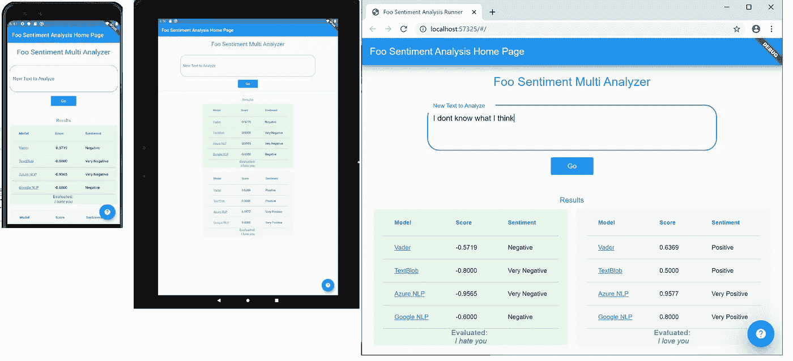
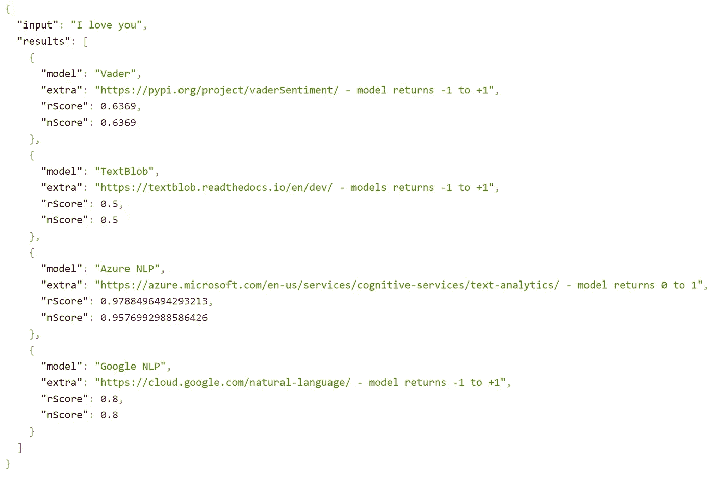
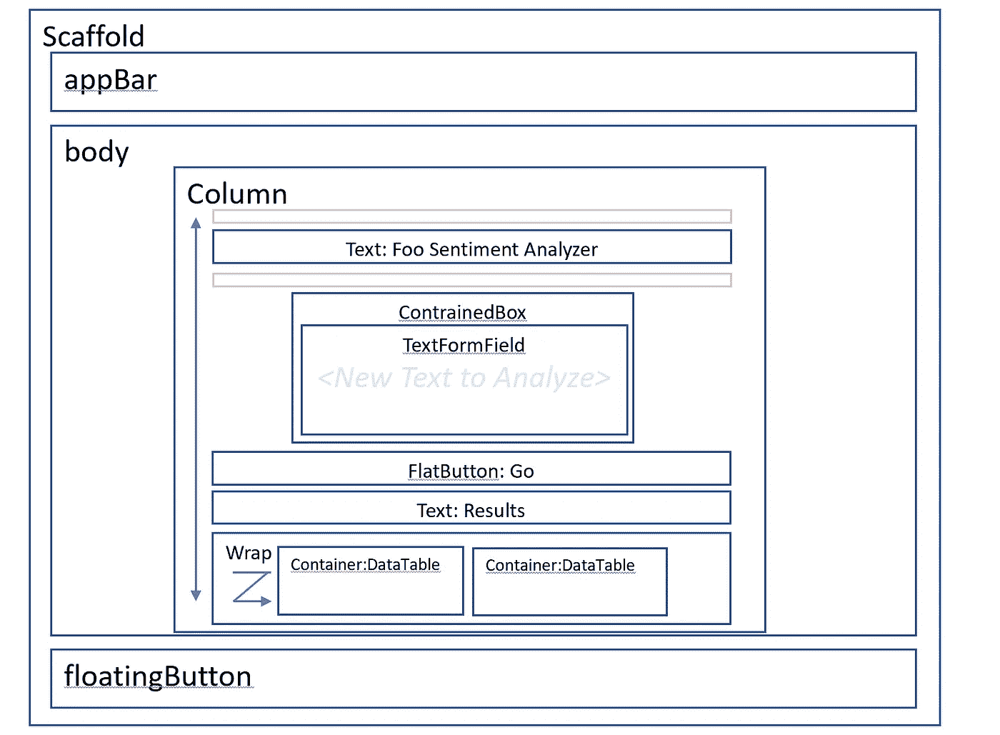
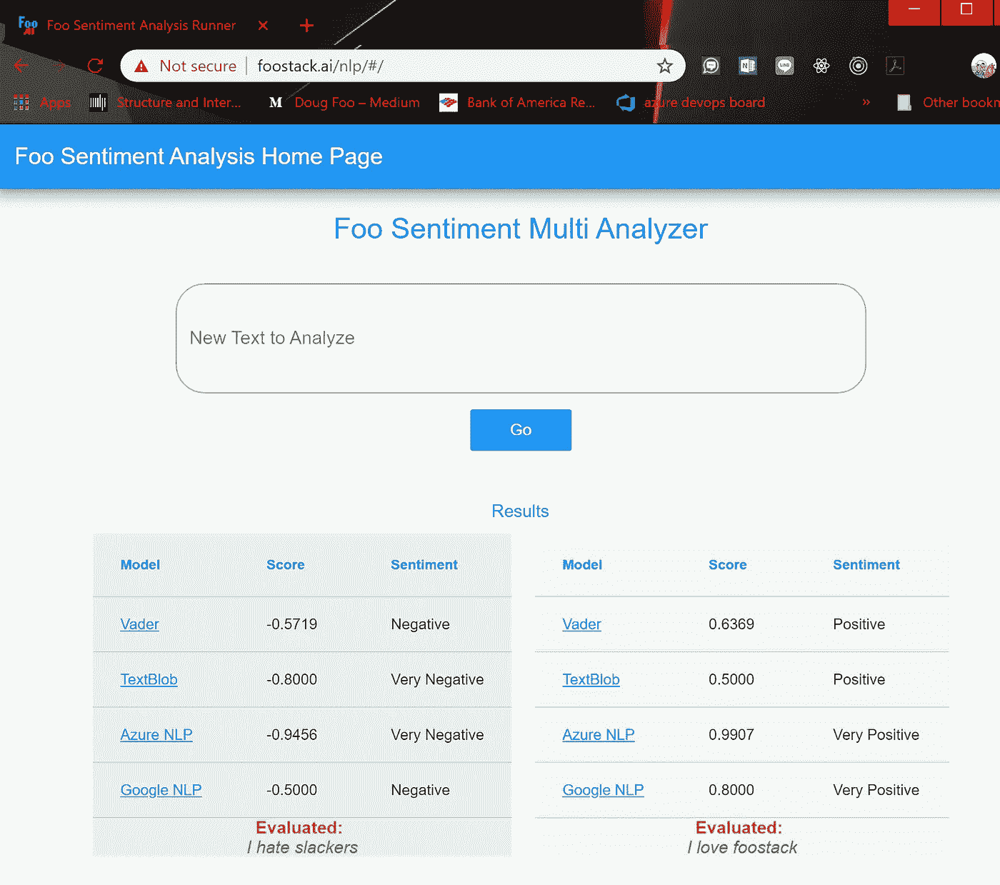

# 基于颤振的跨平台 NLP 图形用户界面

> 原文：<https://towardsdatascience.com/cross-platform-nlp-gui-on-flutter-75d59170864?source=collection_archive---------14----------------------->

## Flutter + Python REST 后端的情感分析 GUI



适用于 Android、平板电脑和网络(iOS 也是！)

# 目标:

根据我的[上一篇文章](https://medium.com/flutter-community/nlp-chat-on-flutter-azure-676aa4768fbb) [2]，我启动了一个项目来构建一个黑仔聊天应用程序，该应用程序利用 NLP 情绪分析器在实时聊天中执行实时聊天分析。本文是该项目的 R & D 阶段:

*   用于情感分析的后端 REST 服务
*   前端可视化工具来查看模型产生的结果

虽然我可以在 Python 笔记本中更容易地做到这一点，但我最终将在 Flutter 中构建聊天 GUI，所以这是一个很好的实践！

# **后端 Python 服务**

在对 NLP 情感分析器的变体进行了大量研究之后[4]，我挑选了几个简单的进行交叉比较:

*   维德
*   文本 Blob
*   Azure 文本分析(认知服务)
*   谷歌云自然语言 API

还有十几个其他的库，我计划建立我自己的“Foo NLP”(*为了体验*)，我将在另一个博客中详述。最终，我会添加圣杯 BERT [5],但这需要一些关于如何微调和操作 w/o 的策略，这让我在 Azure 上花费了$$$计算时间。

我的 REST API 有一个简单的接口:

*   输入:文本字符串
*   输出:情绪得分(-1 到+1，即从负到正的范围)

URL 获取格式为"[***【http://nlp.foostack.ai/nlp/sa/all?textinput=I 爱你】***](http://nlp.foostack.ai/nlp/sa/all?data=I%20love%20you)***"***您可以现场测试并查看其余 JSON 结果:



休息服务结果

Python 实现使用了 [Flask](http://flask.palletsprojects.com/en/1.1.x/) web 框架，并公开了一个 REST API，该 API 反过来调用一些 NLP 情感分析器库或 web 服务，并将结果聚合到 JSON 响应中。Azure 上简单而便宜的托管服务。

REST 服务的代码[1]

# 颤振跨平台图形用户界面

大多数人都知道 Flutter 是一个很棒的 Android+iOS 跨平台开发系统，但截至 2019 年年中，它还做 Web。网络支持工作得非常好，尽管有它的怪癖:

*   一些第三方控件可能无法工作。(例如，Url 启动器直到最近升级后才在 web 上运行)
*   复制-粘贴在 Web 中不起作用。文本等看起来像不可点击的图像或奇怪的东西(我需要进一步调查)
*   开发周期是一个有点笨重的单独构建和测试 web
*   添加自定义 web 控件或 HTML/JS 似乎很困难

最终，Flutter Web 对 FooStack 的客户来说绰绰有余。

# 我的应用程序的结构

Flutter 将所有内容嵌套在子部件中。比如，垂直堆叠条目的列部件，增加空间的填充部件，标签的文本部件，等等。使一个简单的乐高式可互换系统。只需找出要抓取的组件，并将其堆叠在另一个小部件的上方、下方或内部。

## 我的 Flutter 应用程序的抽象结构:

```
- <Widget build>
 - Scaffold               # shortcut with top,body,footer areas
   - appBar:
   - body:Center          # centers all subcomponents
     - Column             # aligns subcomponents down the col
       - Padding
       - Text             # title (Foo Sentiment Analyzer)
       - ContrainedBox    # width controlling container
        - TextFormField   # input box for text to analyze
       - FlatButton       # submit button
       - Text             # title (Results)
       - Wrap             # wrap n-results across and down 
        - Container
         - Column         # single column result table 
          - DataTable     # formatted results table
            - DataColumns # headers  
            - DataCells   # rows
   - floatingButton:      # bottom right help button
```

## 相同逻辑应用的可视化:



颤振代码/布局的直观表示

## 应用程序的实际飞镖/颤振代码

另一个有趣的代码是我们如何从 GUI 调用 REST 服务。在 Go 按钮上，我们有一个事件处理程序“onPressed ”,它被映射到 ***_submit*** 函数。

```
**FlatButton** (
  child: Text(**'**Go**'**),
  color: Colors.*blue*,
  textColor: Colors.*white*,
 **onPressed: _submit,** ),
```

我们将 submit()定义为一个向 REST 服务发出 HTTP 请求并返回 JSON 的方法。JSON 被重新映射到供 GUI 处理的映射列表。还有更多关于 GUI 如何自动更新的内容，我就不多说了(StatefulWidgets 等)。

```
**void _submit() async {
***// call REST service and extract JSON body* var host = 'http://flaskmli.azurewebsites.net/nlp/sa/alldata=';var response = await http.get(host+inputController.text);
  var resp = response.body; *// extract JSON "results" array to a Map (dictionary)
  // push it onto the new dataList array (list of Maps)*  Map<String, dynamic> nlps = jsonDecode(resp);
  List<dynamic> results = nlps['results'];
  List<Map<String, dynamic>> dataList = [];
  results.forEach((result) {
    dataList.add(result);
  }); *// bit of hack here, add input text to _rawContentList*  _rawContentList.insert(0,[dataList, inputController.text])inputController.text = ''; *// reset focus (clears keyboard on mobile devices)*  FocusScope.*of*(context).requestFocus(FocusNode());
  setState(() {});   *// make GUI refresh from _rawContentList*
}
```

**都搞定了！** *我越来越擅长旋舞了，这个只用了几天就造好了。*

我可以通过 Android Studio 和谷歌 Play 商店开发并发布我的 Android、平板电脑和 iPhone 应用程序。要发布我的 Flutter Web 应用程序，我只需运行“flutter build web”并手动将 web/build 构件部署到我的 Web 服务器上(实际上是将它们复制到一个现有的站点上，在我的例子中是复制到[http://foostack.ai/nlp](http://foostack.ai/nlp)——请随意测试)。



现场 Foostack NLP 试用[http://foostack.ai/nlp](http://foostack.ai/nlp)

感谢阅读。

## **参考与启示**

[1]之前我的 Flutter NLP 聊天项目的文章—[https://medium . com/Flutter-community/NLP-Chat-on-Flutter-azure-676 a 4768 fbb](https://medium.com/flutter-community/nlp-chat-on-flutter-azure-676aa4768fbb)

[2]学习颤振的前期文章—[https://code burst . io/why-I-a-Sr-manager-learned-Flutter-8d a9 a 05 b 2326？来源= - 5 -](https://codeburst.io/why-i-a-sr-manager-learned-flutter-8da9a05b2326?source=---------5------------------)

[3]启发我的好文章—[https://towards data science . com/a-practices-guide-to-natural-language-processing-part-I-processing-understanding-text-9 F4 abfd 13 e 72](/a-practitioners-guide-to-natural-language-processing-part-i-processing-understanding-text-9f4abfd13e72)

[4]关于 BERT 和一些其他 NLP 模型的一些信息—[https://medium . com/swlh/BERT—双向—编码器—表示—来自—变压器—C1 ba 3 ef 5 e 2 f 4](https://medium.com/swlh/bert-bidirectional-encoder-representations-from-transformers-c1ba3ef5e2f4)