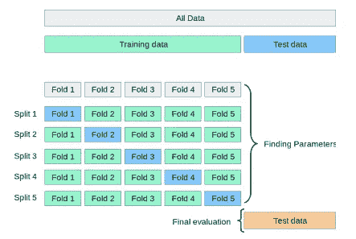
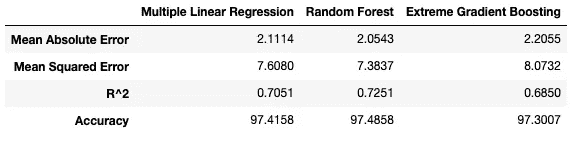
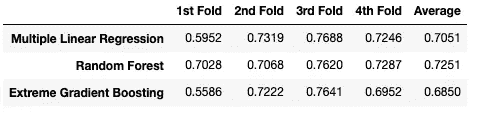
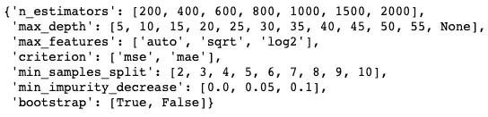
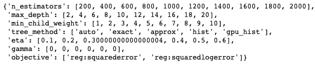
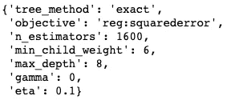
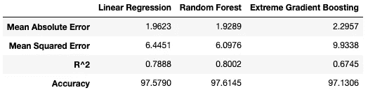

# 交叉验证和超参数调整:如何优化你的机器学习模型

> 原文：<https://towardsdatascience.com/cross-validation-and-hyperparameter-tuning-how-to-optimise-your-machine-learning-model-13f005af9d7d?source=collection_archive---------0----------------------->

Alexis Baydoun 在 [Unsplash](https://unsplash.com?utm_source=medium&utm_medium=referral) 上拍摄的照片

## 非常准确地预测 Fitbit 的睡眠分数

在本文的前两部分，我获取并预处理了 Fitbit 睡眠数据，将数据分为训练集、验证集和测试集，训练了三个不同的机器学习模型，并比较了它们的性能。

在[第 2 部分](https://medium.com/@bennerjonas10/using-machine-learning-to-predict-fitbit-sleep-scores-496a7d9ec48)中，我们看到使用随机森林和极端梯度增强的默认超参数并评估验证集上的模型性能导致多元线性回归表现最佳，随机森林和梯度增强回归器表现稍差。

在文章的这一部分，我将讨论只使用一个验证集的缺点，我们如何解决这些缺点，以及我们如何调整模型超参数来提高性能。让我们开始吧。

# 交叉验证

## 简单训练、验证和测试分割的缺点

在本文的第 2 部分中，我们将数据分为训练集、验证集和测试集，在训练集上训练我们的模型，并在验证集上评估它们。我们还没有接触测试集，因为它旨在作为一个保留集，代表以前从未见过的数据，一旦我们觉得机器学习模型准备好进行最终测试，这些数据将用于评估机器学习模型的泛化能力。

因为我们只将数据分为一组训练数据和一组验证数据，所以我们的模型的性能指标高度依赖于这两组数据。它们只被训练和评估一次，因此性能取决于那一次评估，并且当对相同数据的不同子集进行训练和评估时，性能可能会非常不同，这仅仅是因为如何挑选子集的性质。

如果我们可以多次进行训练和验证测试，每次针对不同的数据子集，每次都训练和评估我们的模型，并在多次评估中查看模型的平均性能，会怎么样？这正是 K 倍交叉验证背后的想法。

## k 倍交叉验证

在 K-fold 交叉验证(CV)中，我们仍然从数据集中的剩余数据中分离出一个测试/保留集，用于我们模型的最终评估。剩余的数据，即除测试集之外的所有数据，被分成 **K** 个折叠(子集)。交叉验证然后遍历折叠，并且在每次迭代中使用 K 个折叠中的一个作为验证集，同时使用所有剩余的折叠作为训练集。重复这个过程，直到每个折叠都被用作验证集。以下是五重交叉验证的流程:

通过在相同训练数据的不同子集上对模型进行 K 次训练和测试，我们可以更准确地表示我们的模型在以前从未见过的数据上的表现。在 K-fold CV 中，我们在每次迭代后对模型进行评分，并计算所有评分的平均值，以获得与仅使用一个训练和验证集相比模型表现如何的更好表示。

## Python 中的 k 重交叉验证

因为 Fitbit sleep 数据集比较小，所以我准备使用 4 重交叉验证，比较目前使用的三种模型:多元线性回归、随机森林和极端梯度提升回归器。

请注意，4 重 CV 也可以很好地与第 2 部分中的训练和验证数据进行比较，因为我们将数据分为 75%的训练数据和 25%的验证数据。一个四重 CV 本质上做同样的事情，仅仅四次，并且每次使用不同的子集。我创建了一个函数，它将我们想要比较的模型列表、特征数据、目标变量数据和我们想要创建的折叠数作为输入。该函数计算我们之前使用的性能测量，并返回一个表，其中包含所有模型的平均值以及每种类型的测量在每个折叠中的分数，以备我们进一步研究。下面是函数:

现在，我们可以创建一个要使用的模型列表，并使用 4 重交叉验证调用上面的函数:

生成的比较表如下所示:

使用一个 4 重 CV，随机森林回归器在所有性能指标上都优于其他两个模型。但是在第 2 部分中，我们看到多元线性回归有最好的性能指标，为什么会改变呢？

为了理解为什么交叉验证会产生与第 2 部分中的简单训练和验证不同的分数，我们需要更仔细地看看模型在每个折叠中的表现。上面的 cv_comparison()函数也为每个折叠返回每个不同模型的所有分数列表。让我们来看看三个模型的 R 平方在每次折叠时的比较。为了得到表格格式的结果，让我们快速地将它转换成数据帧:

上表清楚地表明了为什么从四重 CV 获得的分数不同于训练和验证集的分数。R 平方因褶皱而异，特别是对于极端梯度增强和多元线性回归。这也说明了为什么使用交叉验证如此重要，尤其是对于小数据集。如果你只依赖一个简单的训练和验证集，你的结果可能会有很大的不同，这取决于你最终得到的数据的分割。

既然我们知道了什么是交叉验证以及它为什么重要，那么让我们看看是否可以通过调整超参数从我们的模型中获得更多。

# 超参数调谐

不同于在模型训练期间学习并且不能任意设置的模型参数，超参数是可以由用户在训练机器学习模型之前设置的参数。随机森林中超参数的示例包括森林中决策树的数量、每次分割时要考虑的最大要素数量或树的最大深度。

正如我之前提到的，寻找最佳超参数没有一个放之四海而皆准的解决方案。对于一个机器学习问题表现良好的一组超参数可能在另一个问题上表现不佳。那么我们如何计算出最优超参数是什么呢？

一种可能的方法是使用有根据的猜测作为起点来手动调整超参数，改变一些超参数，训练模型，评估其性能，并重复这些步骤，直到我们对性能满意为止。这听起来像是一个不必要的乏味的方法，事实也的确如此。

比较超参数调音和吉他调音。你可以选择用耳朵给吉他调音，这需要大量的练习和耐心，而且可能永远不会达到最佳效果，尤其是如果你是初学者的话。幸运的是，有电吉他调音器可以通过解释吉他弦的声波并显示其读数来帮助你找到正确的音调。你仍然需要使用机器头来调弦，但这个过程会快得多，电动调音器可以确保你的调弦接近最佳。那么电吉他调音师的机器学习等同于什么呢？

## 随机网格搜索交叉验证

在 scikit-learn 中，一种最流行的调整机器学习超参数的方法被称为 RandomizedSearchCV()。我们来剖析一下这是什么意思。

在随机网格搜索交叉验证中，我们首先创建一个超参数网格，我们希望优化这些超参数的值。让我们看一个随机森林回归器的超参数网格示例，以及如何设置它:

首先，我们为每个想要调优的超参数创建一个可能值的列表，然后我们使用一个包含键值对的字典来设置网格，如上所示。为了找到和理解机器学习模型的超参数，你可以查看模型的官方文档，参见随机森林回归器的文档[这里](https://scikit-learn.org/stable/modules/generated/sklearn.ensemble.RandomForestRegressor.html)。

生成的网格如下所示:

顾名思义，随机网格搜索交叉验证使用交叉验证来评估模型性能。随机搜索意味着该算法从网格中为每个超参数随机选择一个值，并使用超参数的随机组合来评估模型，而不是尝试所有可能的超参数组合(在我们的示例中为 27，216 个组合)。

尝试所有可能的组合在计算上会非常昂贵，并且需要很长时间。随机选择超参数可以显著加快这一过程，并且通常为尝试所有可能的组合提供了一个类似的好解决方案。让我们看看如何使用随机网格搜索交叉验证。

## 随机森林的超参数调整

使用之前创建的网格，我们可以为我们的随机森林回归量找到最佳超参数。我将使用三重 CV，因为数据集相对较小，并且运行 200 个随机组合。因此，总的来说，随机网格搜索 CV 将训练和评估 600 个模型(200 个组合的 3 倍)。因为与极端梯度提升等其他机器学习模型相比，随机森林往往计算缓慢，所以运行这么多模型需要几分钟时间。一旦该过程完成，我们就可以获得最佳的超参数。

下面是如何使用 RandomizedSearchCV():

我们将在最终模型中使用这些超参数，并在测试集上进行测试。

## 超参数调谐，实现极端梯度提升

对于我们的极端梯度推进回归器，过程基本上与随机森林相同。由于模型的性质，我们试图优化的一些超参数是相同的，一些是不同的。你可以在这里找到 XGBRegressor [的超参数的完整列表和解释。我们再次创建网格:](https://xgboost.readthedocs.io/en/latest/parameter.html)

生成的网格如下所示:

为了使性能评估具有可比性，我还将使用具有 200 种组合的 3 重 CV 进行极端梯度提升:

最佳超参数如下:

同样，这些将在最终模型中使用。

虽然对一些人来说这可能是显而易见的，但我只想在这里提一下:我们不为多元线性回归进行超参数优化的原因是因为模型中没有要调整的超参数，它只是一个多元线性回归。

既然我们已经获得了最佳超参数(至少在我们的交叉验证方面),我们终于可以根据我们从分析一开始就坚持的测试数据来评估我们的模型了！

# 最终模型评估

在评估了我们的机器学习模型的性能并找到最佳超参数之后，是时候对模型进行最终测试了——全能坚持集。

为了做到这一点，我们在迄今为止所有评估中使用的全部 80%的数据上训练模型，即除测试集之外的所有数据。我们使用在上一部分中找到的超参数，然后比较我们的模型在测试集上的表现。

让我们创建并训练我们的模型:

我定义了一个函数，该函数对所有最终模型进行评分，并创建一个数据框架来简化比较:

用我们的三个最终模型调用该函数，并调整列标题，得到以下最终评估结果:

获胜者是:随机森林回归者！

随机森林在测试集上实现了 80%的 R 平方和 97.6%的准确性，这意味着它的预测平均只相差约 2.4%。还不错！

多元线性回归的表现并不落后，但极端梯度推进未能达到其在该分析中的宣传效果。

# 结论意见

想出这整个分析和实际进行分析的过程充满了乐趣。一段时间以来，我一直试图弄清楚 Fitbit 是如何计算睡眠分数的，很高兴对它有了更好的理解。最重要的是，我设法建立了一个机器学习模型，可以非常准确地预测睡眠分数。话虽如此，我还是想强调几点:

1.  正如我在[第 2 部分](https://medium.com/@bennerjonas10/using-machine-learning-to-predict-fitbit-sleep-scores-496a7d9ec48)中提到的，多元线性回归系数的解释可能不准确，因为要素之间存在高度的多重共线性。
2.  我用于此分析的数据集相当小，因为它依赖于从 Fitbit 获得的 286 个数据点。这限制了结果的通用性，需要更大的数据集才能训练更稳健的模型。
3.  这种分析只使用了一个人的 Fitbit 睡眠数据，因此可能无法很好地推广到具有不同睡眠模式、心率等的其他人。

我希望你喜欢这篇关于如何使用机器学习来预测 Fitbit 睡眠分数的透彻分析，并了解不同睡眠阶段的重要性以及睡眠时间。

我非常感谢建设性的反馈，您可以随时通过 [LinkedIn](https://www.linkedin.com/in/jonas-benner-257093120/) 联系我。

感谢阅读！