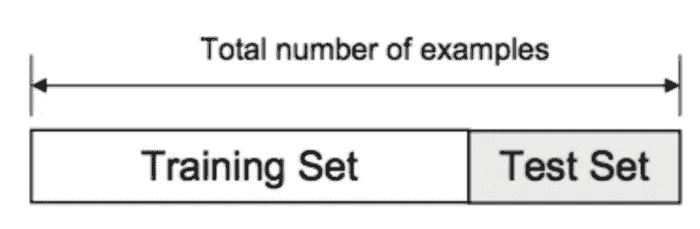
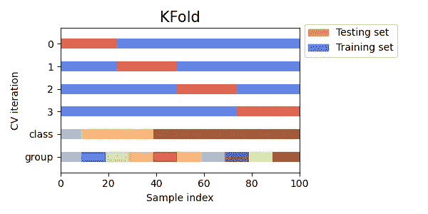
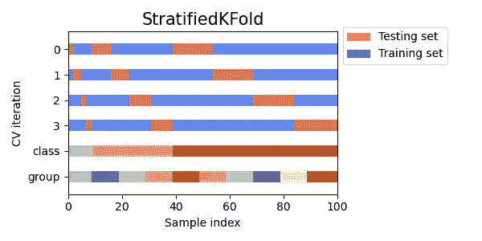
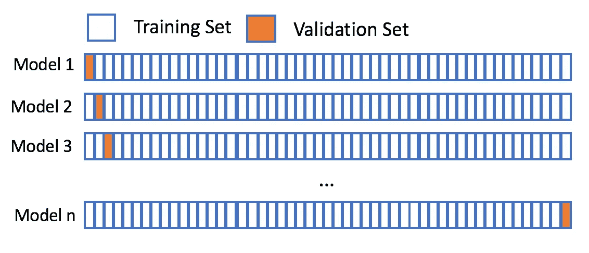
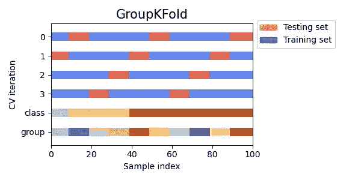

# 交叉验证

> 原文：<https://towardsdatascience.com/cross-validation-c4fae714f1c5?source=collection_archive---------23----------------------->

## 验证您的机器学习模型性能


来源:[维基百科](https://en.wikipedia.org/wiki/Cross-validation_(statistics))

交叉验证可以是各种模型验证技术中的任何一种，这些模型验证技术用于评估预测模型将多好地推广到该模型以前没有见过的独立数据集。因此，它通常用于我们预测某些事情，并且我们希望粗略估计我们的预测模型在实践中的表现。

> “在创建任何机器学习模型之前，我们必须知道什么是交叉验证，以及如何选择最佳的交叉验证”——Abhishek tha kur，Kaggle 的第一位 4x 特级大师

在这篇文章结束时，你将对流行的交叉验证技术有一个很好的理解，我们如何使用 scikit-learn 实现它们，以及如何选择给定特定问题的正确 CV。

## 流行的交叉验证技术

本质上，选择正确的交叉验证技术归结于我们手头的数据，因此为什么一个交叉验证的选择可能对另一组数据起作用，也可能不起作用。然而，采用交叉验证技术的目标保持不变，我们希望估计预测模型对未知数据的预期拟合水平，因为有了这些信息，我们可以做出必要的调整来制作预测模型(如果需要)或决定使用完全不同的模型。

## 基于保留的交叉验证

我可能会受到一些经验数据科学家、机器学习和/或深度学习从业者对不恰当术语的滥用，因为交叉验证通常允许预测模型在各种拆分上进行训练和测试，而保留集则不允许。不管怎样，当我们把数据分成一个训练集和一个测试集时，就需要进行基于坚持的交叉验证。这通常是您要实现的第一个验证技术，也是最容易理解的。它包括把你的数据分成不同的部分，你可以在一个数据集上训练你的预测模型，并在测试集上测试它。

> **注意**:有些人更进一步，会有一个训练数据集、一个验证数据集和测试数据集。验证数据集将用于调整预测模型，测试集将用于测试模型的泛化能力。

在划分数据时，要记住的一点是，您必须确定哪些数据用于训练，哪些用于测试。我见过从 60%(训练)-40%(测试)到 80%(训练)-20%(测试)的各种分裂。我相信可以有把握地说，60%-80%的数据应该用于训练预测模型，其余的可能直接用于测试集(或者再次分成验证集和测试集)。



图 1:基于拒绝的验证的例子(来源: [Adi Bronshtein](https://medium.com/u/c82c464daf80?source=post_page-----c4fae714f1c5--------------------------------) ，[Python 中的训练/测试分割和交叉验证](/train-test-split-and-cross-validation-in-python-80b61beca4b6))

```
# [https://bit.ly/3fUuyOy](https://bit.ly/3fUuyOy)**import** **numpy** **as** **np**
**from** **sklearn.model_selection** **import** train_test_split
X, y = np.arange(10).reshape((5, 2)), range(5)
**print**(X)
array([[0, 1],
       [2, 3],
       [4, 5],
       [6, 7],
       [8, 9]])**print(**list(y))
[0, 1, 2, 3, 4]
```

当我们有一个非常大的数据集时，执行基于拒绝的验证技术是最有效的。由于不需要在各种分割上进行测试，这种技术使用的计算能力要少得多，因此使其成为在大型数据集上进行验证的首选策略。

## k 倍交叉验证

我简单地提到了由上述“c *组成的交叉验证，ross 验证通常允许预测模型在各种拆分上进行训练和测试，而保留集则不允许—* 换句话说，交叉验证是一个重采样的过程。当“k”出现在机器学习讨论中时，它通常用于表示常数值，例如 k-means 聚类中的 k 是指聚类的数量，k 近邻中的 k 是指执行多元投票(用于分类)时要考虑的近邻数量。这种模式也适用于 K-Fold 交叉验证，其中 K 表示给定数据样本应该分成的组的数量。

在 *k* 倍交叉验证中，原始样本被随机分成 *k* 个大小相等的组。从 k 个组中，一个组将作为保留组被移除，并且剩余的组将是训练数据。然后，将预测模型拟合到训练数据上，并在保留集上进行评估。这个过程是 k 次，因此所有的组正好服务一次作为坚持组。



图 KFold 交叉验证的例子(来源: [Scikit-Learn 文档](https://scikit-learn.org/stable/modules/cross_validation.html))

```
**#** [https://bit.ly/2POmqVb](https://bit.ly/2POmqVb)**import** **numpy** **as** **np**
**from** **sklearn.model_selection** **import** KFoldX = np.array([[1, 2], [3, 4], [1, 2], [3, 4]])
y = np.array([1, 2, 3, 4])
kf = KFold(n_splits=2)
**print(**kf.get_n_splits(X))
2**print**(kf)
KFold(n_splits=2, random_state=None, shuffle=False)**>>> for** train_index, test_index **in** kf.split(X):
**... **    **print**("TRAIN:", train_index, "TEST:", test_index)
**... **    X_train, X_test = X[train_index], X[test_index]
**... **    y_train, y_test = y[train_index], y[test_index]
TRAIN: [2 3] TEST: [0 1]
TRAIN: [0 1] TEST: [2 3]
```

由于易于理解，k-fold 交叉验证相当流行。并且与执行基于拒绝的验证相比，它通常会产生偏差较小的结果。这种技术通常是回归问题的一个很好的起点，尽管如果目标变量的分布不一致，使用分层 k-fold 可能更好，这将需要目标变量的宁滨。需要考虑的是 k 的配置，它必须分割数据，以便数据样本的每个训练/测试分割足够大，能够在统计上代表更广泛的数据集。

## 分层 K 折叠

到目前为止，我们介绍的两种技术在许多情况下都是相对有效的，尽管当目标数据具有不平衡的标签时，可能会出现误导性的结果(以及潜在的整体失败)——我一直很小心，不只是将这作为分类任务的一个问题，因为我们可以以某种方式调整回归任务，以便能够执行分层 k-fold 进行验证。相反，一个更好的解决方案是以这样一种方式随机划分，即我们在每个子集中保持相同的类别分布，这就是我们所说的分层。

> **注**:除了我们随机分割数据的方式，分层 k 重交叉验证与简单 k 重交叉验证是一样的。



图 StratifiedKFold 的例子(来源: [Scikit-Learn 文档](https://scikit-learn.org/stable/modules/generated/sklearn.model_selection.StratifiedKFold.html#sklearn.model_selection.StratifiedKFold)

```
**#** [https://bit.ly/3iCHavo](https://bit.ly/3iCHavo)**import** **numpy** **as** **np**
**from** **sklearn.model_selection** **import** StratifiedKFoldX = np.array([[1, 2], [3, 4], [1, 2], [3, 4]])
y = np.array([0, 0, 1, 1])
skf = StratifiedKFold(n_splits=2)
**print**(skf.get_n_splits(X, y)
2**print**(skf)
StratifiedKFold(n_splits=2, random_state=None, shuffle=False)**for** train_index, test_index **in** skf.split(X, y):
   **print**("TRAIN:", train_index, "TEST:", test_index)
    X_train, X_test = X[train_index], X[test_index]
    y_train, y_test = y[train_index], y[test_index]TRAIN: [1 3] TEST: [0 2]
TRAIN: [0 2] TEST: [1 3]
```

根据第一个 4X Kaggle 特级大师 Abhishek Thakur 的说法，可以肯定地说，如果我们有一个标准的分类任务，那么盲目地应用分层 k-fold 交叉验证根本不是一个坏主意。

## 留一交叉验证

留一交叉验证可以被认为是 k 重交叉验证的特例，其中 *k* = *n* ，n 是原始数据集中的样本数。换句话说，数据将在 *n* - 1 个样本上训练，并将用于预测被遗漏的样本，这将被重复 *n* 次，使得每个样本充当被遗漏的样本。



图 4:留一简历示例(来源: [DataCamp](https://www.google.com/url?sa=i&url=https%3A%2F%2Fcampus.datacamp.com%2Fcourses%2Fmodel-validation-in-python%2Fcross-validation%3Fex%3D10&psig=AOvVaw2sJGVDwGJwUQAawqZAHnW3&ust=1597337281376000&source=images&cd=vfe&ved=0CA0QjhxqFwoTCMjevKKPlusCFQAAAAAdAAAAABAD)

```
#[https://bit.ly/2POw0HU](https://bit.ly/2POw0HU)**import** **numpy** **as** **np**
**from** **sklearn.model_selection** **import** LeaveOneOutX = np.array([[1, 2], [3, 4]])
y = np.array([1, 2])
loo = LeaveOneOut()
**print**(loo.get_n_splits(X))
2**print**(loo)
LeaveOneOut()**for** train_index, test_index **in** loo.split(X):
    **print**("TRAIN:", train_index, "TEST:", test_index)
   X_train, X_test = X[train_index], X[test_index]
    y_train, y_test = y[train_index], y[test_index]
    **print**(X_train, X_test, y_train, y_test)TRAIN: [1] TEST: [0]
[[3 4]] [[1 2]] [2] [1]
TRAIN: [0] TEST: [1]
[[1 2]] [[3 4]] [1] [2]
```

这种技术可能需要大量的计算时间，在这种情况下，k 倍交叉验证可能是更好的解决方案。或者，如果数据集很小，那么预测模型将丢失大量数据(特别是如果交叉验证很大)，因此在这种情况下，留一法是一个很好的解决方案。

## 组 K-折叠交叉验证

GroupKFold 交叉验证是 k-fold 交叉验证的另一种变体，它确保同一组不出现在训练和测试集中。例如，如果我们想要建立一个预测模型，从患者皮肤的图像中对恶性或良性进行分类，很可能我们会有来自同一个患者的图像。由于我们没有在训练和测试集中分割单个患者，因此我们恢复到 GroupKfold 而不是 k-fold(或分层 k-fold)，因此，患者将被视为组。



图 5:分组文件夹的例子(来源: [Scikit-Learn 文档](https://scikit-learn.org/stable/modules/cross_validation.html)

```
**#** [https://scikit-learn.org/stable/modules/cross_validation.html](https://scikit-learn.org/stable/modules/cross_validation.html)**from** **sklearn.model_selection** **import** GroupKFold

X = [0.1, 0.2, 2.2, 2.4, 2.3, 4.55, 5.8, 8.8, 9, 10]
y = ["a", "b", "b", "b", "c", "c", "c", "d", "d", "d"]
groups = [1, 1, 1, 2, 2, 2, 3, 3, 3, 3]

gkf = GroupKFold(n_splits=3)
**for** train, test **in** gkf.split(X, y, groups=groups):
   print("*%s* *%s*" % (train, test))[0 1 2 3 4 5] [6 7 8 9]
[0 1 2 6 7 8 9] [3 4 5]
[3 4 5 6 7 8 9] [0 1 2]
```

> **注意**:这种技术的另一个变体是分层 K 折叠交叉验证，当我们想要保持类别分布并且我们不想同一个组出现在两个不同的折叠中时，执行这种验证。scikit-learn 没有内置的解决方案，但是在这个 [Kaggle 笔记本](https://www.kaggle.com/jakubwasikowski/stratified-group-k-fold-cross-validation)中有一个很好的实现。

## 包裹

交叉验证是建立机器学习模型的第一步，在决定采用什么技术时，我们考虑我们拥有的数据是极其重要的——在某些情况下，甚至有必要根据数据采用新形式的交叉验证。

> “如果你有一个好的交叉验证方案，其中验证数据代表训练和真实世界的数据，你将能够建立一个良好的高度可概括的机器学习模型。”——Abhishek tha kur

这个故事的灵感来自于第一位 4x Kaggle 特级大师 Abhishek Thakur 的《接近(几乎)任何机器学习问题 》(链接是**而不是**附属链接，并且**我没有被要求推广这本书**)。如果你已经有了一些机器学习的经验，并且想要更多实用的建议，那么我强烈推荐这本书。

如果你想和我联系，我在 LinkedIn 上最容易找到:

[](https://www.linkedin.com/in/kurtispykes/) [## Kurtis Pykes -人工智能作家-走向数据科学| LinkedIn

### 在世界上最大的职业社区 LinkedIn 上查看 Kurtis Pykes 的个人资料。Kurtis 有一个工作列在他们的…

www.linkedin.com](https://www.linkedin.com/in/kurtispykes/)