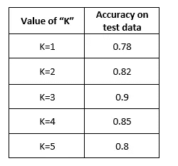
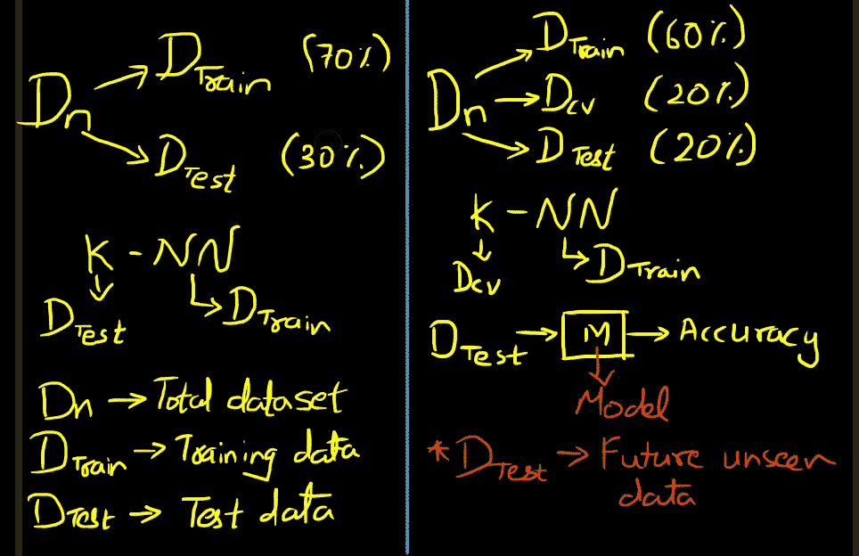
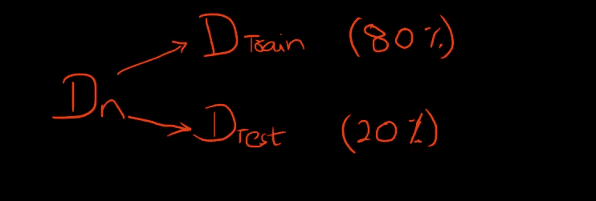
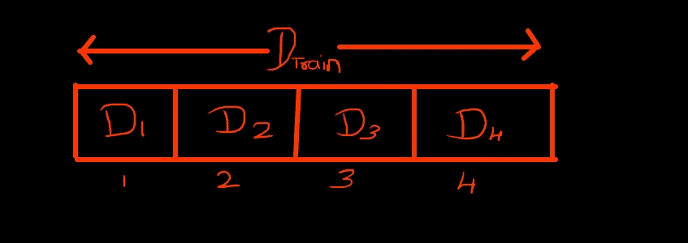
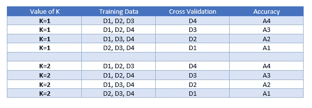

# 使用 KNN 进行交叉验证

> 原文：<https://towardsdatascience.com/cross-validation-using-knn-6babb6e619c8?source=collection_archive---------1----------------------->

这是 KNN 系列的第三篇文章。如果你还没有阅读前两部分，我建议你先浏览一遍。[第一部分](https://levelup.gitconnected.com/knn-k-nearest-neighbours-d3ce76380e14)，[第二部分](https://levelup.gitconnected.com/knn-failure-cases-limitations-and-strategy-to-pick-right-k-45de1b986428)

在本文中，我们将了解什么是交叉验证，为什么需要它，以及什么是 k 倍交叉验证？

为了更好地理解交叉验证的必要性，让我先回顾一下如何确定“K”的正确值？

假设，我们有一个数据集，我们将它按照 70:30 的比例分成训练数据和测试数据。也就是说，我保留总数据的 70%来训练我的模型，剩下的 30%来测试它。接下来，我用不同的“K”值训练我的模型，并在我的测试数据上捕捉它的准确性。假设我们得到如下表格:

作者图片

现在，如果你观察，那么在 K=3 时，我得到 90%的最高精度，之后，我们看到精度下降的趋势。所以，我们得出结论的基础是，我的 K=3 的合适值。

这一切听起来不错，但有一个小问题。让我问你一个非常简单而有趣的问题。

> 机器学习的目的是什么？

> 如果我考虑上面的例子，并且基于我的理解，对于一个未来看不见的数据点，我的模型将如何准确地预测类别标签。当一个算法在一个看不见的数据点上表现良好时，它被称为**推广**。机器学习的整体目标是推广。

想想 KNN，我们使用测试数据来确定 K 的正确值，使用训练数据来寻找最近的邻居。我们在测试数据上获得了 90%的准确性，我们还使用这些数据来确定“K”的正确值。我是否可以说，既然我的测试数据达到了 90%的准确率，我就能在未来看不到的数据上保持这种大致的准确率？答案是**否**。

为了自信地说，我们可以在未来看不见的数据上达到大约 90%的准确性，我需要首先在看不见的数据上测试这个模型。

但是我该怎么做呢？我有我的数据集，我已经把它分成了 70:30 比例的训练和测试数据。我没有更多可用的数据。

为了解决这个问题，我给你介绍一下**交叉验证**的概念。

在交叉验证中，我们不是将数据分成两部分，而是分成三部分。训练数据、交叉验证数据和测试数据。在这里，我们使用训练数据来寻找最近的邻居，我们使用交叉验证数据来寻找“K”的最佳值，最后我们在完全看不见的测试数据上测试我们的模型。这个测试数据相当于未来看不见的数据点。

为了更好地理解，请考虑下图，该图清楚地区分了拆分:

作者图片

左边的部分没有交叉验证，右边的部分有交叉验证。

在交叉验证部分，我们使用 D_Train 和 D_CV 来找到 KNN，但我们不接触 D_Test。一旦我们找到一个合适的“K”值，我们就在 D_Test 上使用这个 K 值，它也作为一个未来看不见的数据，来发现模型执行的准确程度。

现在，我们已经理解了交叉验证的概念和它的必要性，让我们解决一个与之相关的问题。

## 问题:

如果你参考上面的图片，我们已经按照 60:20:20 的比例分割了数据，其中我们使用 60%的数据来训练我们的模型，20%用于交叉验证，其余 20%用于测试。在这个交叉验证的过程中，我们丢失了将近 20%的数据，这些数据本来是用于训练的，众所周知，训练数据越多，算法就越好。那么，有没有办法在训练数据下使用那 20%的交叉验证数据呢？

> 这个问题的答案是 k 倍交叉验证

那么，在 k 倍交叉验证中会发生什么呢？考虑下面的例子:

作者图片

在将总数据集(D_n)分割成训练(D_Train)和测试(D_Test)数据集后，以 80:20 的比例，我们进一步**随机**将训练数据分割成 4 等份。

作者图片

D1、D2、D3 和 D4 是 D_Train 的四个随机拆分的相等部分。完成分割后，我们按如下方式进行:

作者图片

第一步:对于 K=1，我选择 D1、D2 和 D3 作为我的训练数据集，并将 D4 设置为我的交叉验证数据，并找到最近的邻居并计算其准确性。

第二步:同样，对于 K=1，我选择 D1、D2 和 D4 作为我的训练数据集，并设置 D3 作为我的交叉验证数据，我找到最近的邻居并计算其准确性。

我用 D2 和 D1 作为我的交叉验证数据集重复上述步骤，并计算相应的准确度。完成后，对于 K=1 的相同值，我得到了 4 个精度。因此，我考虑这些精度的平均值，并将其作为 K=1 时的最终值。

现在，我对 K=2 重复上述步骤，找到 K=2 的平均精度。依此类推，我计算不同 k 值的精度。

现在，请注意，对于 K 的每个值，我必须计算 4 次精度。这是因为我随机地将我的训练数据集分成 4 个相等的部分。假设我将我的数据集随机分成 5 个相等的部分，那么我将不得不为每个 K 值计算 5 个不同的精确度，并取它们的平均值。

> 请注意:大写“K”代表 **KNN** 中的 K 值，小写“K”代表 **k 倍交叉验证**中的 K 值

因此，对于上述示例，k-fold 交叉验证中的 k 值是 4(即 k=4)，如果我们将训练数据分成 5 个相等的部分，则 k 值=5。

k =我们随机将训练数据集分成的部分的数量。

现在，我们使用全部 80%的数据来计算最近邻以及 KNN 的 K 值。

K 重交叉验证的一个缺点是，我们要对(KNN 的)每个 K 值重复计算。所以基本上增加了时间复杂度。

## 结论

我们已经理解了交叉验证的概念，为什么我们需要它，以及 k 倍交叉验证是什么意思。尽管时间复杂度很高，但这个过程是值得的，因为它增加了模型的泛化能力。

# 感谢阅读！

我希望这些资源和想法对您的数据科学之旅有所帮助。

# 迪帕克·贾恩

*   *如果你喜欢这个，* [*跟着我*](https://deepak-jain.medium.com/) *上媒求更*
*   *我们来连线上* [*LinkedIn*](https://www.linkedin.com/in/deepakjain20/)