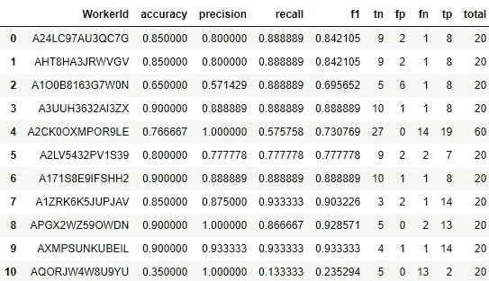

# 众包数据标签

> 原文：<https://towardsdatascience.com/crowd-sourced-data-labeling-68fb92b291a5?source=collection_archive---------21----------------------->

照片由乔丹·康纳在 [Unsplash](https://unsplash.com/s/photos/crowd?utm_source=unsplash&utm_medium=referral&utm_content=creditCopyText) 上拍摄

# 如何利用外包人员获得高质量的标注数据集

作为一名数据科学家，我们花了大量的时间处理数据——清理、规范化、标记。令人欣慰的是，如今许多解决方案将标记工作交给了第三方，解放了数据科学家的宝贵时间，并减轻了手动文本、图片或视频标记的负担。

然而，作为一名数据科学家，我们想知道第三方在标记任务上的表现如何，因为我们通常称输出为**“黄金数据集”**有几种方法可以检查数据集的注释情况。

*注释者间协议(IAA)* —是两个或更多注释者之间关于标签的协议。例如，如果我们有一个观察，由 7 个不同的人独立地标记为 3 个可能的标签，IAA 是多少注释者同意应该分配的标签的度量。如果所有 7 个人都分配了相同的标签，IAA 将为 100%。也就是说*注释者之间的一致是两个(或更多)注释者对某个类别做出相同注释决定的程度的度量。*

然而，在现实世界中，并不是所有的注释者都具有相同的技能水平。一些人类注释者在这项任务中可能更有经验，所以他们应该有更高的权重。这时候*加权* [*弗莱斯卡帕*](https://en.wikipedia.org/wiki/Fleiss%27_kappa) 进来了。这是计算注释者一致性的标准，因为有些注释者比其他人更熟练。

如果我们有一份法律文件，并且每个文本段落需要被分类为 3 个可能的标签，例如，*特殊法律条款*、*样板法律文本*或*合同细节*。此外，我们希望每个文本段落由 5 个不同的人类标签分类。一个贴标签的专家应该有更强的发言权，标签应该是什么。这个较高的权重是基于正确性的历史运行平均值。这意味着如果专家始终是正确的，特别是在贴标机不能就标签达成一致的低 IAA 观察上。那么专家的投票将具有更高的权重- 2 个或更多标签员的投票。

众包贴标机的另一个改进是当他们的标签与共识标签不一致时提示贴标机。作为一个节省成本的措施，设置一个小样本——10%由多个标注者标注(抽样率)

通过如上所述的自动设置，可以获得高精度的群体标记系统，其中大量初始观察被发送到甲骨文，并且随着时间的推移，专家将出现，因为他们的标签与低注释者间一致性观察的甲骨文相一致。同样，如果注释者在没有阅读/理解问题的情况下随机分配标签，那么他们的分类将与大多数样本的分类不同。在一个例子中，许多注释者同意类应该是*特殊法律条款*当“坏的”注释者选择*合同细节*作为答案时，设置将随着时间的推移降低标注者的等级，甚至完全禁止他们为您标注。

# 工作示例

在我的工作中，当我的团队需要廉价和高质量的数据集时，我们使用 MTurk。例如，对于一个获得大约 20，000 个高质量标记数据点来微调基于变压器的 NLP 模型的项目，我们做了以下工作

1.  我们(ML 工程师和 SME)手工标记了大约 200 个(或 1%)观察值。
2.  我们在 20 个预先标记的观察值上为 Turkers 设置了资格作业。这将决定哪些 Turkers 我们想登上我们的主要标签工作。这是它看起来的样子—

尝试标记合格测试的 10 台机器的样本

你可以看到 10 号工人甚至没有努力，f1 分数为 23%。我们让 f1 超过 90%的员工来完成这项任务。

3.我们以这样一种方式设置任务，即每个观察将被 5 个不同的 Turkers 标记。每个这样的任务将包含 100 个观察值，99 个未标记，1 个观察值已经由我们的团队预先标记，但对 Turkers 不可见。

4.我们总共发布了 200 个这样的任务，每个任务有 100 个观察值。任务将以最大化观察完整性的方式提供给 Turkers，即，我们希望任务 1 在转移到下一个任务之前由不同的 Turkers 完全完成，以此类推。这里的风险是，如果所有任务对 Turker 都可用，我们将没有可靠的指标，因为 Turker 1 将从任务#10 开始，而 Turker 2 将从任务#103 开始，以此类推，从而妨碍 IAA 计算。

5.Turkers 在连续的 100 次观察中标记了主要的 19，980 (20，000–20)个数据集，我们将监控每个 Turkers 的 IAA 指标。如果任何一个 Turker 的 IAA 降得太低，我们编写的代码就会将他们排除在我们的标记之外。

6.我们还监控了 Turkers 在我们团队预先标记的少数观察中的表现，以确保 Turkers 不会集体误入歧途，因为 IAA 指标监控的是相关性而不是正确性。

7.在整个任务完成后，我们将提升某些工人为主工人，下次我们做标记时，这些工人不需要参加资格考试。在这里，我们甚至可以进行扩展，使这些 Turker 的投票数在 IAA 的计算中更高。

我上面描述的系统是由我们构建的，充分利用了 AWS 的 MTurk APIs，我们不必担心标记者变得懒惰并开始随机标记数据，因为他们会自动从池中删除。

# 结论

在数据科学家团队中，我们经常需要带标签的数据。对于现代人工智能团队来说，拥有一种自动化的方式来搭载众包工人，以自动化的方式评估和监控贴标机的性能是非常重要的。这些原则中的一些甚至被用于数据编程，在数据编程中，标记功能可以被认为是单个的工人，鉴别器试图辨别哪些标记功能执行，哪些不执行。

如果你有兴趣用 apis ping me 建立自己的自动化众包系统，我们可以抓取☕️电子咖啡👍。