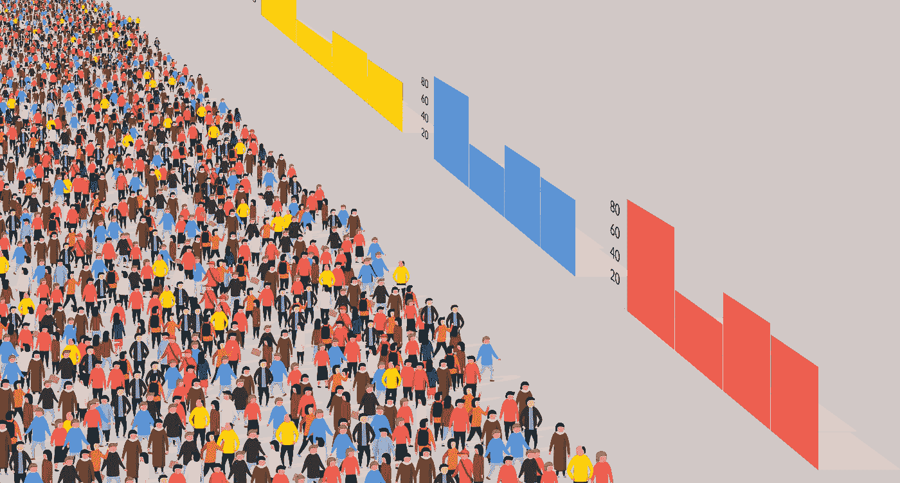
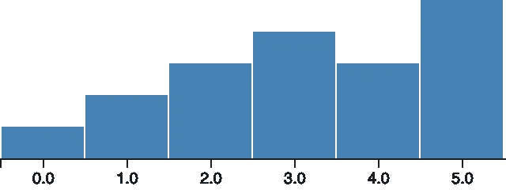
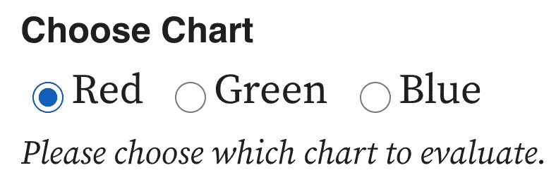
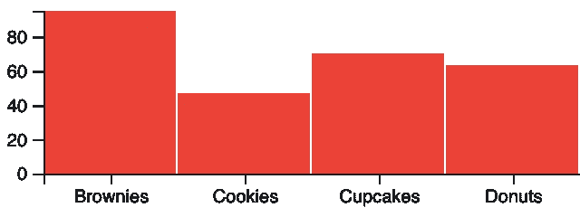

# 如何:用 ObservableHQ 和 Mechanical Turk 对数据进行群体测试

> 原文：<https://towardsdatascience.com/crowd-testing-data-viz-observablehq-and-mechanical-turk-e3663f9fa5f8?source=collection_archive---------48----------------------->

## 在可观察的笔记本上开发数据可视化和用户在 Mechanical Turk 上测试它们的技术指南。



(图片来自作者)

数据可视化看似复杂。即使是简单的可视化也有多个组件以令人惊讶的方式交互。出于这个原因，用真人测试可视化是至关重要的。在大多数情况下，[做一些(定性的)用户测试](https://uxdesign.cc/crucial-questions-for-user-testing-data-visualizations-297413f7d6ab)，修复问题，然后发布就足够了。

但是有时候你需要更多的确定性。例如，如果你正在为公众设计可视化效果，如果你正在进行学术研究，或者如果可视化效果将成为产品或应用程序的一部分，你可能需要评估一些不同的设计变体，以了解哪种表现最好。

定性测试使得比较设计的不同版本变得困难，因为像[排序效应](https://dictionary.apa.org/order-effect)这样的问题。传统的 A/B 测试也没有帮助，因为它们不会透露太多关于用户是否“得到”图表的信息。幸运的是，还有机械土耳其人。

# 用户测试数据，即机械土耳其人

如果你需要测试数据可视化，你需要统计精度，机械土耳其人是你的朋友。Mechanical Turk 可以(相对)轻松地快速接触到大量“工人”受众，并向他们询问几乎任何问题。

当你测试数据时，你给工人一个“测验”,基于你的想象，看看他们表现如何。显然你不是在测试用户，而是在测试你的设计。用户正确回答的问题越多，回答的速度越快，您就越有信心可视化是健壮的。

[迈克·博斯托克](https://twitter.com/mbostock)和[杰弗里·赫尔](https://twitter.com/jeffrey_heer) [在斯坦福发表了一项研究](dx.doi.org/10.1145/1753326.1753357)证实了这一点。他们检查了 Mechanical Turk，特别是作为测试数据可视化的平台，并发现*“众包感知实验是可行的，并为可视化设计提供了新的见解。”*

## **挑战:测试设置**

像赫尔和博斯托克这样的研究面临的挑战是，它们通常需要相当多的设置。通常这包括实际启动一个服务器来托管可视化和你自己的“测验”。这并不是一个巨大的负担，但这是可以花在更有启发性的事情上的时间。

不过，多亏了 [ObservableHQ](https://observablehq.com/) ，你可以在一个可观察的笔记本中构建整个实验，并将可视化结果完全无服务器地嵌入到一个机械土耳其人“HIT”(或人类智能任务)中。

额外的好处是，实际上在可观察中对可视化进行原型化通常是快速、令人愉快的，并且支持简单的协作。

在最近的一个实验[中，我测试了条形图 v.s .棒棒糖图 v.s .点图](https://medium.com/nightingale/bar-graphs-vs-lollipop-charts-vs-dot-plots-experiment-ba0bd8aad5d6)，使用这个 ObservableHQ + Mechanical Turk 设置，在几个小时内评估了 3 种不同的有争议的图表类型，有 150 名不同的参与者(发现对理解的准确性和速度有显著影响)。

# 工作原理:

在本指南中，我将介绍使 Bar /棒棒糖/ Dot 实验工作的技术方面。为了简单起见，我们将构建一个更简单的玩具实验(测试不同颜色的条形图)。

这些实验的完整代码在两个地方:

1.  此处的[可观察笔记本](https://observablehq.com/@elibryan/observable-mechanical-turk-guide)。
2.  这个包含 MTurk HIT 的 HTML 的[要点在这里](https://gist.github.com/elibryan/b21b3e5444a61a865574bda58d81c358)。

## **步骤:**

假设我们想做一个实验，看看条形图的颜色是否对理解或速度有任何影响。我们决定测试红色、绿色和蓝色条形图。

为此，我们将…

*   在 ObservableHQ 笔记本中构建 3 种不同的可视化效果
*   将 3 个可视化效果中的 1 个随机嵌入到一个机械 Turk HIT 中
*   将问题作为简单的 HTML 表单输入添加到 HIT 中
*   开展活动！
*   评估结果

# 在可观察的笔记本中构建可视化效果

首先，在 [ObservableHQ](https://observablehq.com/new) 上新建一个笔记本。

然后，我们将从导入 d3 开始。按照惯例，它们通常放在笔记本的底部，但为了保持时间顺序，把它们放在上面。

```
d3 = require("d3@5")
```

接下来，我们将制作一个简单的条形图。我们会给它一个`color`参数，这样我们就可以使用这个相同的条形图来测试我们 3 个实验变体的所有 3 种颜色。

然后，我们可以测试它在下一个单元格中的工作方式:



```
barChart([1,2,3,4,3,5].map((d,i)=>({x:i, y:d})))
```

然后，让我们为 3 个不同的变体制作 3 个不同的函数:一个红色条形图、一个蓝色条形图和一个绿色条形图。我们将它们存储在`chartVariants`中，用变体名称:`'red'`、`'green'`和`'blue'`键接。

```
chartVariants= ({
  'red': (data,params)=>(barChart(data, {...params, color: '#EB4137'})),
  'green': (data,params)=>(barChart(data, {...params, color: '#8CC432'})),
  'blue': (data,params)=>(barChart(data, {...params, color: '# t'})),
})
```

接下来，我们将生成一个数据集，并用测试可视化来呈现。

测试数据集很可能是静态的，但是如果我们希望看到可视化在各种数据形状上的表现，那么我们需要用各种底层数据集来测试它。为了在实验中做到这一点，我们将在每次加载图表时使用不同的随机生成的数据集来呈现条形图(因此每个实验参与者都会看到使用不同数据集填充的图表)。

假设我们选择烘焙义卖商品销售作为测试数据集的主题。这很好，有两个原因:1)烘焙销售项目很美味，通常考虑起来很愉快；2)烘焙销售项目是一个广泛熟悉的主题，所以它们对我们的测试参与者来说更容易推理。记住，我们不是在测试工人，我们是在测试可视化。

我们生成测试数据如下…

```
//Note: if you re-run this cell, it generates a new dataset every time
data0 = ["Brownies", "Cookies", "Cupcakes", "Donuts"].map((treatLabel)=>({x: treatLabel, y: Math.round(Math.random() * 100)}))
```

(按照惯例，我发现对数据集的变量名及其对应的图表进行编号，可以更容易地跟踪单个实验中的多个图表。这对于我们的单个图表来说显然是矫枉过正了)。

现在我们想看看数据在每个图表变量中的样子。为了在笔记本中方便起见(稍后为了将参与者分配到实验组),我们将定义一个名为`chartVariant`的变量，然后使用测试数据呈现由`chartVariant`定义的图表。

但是首先，我们将导入一个单选控件，添加一个 UI 选择器，以便在我们查看笔记本时方便地选择`chartVariant`。

```
import { radio } from "@meetamit/multiple-choice-inputs"
```

然后我们将创建`chartVariant`选择器，同样是为了在我们查看笔记本时方便地选择`chartVariant`:



```
viewof chartVariant = radio({
  title: 'Choose Chart',
  description: 'Please choose which chart to evaluate.',
  options: [
    { label: 'Red', value: 'red' },
    { label: 'Green', value: 'green' },
    { label: 'Blue', value: 'blue' },
  ],
  value: 'red'
})
```

现在，让我们把它们放在一起，看看我们选择的`chartVariant`在我们的测试数据集上看起来如何。请注意，如果您在单选按钮中选择不同的颜色，图表将在笔记本中自动更新。



```
chart0 = {
  const chartFn = chartVariants[chartVariant]
  return chartFn(data0)}
```

然后点击笔记本上的“发布”,我们就完成了 Observable。我们会在机械土耳其人里做其他的事情。

# 制造轰动

在《土耳其机器人》的世界里，一个[击中](https://www.mturk.com/worker/help#what_is_hit)(“人类智能任务”)是一个“需要答案的问题”。或者，更具体地说，它是一个需要答案的问题的模板。

机械土耳其人给你一吨的灵活性时，建设击中。通过将所有内容包装在一个 HTMLQuestion 元素中，您可以在 HIT 中包含几乎任何任意的 HTML。为了这个实验的目的，我们不需要太花哨的东西，我们只需要建立一个基本的形式。

要设计和构建 HIT，只需在您最喜欢的编辑器中创建一个普通的 HTML 文件。我们将像构建任何普通 HTML 页面一样构建和调试表单，然后在准备就绪时将其复制并粘贴到 Mechanical Turk 中。

HIT HTML 的结构如下所示:

正如您在上面看到的，这是一个基本的 HTML 表单，底部有一些 javascript，用于设置可观察的嵌入和验证表单。

上面遗漏了两个部分，我们将在下面讨论:

1.  将笔记本元素嵌入该 HTML 的代码
2.  一种跟踪用户回答问题时的时间戳的方法

## **将可观察图表嵌入 HTML:**

Observable 使得将笔记本的各个部分嵌入到网络上的其他页面变得非常简单。你可以在这里看到他们的[指南。](https://observablehq.com/@observablehq/downloading-and-embedding-notebooks?collection=@observablehq/introduction)

在这个实验中，我们希望将图表嵌入到我们创建的笔记本的最后一个单元格(`chart0`)中。为此，单击单元格左侧的垂直点，然后从菜单中选择“嵌入代码”。它会向您展示一个如下所示的片段:

```
<div id="observablehq-befff29e"></div>
<script type="module">
import {Runtime, Inspector} from "[https://cdn.jsdelivr.net/npm/@observablehq/runtime@4/dist/runtime.js](https://cdn.jsdelivr.net/npm/@observablehq/runtime@4/dist/runtime.js)";
import define from "[https://api.observablehq.com/@elibryan/observable-mechanical-turk-guide.js?v=3](https://api.observablehq.com/@elibryan/observable-mechanical-turk-guide.js?v=3)";
const inspect = Inspector.into("#observablehq-befff29e");
(new Runtime).module(define, name => name === "chart0" ? inspect() : undefined);
</script>
```

上面的内容对于静态用例来说很好，但是我们还需要做一些调整，所以你所需要的就是上面的 URL 路径，看起来像是`/@elibryan/observable-mechanical-turk-guide.js?v=3.`复制它，并用你笔记本的路径替换下面代码中的路径。

我们将使用以下代码将笔记本图表嵌入到我们的 HIT 中:

我们正在做一些值得注意的事情:

*   我们正在从 Observable 公司进口笔记本:`import define from “https://api.observablehq.com/@elibryan/observable-mechanical-turk-guide.js?v=3";`
*   在开关内部，我们使用`return inspect0()`呈现图表，并将随机生成的数据集保存到表单中的隐藏元素:`document.getElementById("data0").value = JSON.stringify(value);`
*   我们通过从图表变量中随机选择来设置`experimentVariant`，然后将变量键保存到一个隐藏字段`document.getElementById(“experiment-variant”).value = experimentVariant;`，这样我们就可以在分析时访问它。我们还更新了嵌入图表的状态，以显示带有`observableCharts.redefine(“chartVariant”, experimentVariant);`的所选变量

此时，如果您在浏览器中加载 HIT HTML，您应该会看到图表呈现。

## 提出好的测验问题

在上面的 HTML 中，我包含了两个玩具问题的例子。如果你要在现实生活中运行它，你会希望设计得更仔细一点。查看[条形/棒棒糖/圆点实验记录](https://medium.com/nightingale/bar-graphs-vs-lollipop-charts-vs-dot-plots-experiment-ba0bd8aad5d6)，了解评估图表理解能力的实际调查问题的示例和解释。

## **跟踪答案时间戳**

知道一个图表是否能引导观众找到正确的答案是很重要的。但我们也想确保用户可以快速、轻松地搜索图表。为了确定这一点，我们想知道用户回答关于图表的每个问题需要多长时间。

为此，我们存储用户每次“回答”一个问题的时间戳(即每当他们改变表单中的一个字段时)。然后，当我们进行分析时，我们可以通过从之前的时间戳中减去当前答案的时间戳来粗略了解用户回答一个问题花费了多长时间。

这里的方法并不完美。出于很多原因，您不能将此解释为“用户 X 花了 Y 秒回答问题 Z”，但是如果样本足够大，您可以使用此进行比较(例如，“A 组的用户比 B 组的用户多花了 10%的时间”)。

上面的代码遍历表单中的每个单选按钮和文本输入，并对每个按钮和文本调用`addTimeStampField`。`addTimeStampField`在每个原始输入字段下添加一个相应的`hidden`元素。`addTimeStampField`还将`onChange`添加到相关的输入事件处理程序中，这样，如果原始输入发生变化，`onChange`会在隐藏字段中存储当前时间戳，从而节省用户“回答”问题的时间。

就是这样！同样，完整的热门 HTML 的要点可以在这里找到:[observable-mturk-experiment-hit.html](https://gist.github.com/elibryan/b21b3e5444a61a865574bda58d81c358)。这应该既可以在 Mechanical Turk 向导中工作，也可以在浏览器中查看 HTML(这使得构建/调试更加容易)。

接下来，我们将创建一个机械土耳其人项目，并将上述 HTML 复制/粘贴到 HIT 中。

# 运行实验

要运行该实验，请转到 [Mechanical Turk 请求者页面](https://requester.mturk.com/create/projects)，然后创建一个新项目。创建项目时要记住一些设置:

*   根据赫尔和博斯托克的说法，你为每次点击支付的金额(“每次回应的奖励”)实际上不会影响回应的质量，但会影响人们对你的点击做出回应的速度。他们建议每个问题支付 0.02 美元，以达到美国的最低工资标准。
*   在决定受访者的数量(即有多少独特的员工将参与)时，您可能希望选择一个高于您实现适当统计功效所需的数字。因为人们被随机分配到每个实验组，你可能会以不均衡的小组规模结束，一些小组可能会动力不足。
*   对于工作人员需求，您可以通过设置较高的命中率(例如> = 95%)来获得更好的响应，但是您仍然应该期望随机填写一些答案，并且您将需要一个过程来在实验运行后过滤掉这些答案。

一旦您选择了正确的设置，您将转到设计布局选项卡。它可能会显示一个 WYSIWIG 编辑器，在这种情况下，切换到原始 HTML 视图。然后只需从上面复制/粘贴命中的 HTML。

您可以确保预览和完成屏幕上的一切都正常。您应该可以从您的观察笔记本中看到图表和调查问题。您还应该看到，当您刷新浏览器时，图表会在不同的变量之间切换。

我是谁？不，不，*你是谁？！*

嗨！我是伊莱·霍德。[我帮助客户设计和开发忙碌的人和他们杂乱的数据之间的有效接口](https://3isapattern.com/?utm_source=medium)。如果你是一名创始人、创客、讲故事者、非营利行善者或商业领袖，正在思考数据、设计和用户心理的交集，我很乐意联系并聆听你的故事。

你可以发电子邮件到 eli@3isapattern.com 给我，或者在推特上关注我。

参考资料:

*   J.赫尔，m .博斯托克，[众包图形感知:使用机械土耳其人评估可视化设计](https://dl.acm.org/doi/10.1145/1753326.1753357) (2010)