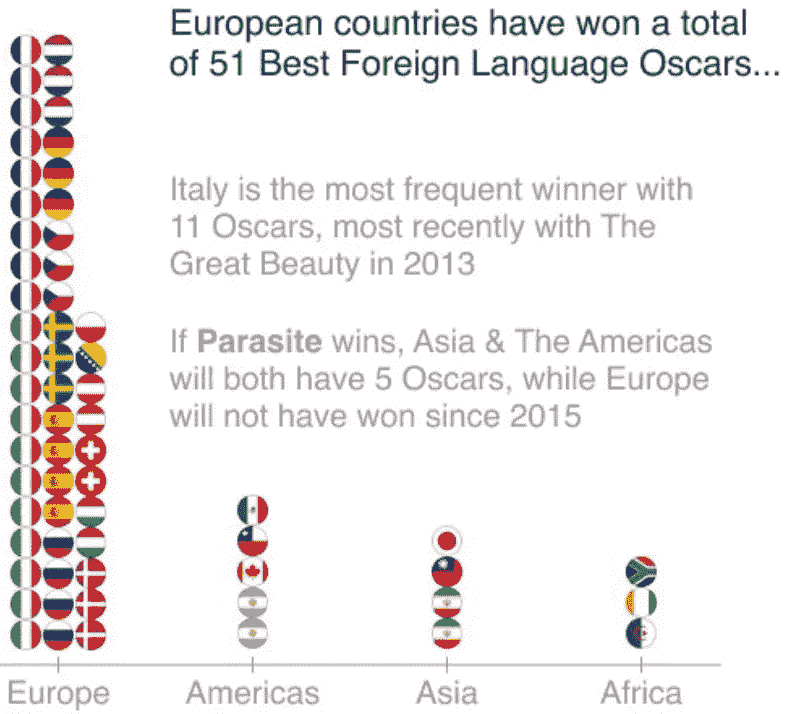
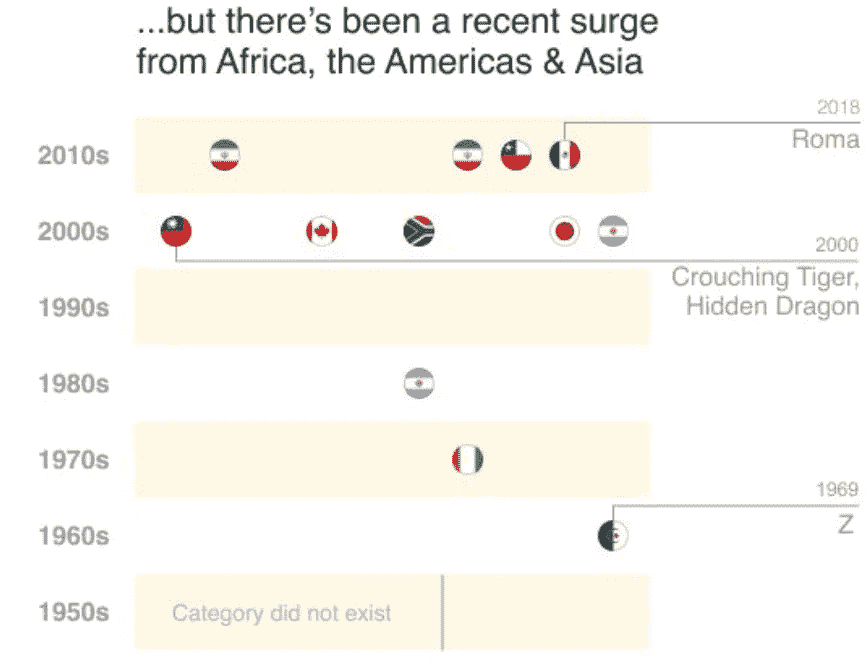

# 处理奥斯卡外语片的数据

> 原文：<https://towardsdatascience.com/crunching-the-data-of-the-foreign-language-oscar-fe435716b66?source=collection_archive---------38----------------------->

## 《寄生虫》让历史赢得了最佳影片，但它也证实了外语类影片的一种新趋势

去年的奥斯卡季[中，我们分析了哪些奥斯卡提名更有可能赢得最佳影片的数据](/predicting-the-oscars-with-data-viz-e5bb0fd01766),并跟踪了有强烈女性表演的电影与只有男性表演提名的电影的成功。

今年，随着韩国电影《T2》的热播，我们仔细研究了奥斯卡外语片的数据。以下是我和我的合作伙伴若昂·席尔瓦创建的数据 viz，我将分两部分对其进行简要评论。

## 欧洲独霸奥斯卡最佳外语类奖项

> 欧洲国家总共获得了 51 个最佳外语片奖

自 1956 年以来，奥斯卡最佳国际故事片奖(Academy Award for the best International Feature Film)每年都会颁发给在美国以外制作的、对白主要为非英语的长篇电影。我们数据的第一部分 viz 使用了一个由旗帜组成的条形图来显示全球四个地区的成功分布情况。

不可否认，这是由欧洲国家的电影主导的——意大利获得了 11 项奥斯卡奖，其次是法国，是最成功的两个国家。这两个国家帮助欧洲获得了 80%的奖项，而美洲只获得了 8%，非洲制作了 5%的获奖电影。昨晚之前，亚洲排名第三，但随着《寄生虫》赢得最佳外语片奖(击败四个欧洲候选人)，亚洲现在与美洲持平，获得 5 个奖项。

## 但是奥斯卡获奖者有一个新的趋势

> 在过去的 20 年里，50%的获奖者都不是欧洲人

看看我们数据的第一部分，你可能会认为这纯粹是欧洲占主导地位的故事。但在第二部分，我们在时间线上绘制了非欧洲的胜利，以突出一个新的趋势。阿尔及利亚电影《T4》Z 是第一部在 1969 年获奖的非欧洲电影。象牙海岸在 20 世纪 70 年代获得了唯一一个非欧洲奖项，而阿根廷的一部电影在 20 世纪 80 年代代表了世界其他地区。

从 2000 年开始，随着亚洲第一部获奖电影*卧虎藏龙*的问世，一种新的潮流开始形成。在过去的 20 年里，现在 50%的获奖者都是非欧洲人，寄生虫证实了这一类别中新形式的多样性。

昨晚,《寄生虫》成为第一部赢得最佳影片最高奖项的外语电影——这一成就是备受赞誉的墨西哥*罗马*去年未能实现的，也是这一类别中最成功的国家 1998 年未能与精彩的意大利*生活是美丽的*实现的。这有望为更多关注非英语电影打开大门，或者至少延续比过去更加多样化的外语电影类别的趋势。

## 我们如何创建我们的数据，即

我们梳理了这一类别的奥斯卡数据，并决定按世界地区(欧洲、亚洲、非洲和美洲)对奥斯卡获奖作品进行分类。然后，我们使用基于浏览器的 UI 和 UX 设计应用程序 Figma 来设计数据，即。

我们使用[国旗](https://www.countryflags.com/)下载获奖电影的原产国国旗的图像，以形成条形图，每个国家的获奖数量都有重复的旗帜。我们在时间表中再次重复使用旗帜来显示获奖电影的年份，省略了欧洲国家。这清楚地显示了过去 20 年中非欧洲国家的集群。