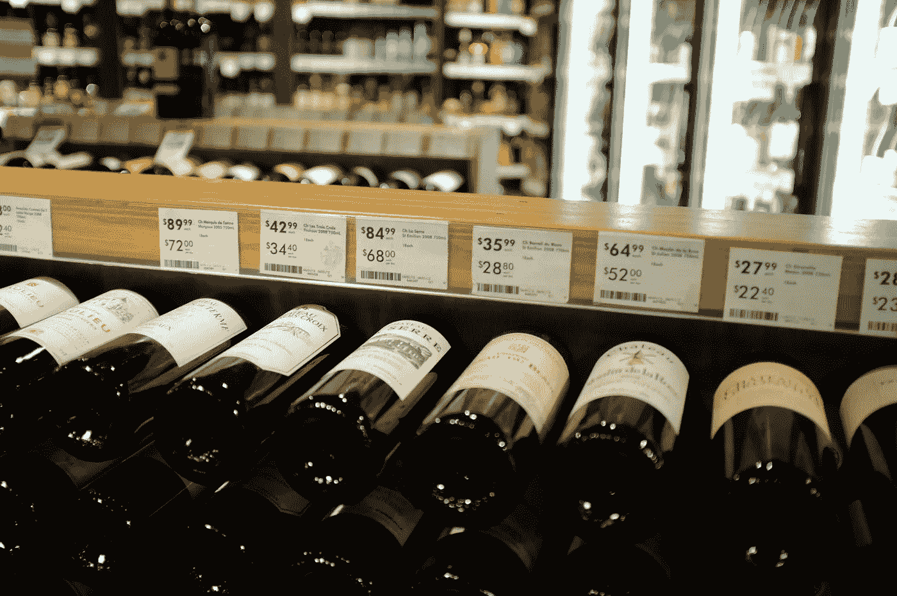
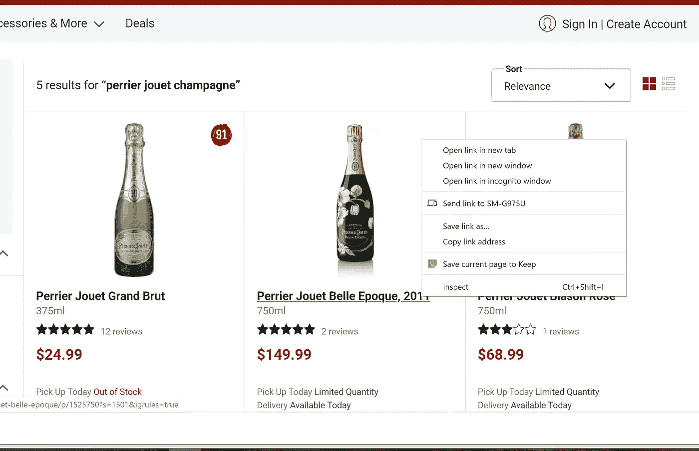
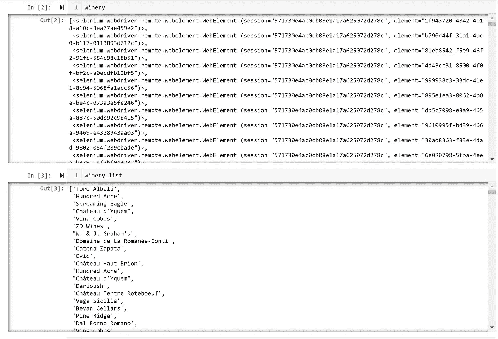
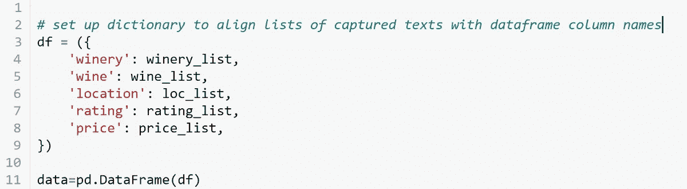
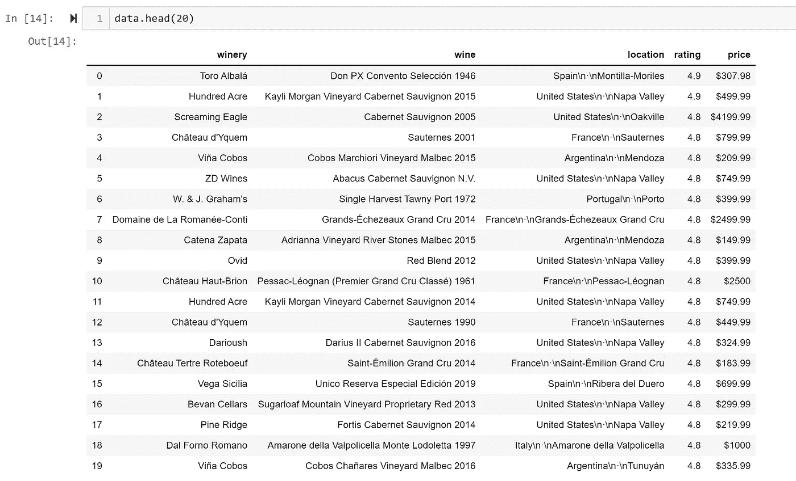

# 粉碎零售葡萄酒数据

> 原文：<https://towardsdatascience.com/crushing-retail-wine-data-with-selenium-and-python-f16a13e046a4?source=collection_archive---------19----------------------->

## [现实世界中的 DS](https://towardsdatascience.com/data-science-in-the-real-world/home)

## 使用 Selenium 和 Python

照片由[阿克谢·肖汉](https://unsplash.com/@akshayspaceship?utm_source=unsplash&utm_medium=referral&utm_content=creditCopyText)在 [Unsplash](https://unsplash.com/s/photos/wine-shop?utm_source=unsplash&utm_medium=referral&utm_content=creditCopyText) 上拍摄

在我的[上一篇文章](https://medium.com/@tony.bosco/harvesting-data-how-web-scraping-can-increase-your-insight-into-the-wine-market-8c533f1f64f8)中，我谈到了网络抓取作为一种工具，通过从相关零售和电子商务网站中提取知识来帮助你关注竞争或定价趋势。

今天，我们将仔细看看这个过程。我们将用简单的调查术语(谁、什么、为什么、在哪里和如何)来处理它，因为为你的刮擦设置策略将帮助你更快地通过这个过程。

我们还将分享一些使用 Python 和 Selenium 包收集数据并将其压缩成可以操作的数据帧的技巧。

在开始之前，您需要确保您的 Selenium 包安装在 Python 中，并且 ChromeDriver 设置为与 Selenium 一起运行。有关设置 [Selenium](https://pypi.org/project/selenium/) 和 [ChromeDriver 的更多信息，请点击以下链接。](https://chromedriver.chromium.org/home)

# **世卫组织(您将从中获取信息的网站)？**

当你浏览一个网站时，要考虑三个关键因素:

1.  *查看网站的条款和条件*，确保您没有违反任何潜在协议。你很可能不希望失去对网站的访问，所以花一些时间了解他们是否会对你抓取他们的数据有意见。在接下来的讨论中，我们将假设一个站点可以被你浏览。
2.  评估你感兴趣的网站。考虑给谷歌 Chrome 添加一个像 [BuiltWith](http://BuiltWith.com) 这样的技术剖析器，从顶部了解网站是如何构建的，是什么让它运行的(这将有助于你以后识别元素)。你还将利用[谷歌的元素面板](https://developers.google.com/web/tools/chrome-devtools)来检查你将可以抓取哪些元素(稍后会有更多相关内容)。此外，注意你与网站的交互方式——如果网站返回的结果没有巨大的滚动，你很幸运，如果它是一个无限滚动的网站(像脸书或 Twitter ),你可能需要在代码中考虑一些额外的选项。
3.  *识别一个完整的网址:*当你用 Python 写代码时，你需要识别你想要访问的特定网址。我的建议是访问该网站，输入标准来执行您希望进行的任何搜索，并捕获结果网址，以便在发送您的 web scraper 之前满足您的标准。准备好那个网址，作为设置你的网页抓取代码的第一步，通过 Selenium 告诉 ChromeDriver 到底要打开和抓取什么网站。

右键单击页面上的任何文本、图像或价格点，以访问检查功能并打开元素面板

# (我们要找的)是什么？

如上所述，我们依靠谷歌的 Inspect 功能和元素面板窗口来检查哪些元素你可以抓取。右键点击页面上你感兴趣的任何一项(图片或文字)，在弹出的菜单中，向下滚动到“Inspect”并点击(见上图)。

这将带您进入元素面板，以便您可以查看站点的文档对象模型(DOM)树，并找到您要提取的元素的正确标识符。

页面上的每个元素都将被引用到 DOM 上的一个节点。面临的挑战是为您需要的每个元素找到最有效、最可靠的定位器。幸运的是，Selenium 为您提供了一个工具箱，里面装满了可供选择的工具，因此，无论是哪个网站，您都有很大的机会使用以下命令找到您需要的东西:

*   按 ID 查找元素
*   按名称查找元素
*   按类名查找元素
*   通过 XPath 查找元素
*   通过 CSS 选择器查找元素
*   通过链接文本查找元素
*   通过部分链接文本查找元素
*   通过标记名查找元素

您可能需要试验其中的一些定位器类型来获得您想要的结果，并且您可能会发现通过在整个代码中使用多个定位器来访问您想要抓取的元素是最好的。互联网上有很多关于部署这些 find 命令的最佳方法的建议。对于本例，我们将使用“按类名查找元素”,如下所示:

当您检查图像或文本时，它会引导您找到它在 DOM 中的元素标识符。这里是一个类名，**“vintage title _ _ wine—U7t9G”**

在您的代码中，您将调用这个元素来帮助将所需的相关文本抓取到您的文件中—参考第四行:**wine = browser . find _ elements _ by _ class _ name(" vintage title _ _ wine—U7t9G ")**

*(在 GitHub Gist**可以访问上面的代码片段* [*)*](https://gist.github.com/Boscobrand/1b7a078e708eeb9d4a1ce8f61d4817d8)

# **为什么(我们这样刮？)**

使用 Python 和 Selenium，有一种更简单的方法将所有信息放入一个列表中——但是结果非常冗长、麻烦且难以操作。

然而，为了能够更有效地处理数据，并最终将它放入我们可以管理的 Python Pandas 数据帧中，我们将使用一个两步过程来定位各个元素，然后访问相关的文本。

# **这些元素在哪里？**

这些元素遍布站点的 DOM 树。因此，对于我们的两步过程，我们的第一步是识别所有的元素，第二步是运行一个简单的 for/循环来遍历每个元素，让 selenium 为我们的审查挑选最好的文本。

在上面的代码中，我们建立了五个单独的列表来存放我们的元素集合。当我们遍历每一个单独的元素列表时，我们将创建五个新的文本列表，它们都是相互对应的。因此，在这个具体的例子中，我们收获了我们的 winery 元素，并用 Selenium 为我们精选的最好的数据粉碎了我们的 winery_list。

Selenium 将收获关键元素，然后我们会告诉它用 for 循环粉碎相应的数据。

# **如何(我们现在使用这些信息)？**

我们现在有五个伟大的列表提供我们收集的数据，我们只是一个简单的 Python 字典，将我们的列表压在一起，形成一个数据帧，我们可以清理，分析，添加，然后提供并与我们的同事分享我们的见解。

一个简单的字典代码，将我们的五个列表压缩成一个单一的数据框架

*(在 GitHub Gist 这里* *可以访问上面的代码片段*[*)*](https://gist.github.com/Boscobrand/b2ce886c5effffa1e4771097a10e0e78)

我们的最终数据框架(在清洁、EDA 或特征工程之前)

如您所见，生成的数据框架以一种我们可以分析并从中获得更多价值的方式汇集了我们的数据，更不用说我们已经建立了一个相对简单的程序来在需要时更新我们的信息。

总的来说，网络抓取可以为我们提供很好的自动化数据访问，这反过来帮助我们获得洞察力，推动我们的业务向前发展。在我们开始写代码之前，建立我们的抓取策略(并考虑谁、什么、哪里、为什么和如何)，对获得我们想要的结果有极大的帮助。

直到下一次…

干杯！