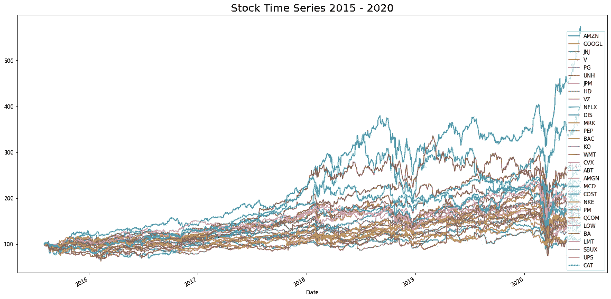
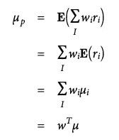
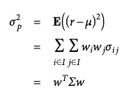
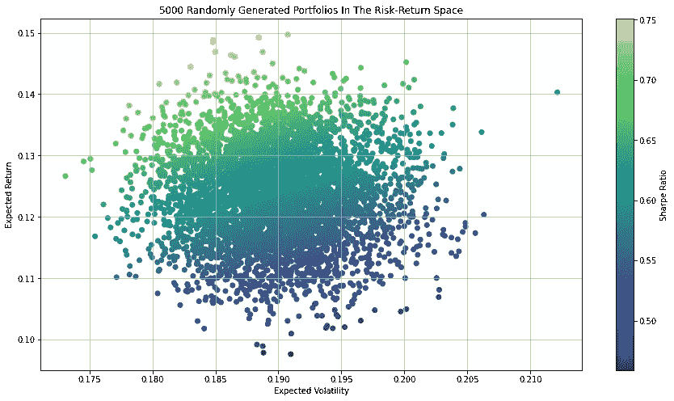
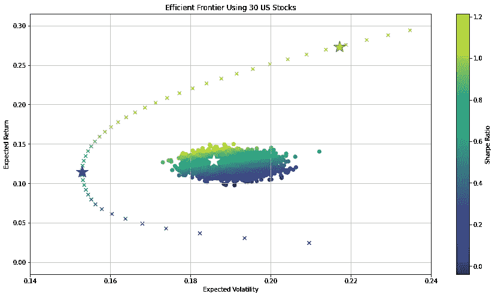
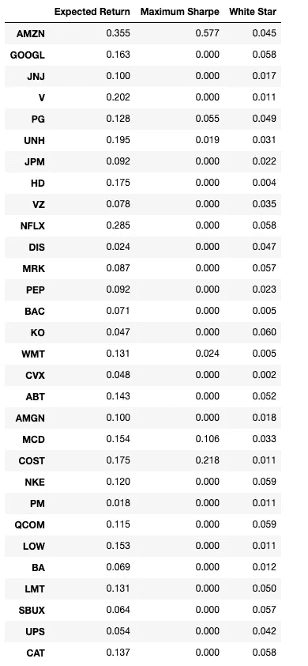
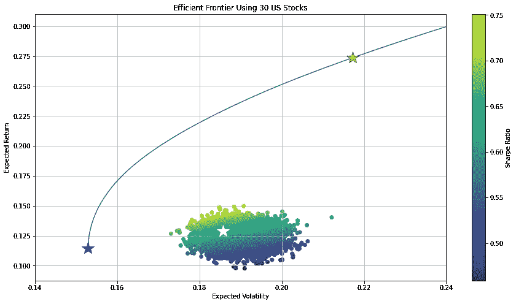
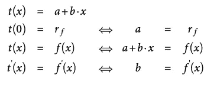
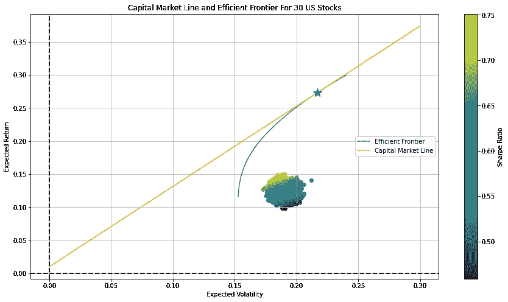
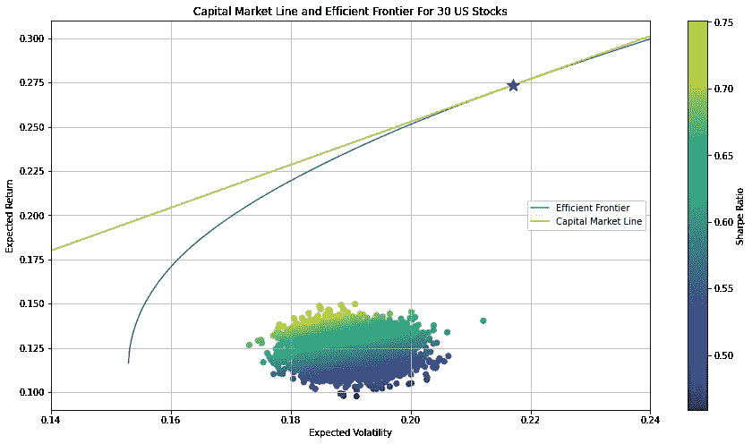

# 使用 Python 进行股票和加密货币的均值-方差分析

> 原文：<https://towardsdatascience.com/cryptocurrencies-the-new-frontier-part-1-940e787c7ab9?source=collection_archive---------14----------------------->

照片由 [Clifford 摄影](https://unsplash.com/@cliffordgatewood?utm_source=medium&utm_medium=referral)在 [Unsplash](https://unsplash.com?utm_source=medium&utm_medium=referral)

## Python，均值-方差分析，有效边界以及加密货币如何拓展边界。

加密货币多年来一直是一个热门话题，这是有充分理由的。对一些人来说，它们是一个黑匣子，对另一些人来说，它们是金融不可避免的未来。不用说，任何人，只要花了至少一部分时间和金钱投资股票和其他资产，近年来都会考虑投资这种新颖的资产类别。

在本文中，我将从均值-方差的角度分析将加密货币纳入传统股票投资组合的影响。本分析的目的不是给出投资建议或对未来做出预测，而是展示为什么考虑将加密货币等替代资产类别与股票一起纳入投资组合是值得的，不管你对它们的看法如何。

如果你对加密货币、金融理论、投资或使用 Python 编程感兴趣，这篇文章是为你准备的。我将深入基础金融理论，并解释如何使用 Python 执行均值-方差分析。虽然这些是复杂的数学主题，但我将主要关注底层逻辑，因为太多的公式会使任何事情看起来比它需要的更复杂。

这篇文章的结构如下:

1.  简要财务概述
2.  解释均值-方差分析
3.  将均值-方差分析应用于股票
4.  使用 Python 计算有效边界
5.  使用 Python 计算资本市场线
6.  向投资组合中添加加密货币并调查结果
7.  比较加密货币与其他替代资产的效果
8.  结论意见

本文的第 1 部分涵盖了第 1 点到第 5 点。您可以在这里找到将加密货币引入投资组合的部分:

 [## 加密货币——新的前沿

### Python、均值-方差分析、有效边界以及加密货币如何拓展边界

towardsdatascience.com](/cryptocurrencies-the-new-frontier-part-2-7218c6a489f9) 

# 金融中的一些重要措施

提到股票价格(以及一般的任何资产价格)时，最重要和最常用的两个指标是回报率和波动性。

我们所说的回报率通常是指收益率，最常见的形式是简单收益率和对数收益率。要了解这两者之间的区别，请看[这篇](https://chandlerfang.com/2017/01/09/arithmetic-vs-logarithmic-rates-of-return/)博客文章。现在，把回报想象成股票价格在给定时间间隔内的百分比变化，也就是说，如果某个股票价格今天是 100 美元，明天跳到 105 美元，回报(简单回报率)是 5%。

对于波动性，我们指的是回报的标准差，即回报方差的平方根。方差是对收益数据集分布程度的一种度量。因为方差是使用平方偏差计算的，所以它与原始观测值没有相同的测量单位。取平方根，即计算标准偏差，将这种测量转换成相同的单位，从而使分布的测量更容易解释和跨数据集比较。更大的利差意味着更多的上下波动，这就是为什么在金融中标准差通常是风险的衡量标准。更多关于标准差[这里](https://www.investopedia.com/terms/s/standarddeviation.asp#:~:text=Standard%20deviation%20is%20the%20square,one%20data%20value%20and%20another.)。

投资者通常会查看平均回报和风险来比较股票并做出投资决策。一般来说，与债券等其他资产相比，股票往往相对不稳定，降低投资股票风险的一种方法是投资多只股票。这就是[习语](https://www.idioms.online/put-all-your-eggs-in-one-basket/)“不要把所有的鸡蛋放在一个篮子里”的实际执行，被称为多元化。

分散投资或通过投资多只股票来降低整体投资组合风险背后的直觉是，选择价格和回报不会同步波动的股票。这样，如果一个下降，另一个可能保持不变或上升。你可以认为这是一种“平衡”。将历史上从未一起波动的股票包括在内，会使投资组合更加平衡。

当我们分析由多只股票组成的投资组合时，我们希望能够计算整个投资组合的预期收益和方差，而不是单只股票的预期收益和方差。为了做到这一点，除了它们的平均回报和标准差之外，我们需要知道投资组合中股票的两个度量之一:它们的协方差或相关性。

[协方差和相关性](https://www.dummies.com/education/math/business-statistics/how-to-measure-the-covariance-and-correlation-of-data-samples/)是两个变量之间关系和依赖性的度量。本质上，相关性只是协方差的标准化版本，它测量两个变量之间线性关系的强度和方向。相关性的可能值介于-1 和 1 之间。正相关意味着两个变量趋向于同向移动，负相关意味着两个变量趋向于反向移动，零相关意味着变量之间没有关系。因此，对于投资组合多样化来说，最好的建议是组合那些回报具有低相关性或负相关性的股票(想想“平衡”的类比)。

计算投资组合的预期收益和方差的数学方法超出了本文的介绍范围，但是[这篇](https://financetrain.com/expected-return-and-variance-for-a-two-asset-portfolio/)博客文章用一个双资产投资组合提供了一个很好的解释。我们现在需要知道的是，整个投资组合的预期收益是投资组合中个股预期收益的加权平均值。投资组合的预期方差有点复杂，但本质上是单个股票的方差、它们在整个投资组合中各自的权重以及每对股票之间的相关性的产物。

# 什么是均值-方差分析？

均值-方差分析，通常被称为现代投资组合理论(MPT ),是一种关于投资组合构建的理论，由 [Harry Markowitz](https://en.wikipedia.org/wiki/Harry_Markowitz) 于 1952 年首次提出，后来他获得了诺贝尔经济学奖。该理论背后的主要思想是，通过调整投资组合中单个资产的权重，有可能构建最佳投资组合，在给定的风险水平下，提供最大可能的预期回报。MPT 的一个关键观点是，单个资产的回报率和波动性不应由其本身来评估，而应根据它对投资组合整体回报率和波动性的贡献来评估。

最佳投资组合，即在给定风险水平下最大化预期回报或在给定回报水平下最小化预期波动性的投资组合，可以绘制在图表上。连接最优投资组合的线将是一条向上倾斜的双曲线，它被称为有效边界。之所以称之为“有效”，是因为在给定的风险水平下，基于它的投资组合能提供最高的预期回报。

让我们看看使用 Python 应用均值-方差分析是什么样子的。对于接下来的部分，假设对 Python 有一个基本的了解，但是即使没有它，基本的逻辑和结论也将是清楚的(我强烈建议那些真正想了解 Python 的人搜索未知的 Python 术语)。

# 将均值-方差分析应用于股票

在开始分析之前，我们需要将股票价格数据导入 Python。令人欣慰的是，Pandas 有一个名为 pandas-datareader 的子程序包，可以很容易地从各种互联网资源中提取数据，并放入 pandas DataFrame 中。我将从雅虎财经中提取股票价格数据。但是我们如何决定提取哪些股票价格数据呢？

在这个例子中，我关注了标准普尔 500 中的 30 只股票。为了简单起见，我假装是一个业余投资者，他知道为了有一个多元化的投资组合，建议投资组合中有 15 到 30 只股票。因为我也知道来自不同行业的股票往往比来自同一行业的股票相关性更低，所以我试图构建投资组合，使其中包含的股票来自许多不同的行业。因为我有点懒，我就查了一下标准普尔 500 的成分，找到了一个按权重排序的列表，浏览了一下列表，从不同行业挑选了股票，直到我有了一个 30 只的列表。这绝不是选择股票的好策略，而且在我们的样本中必然会导致生存偏差，但为了简单起见，这已经足够好了(这也类似于许多人会考虑的相当多样化的投资组合)。

在接下来的内容中，我将包括最重要的代码块和可视化。完整的笔记本可以在这里找到[。](https://github.com/JoBe10/Mean_Variance_Portfolio_Optimisation/blob/master/Efficient_Frontiers_Cryptos.ipynb)

下面是从 Yahoo Finance 中提取股票价格数据的代码:

这一提取提供了近五年的股票价格数据。我选择 2015 年 8 月 6 日作为开始日期的原因将在后面的分析中变得清楚。在我继续均值-方差分析之前，让我们简要地看一下这个分析中包含的股票价格的演变。以标准化方式绘制时间序列股票价格数据会产生以下图形:

正如时间序列显示的那样，亚马逊等一些股票在过去五年里取得了令人印象深刻的涨幅。似乎新冠肺炎的传播也导致了 2020 年初所有股票价格的大幅下跌。另一个观察结果是，尽管有不同的轨迹，股票价格往往一起移动，这意味着它们是正相关的。稍后将详细介绍。

正如我前面提到的，MPT 的主要思想围绕着寻找一个投资组合中的股票权重，在给定的波动水平下，这些股票可以带来最高的预期回报。但是我们如何计算出这些“最佳”重量呢？

在我继续之前，我想介绍两个公式，它们将是分析的基础(我知道我说过我将主要关注底层逻辑，但是这些公式对于理解下面的代码是必不可少的)。对于这两个公式以及随后的所有计算，我们假设只允许多头头寸(即只买入股票，不卖出股票)，并且头寸总和为 100%(即权重总和为 1)。第一个是投资组合的预期回报公式:

资料来源:Yves Hilpisch 的《金融 Python》

在上面的公式中，历史平均收益被假定为预期收益的最佳估计值，并被假定为正态分布。最后一个等式是投资组合的预期收益是单个资产预期收益的加权平均值，以向量乘法的形式表示。

第二个基本公式是投资组合的预期方差公式:

资料来源:Yves Hilpisch 的《金融 Python》

上述公式中的最后一个等式只是资产权重向量乘以协方差矩阵和资产权重向量的乘积的转置。

翻译成 Python，这两个公式都可以归结为一行代码，我将很快展示。回到资产的权重。

因为目前我们不知道“最优”资产权重是多少，所以一个好的开始是运行蒙特卡罗模拟，在其中我们随机分配 0 到 1 之间的权重(以权重相加为 1 的方式)。然后，我们计算由此产生的投资组合的预期收益和方差，重复这些步骤，无论我们认为需要多少次，并绘制结果。

我定义了一个函数，它将每日回报的数据帧和一个数字 N 作为输入，N 告诉函数要运行多少次模拟。值得注意的是，收益和(共)方差的“年化”是在收益相互独立且同分布的假设下计算的:

当使用 30 只股票的每日日志回报和 5，000 次模拟调用该函数并绘制结果时，我们得到以下散点图:

在散点图中，我根据夏普比率给点着色。夏普比率是金融中最常见的风险回报指标之一。它被定义为一项投资的超额回报(即超过无风险利率的回报)除以该项投资的波动性。计算夏普比率可以很容易地比较不同风险回报的投资。一般来说，夏普比率越高越好。在这个项目中，我假设无风险利率为 1%。

在下一节中，我将解释我们如何从随机生成的投资组合分散到计算有效边界。

# 使用 Python 计算有效边界

正如我前面提到的，有效边界是由所有的最优投资组合组成的，这些最优投资组合是由可用于组成这些投资组合的股票组成的。正如“最优投资组合”这个名字所暗示的，寻找构成这些投资组合的权重归结为一个优化问题。但是我们优化什么呢？

让我们考虑一下。我们希望找到在给定风险水平下具有最大预期回报的投资组合。由于 Python 的 SciPy 库中优化函数的设置方式，我们不得不将它重新定义为最小化问题。对于给定的风险水平，寻找具有最大期望回报的投资组合等同于对于给定的期望回报，寻找具有最小风险水平的投资组合。

我们需要做的是定义一个返回重要投资组合统计数据的函数:预期回报、波动性和夏普比率。在设置了最小化函数中使用的一些约束和初始权重后，我们可以调用该函数并生成预定义数量的最优投资组合，我们可以绘制这些投资组合并用于进一步分析。下面的代码就是这样做的:

调用 30 只美国股票的有效边界函数，并将其绘制在随机生成的投资组合散点图的顶部，会得到以下图形:

在上面的观想中，我包括了三颗星星。

蓝星代表最小方差投资组合。每一个位于该恒星上方和右侧的“x”构成了有效边界。位于蓝色星号下方和右侧的“x”不是有效的，因为很明显，具有相同预期波动率(x 轴值)的投资组合具有更高的预期回报(y 轴值)。

红星代表最大夏普比率投资组合，白星代表 5000 个随机生成的投资组合之一。

对于一些人来说，尤其是那些在大学或其他地方看过有效边界可视化的人，可能会感到困惑，为什么位于有效边界上的 x 距离随机生成的投资组合如此之远。其原因是，在沿着有效边界的投资组合中，许多股票被赋予了零权重，因为这是给定波动率下的最大回报。在蒙特卡洛模拟中，每只股票都被赋予一个介于 0 和 1 之间的权重，由于所包含股票的风险回报和协方差特征，这不会导致最优的投资组合分配。以下是最大夏普比率投资组合与白星代表的投资组合的配置比较:

比较最优和次优投资组合的权重分配

权重比较显示，随机选择的投资组合过度分配给不太“有价值”的股票(这里的有价值是指增加投资组合的多样化，同时也有助于预期回报)，而不足分配给更“有价值”的股票。

但是为什么最优投资组合只将资本分配给一部分股票呢？例如，为什么亚马逊在投资组合中占据了 50%以上的份额？为什么谷歌没有投资，但麦当劳却获得了大约 10%的资本分配？

通过查看股票的相关矩阵，并记住上表中显示的预期年回报率，我将提供一个基本逻辑的简单解释。整个相关矩阵太大，无法在此列出，但可以在[笔记本](https://github.com/JoBe10/Mean_Variance_Portfolio_Optimisation/blob/master/Efficient_Frontiers_Cryptos.ipynb)中找到。

亚马逊在最大夏普比率投资组合中占据如此大的一块，原因很简单，因为它迄今为止的预期回报率最高，年回报率为 35.5%。此外，如果你考虑到亚马逊的预期波动性，它的吸引力就变得更加明显了。尽管拥有最高的预期回报率，但它的波动性在所有股票中仅排在第七位。事实上，亚马逊的预期波动性与摩根大通非常接近，后者的预期年回报率为 9.2%。

谷歌在最大夏普比率投资组合中的权重为零的原因是因为它是回报与亚马逊的相关性最高的股票。因为亚马逊已经在投资组合中占据了如此大的一部分，以分散投资，从而降低整体投资组合风险，所以剩余的权重需要分配给回报率与亚马逊相关性较低的股票。

这就是麦当劳的用武之地。它的股票回报率与亚马逊股票的相关性最低，这就是为什么尽管回报率平均，但从整个投资组合的角度来看，将它加入投资组合是有价值的。

必须谨慎地做出类似这样的简化陈述，因为在投资组合配置中，人们不能仅通过查看两只股票的风险回报情况和它们之间的相关性来得出任何结论，而是始终需要将投资组合视为一个整体。话虽如此，我认为使用亚马逊、谷歌和麦当劳的例子是理解底层逻辑的一个很好的起点。

短暂的转移话题后，让我们回到有效边界。在这一点上，有效边界的观想只包括单个的点，但是为了使它成为一个合适的边界，我们希望它是一条连续的线。为了使用构成有效边界的现有点创建一条连续线，我们可以插入数据点的 [B 样条表示](http://support.ptc.com/help/mathcad/en/index.html#page/PTC_Mathcad_Help/b_spline_interpolation.html)。听起来令人困惑，数学相当先进，但本质上 B 样条插值所做的是将曲线拟合(即近似)为一组点。这使我们能够把有效边界画成一条连续的线，但它也给了我们一个有效边界的连续函数，这在下一节会派上用场。

生成的连续曲线如下所示:

现在我们有了作为连续函数的有效边界，我们可以计算资本市场线。

# 使用 Python 计算资本市场线

到目前为止，我只考虑了由风险资产(这里是股票)组成的投资组合，但如果我们考虑无风险投资(通常是大型银行的现金账户)与风险投资相结合，会怎么样呢？

事实证明，这是资本市场线(CML)背后的基本理念。本质上，该理论建议投资者首先确定一个有效的风险资产组合(正如我们所做的那样)，然后在组合中加入一种无风险资产。正如我将很快展示的，将无风险投资与高效投资组合相结合，会极大地增强投资者的高效投资机会。

我们选择与无风险投资相结合的有效投资组合，是指有效边界的切线在绘制有效边界的 y 轴上恰好穿过无风险投资的回报。对于利率为 1%(即其回报率)的无风险投资，y 轴上的点将是(0，0.01)。

你们中的一些人可能还记得微积分课程([这里](https://www.siyavula.com/read/maths/grade-12/differential-calculus/06-differential-calculus-04)是给那些不知道的人的链接)我们可以用一个函数的一阶导数来找到这个函数在特定点定义的曲线的切线。这就是 B 样条插值给了我们一个连续(可微)函数的事实派上用场的地方。使用该连续函数及其一阶导数，结合一些条件，我们可以求解 CML。为了找到资本市场线，我们使用 SciPy 的 fsolve 函数(它找到一个连续函数的根),条件如下:

资料来源:Yves Hilpisch 的《金融 Python》

换句话说，第一个条件意味着在 x=0 时，函数必须等于无风险利率的回报，即 CML 的直线必须通过 y 轴上的该点。第二个条件简单地说明，对于 x 的任何值，函数必须满足线性函数方程(有些人可能记得在高中时写为 y=mx+b)。第三个条件规定函数的一阶导数必须等于参数 b，即斜率。

允许我们求解有效投资组合的代码是这样的，切线穿过 y 轴上无风险资产的收益:

这导致了以下资本市场线:

在上面的图像中，蓝色的星代表有效的投资组合，切线穿过无风险利率。至少根据现代投资组合理论，通过将无风险投资添加到有效投资组合中，投资者可以通过调整投资于无风险资产的财富比例，获得位于无风险资产和有效投资组合之间直线上的任何风险回报组合(甚至通过借钱超越该点)。投资于无风险资产的比例越大，你就越接近 CML 的原点，反之亦然，(风险)有效投资组合的比例越大，你就越接近蓝星。

下面是上述可视化的放大版本，以便与之前的版本进行比较:

随着 CML 的计算和绘制，本文的第一部分已经完成，我们可以继续分析在投资组合中包含加密货币会产生什么影响。你可以在这里找到文章[的第二部分。](https://medium.com/@bennerjonas10/cryptocurrencies-the-new-frontier-part-2-7218c6a489f9)