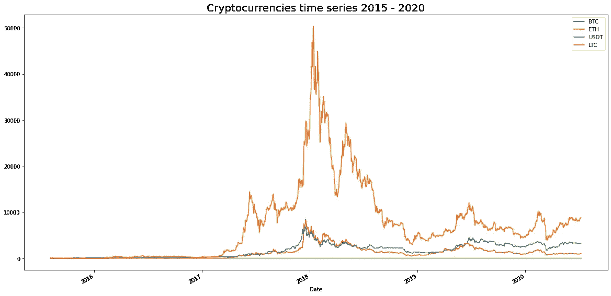
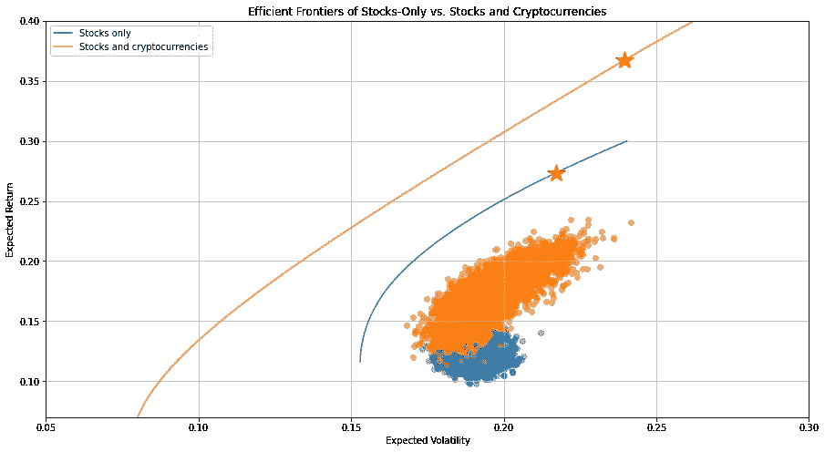
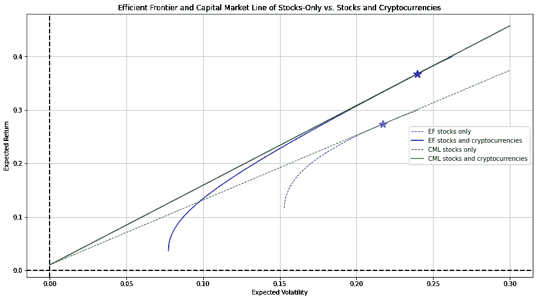
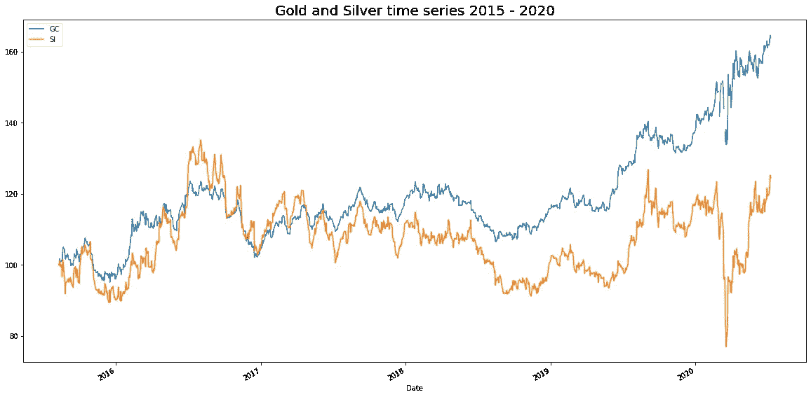
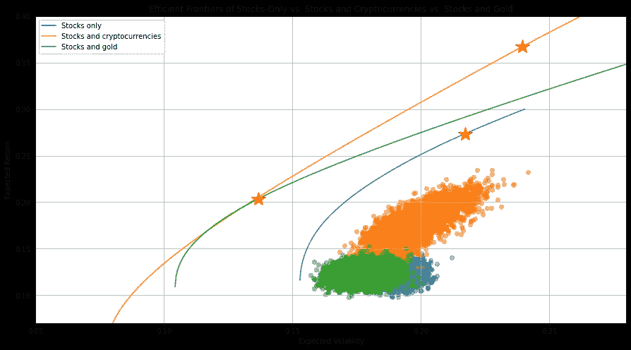
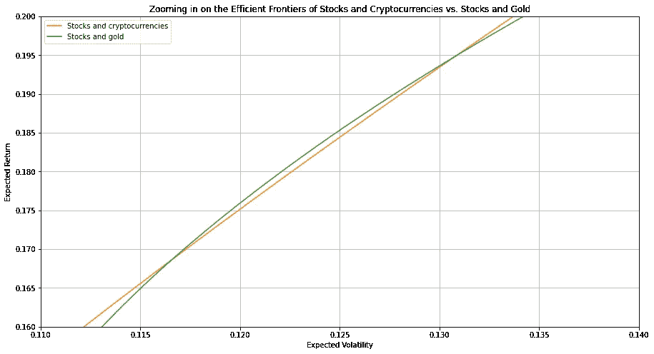
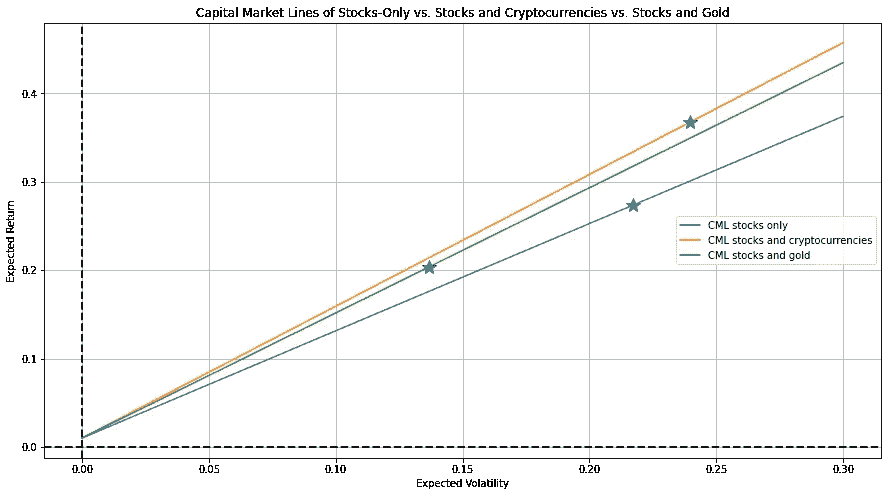
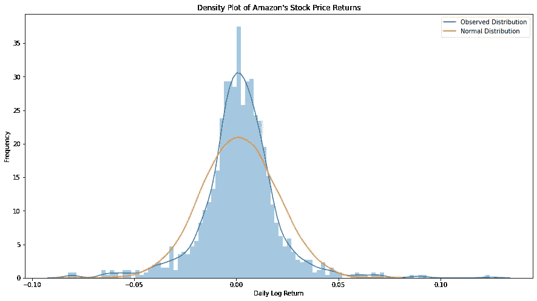
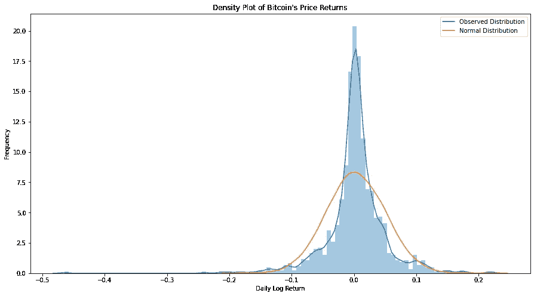

# 加密货币——新的前沿

> 原文：<https://towardsdatascience.com/cryptocurrencies-the-new-frontier-part-2-7218c6a489f9?source=collection_archive---------26----------------------->

照片由 [Clifford 摄影](https://unsplash.com/@cliffordgatewood?utm_source=medium&utm_medium=referral)在 [Unsplash](https://unsplash.com?utm_source=medium&utm_medium=referral)

## Python，均值-方差分析，有效边界以及加密货币如何拓展边界。

在这篇文章的[第一部分](https://medium.com/@bennerjonas10/cryptocurrencies-the-new-frontier-part-1-940e787c7ab9)中，我使用了 30 只来自不同行业的美国股票来计算有效前沿和资本市场线(CML)。在本文的这一部分，我将把加密货币添加到组合中，并分析它们对投资组合的影响。

让我们快速回顾一下到目前为止我们所知道的。由于一些股票的风险回报状况，特别是亚马逊，由此产生的有效投资组合显示了令人印象深刻的风险回报状况。由此得出的 CML 的斜率为 1.21，这是沿着这条线的任何财富分配的夏普比率。最优(正切)投资组合的预期年收益率为 27.4%。有效边界和资本市场线看起来像这样:

有可能把这些数字推得更高吗？如果是这样，我们会怎么做？

正如我在本文第 1 部分中提到的，增加与现有投资组合不相关的资产并获得可观的回报，可能会改善整个投资组合的风险回报状况。让我们使用一些流行的加密货币来实现这一点。

关于如何计算最优投资组合的详细描述，Python 中的有效边界和资本市场线请看本文的第一部分:

 [## 使用 Python 进行股票和加密货币的均值-方差分析

### Python，均值-方差分析，有效边界以及加密货币如何拓展边界。

towardsdatascience.com](/cryptocurrencies-the-new-frontier-part-1-940e787c7ab9) 

# 将加密货币加入投资组合

首先，我们需要导入加密货币价格数据，我们可以将这些数据添加到我们迄今为止分析的 30 只美国股票的价格数据中。在这篇分析中，我重点关注四种最知名和最大的加密货币(就市值而言):比特币、以太坊、Tether 和莱特币。

绘制加密货币价格随时间变化的归一化时间序列如下图所示:

关于上述时间序列的一些观察结果:

1.  用正常的术语来说，以太坊在 2018 年经历了极端的峰值。
2.  y 标签刻度的增量为 10，000(与第一部分[中的股价时间序列的 y 轴相比)！).](https://medium.com/@bennerjonas10/cryptocurrencies-the-new-frontier-part-1-940e787c7ab9)
3.  看起来莱特币、以太币和比特币似乎倾向于一起移动(即相关)，但 Tether 没有显示相关性，甚至没有移动。

因为上图中正常化的时间是 2015 年 8 月 6 日(这是以太坊价格被纳入雅虎财经的第一天)，这是一个加密货币极其新颖且价格非常低的时期，y 轴的刻度一直上升到 50，000。以太坊的起价为 2.77 美元，2018 年最高达到 1396.42 美元，几乎是起价的 504 倍。这显然是一个非常特殊的案例，我将在稍后对此进行评论。

上述时间序列揭示了一条对任何投资者都很直观的经验法则(但也可以说在生活中有更广泛的应用)，即更高的回报往往伴随着更高的风险。在这段时间内，投资加密货币的回报可能是巨大的，但时间序列图有很多起伏，在以太坊的情况下，非常极端，使它们非常危险。

在提取相关的加密货币价格并计算每日日志回报后，我很好奇加密货币价格的回报与股票回报之间的相关性。完整的相关性矩阵可以在[笔记本](https://github.com/JoBe10/Mean_Variance_Portfolio_Optimisation/blob/master/Efficient_Frontiers_Cryptos.ipynb)中找到，但总结一下，在 2015 年年中到 2020 年年中的时间段内，加密货币回报和股票回报之间几乎没有相关性(至少对于本分析中包含的那些来说)。

加密货币似乎与现有投资组合中的任何股票都几乎不相关，加上它们令人印象深刻的回报，这一事实表明，从均值-方差的角度来看，将它们加入投资组合可能是有益的。让我们看看那是什么样子。

在上面的可视化中，蓝色聚类表示仅基于股票的随机生成的投资组合，橙色聚类表示基于股票和加密货币的随机生成的投资组合。橙色集群在 x 轴上分布得更广，这意味着基于股票和加密货币的随机生成的投资组合具有更广泛的可能风险，特别是朝着风险更高的一端。与此同时，即使风险水平相同，橙色集群也往往位于蓝色集群之上，表明橙色集群的风险回报状况更好。

同时使用股票和加密货币可以实现的有效边界位于仅使用股票的有效边界的上方和左侧，因此可以为任何风险提供更高的回报。

红星代表最大夏普比率投资组合，根据聚类和有效边界，使用股票和加密货币构建的投资组合提供了更高的回报，但也带来了更多的风险。纯股票投资组合和组合投资组合的夏普比率分别为 1.21 和 1.49。

画出各自的资本市场线使画面完整:

将加密货币添加到组合中，并将由此产生的高效投资组合与无风险投资相结合，可以提供比仅使用股票和无风险投资更高的风险回报。

在这一点上，有些人可能会说，“但是，等一下，你所做的只是将一种回报率几乎不相关的资产添加到投资组合中，难道你不能用任何回报率接近与投资组合不相关的资产，如黄金或白银，来实现同样的目标吗？”这是一个很好的观点。让我们看看那个。

# 黄金和白银与加密货币

在这一节中，我将遵循我用于将加密货币添加到股票投资组合中的相同步骤，但我将把黄金和白银添加到投资组合中，而不是加密货币。

首先，让我们再来看看标准化的时间序列:

一些观察结果:

1.  用正常的术语来说，在特定的时间段内(尤其是临近尾声的时候)，黄金的表现优于白银。
2.  黄金和白银价格似乎密切相关。
3.  新冠肺炎事件导致了黄金和白银的震荡，但白银受到的冲击尤为严重。

查看黄金、白银和所选的 30 只股票之间的相关性矩阵(可在[笔记本](https://github.com/JoBe10/Mean_Variance_Portfolio_Optimisation/blob/master/Efficient_Frontiers_Cryptos.ipynb)中找到)突出了一个有趣的事实，这一组新的可用资产与之前的略有不同。与加密货币的回报大多与股票的回报呈小正相关不同，黄金和白银的回报与所选股票的回报呈小负相关(超过 5 年的时间段)。此外，黄金的波动性相对较低，但回报也不错。由于其优越的风险回报状况，黄金在所有最优投资组合中具有一定的正权重，而白银的权重为零。

基于黄金的这两个特征，即与大多数股票的负相关性和良好的风险回报状况，将黄金加入投资组合可以降低包括加密货币在内的货币无法实现的风险(因为它们与股票的相关性大多为正)。让我们看看有效前沿是如何比较的。

在上面的可视化中，绿色聚类稍微集中在蓝色聚类的左侧，但在垂直位置上大致处于相同的水平，这意味着将黄金和白银添加到投资组合中会产生随机投资组合，与只有股票的投资组合相比，其预期回报大致相同，但风险较低。

有趣的是，对于相对较低的风险水平(x 轴上的 0.1 到 0.15 之间)，股票和黄金以及股票和加密货币的有效边界似乎几乎重叠。我将很快放大到有效边界的那一部分。

红星代表最大夏普比率投资组合，由股票和黄金组成的最大夏普比率投资组合位于仅由股票或股票和加密货币组成的投资组合的下方和左侧。这进一步表明了将黄金加入投资组合的影响:它具有降低风险的效果，但由于其有限的预期回报，也降低了可以实现的回报。

放大股票和黄金以及股票和加密货币的有效前沿为我们提供了一个有趣的视角:

存在一个小的预期波动窗口，其中使用股票和黄金构建的最优投资组合实际上提供了比使用股票和加密货币构建的最优投资组合略高的预期回报。

最后，让我们比较一下资本市场线(为了保持形象清晰，我省略了有效边界):

使用由股票和黄金组成的有效投资组合结合无风险投资可以实现的 CML 介于仅股票和股票与加密货币之间。它的斜率更接近股票和加密货币的 CML。一个重要的注意事项是，蓝星代表最优投资组合，其切线穿过无风险利率截距。如果我们假设没有借款(出于多种原因，但主要是因为借款利率往往不同于投资利率)，这些蓝星也是沿着 CML 可以实现的有效投资集的极限。这意味着，尽管其斜率接近使用股票和加密货币的 CML 的斜率，但使用股票和黄金的 CML 的有效投资集在可实现的预期回报方面要有限得多。这是与比特币和以太坊相比，将黄金作为替代资产纳入投资组合的主要区别之一。

对于那些对将所有三种资产类别(股票、密码和金属)结合在一起或引入其他资产类别的效果感兴趣的人，我相信你现在可以自己尝试一下了(如果你遇到困难，请随时联系)。

# 结论意见

虽然本文中的分析得出了一些有趣的发现和令人印象深刻的风险回报结果，但我想再次说明，这绝不是投资建议，也不能在未来以任何方式复制。我想强调分析的几个非常重要的方面:

1.  该分析基于历史股票价格，这意味着最优投资组合的计算是事后诸葛亮。没有理由相信这些也将是未来的最优投资组合配置。
2.  被包括在内的股票的挑选方式受到生存偏差的影响。这些股票是通过简单地浏览当今标准普尔 500 中的顶级股票列表来挑选的，这意味着为了接近该列表的顶部，它们必须在最近几年中表现相对良好。因此，在我分析的时间范围内，这些股票注定会有不错的风险回报。
3.  加密货币在本次分析期间经历了令人难以置信的价格上涨，这种情况不太可能再次发生(至少以类似的方式)。
4.  根据均值-方差分析，最优投资组合的投资组合配置可能是最优配置，但这并不意味着只投资于少数股票，当这些股票组合成一个投资组合时，可以产生高夏普比率，从而形成一个非常多样化的投资组合，特别是从长期来看。原因是投资组合风险的重要维度超出了标准差。其中一个维度是终极财富转移(TWD)，更多信息请见这里的。
5.  仅仅因为某个资产类别与另一个资产类别不相关，并不意味着将其加入投资组合是有益的。Tether 就是一个很好的例子。由于其作为由法定货币支持的“稳定硬币”的性质，Tether 不会给投资组合增加任何回报。在投资任何资产之前进行研究是非常重要的，这对于加密货币尤其重要！
6.  现代投资组合理论的一些基本假设可能不是当今金融现实世界的完美代表。整个分析的一个基本假设是资产回报是正态分布的。我们来看看亚马逊和比特币的回报分布:

两种分布似乎都有“厚尾”和“高峰”，这意味着更接近平均值的回报和远离平均值的回报比正态分布更有可能出现。离群值似乎也会影响分布。在亚马逊的情况下，最高的每日日志回报大约是均值以上 6.5 个标准差，而在比特币的情况下，最负的每日日志回报几乎是均值以下 10 个标准差。正态分布回报的假设虽然在理论上非常有用，但在现实世界中可能并不完美。

尽管如此，本文的目的并不是预测未来或构建完美的投资组合。本文的目的是解释什么是均值-方差分析，以及如何使用 Python 来完成它。我的目标是用更容易理解的语言解释这个有点复杂的话题，同时指出为什么单单投资股票可能会限制一个人多样化的可能性。

我希望你喜欢这个现代投资组合理论的演示。如果您有任何问题或想聊些什么，请随时通过 [LinkedIn](https://www.linkedin.com/in/jonas-benner-257093120/) 与我联系。

感谢阅读！