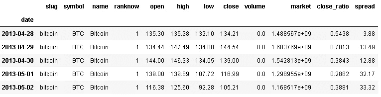
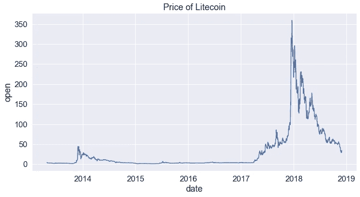
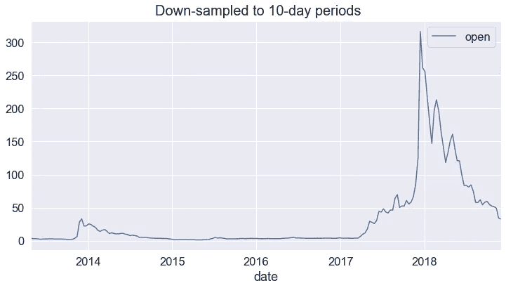
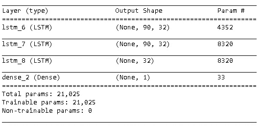
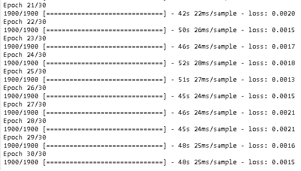
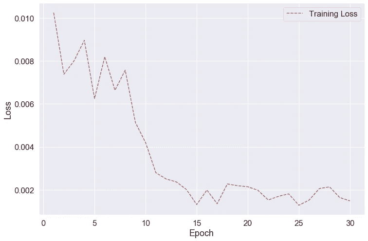
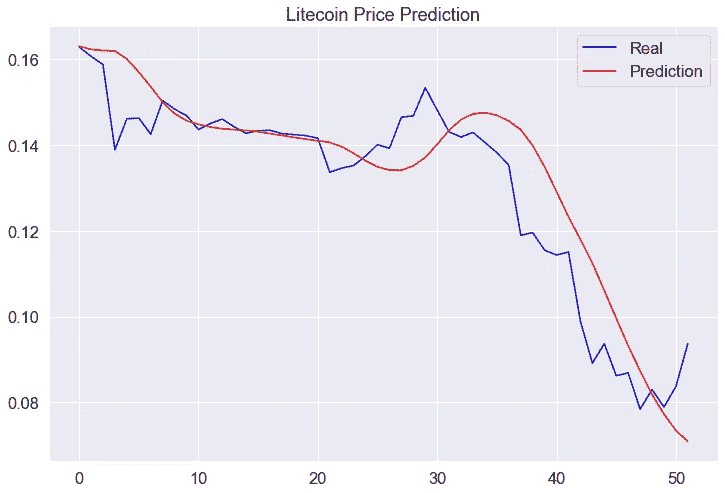
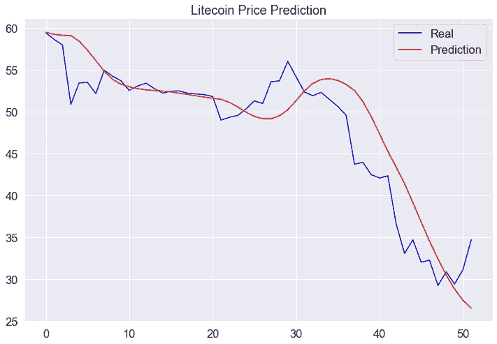

# 用 LSTM 预测加密货币

> 原文：<https://towardsdatascience.com/cryptocurrency-prediction-with-lstm-4cc369c43d1b?source=collection_archive---------13----------------------->

## 如何预测汇率的趋势

虽然第一种重新分配的加密货币(比特币)是在 2009 年创造的，但数字货币的想法却出现在 20 世纪 80 年代。近年来，加密货币获得了惊人的流行。作为传统货币，加密货币的价值随着时间而变化。使用历史数据，我将使用 LSTM(长短期记忆)层实现一个递归神经网络，以预测未来加密货币价值的趋势。


安德烈·弗朗索瓦·麦肯齐在 [Unsplash](https://unsplash.com/s/photos/bitcoin?utm_source=unsplash&utm_medium=referral&utm_content=creditCopyText) 上的照片

Kaggle 上有一个关于[加密货币市场](https://www.kaggle.com/jessevent/all-crypto-currencies)价格的庞大数据集。我只使用莱特币历史价格数据的一部分。

和往常一样，我们从导入库开始:

```
import numpy as np
import pandas as pdimport matplotlib.pyplot as plt
import seaborn as sns
sns.set(style="darkgrid", font_scale=1.5)%matplotlib inline
```

导入库后，我们现在可以获得我们需要的数据:

```
df = pd.read_csv("crypto-markets.csv", parse_dates=["date"], index_col="date")df.shape
(942297, 12)df.head()
```



该数据集包括近 100 万行。我只需要“莱特币”的“开放”王子。

```
df = df[df.slug == "litecoin"][["open"]]df.shape
(2042, 1)
```

我们现在有莱特币从 2013 年 4 月到 2018 年 11 月的历史数据。让我们来看看它是如何随着时间而变化的。

```
plt.figure(figsize=(12,6))
sns.lineplot(x=df.index, y="open", data=df).set_title("Price of Litecoin")
```



在经历了 2013 年底的一个小高峰后，市场陷入了长时间的沉默。然后在 2017 年底达到最高值。我们可以通过应用下采样使图形看起来更平滑。

```
df.resample('10D').mean().plot(figsize=(12,6))plt.figtext(.5,0.9,"Down-sampled to 10-day periods", fontsize=20, ha='center')
```



# **型号**

长短期记忆(LSTM)是一种递归神经网络(RNN ),对序列数据建模非常强大，因为它保持一种内部状态来跟踪它已经看到的数据。LSTMs 的常见应用包括时间序列分析和自然语言处理。

LSTM 要求输入是具有形状(batch_size，timesteps，input_dim)的 3D 张量。

我将建立一个模型，使用过去的 90 个值(从 t-90 到 t-1)预测时间 t 时莱特币的价值。因此**时间步长**的数量是 90。我仅使用“开盘价”进行预测，因此 **input_dim** 为 1。目标变量是莱特币的“公开”价格，它会受到许多其他因素的影响。例如，另一种加密货币的价值可能会对莱特币产生影响。如果我们还使用第二个变量来进行预测，那么 input_dim 将是 2。

# **数据预处理**

我将重新组织数据，使用前 90 天的值序列来预测时间 t 的值。由于在神经网络中进行了过多的计算，因此最好将这些值标准化。

```
data = df.iloc[:, 0]hist = []
target = []
length = 90for i in range(len(data)-length):
    x = data[i:i+length]
    y = data[i+length]
    hist.append(x)
    target.append(y)
```

第一个元素的最后一个时间步长与原始数据的第 90 个时间步长相同，这正是我们计划要做的。

hist 的第二个元素应该只是第一个元素的一个时间步长偏移版本。因此，第二个元素中的最后一个时间步长应该等于目标变量的第一项，即原始数据中的第 91 个时间步长。

让我们仔细检查以确认:

```
print(hist[1][89])
print(data[90])
print(target[0])2.9
2.9
2.9
```

Hist 和 target 是列表。我们需要将它们转换成 numpy 数组，并对目标变量进行整形。

```
hist = np.array(hist)
target = np.array(target)target = target.reshape(-1,1)
```

让我们检查历史数组和目标数组的形状:

```
hist.shape
(1952, 90)target.shape
(1952, 1)
```

Hist 阵列包括 1952 个观测值，每个观测值包括 90 个时间步长(90 天)。

现在，我们可以对数据进行归一化，压缩 0 到 1 范围内的所有数据点，使最大值和最小值分别为 1 和 0。标准化可以通过应用一个简单的数学方程或者仅仅使用一个像 **MinMaxScaler** 这样的函数来完成。

```
from sklearn.preprocessing import MinMaxScalersc = MinMaxScaler()
hist_scaled = sc.fit_transform(hist)
target_scaled = sc.fit_transform(target)
```

预处理的最后一步是调整输入数组的形状，使其与 LSTM 图层兼容。

```
hist_scaled = hist_scaled.reshape((len(hist_scaled), length, 1))
print(hist_scaled.shape)
(1952, 90, 1)
```

# **训练和测试集**

我们的数据集包括 1951 个样本(天)。输入样本包括连续 90 天的莱特币价值，目标变量是 90 天后第二天的莱特币价值。

我将以一种方式分割数据集，即 1900 个样本用于训练，然后该模型将用于预测未来 51 天的趋势。

```
X_train = hist_scaled[:1900,:,:]
X_test = hist_scaled[1900:,:,:]y_train = target_scaled[:1900,:]
y_test = target_scaled[1900:,:]
```

# **构建神经网络**

```
import tensorflow as tffrom tensorflow.keras import layers
```

我将建立一个有 3 个 LSTM 层和 1 个输出层的密集层的模型。

```
model = tf.keras.Sequential()model.add(layers.LSTM(units=32, return_sequences=True,
                  input_shape=(90,1), dropout=0.2))model.add(layers.LSTM(units=32, return_sequences=True,
                  dropout=0.2))model.add(layers.LSTM(units=32, dropout=0.2))model.add(layers.Dense(units=1))model.summary()
```



我们现在需要编译模型。编译模型时，应选择用于调整权重的优化器。Tensorflow 提供了许多优化器。回归任务中常用的优化器有“adam”和“rmsprop”。此外，应该选择损失函数。由于这是一个回归任务，我们可以选择“均方误差”。

```
model.compile(optimizer='adam', loss='mean_squared_error')
```

是时候训练模型了。我们需要在这里指定两个超参数:

*   batch_size=在更新模型的内部参数之前，通过神经网络工作的样本数。如果 batch_size 为 1，则在将每个样本(或观察值)馈送到神经网络后，会更新参数。
*   次数:整个训练集向前和向后通过神经网络的次数。

```
history = model.fit(X_train, y_train, epochs=30, batch_size=32)
```



该模型似乎在 30 个时期内收敛，因此没有必要进行额外的时期。损失不到 0.002 我觉得已经很不错了。

让我们想象一下随着时代数量的增加，损失是如何变化的。

```
loss = history.history['loss']
epoch_count = range(1, len(loss) + 1)
plt.figure(figsize=(12,8))
plt.plot(epoch_count, loss, 'r--')
plt.legend(['Training Loss'])
plt.xlabel('Epoch')
plt.ylabel('Loss')
plt.show();
```



看起来这个模型在 15 个纪元后已经收敛了。之后亏损在 0.0018 附近上下反弹。

现在是做预测的时候了。

```
pred = model.predict(X_test)plt.figure(figsize=(12,8))
plt.plot(y_test, color='blue', label='Real')
plt.plot(pred, color='red', label='Prediction')
plt.title('Litecoin Price Prediction')
plt.legend()
plt.show()
```



我们的模型很好地确定了趋势。您可能已经注意到，这些值比原始值小得多，因为我们在训练模型之前对这些值进行了规范化。我们可以进行逆变换来反映真实价格，但趋势是相同的。

```
pred_transformed = sc.inverse_transform(pred)
y_test_transformed = sc.inverse_transform(y_test)
```



总有改进的空间。神经网络的燃料是数据，因此我们可以通过收集更多的数据来建立一个更鲁棒和准确的模型。我们还可以尝试调整一层中的节点数量或添加额外的 LSTM 层。我们还可以尝试增加时间步长的数量，在我们的模型中是 90。另一种改进方法是使用 GridSearchCV 调整参数。

请记住，提高模型精度并不总是好的，因为我们最终可能会有一个过度拟合的模型。

你可以在这里找到整个 jupyter 笔记本。

感谢阅读。如果您有任何反馈，请告诉我。