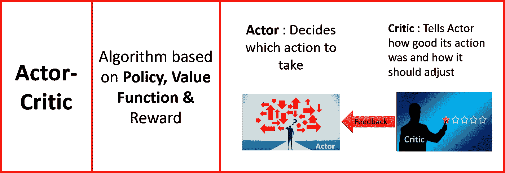

# 清晰的强化学习

> 原文：<https://towardsdatascience.com/crystal-clear-reinforcement-learning-7e6c1541365e?source=collection_archive---------25----------------------->

用于此插图图片的像素图像

## 强化学习的综合简明概念

强化学习(RL)是人工智能和机器学习的最热门领域，在过去几年中有许多惊人的突破。这篇文章试图给出整个 RL 光谱的一个简明的视图，而不要过多地进入数学和公式，同时也不要忽略茂密复杂的森林中的树木。

现在首先让我们了解什么是强化学习或 RL？

RL 意味着在头脑中考虑**长期**结果或**累积** **回报**的情况下采取最佳行动。

用于此插图图片的像素图像

强化学习(RL)是通过**与**环境**交互**进行的学习。强化学习**代理**从其**动作**的结果中学习，而不是从明确的教导中学习，它根据其过去的经验(利用)以及新的选择(探索)来选择其动作，这是必不可少的，试错学习就像孩子学习一样。RL-agent 接收到的强化信号是一个数字的**奖励**，它编码了一个动作结果的成功，agent 试图学习选择那些**随着时间的推移使累积奖励最大化的动作。**

用于此插图图片的像素图像

在我们深入研究 RL 之前，让我们先看看为什么 RL 在人工智能和机器学习领域如此重要。参考下面的图表，它显示了 RL 在生活的各个领域中的应用。

用于此插图图片的像素图像

现在，我将介绍一些经常用来解释强化学习的术语，在深入研究算法和更吸引人的概念之前，人们必须理解这些术语。

用于此插图图片的像素图像

在上图中，我列出了名称、标准符号和图示。现在，我将分别对它们进行定义。

## 代理人

任何使用某种传感器感知其环境并能够在环境中产生行动的东西都被称为代理。代理执行动作，接受观察，并给予奖励。

## 环境

环境是代理交互的总体表示。该媒介不被认为是环境的一部分。环境接受一个动作，发出观察和奖励。

## 状态

状态描述了当前的情况，并决定了接下来会发生什么。代理可能有状态的局部视图，这被称为**观察**。

## 报酬

当一个代理在一个州采取行动时，它会收到一个奖励。这里的术语“奖励”是一个抽象的概念，描述来自环境的反馈。奖励可以是正面的**或负面的**。当奖励为正时，对应的是我们通常意义上的奖励。当奖励为负时，对应的就是我们通常所说的“惩罚”。

Pixabay，Atari & Tesla 图像用于此插图图片

奖励是代理在每个时间步从环境中得到的**反馈**。然后，它可以使用这个奖励信号(对于好的行为可以是积极的，对于坏的行为可以是消极的)来推断在一种状态下如何表现。总的来说，目标是解决一个给定的任务，尽可能获得最大的回报。这就是为什么许多算法对代理采取的每一个动作都有一个微小的负奖励，以激励它尽快解决任务。奖励是在 RL 中至关重要的设计决策，因为这将鼓励 RL 代理优化行为。例如，以更少的时间赢得象棋比赛或以平均速度驾驶汽车但不发生任何碰撞(汽车可以在空旷的高速公路上加速，而在繁忙的道路上缓慢行驶)。奖励告诉我们什么是好的**直接感觉**。比如雅达利游戏，每一个时间步代理都是得分或者失分的。

## 贴现因素

现在的奖励**比未来**的奖励**更有价值。贴现因子，通常表示为γ，是一个乘以未来预期*回报*的因子，在[0，1]的范围内变化。它控制着未来回报相对于眼前回报的重要性。折扣因子越低，未来的回报就越不重要，代理人将倾向于专注于只产生即时回报的行动。贴现率被限制为小于 1 的事实是一个使**无限和**有限的数学技巧。这有助于证明某些算法的收敛性。贴现因子用于确定未来报酬**的**现值(类似于由于通货膨胀等因素贴现的未来货币的现值)。**

## 状态值

状态值“V(S)”是从该状态开始的一段时间内代理可以期望积累的奖励总额。与奖励信号不同，价值函数指定了*长期* 中什么是**好的。**

## 行动

动作是代理在每个状态下可以做的事情。例如，机器人的步幅只能是 0.01 米到 1 米。围棋程序只能在 19 x 19(即 361)个位置中的一个位置放下棋子。自动驾驶汽车可能会向不同的方向行驶。

## 动作值

动作值或状态-动作值函数(Q 函数)指定代理在具有策略π的状态下执行特定动作的良好程度。Q 函数用 Q(S，A)表示。它表示在遵循策略π的状态下采取行动的价值。这里的‘q’指的是一个动作的**质量**。

## 政策

策略是代理从状态中选择的动作。策略是在一种状态下行动的映射，这种状态可以是**确定性的**或**随机性的**。该策略由 **π表示。**

## 环境模型

这个模型是对环境的模拟。它知道从一个状态到另一个状态的转换，以及对环境的高层次理解。

用于此插图图片的像素图像

现在，我将介绍一些基本概念，如勘探、开发、策略上、策略下等。在我们深入研究 RL 算法之前。

## 开采和勘探

开发和探索的概念与人类的本性有着内在的联系，作为人类，我们更喜欢已知而不是未知。例如，去餐馆，你可以选择去你最喜欢的餐馆，因为你已经喜欢那里的食物，但除非你尝试另一家餐馆，否则你不会知道是否存在更好的餐馆。

用于此插图图片的像素图像

因此，开发就是去做同样的事情，从一个国家获得最大的价值(这通常被称为贪婪的行为)，而探索就是尝试新的活动，从长远来看，这些活动可能会带来更好的回报，即使眼前的回报可能并不令人鼓舞。在上图中，如果代理人只考虑即时奖励，通过跟随红色路径获得最大奖励，它将在稍后发现具有更高价值的蓝色路径，即使即时奖励较低。这就是为什么需要探索来获得更好的长期回报。

## 符合政策和不符合政策

在非策略学习中，我们评估目标策略(π)，同时遵循另一个称为**的策略行为策略** (μ)(这就像机器人遵循视频或基于**另一个代理**获得的经验的代理学习)。“在策略上”表示代理遵循它用来更新目标的相同策略。

用于此插图图片的像素图像

## 规划和学习

RL 算法可分为**规划**或**学习**算法。在规划中，代理需要知道环境的模型(代理知道转移概率)，然后在该模型下规划最优策略。在学习问题中，代理不了解环境的动态，它需要通过**试错**进行交互，以了解环境，从而得出最优策略或最优状态值。

## 基于模型和无模型

在基于模型的 RL 问题中，代理知道环境的模型，这意味着它知道转换动态，并且主要目标是计划最优动作。在无模型 RL 中，代理不知道转换或其他动态；相反，它必须通过与环境的互动来学习什么样的可选动作会产生最佳结果。

# 强化学习“规划”算法

## 马尔可夫决策过程(MDP)

马尔可夫决策过程(MDP)是复杂决策过程的数学表示。(MDP)正式描述强化学习的环境。环境是完全可观察的和静止的(意味着规则不随时间改变)。几乎所有的 RL 问题都可以用 MDP 来形式化。MDP 的定义是:

*   一个状态 S，它代表了在一个定义的世界中，一个人可能处于的每一个状态。只有**现在重要，**这意味着转移函数仅取决于当前状态 S，而不取决于任何先前状态。

用于此插图图片的像素图像

*   一个模型或转移函数 P，它是当前状态、所采取的行动以及我们最终所处的状态的函数。这种转变产生了一定的概率，以状态 S '结束，在途中获得奖励 R，从状态 S 开始，并采取行动 a。
*   奖励是处于一种状态的一个标度值。它告诉我们进入状态的用处。

MDP 的最终目标是找到一个政策，它可以告诉我们，对于任何一个州，该采取什么行动(记住，将州映射到行动是我们的政策)。最优策略是使长期预期回报最大化的策略。**一旦找到最优策略，RL 问题就解决了**。

在 RL 中，我们考虑如何计算任意策略π的状态值函数 V(S)。这在 RL 文献中被称为**政策评估**(也称为**预测**问题)。通过使新策略相对于原始策略的价值函数变得**贪婪**来改进原始策略的过程被称为**策略改进或控制。**

## 广义策略迭代

广义策略迭代(GPI)是指让策略评估和策略改进过程相互作用的总体思想，独立于两种方法的粒度和其他细节。这就像梅西和 c 罗在同一支球队踢一场足球赛。他们每次传球都是为了个人进球而互相竞争，但他们也互相协助为球队赢得比赛。同样，GPI 就像一场足球比赛，最终目标是找到最优政策/最优价值函数。在一次扫描中(可能是全部情节，也可能是每一步或几步)，对策略进行评估，以计算出该策略的价值。然后通过对旧政策采取贪婪的行动来改进政策。重复这一过程，直到出现收敛，并找到最优策略或最优值。

## 贝尔曼方程

特定状态的值等于当前状态的奖励，加上从该点开始从当前状态 S 过渡到未来状态 S’时得到的折扣奖励。

## 价值迭代

为了求解贝尔曼方程，我们通常从所有状态的任意值开始，然后基于邻居(从当前状态可以到达的所有状态)更新它们。最后，我们重复直到收敛。这个过程叫做**“价值迭代。”**值迭代是一个组合**一个(或多个)**政策评估扫描，然后执行**另一个政策改进扫描**。重复这个过程，直到收敛发生。价值迭代包括:**寻找最优价值函数** +一个**策略抽取**。这两者没有重复，因为一旦价值函数是最优的，那么由此得出的策略也应该是最优的(即，收敛的)。

## 策略迭代

这是一个 GPI 过程，其中通过执行单调改进的策略和值函数来改进策略:通过重复策略评估，然后执行策略改进。每一个策略都**保证**是对前一个策略的严格改进(除非它已经是最优的)。因为有限的 MDP 只有有限数量的策略，所以这个过程必须在有限数量的迭代中**收敛到最优策略**和最优值函数。这种寻找最优策略的方式称为策略迭代。策略迭代包括**策略评估** + **策略改进**，两者反复迭代直到策略收敛。

# RL“学习”算法

在 RL 问题中，我们的目标是找到每个状态的最优值或者找到最优策略。根据算法是如何制定的，它们大致分为三类。我们还可以根据策略(开或关)选择不同的模式

# 基于值的算法

用于此插图图片的像素图像

## 蒙特卡洛学习

蒙特卡罗方法是一个简单的概念，当它与环境交互时，代理学习状态和奖励。在这种方法中，代理生成经验样本，然后基于平均回报，为状态或状态-动作计算值。下面是蒙特卡罗(MC)方法的关键特征:

1.  没有模型(代理不知道状态 MDP 转换)
2.  代理人**从**采样的**经验中学习**
3.  通过体验来自所有采样剧集的**平均**回报，学习策略π下的状态值 vπ(s )(值=平均回报)
4.  仅在**完成一集**之后，值才被更新(因为该算法收敛缓慢，并且更新发生在一集完成之后)
5.  没有**自举**
6.  仅可用于**偶发性问题**

在蒙特卡罗方法中，我们使用代理人根据政策采样的经验回报率，而不是预期回报率。考虑下面的图表，我们看到五个不同的轨迹(轨迹是代理在一集里所走的路径),代理从一集开始到结束都经历了这些轨迹。在这种情况下，for starting 状态出现在所有五个样本中，并且该状态的值将是在五个展开中采样的五个值的平均值。

有两种 MC 方法:第一次访问 MC 和每次访问 MC。

用于此插图图片的像素图像

在计算一个状态的值时，只计算第一次访问，即使该状态被多次访问。在每次访问 MC 中，每次在一集内访问该州时，该州的值都会受到访问次数的影响(参考以下示例中的 S3 州值。

用于此插图图片的像素图像

## TD(0)

TD(0)是时间差分(TD)学习的最简单形式。在这种形式的 TD 学习中，在每一步值函数都用下一个状态的值和沿途的**更新后，得到奖励**。这种观察到的回报是保持学习接地气的关键因素，算法在足够数量的采样后收敛(在无穷大的极限内)。所有 TD 方法都具有以下特征:

1.  没有模型(代理不知道状态 MDP 转换)
2.  代理**从**采样的**经验中学习**(类似于 MC)
3.  像 DP 一样，TD 方法部分基于其他**学习的估计**更新估计，而不等待结果(它们**像 DP 一样引导**)。
4.  它可以从**不完整的插曲中吸取教训；**因此，该方法同样可以用于**连续问题**。
5.  TD 将猜测更新为猜测，并根据实际经验修改猜测。

参考下图，其中状态值在每一步之后从下一个状态值更新(**学习率(α)** 是一个决定从下一个状态和当前状态之间的差中取多少来更新当前状态的因素)。这种差异被称为 **TD 误差**。

用于此插图图片的像素图像

## 萨尔萨

控制**或改进**的 TD 算法之一是 SARSA。SARSA 的名字来源于这样一个事实，即代理从一个状态-动作值对**向另一个状态-动作值对**迈出一步，并在此过程中收集奖励 R(因此它是 S( t)，A( t)，R (t+1)，S (t+1) & A(t+1)元组，它创建了术语 **S，A，R，S，A** )。SARSA 是一种**基于策略的**方法。SARSA 使用动作值函数 Q 并遵循策略π。 **GPI** (广义策略迭代)用于基于策略π采取行动(**ε-贪婪**确保探索以及贪婪改进策略)。参考下图，我们可以看到下一个操作可以是基于策略的任何下一个操作。

用于此插图图片的像素图像

## q 学习

Q-learning 是一种**非策略**算法。DQN(深度 Q-learning)登上了《自然》杂志的头版，它是一种基于 Q-Learning 的算法(几乎没有额外的技巧)，在雅达利游戏中超越了人类水平的专业知识(我将在未来的帖子中详细介绍 DQN)。在 Q-learning 中，目标策略是**贪婪策略**，行为策略是**ε-贪婪策略**(这确保了探索)。

用于此插图图片的像素图像

参考下图。接下来的行动是基于一个贪婪的政策。

用于此插图图片的像素图像

## 预期 SARSA

预期 SARSA 就像 Q-learning 一样，除了它使用**期望值**(基于概率的平均值)而不是下一个状态-动作对的最大值，同时考虑了每个动作在当前策略下的可能性。给定下一个状态，Q-learning 算法确定性地将**向同一方向移动**，而 SARSA 按照**期望**跟随，因此，它被称为期望 SARSA。参考下文，下一步行动基于预期值。

用于此插图图片的像素图像

基于 SARSA 概念的这些控制算法的主要区别如下图所示。

用于此插图图片的像素图像

接下来，我们将介绍一些基于时间差概念的算法，但这些算法的值不会立即更新，而是在几步之后更新，或者基于几个状态的平均值进行更新。

## n 步 TD / SARSA

在 n 步 TD 中，状态值或动作值在一定数量的时间步后更新。在这些情况下，代理在值更新之前收集更多的奖励。在一定数量的步骤之后，根据沿途收集的所有折扣奖励和状态或状态-动作的价值函数来更新价值。

用于此插图图片的像素图像

## TD(λ)

TD(λ)是 n 步 TD 的扩展。直觉是*将所有可能的 n 步回报平均*成一个单一的回报。我们使用随时间呈指数衰减的权重对 n 步回报进行加权。这是通过引入因子λ(值在 0 和 1 之间)并将第 n 次返回加权为(n-1)次幂λ来实现的。因为我们希望所有这些权重相加为一(得到一个加权平均值)，所以我们将它们归一化。

我们可以看到，当λ = 1 时，只保留最后一项，这本质上是蒙特卡罗方法，作为状态，作用过程一直进行到最后，当λ = 0 时，该项还原 TD (0)方法，对于 0

用于此插图图片的像素图像

这可以使用**资格跟踪**来进一步改进，这是一个绝妙的想法，它允许我们基于对过去发生的事情的记忆来更新每个状态值，并使用当前信息来更新我们到目前为止看到的每个状态的状态值。资格追踪结合了两件事:一是**多频繁**二是**一个州多近**。在 RL 中，将在下一个状态学到的东西也扩展到先前的所有状态以加速学习将是有用的。为了实现这一目标，需要有一个短期记忆机制来存储在最后步骤中访问过的状态。这就是**资格跟踪**概念出现的地方。λ∈[0，1]是称为 **trace-decay** 或 **accumulating trace，**的衰减参数，其定义了每个被访问状态的更新权重。痕迹随时间减少。这允许对不频繁的状态给予小的权重，而对最近访问的状态给予大的权重。对于λ=0，我们有 TD(0)的情况，只有前一个预测被更新。TD(1)可以被认为是使用 TD 框架的 MC 方法的扩展。在 MC 方法中，我们需要等到剧集结束时更新状态。在 TD(1)中，我们可以在线更新所有之前的状态，并且我们不需要剧集的结尾。现在让我们看看在一个事件中特定的状态跟踪会发生什么。我将考虑一集七次访问，其中访问了五个州。在该事件期间，状态 s1s1 被访问两次。让我们看看它的踪迹会发生什么变化。

参考上图；开始时，迹线等于零。在第一次访问 S1(第一步)后，迹线上升到 1.0，然后开始衰减。在第二次访问(第 3 步)之后，将+1 加到当前值(0.50)，获得 1.50 的轨迹。在三个以上的步骤之后，S1 被重新访问，使得踪迹值为 1.75(注意，这里指数衰减仅仅被显示为在每个步骤中减少 0.25，为了说明的自由，实际值将会不同)。

TD(λ)如何更新值函数？在 TD(λ)中，先前的状态是可访问的，但是它们是基于资格跟踪值更新的。具有小资格轨迹的州将被少量更新**，**，而具有高资格轨迹的州将被大量更新。

## 深 Q 网(DQN)

这是整合深度学习和强化学习的主要成功故事之一，它打开了新算法的闸门，并重新引起了人们对强化学习领域的兴趣。深度神经网络用作 Q 值的函数逼近器。深度 Q 学习简单地应用神经网络来近似每个动作和状态的 Q 函数，这可以节省大量的计算资源，并且潜在地扩展到连续时间动作空间。

**体验回放**:我们运行代理，将最近的 10 万个过渡(或视频帧)存储到一个缓冲区中，并从这个缓冲区中抽取一个 512 大小的小批量样本来训练深度网络。当我们从重放缓冲区随机取样时，数据更加相互独立，更接近于同分布(独立同分布)。这使得降雨稳定。

**目标网络**:我们创建两个深度网络θ-(目标网络)和θ(Q-网络)。我们使用第一个来检索 Q 值，而第二个包括训练中的所有更新。比如说 50，000 次更新后，我们将θ-与θ同步。目的是暂时固定 Q 值目标，这样我们就没有一个移动的目标可以追逐。此外，参数变化不会立即影响θ-，因此即使输入也变得接近 i.i.d。

下面是 DQN 的图表和步骤。

1.  预处理并将状态提供给 DQN，后者将返回状态中所有可能动作的 Q 值
2.  使用ε-贪婪策略(**行为策略**)选择一个动作。对于概率ε，我们选择随机动作 *a，*，对于概率 1-ε，我们选择具有最大 Q 值的动作，例如 A= argmax (Q(S，A，θ))
3.  在状态 S 中执行该动作，并移动到新的状态 S *'* 以获得奖励 r。在 Atari 模拟器的情况下，该状态 S '是下一个游戏屏幕的预处理图像。我们将这个过渡存储在我们的重放缓冲器中作为< S，A，R，S’>
4.  接下来，从重放缓冲区中随机抽取一些批次的转换样本，并计算损失，这只是目标 Q(奖励+贴现的最大下一个 Q 值(**贪婪目标策略**))和预测 Q 之间的平方差。
5.  根据我们的实际网络参数执行梯度下降，以最小化这种损失
6.  每 N 次迭代后，将我们的实际网络参数(θ)复制到目标网络参数(θ-)
7.  重复这些步骤达 *M* 集数以收敛参数θ

## 双 Q 学习

Q-Learning 在一些随机环境中表现很差。由于在 Q-learning 中使用**Max Q(S’，A’)**导致动作值被大大高估，从而导致性能不佳。主要概念是通过将目标中的 max 操作分解为**动作选择**和**动作评估**来减少高估。在 Doble Q-learning 中，我们维护两个 Q 值函数 Q-A 和 Q-B(在 Double Deep Q 网络中，这两个通过称为目标网络和 Deep Q 网络的两个不同的函数近似来支持)，每个都从另一个获得下一个状态的更新。Q-A 决定在下一个状态中导致最佳动作值的动作，而 Q-B 使用 Q-A 选择的那个动作来决定状态动作的期望值是多少(这里的算法是维护两个网络)。

用于此插图图片的像素图像

## 决斗 DQN

q 值可以分解为两部分:状态值函数 V 和优势值 a。优势函数捕获**在给定状态下，某个动作**与平均动作相比有多好(参见 A3C，了解优势函数的直观解释)。同时，正如我们所知，价值函数捕捉到了处于这种状态有多好。

决斗 Q 网络背后的整个思想依赖于将 Q 函数表示为值和优势函数的总和。

我们简单地用两个网络来学习和的每一部分，然后我们合计它们的输出。参考下图，其中全连接(FC)层有两个头(一个用于 V，一个用于所有 A)。

将这种类型的结构添加到网络中允许网络更好地区分彼此的动作，并且显著地改进了学习。在许多状态下，不同动作的值非常相似，采取哪种动作并不重要。这在有许多操作可供选择的环境中尤其重要。

# 基于策略的算法

用于此插图图片的像素图像

在基于策略的方法中，我们不是学习告诉我们给定一个状态和一个动作的期望回报总和的值函数，而是直接学习将状态映射到动作的策略函数(选择动作而不使用值函数)。政策梯度背后的关键思想是**提高**导致**更高回报**的行动概率，而**降低**导致**更低回报**的行动概率，直到我们得出最优政策。

**策略梯度**方法的目标是直接建模和优化**策略**。策略 *π* (A|S)通常用参数化函数 *θ* 建模。奖励(目标)函数的值取决于这个策略，然后可以应用各种算法来优化 *θ* 以获得最佳奖励。在**基于策略的**方法中，我们显式地构建一个策略的表示(映射π:S→A ),并在学习期间将其保存在内存中。

很自然地期望基于策略的方法在**连续空间**更有用。因为存在无限数量的动作和(或)状态来估计值，因此基于值的方法在连续空间中在计算上**过于昂贵**。例如，在一般化的策略迭代中，策略改进步骤需要对动作空间进行全面扫描，遭受了**维数灾难**。

用于此插图图片的像素图像

# 加固

**加强**(蒙特卡洛政策梯度)依赖于通过蒙特卡洛方法使用事件样本更新政策参数θ的估计回报。因为样本梯度的期望值等于实际梯度，所以加强是可行的。在加强中，代理使用其当前策略收集一集的轨迹τ，并使用它来更新策略参数。下面是加固的步骤。

1.  随机初始化策略参数θ。
2.  在策略π上生成一个轨迹
3.  估算每个时间步的回报，直到最终状态
4.  通过一步梯度上升更新政策参数:θ(价值函数的梯度可以计算为**政策梯度(的对数)的梯度期望值乘以奖励—** 这是政策梯度的主要技巧)
5.  重复 2–4 直到收敛

强化以基于策略的方式训练随机策略。这意味着它通过根据其随机策略的最新版本对行为进行采样来进行探索。动作选择的随机性取决于初始条件和训练程序。在整个训练过程中，策略通常变得越来越不随机，因为更新规则鼓励它利用它已经发现的奖励。这可能导致策略陷入局部最优。下图是对钢筋的解释。我们希望更新有正回报的策略参数，并减少有负回报的策略参数。

需要注意的重要一点是，这里没有使用马尔可夫性质，这也可以用于部分观测的 MDP，而不需要在算法上做任何改变。

这种方法的一个主要缺点是方差大和收敛慢。

## 用基线加强

为了减少方差，一个想法是从返回 G(S)中减去一个称为基线 B(S)的值，其中 B(S)不依赖于动作 a。从数学上仍然可以看出，政策梯度仍然在预期中给出无偏的结果。

所以现在的问题是如何选择 B(S)。对基线的选择之一是计算状态值 V(S，w)的估计，其中 w 是通过诸如蒙特卡罗的一些方法学习的参数向量。

# 演员-评论家算法

用于此插图图片的像素图像

政策梯度的两个主要组成部分是政策模型和价值函数。除了策略之外，**学习价值函数**是很有意义的，因为知道价值函数可以帮助策略更新，例如通过减少普通策略梯度中的**梯度方差**，并且这正是**参与者-批评家**方法所做的，其中**参与者是策略**并且**批评家是价值函数**。

行动者-批评家方法由两个模型组成，这两个模型可能共享也可能不共享参数:

*   **评论家**更新值函数参数‘w’，根据算法，它可以是动作值 Q 或状态值 v。
*   **行动者**按照批评者建议的方向更新策略参数‘θ’。

正如我们前面看到的，减少政策梯度方法的方差和增加稳定性的一个方法是用基线减去累积回报(回报)。该基线减法在预期中**是无偏的**。因此，我们在这里做的是通过一些基线来调整回报，这减少了方差。有许多方法可以改进增强算法。

## A3C

**异步优势行动者-批评家(A3C)** 算法是一种经典的策略梯度方法，特别关注并行训练。这是一个典型的政策梯度方法，特别强调平行培训。该算法使用多个代理，每个代理都有自己的网络参数和环境副本。这些代理与它们各自的环境**异步交互**，在每次交互中学习。一个全球网络控制着每个代理。随着每个代理获得更多的知识，它有助于全球网络的总知识。全球网络的存在允许每个代理具有更多样化的训练数据。这种设置模拟了人类生活的真实环境，因为每个人都从其他人的经验中获得知识，从而使整个“全球网络”变得更好。

与基于价值迭代法或策略梯度法的一些更直接的技术不同，A3C 算法结合了这两种方法的最佳部分，即该算法预测价值函数和最优策略函数。

典型地，在实施**策略梯度**(优势的价值)时，代理人也知道回报比其平均值(期望值)好多少。这提供了对环境中的代理的新发现的洞察力，因此学习过程更好。以下表达式提供了 advantage 函数。

**优势(S，A) =行动价值(S，A) —状态价值(S)。**

参考下图，该图解释了具有四个动作的状态的优势函数，并显示了动作的概率(为了解释，这被用作确定性离散动作，但该概念同样适用于随机连续动作空间)。这里，行动 A3 中的优势值最高，行动者在这种状态下会更多地遵循该行动，如评论家所建议的那样(优势函数)。

请参考下图，该图显示了 A3C 架构如何与工人和全球网络参数一起工作。与此同时，不同的主体从环境中获取不同的信息，并且所有主体都合作学习对环境和问题的全局理解。

# A2C

**A2C** 是 A3C 的“同步”确定性版本；这就是为什么它被命名为“A2C”，去掉了第一个“A”(“异步”)。在 A3C 中，每个代理独立地与全局参数对话，所以有时特定于线程的代理可能会使用不同版本的策略。因此，聚集更新将**不是最佳的**。为了解决这种不一致，A2C 的协调器在更新全局参数之前等待所有并行参与者完成他们的工作。然后在下一次迭代中，并行参与者从相同的策略开始。同步梯度更新使训练**更有凝聚力**，并可能使**收敛更快**。A2C 还能够更有效地利用 GPU，更好地处理大批量数据，同时实现与 A3C 相同或更好的性能。

请参考下图。所有 n 个代理线程等待，直到它们都有更新要执行。然后，我们通过对全局网络的一次更新来平均这 n 个线程上的梯度。事实上，由于批量较大，这应该更有效。

## TRPO

为了提高训练的稳定性，我们应该避免一步改变策略太多的参数更新。**信任区域策略优化(TRPO)** 通过在每次迭代中对策略更新的大小实施 KL 发散约束来实现这一思想。TRPO 是一种基于策略的算法。TRPO 可用于具有离散或连续动作空间的环境。

TRPO 通过采取尽可能大的步骤来更新策略，以提高性能，同时满足允许新旧策略接近程度的特殊约束。这种约束用 **KL-Divergence** 来表示，这是新旧政策概率分布之间距离的一种度量。

这不同于标准策略梯度，标准策略梯度在参数空间中保持新旧策略接近。但是，即使参数空间中看似很小的差异也会在性能上产生相当大的差异——因此，一个错误的步骤就可能导致策略性能崩溃。这使得对普通策略梯度使用大的步长变得很危险，从而损害了它的采样效率。TRPO 很好地避免了这种崩溃，并倾向于快速单调地提高性能。参考下图，这是 TRPO 如何使用信任区域(循环空间)来限制后续策略的卡通说明，以便新策略不会漂移太多，从而永远不会达到最优策略。红色、黄色和橙色策略在信任区域(由 KL-divergence 设置)之外，因此无法恢复或解决局部最优。

用于此插图图片的像素图像

TRPO 旨在最大化服从*信任区域约束*的目标函数，该约束强制由 KL-divergence 测量的新旧策略之间的距离在参数δ内足够小。这样，当满足这一硬约束时，新旧政策不会相差太多。请参考下图，了解约束如何适用于两种策略。

## 聚苯醚（Polyphenylene Oxide 的缩写）

TRPO 实现起来相当复杂。**近似策略优化(PPO)** 通过使用**修剪替代目标**来简化它，同时保留类似的约束和类似的性能。PPO 消除了由约束优化产生的计算，因为它提出了一个**裁剪代理目标**函数。它不是强加硬约束，而是将约束形式化为目标函数中的惩罚。

对于 PPO，我们通过将 KL 散度从一个约束条件转化为一个惩罚项来简化问题，类似于，例如，L1，L2 权重惩罚(以防止权重增长到很大的值)。

**PPO-Penalty** 近似地解决了类似 TRPO 的 KL 约束更新，但是惩罚目标函数中的 KL-divergence，而不是使其成为硬约束，并且在整个训练中自动调整惩罚系数，以便其被适当地缩放。

**PPO-Clip** 在目标中没有 KL-divergence 项，完全没有约束。而是依赖于目标函数中的专门剪裁来消除新策略远离旧策略的激励。PPO 确实将政策比率(更新政策与旧政策的比率)限制在 1.0 左右的小范围内，其中 1.0 表示新政策与旧政策相同。

## DDPG

**(**深度确定性策略梯度)**，是一种无模型的非策略行动者-批评家算法，它同时学习 Q 函数(行动值)和策略。它使用非策略数据和贝尔曼方程**学习 Q 函数**，并使用 Q 函数**学习策略**。DDPG 可以被认为是针对**连续动作空间**的深度 Q 学习。**

*   **DDPG 是一个**非策略**算法(使用重放缓冲)**
*   **DDPG**只能**用于有连续动作空间的环境**

**当存在有限数量的离散动作时，最大值不会造成问题，因为我们可以单独计算每个动作的 Q 值，并直接比较它们，这给了我们最大化 Q 值的动作。但是当**动作空间是连续的**时，我们不能穷尽地评估该空间(我们必须评估无限数量的动作)，并且因为每次代理想要在环境中采取任何动作时都需要运行它，这是不可行的。**

****

**在 DDPG，我们使用重放缓冲区来计算目标，然后更新 Q 函数(梯度下降)，然后更新策略(梯度上升)。我们想学习一个确定性的策略，给出最大化 Q 函数的动作。由于动作空间是连续的，并且我们假设 Q 函数相对于动作是可微的，我们执行梯度上升来求解仅相对于策略参数的最大 Q 值。注意，当我们进行梯度上升以更新策略参数时，Q 函数参数在这里被视为常数。**

## **TD3:双延迟深度确定性政策梯度**

**双延迟深度确定性策略梯度(TD3)算法是一种无模型、在线、脱离策略的行动者-批评家算法。DDPG 的一个常见故障模式是，学习到的 Q 函数开始显著高估 Q 值，然后导致策略破坏，因为它利用了 Q 函数中的错误。TD3 算法是 DDPG 算法的扩展。**

**TD3 比 DDPG 做了以下改进。**

1.  **TD3 代理学习**两个 Q 值** ( **“孪生”**)函数，并在策略更新期间使用最小值函数估计。**
2.  **TD3 更新策略(和目标网络)**比 Q 功能更不频繁(“延迟”)**(一个策略更新两个 Q 功能更新，这就是孪生延迟名称的由来)**
3.  **当更新策略时，TD3 代理**向目标动作添加噪声**，这使得策略不太可能利用具有高 Q 值估计的动作。**

****

**上图显示了算法中的步骤。我将在这里尝试以简化的方式描述这些步骤。**

1.  **第一步是初始化策略和 Q 函数的函数近似参数(两个 Q 参数)，将目标参数设置为主参数(1 个用于策略，2 个用于 Q 函数)**
2.  **重复许多集以收集状态、动作(我们添加噪声和剪辑)、奖励、下一个状态、终端状态指示符来构建重放缓冲区**
3.  **从重放缓冲器中随机抽取一批过渡细节，并计算目标动作 A’(S’)(使用**演员目标**网络、剪辑和噪声属性)**
4.  **计算目标 Q 值，在**批评家目标 1** 网络中的 Q’1**
5.  **计算目标 Q 值，Q'2 在**批评家目标 2** 网络中**
6.  **从 Q'1 和 Q'2 中取 Q 值的最小值。**
7.  **使用 **Critic Model1 中的一步梯度下降计算 Q 函数的损失(**将步骤 6 中的 Q 值作为目标 **)****
8.  **使用 **Critic Model2 中的一步梯度下降法计算 Q 函数的损失(**将步骤 6 中的 Q 值作为目标 **)****
9.  **采取步骤 7 和 8 计算总损失，并更新**评估模型 1** 和**评估模型 2** 的参数**
10.  ****每两次迭代中，**我们使用从**评论家模型 1** 输出的 Q 值通过一步梯度上升来更新**演员模型**的策略参数(步骤 7)**
11.  ****每两次迭代中，**我们通过 Polyak 平均更新一次目标网络的参数(**演员目标，评论家目标 1 &评论家目标 2** )。**

**我们继续上述步骤，直到参数收敛。**

## **软演员兼评论家**

**软行动者-批评家(SAC)基于**最大熵强化学习**，这是一个框架，旨在既**最大化预期回报**(这是标准的 RL 目标)又**最大化政策的*熵*** *(* 熵越高的政策越随机)，这直观地意味着最大熵强化学习更喜欢仍然实现高回报的最随机的政策。**

**软演员评论家(SAC)结合了**限幅双 Q 技巧**(像 DDPG 一样)，SAC 的一个中心特征是**熵正则化。**该策略被训练为最大化预期回报和熵之间的权衡，熵是策略中随机性的度量。这与探索-利用权衡有着密切的联系:**增加熵会导致更多的探索**，这可以加速以后的学习。它还可以防止策略过早地收敛到一个**坏的局部最优**。**

*   **SAC 是一种非策略算法。**
*   **SAC 可以在连续或离散的动作空间中工作。**

## **黑斑羚**

****IMPALA(重要性加权行动者-学习者架构)**受流行的 A3C 架构启发，使用多个分布式行动者来学习代理的参数。每个参与者都使用策略参数的克隆来在环境中操作。**

**IMPALA 使用为学习策略和基线函数 v 而设置的行动者-批评家。该架构由一组行动者组成，重复生成经验轨迹，一个或多个学习者使用从行动者发送来的经验**学习策略**非策略。**

****演员**周期性地**暂停**他们的探索，以与**中央参数服务器**共享他们已经计算的梯度，中央参数服务器通过计算梯度来应用更新。在 IMPALA 中，**生成经验的过程与**学习**参数策略和基线函数 v 是分离的**。多个参与者并行生成经验，而学习者使用所有生成的经验优化策略和值函数参数。参与者定期用来自学习者的最新策略更新他们的参数。因为表演和学习是分离的，我们可以添加更多的演员机器来生成更多的时间单位轨迹。由于训练策略和行为策略**不完全同步**，它们之间有一个间隙，因此我们需要称为 **V-trace** 的非策略修正。**

****

**图像参考:深度思维**

**中央学习器计算梯度，产生具有完全独立的参与者和学习者的模型。**

****

**[图片来自谷歌人工智能博客](https://ai.googleblog.com/2020/03/massively-scaling-reinforcement.html)**

**为了利用现代计算系统的规模，可以使用单个学习器机器或在它们之间执行同步更新的多个学习器来实现重要性加权的参与者-学习器架构。以这种方式分离学习和行动还有增加整个系统吞吐量的优点，因为行动者不再需要像在诸如批处理 A2C(如下图所示)的架构中那样等待学习步骤。**

****

**图像参考:深度思维**

**然而，将表演和学习分离会导致参与者的策略落后于学习者。为了补偿这种差异，IMPALA 使用了一种称为 **V-trace** 的非政策优势演员-评论家公式，用于补偿演员非政策获得的轨迹。**

# **最后一个音符**

**强化学习很复杂，但这并不意味着它必须是深奥的。这个领域正在迅速发展；新的想法和论文层出不穷。我尽量避免所有的数学表达式，这些表达式对于理解更复杂的算法是必不可少的。感兴趣的读者可以深入下面的参考列表，享受数学细节和进一步的解释。**

**我期待看到您的反馈或分享任何其他更直接的解释或参考任何不同的算法，您可能希望看到作为本文的一部分。**

**感谢阅读。你可以在 [LinkedIn](http://www.linkedin.com/in/baijayantaroy) 上联系我。**

**只需每月 5 美元，就可以无限制地获取最鼓舞人心的内容…点击下面的链接，成为媒体会员，支持我的写作。谢谢大家！
[***https://baijayanta.medium.com/membership***](https://baijayanta.medium.com/membership)**

# **参考:**

**[https://spinningup.openai.com/en/latest/](https://spinningup.openai.com/en/latest/)
[https://github.com/dennybritz/reinforcement-learning](https://github.com/dennybritz/reinforcement-learning)
[https://lilianweng . github . io/lil-log/2018/04/08/policy-gradient-algorithms . html](https://lilianweng.github.io/lil-log/2018/04/08/policy-gradient-algorithms.html)**