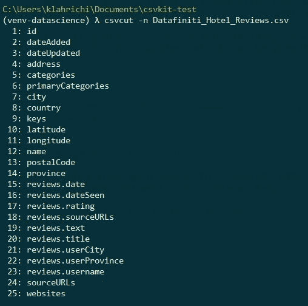
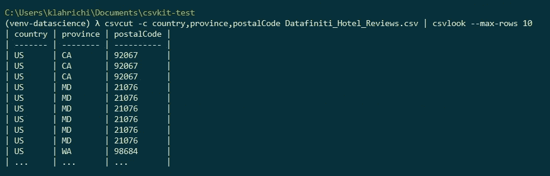
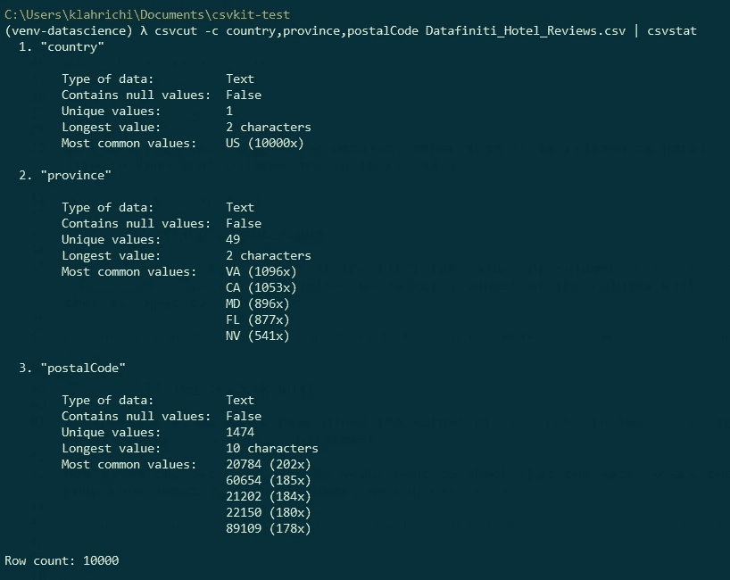
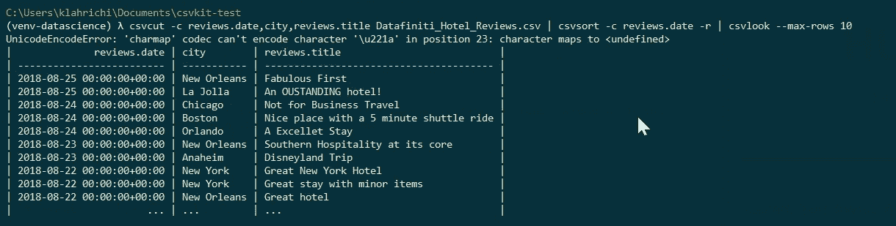
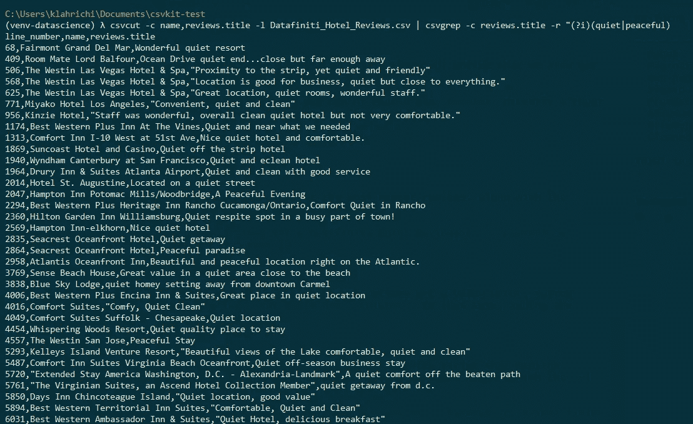
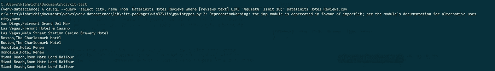

# CSV kit:CSV 数据的瑞士军刀？

> 原文：<https://towardsdatascience.com/csvkit-a-swiss-army-knife-for-csv-data-286db551547b?source=collection_archive---------41----------------------->

## 评估 csvkit 从命令行操作数据的潜力


马库斯·斯皮斯克在 [Unsplash](https://unsplash.com?utm_source=medium&utm_medium=referral) 上拍摄的照片

当面对一个新的 CSV 数据集进行分析时，我们大多数数据科学家会立即启动我们最喜欢的 IDE 或笔记本编辑器，从通常的`numpy`和`pandas`导入开始。

这并没有什么错，但是今天我想向您展示如何在不离开命令行的情况下近距离接触您的数据。

我将使用`csvkit`，一个专门为此设计的工具。我还将在示例中使用 Kaggle 数据集，它也可以从命令行下载，如下所示:

```
pip install kaggle kaggle datasets download datafiniti/hotel-reviews unzip hotel-reviews.zip
```

# 探索数据集

**csvcut** :

我们对这个数据集了解不多，只知道它与酒店有关。首先，我们想知道那里有哪些列。简单:

```
csvcut -n Datafiniti_Hotel_Reviews.csv
```



**csvlook** :

假设您想看看列`province`和`postalCode`的前几个值。在下面的代码中，我们选择带有`csvcut`的列的子集，并将其作为`csvlook`的输入:

```
csvcut -c country,province,postalCode Datafiniti_Hotel_Reviews.csv | csvlook --max-rows 10
```



或者，我们可以将`csvlook`的输出传送到`head`命令，而不是使用`--max-rows`参数。

**csvstat** :

现在给定上面的输出，我们可能想要检查数据是否只覆盖美国。要了解更多关于特定列的信息，我们可以使用`csvstat`:

```
csvcut -c country,province,postalCode Datafiniti_Hotel_Reviews.csv | csvstat
```



这是很多非常有用的信息，非常容易获得！注意，我们还从上面的输出中获得了文件中的行数。

如果您想获得所有列的统计数据，您当然可以直接使用`csvstat`而不用管道:

```
csvstat Datafiniti_Hotel_Reviews.csv
```

csvort:

假设现在我们想快速浏览一下最近的评论和城市。我们可以试着用`csvsort`来做:

```
csvcut -c reviews.date,city,reviews.title Datafiniti_Hotel_Reviews.csv | csvsort -c reviews.date -r | csvlook --max-rows 10
```



*旁注:*根据我选择的列，我有时会得到一个值错误，类似于`Row has X values, but Table has Y columns`。在这种情况下，添加`--snifflimit 0`可以解决问题。

**csvgrep** :

为了结束探索阶段，让我们寻找所有提到“安静”或“和平”酒店的评论标题。在下面的命令中，我添加了带有`-l`标志的行号。`csvgrep`命令的一个缺点是我不能将它的输出通过管道传递给其他命令。

```
csvcut -c name,reviews.title -l Datafiniti_Hotel_Reviews.csv | csvgrep -c reviews.title -r "(?i)(quiet|peaceful)
```



# 查询数据集

`csvkit`的一个非常酷的特性是能够用 SQL 从命令行查询数据。

例如，让我们再次搜索安静的酒店，但这次输出他们的城市和酒店名称:

```
csvsql --query "select city, name from Datafiniti_Hotel_Reviews where [reviews.text] LIKE '%quiet%' limit 10;" Datafiniti_Hotel_Reviews.csv
```

运行此命令会产生以下输出:



不幸的是，我不得不说，运行这个查询相当慢，这有点违背了使用命令行的初衷。

尽管我们可以将 CSV 保存为本地数据库，然后查询该数据库，但我再次发现，如果我打算走数据库这条路，我还不如全力使用编程语言。

# 结论

总而言之，我发现 **csvkit** 的前提很有趣，但是 sql 请求的缓慢运行速度是一个很大的失望。对我来说，价值主张不足以让我放弃熊猫和 jupyter，即使是为了探险。