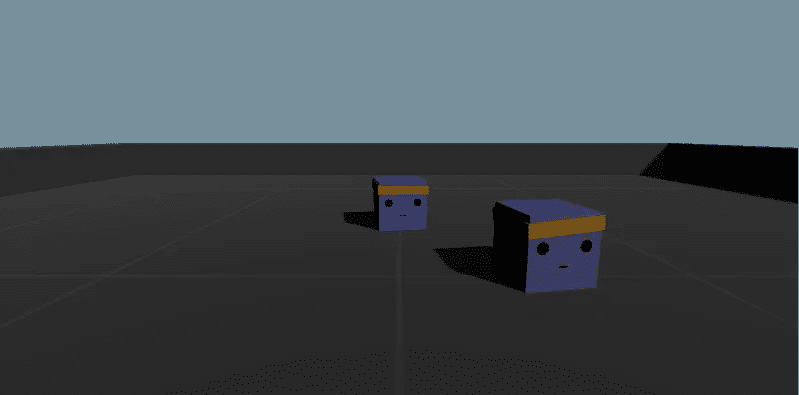
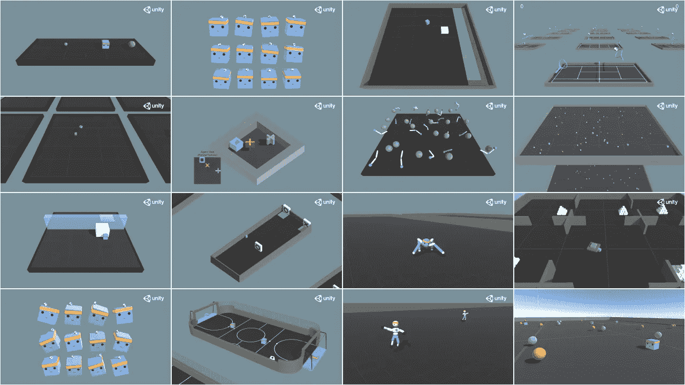
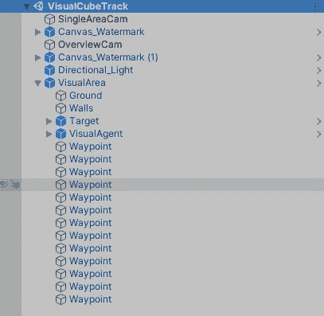
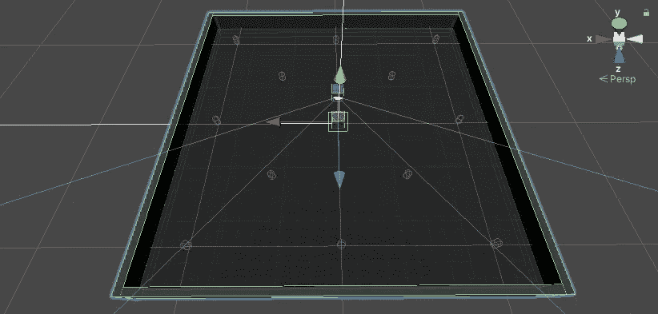
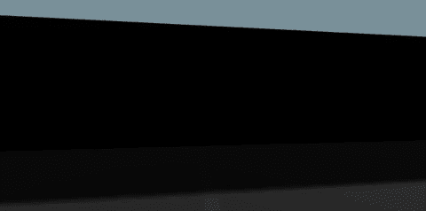
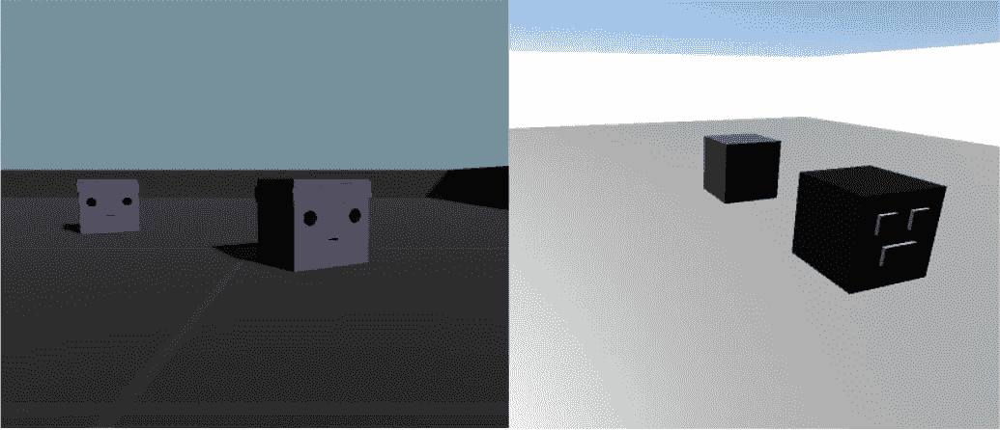
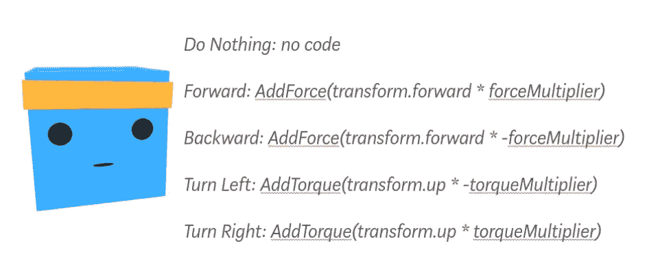
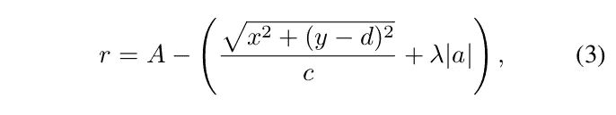
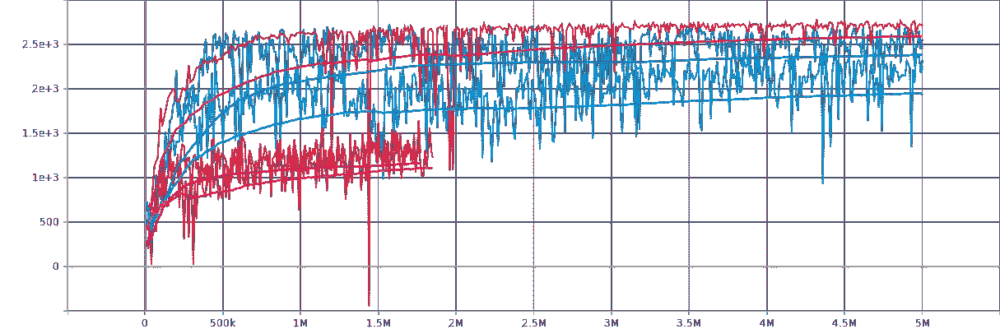
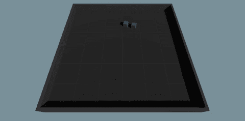

# CubeTrack:使用 Unity + ML-Agents 进行主动跟踪的深度 RL

> 原文：<https://towardsdatascience.com/cubetrack-deep-rl-for-active-tracking-with-unity-ml-agents-6b92d58acb5d?source=collection_archive---------35----------------------->



游戏视图中的立方体追踪(图片由作者提供)

**CubeTrack** ，对我来说，是一次用 ***主动对象跟踪*** (AOT)和游戏引擎支持的 ***深度强化学习*** (RL)来弄脏我的手的练习，同时我等待着开发一个更复杂、更逼真的模拟我的真实世界部署环境的工具。到目前为止，我一直在现成的健身房环境中工作，但是对定制环境的需求让我选择了 Unity 和 ML-Agents。



ML-Agents 示例环境(图片来自[Unity ML-Agents Toolkit Github 库](https://github.com/Unity-Technologies/ml-agents/blob/master/docs/images/example-envs.png))

ML-Agents 附带的示例环境不包含跟踪问题，因此我遵循创建新环境的指导原则，在平台上保持相同的多维数据集设置。有了这样一个相似、简单的设计，我认为整理这个项目并不需要太多的努力，把我和一些 ML-Agents 项目预置放在一起的游戏对象交换出去(只是为了风格的一致性)，并使这个项目成为一个公共回购。示例环境对于学习、实践、测试和构建非常有用。希望 CubeTrack 可以以同样的方式使用，但在不同的问题空间。

> 该项目在[https://github.com/kirstenrichardson/CubeTrack](https://github.com/kirstenrichardson/CubeTrack)进行

如果您只是想使用环境，那么您需要知道的一切都在自述文件中。如果你是 RL 的新手，我建议你看一下史云光·斯廷布鲁格的 Youtube 频道上的一些视频，以获得一个总体概述，并进一步了解这里介绍的工作中使用的算法 PPO(近似策略优化)。或者，如果你有更多的时间，并且想更深入地研究，我推荐《深度思维》的大卫·西尔弗的《RL 简介》系列讲座。

如果你已经熟悉 RL，但对如何在 Unity 中用自定义环境解决自定义问题感兴趣，那么请继续阅读，我将介绍 ML-Agents 以及 CubeTrack 是如何组装的。如果你已经熟悉 Unity 和 ML-Agents，只是想知道基于学习的决策促进了成功的跟踪，那么跳到[设计选择](https://medium.com/p/6b92d58acb5d#e28a)。

ML-Agents 是 ***将常规 Unity 场景转化为学习环境*** 的插件。它提供了一个 Python 低级 API(包含在 Python 包`mlagents_envs`中),用于处理 Unity 环境中的通信器和 Python 训练脚本之间的通信(要么是工具包附带的实现，它们是自己的 Python 包`mlagents`的一部分，要么是您选择的实现，可以选择使用第三个 Python 包`gym-unity`将 Unity 环境包装在 gym 包装器中)。在将 [ML-Agents repo](https://github.com/Unity-Technologies/ml-agents) 克隆到本地目录(设置为 [pipenv](https://docs.pipenv.org/) )并[安装](https://github.com/Unity-Technologies/ml-agents/blob/master/docs/Installation.md)各种 ML-Agents 包之后，我打开 Unity Hub 并在同一位置创建了一个新的 3D Unity 项目。

```
Version information:
  ml-agents: 0.18.0,
  ml-agents-envs: 0.18.0,
  Communicator API: 1.0.0,
  TensorFlow: 1.14.0,
  Unity: 2019.4.4f1,
  Python: 3.6.9
```

# 统一场景

这里没有华而不实。我所需要的是一个非玩家角色(NPC)(不受人类玩家控制的游戏对象)在一个区域内随机移动，提供一个移动的*，以及一个游戏对象代表跟踪器(或 ***代理*** ，使用 RL 术语)响应一些外部“玩家”输入而移动。令人困惑的是，Unity 可以将 NPC 称为人工智能控制的，但人工智能在这里是指预编程的，因此是独立的，而不是像我们的 RL 模型“玩家”那样主动学习，它位于 Unity 的外部。*

**

*层级窗口示例(按作者排序的图像)*

***CubeTrack** 有两个几乎相同的场景，CubeTrack 和 VisualCubeTrack，后者在代理立方体上增加了第一人称视角摄像头。除了游戏相机和照明，场景只包含一个名为 Area(或 VisualArea)的预设——一个包含所有组成 RL 环境的组件的空游戏对象。这个容器预置使复制环境变得容易，拥有多个环境实例可以加速训练，将我们的代理立方体车队的“共享大脑”暴露给并行的多种体验。该区域可分为三个部分:*

*   *训练场:由一系列立方体组成的场地和墙壁。此外，13 个圆柱体(航路点)以网格模式放置在地面上，它们的网格渲染器组件和胶囊碰撞器组件未选中，因此它们都是不可见的，并且能够通过。*
*   ***目标:**一个紫色的立方体，用更小的子对象立方体作为头带、眼睛和嘴巴。为了让立方体在平台上移动，添加了一个名为 NavMesh 代理的组件和一个名为`TargetMovement`的脚本。一个 NavMesh 被烤到了地上(区域预置是开放的，因此它存在于每个区域实例中)，每个航路点都被赋予了标签`RandomPoint`。然后可以通过脚本从标签为`RandomPoint`的对象列表中选择一个随机航路点，并将航路点的位置设置为 NavMesh 代理的目的地，即目标立方体。更多细节请参见此[视频](https://www.youtube.com/watch?v=3AoBCabLIxY)。*
*   ***代理:**一个蓝色的立方体，有头带、眼睛和嘴巴，这次有一个刚体组件，使它能够在物理的控制下行动，并施加力。你可以使用刚体的质量和阻力参数来改变立方体滑动的方式。当使用视觉观察时，添加了一个相机作为子对象，并定位为指向正面(向下看的那个`transform.forward`)。*

**

*场景视图显示航路点对象和代理摄像机 FOV(图片由作者提供)*

# *学习环境建立*

*通过 ML-Agents，将这个普通的 Unity 场景转变为人工智能的训练场所变得超级简单。做这件事的文档是[这里是](https://github.com/Unity-Technologies/ml-agents/blob/master/docs/Learning-Environment-Create-New.md)，但是这些是基本步骤..*

*   *安装 **Unity 包***

*选择游戏对象作为你的 RL 代理..*

*   *添加一个**脚本**组件*
*   *添加一个**行为参数**组件*
*   *添加一个**决策请求器**组件*
*   *(可选)添加一个**摄像头传感器**组件*

*转到您的本地 ML-Agents repo 目录(或本地 CubeTrack repo 目录)并..*

*   *添加一个**配置文件***

*所有这些都准备好了，你的 Unity 场景就可以训练一个模型了。要开始训练，请确保代理多维数据集的行为参数组件下的模型字段显示无。打开终端并使用单一命令行实用程序…*

```
*mlagents-learn ./config/ppo/CubeTrack.yaml --run-id=runName*
```

*…带有结尾标记的任何选项(使用-h 探索 mlagents-learn 命令的完整用法)。然后转到 Unity 编辑器，点击▶️.提供了很大的灵活性，包括恢复尚未结束的训练运行(全局 max_steps 参数)或在现有模型的基础上进行训练。更多详情见[此处](https://github.com/Unity-Technologies/ml-agents/blob/master/docs/Training-ML-Agents.md)。*

*当训练运行完成或提前终止时，模型权重被保存到。“结果”文件夹中的 nn(神经网络)文件。mlagents-learn 命令需要从与您正在使用的配置和结果文件夹相同的位置调用。如果您已经克隆了 ML-Agents repo，那么您可以将您的配置文件与示例环境的所有 yaml 文件放在一起，并从 ML-Agents repo 目录的**根目录运行命令。**cube track repo 有自己的配置和结果文件夹，因此可以在没有 ML-Agents repo 本地副本的情况下使用。在这种情况下，从 CubeTrack repo 目录的**根目录发出命令。***

*推断非常简单，只需复制并粘贴。nn 文件到您的项目资产文件夹，拖动到模型领域，并点击▶️.*

# *设计选择*

## *观察*

*首先，我试图用向量观察来培养追踪行为。被选作观察集的变量组在不同的实验运行中有所不同，但最终成为以下 12 个观察集:*

*   *代理的位置(2 个 obs，对象变换位置的 *x* 和 *z* 组件)*
*   *目标的位置*
*   *代理的速度(`velocity.magnitude`)*
*   *目标的速度*
*   *代理的面向方向(`transform.forward`)(矢量 so 3 obs)*
*   *目标面对的方向*

*一旦以这种方式实现了跟踪，就添加了一个相机传感器，删除了`CollectObservations()`功能，并将检查器窗口中的空间大小设置为 0。相机传感器设置为传送 84 x 84 PNG 型号的图像。下面的 GIF 演示了代理的 POV(注意，这是在调整图像大小之前——模型从同一台相机接收图像，但分辨率较低)。喊出身临其境的极限[视觉变色龙](https://www.immersivelimit.com/tutorials/visual-chameleons)教程由[亚当凯利](https://medium.com/u/9d96550e35f4?source=post_page-----6b92d58acb5d--------------------------------)在这里。*

**

*从代理的机载摄像头查看-游戏视图显示 2(图片由作者提供)*

*在我整理项目和利用 ML-Agents 示例环境中使用的游戏对象之前，我已经通过选择具有最高对比度的材质颜色(黑色目标立方体、浅灰色地面和白色墙壁)、关闭阴影和关闭阴影投射，给了我的代理成功进行视觉观察的最佳机会。在此设置中，足以传递模型灰度 84 x 84 图像(相机传感器组件下的勾选框)，但在 VisualCubeTrack 的较新版本中，需要彩色图像。*

**

*(左)最新版本的 CubeTrack(右)早期版本的 CubeTrack(图片由作者提供)*

## *行动*

*最初，动作空间被设置为连续的。该模型传入了两个浮点值，这两个值在用作同时沿 *x* 和 *z* 轴施加的力的大小之前，都使用`Mathf.Clamp`在-1 和 1 之间进行了限幅。我后来决定了一个简单的 5 选离散行动空间..*

**

*行动空间(图片由作者提供，灵感来自[托马斯·西蒙尼尼](https://medium.com/u/5178b198735a?source=post_page-----6b92d58acb5d--------------------------------)的[Unity ML-Agents 简介](/an-introduction-to-unity-ml-agents-6238452fcf4c))*

*通过将每个动作选项分配给一个箭头键，并对看起来合理的选项进行实验，来测试每种情况下施加的力的大小。前进/后退的幅度为 500，转弯的幅度为 250。*

*我遇到的一个问题可以被描述为代理持续“超调”，导致旋转行为或钟摆般的向前然后向后移动。我意识到我将决策请求者的决策周期设置为 10，但勾选了“在决策之间采取行动”，导致连续十步采取相同的行动。将决策周期更改为 1 并没有使 sim 不堪重负，也没有消除超调。*

## *奖励*

*我第一次尝试奖励工程学是受到了下面的博客的启发，这篇博客是由[亚当·普莱斯](https://medium.com/u/9e52daf12ce1?source=post_page-----6b92d58acb5d--------------------------------)写的关于利用课程学习进行追逃(见他的开源追逃游戏[这里](https://github.com/adamprice97/UnityPursitEvasionGame))。*

*[](/curriculum-learning-with-unity-ml-agents-c8e7a1aa5415) [## 使用 Unity ML-agent 的课程学习

### 教一队猎人捕捉猎物。

towardsdatascience.com](/curriculum-learning-with-unity-ml-agents-c8e7a1aa5415) 

复制“延伸”行为非常有效。我增加了目标的速度，减少了被认为“足够接近”目标的距离。然后，我尝试在这个模型的基础上进行新的培训，鼓励使用计数器变量进行跟踪，计算目标范围内连续`FixedUpdate()`呼叫的数量。目标速度再次增加，这一次“持续时间”阈值(计数器变量需要达到的值)也增加了。第二阶段进展缓慢！一旦剧集终止代码被删除，代理人的最终行为是只跟踪导致奖励的时间长度，然后失去兴趣(显然是回想起来)。

我需要一个函数来分配每一步的比例奖励，我在的一篇论文中看到了一个这样的例子[罗等人(2018)](https://arxiv.org/abs/1705.10561) 。该功能如下所示:



奖励函数(图片来自[罗等(2018)](http://proceedings.mlr.press/v80/luo18a/luo18a.pdf) )

*   *A* 、 *d* 、 *c* 和 *λ* 都是调谐参数。 *A* 和 *d* 纯属设计选择， *A* 为一步可分配的最大奖励(设置为 1，与罗纸相同) *d* 为最佳前进/后退距离(根据游戏视图中看似合理的差距设置为 3)。
*   括号的左边是奖励代理的位置，右边是代理面对的方向。为了生成[-1，1]范围内的奖励，需要设置 *c* 和 *λ* 以使括号中的最大值为 2。Unity 中的旋转从-180°到 180°，因此如果旋转和定位的权重相等，则 *λ* 应该总是 1/180。 *c* 的值根据所用训练场地的大小而变化。
*   *x* 和 *y* 代表从代理到目标的航向矢量的 *x* 和 *z* 分量。取方向分量总和的平方根，计算矢量的长度，即距离。当代理和目标在 *x* 平面上的位置相同，但`heading.z`为+3 时，整项为零，奖励最高。我意识到`heading.z`的符号根据目标的行进方向而变化，导致代理人有时因在目标后面而被奖励，有时因在目标前面而被奖励(没有帮助！).因此，有一个额外的代码块来确保在目标的后面**发布最高奖励，即使根据世界 z 轴，代理在技术上在目标的前面。**

```
if (Vector3.Dot(heading.normalized, Target.transform.forward) > 0)
 {
  heading.z = Mathf.Abs(heading.z);
 } else {
  heading.z = -Mathf.Abs(heading.z);
 }
```

*   *a* 是代理的`transform.forward`矢量和航向矢量之间的角度。这鼓励目标去**看**目标。最初我将 *a* (在下面的引用中)的描述解释为代理的`transform.forward`和目标的`transform.forward`之间的角度，但是后来的实现(指向的角度)工作得更好，我认为这是有意义的，特别是在视觉设置中。

> “当物体完美地站在智能体前面距离 d 处，且**不旋转**时，奖励 A 最大”—罗等(2018)

下面是该项目的函数的代码实现。

```
var rDist = Mathf.Sqrt(Mathf.Pow(heading.x, 2f) + Mathf.Pow((heading.z - d), 2f));        
 var r = A - ((rDist/c) + (a*lam));
 AddReward(r);.
```

# 结果

培训在我的联想 Thinkpad T480s 笔记本电脑(英特尔酷睿 i7–8550 u 处理器，4 核，8 线程，1.80 GHz 处理器主频)上进行，将`max_steps`设置为 5M。下图是 TensorBoard 生成的平滑度为 0.99 的累积奖励图。

使用矢量观察(粉色)进行的训练最初需要大约 5 个小时，但使用六个训练场后减少到大约 2 个小时(参见立方体轨道场景中的游戏视图显示 2)。在这种情况下，奖励值代表六个区域实例的平均奖励。曲线图的坐标轴模糊不清，但累积奖励稳定在 2500 左右。注意，在一集中可实现的最大奖励是 3000(除非该集的累积奖励下降到-450 以下，否则该集在 3000 步处终止)，但是将要求代理的随机开始位置和面向方向是从奖励函数中引出直接+1 的位置和面向方向。



5 次不同训练跑的累计奖励超过 500 万步(图片由作者提供)

下面的深蓝色线条说明了 VisualCubeTrack 的第一个版本中视觉观察跟踪的成功，具有高对比度的颜色，没有阴影或阴影。在较新版本的 VisualCubeTrack 中使用灰度图像进行训练导致了显著的性能下降(浅橙色)，而仅改变为彩色观察对改善事情(红色)几乎没有作用。在这两种情况下，训练都被缩短了。直到视觉编码器从`simple` (2 个卷积层)变为`resenet` ( [IMPALA ResNet](https://arxiv.org/pdf/1802.01561.pdf) —三个堆叠层，每个层有两个剩余块)，进展才有所改善(浅蓝色)，累积奖励稳定在 2300 左右，推理呈现合理行为。这次训练包括一个训练场地，持续了大约 56 个小时。

# 范围

本博客主要讨论的是第一个“设置”(奖励功能，环境设置，训练配置等。等等。)来引出令人信服的跟随行为，仅此而已。受过训练的代理在 VisualCubeTrack 中的表现尤其有改进的余地。改进的途径包括..

*   进一步调整配置文件中的超参数
*   进一步奖励工程，例如增加长期奖励
*   使用不同的算法(ML-Agents 提供软演员评论家的实现)或不同的实现(在使用 ML-Agents 之前，我选择的 RL 库是来自 [Antonin RAFFIN](https://medium.com/u/2409d35123af?source=post_page-----6b92d58acb5d--------------------------------) 和其他人的[稳定基线](https://stable-baselines.readthedocs.io/en/master/)
*   使用额外的技术，例如已经提到的课程学习或称为好奇心的内在奖励信号
*   例如，使用域随机化使学习到的策略更加健壮
*   通过在多个环境实例上进行训练或使用可执行文件而不是在编辑器中进行训练来提高训练效率

除了在当前版本的环境中提高性能之外，具有深度 RL 的 AOT 还可以通过以下方式进一步提高..

*   增加学习问题的复杂性，例如引入与目标或增加的障碍碰撞的惩罚
*   使用更加复杂和真实的 sim 卡！！



CubeTrack.nn 上的推论(图片由作者提供)

如果你发现任何疏忽或有任何想法或问题等。那么，请在下面发表评论或在@ KN _ Richardson 给我发推文。注意安全！

[1]:朱利安尼，a .，伯格斯，v .，滕，e .，科恩，a .，哈珀，j .，埃利翁，c .，戈伊，c .，高，y .，亨利，h .，马塔，m .，兰格，D. (2020)。Unity:智能代理的通用平台。 *arXiv 预印本*[arXiv:1809.02627](https://arxiv.org/abs/1809.02627)*。*[https://github.com/Unity-Technologies/ml-agents](https://github.com/Unity-Technologies/ml-agents)。

[2]:罗文伟、孙平、钟、冯芳、刘文伟、张、汤、王(2018 年 7 月)。基于强化学习的端到端主动目标跟踪。在*机器学习国际会议*(第 3286–3295 页)。

[3]: A .希尔，a .拉芬，m .埃内斯托斯，a .格莱夫，a .卡内维斯托，r .特拉奥雷，p .达里瓦尔，c .黑塞，o .克里莫夫，a .尼科尔，m .普拉波特，a .拉德福德，j .舒尔曼，s .西多尔，y .吴，《稳定的基线》，[，](https://github.com/hill-a/stable-baselines)，2018。*