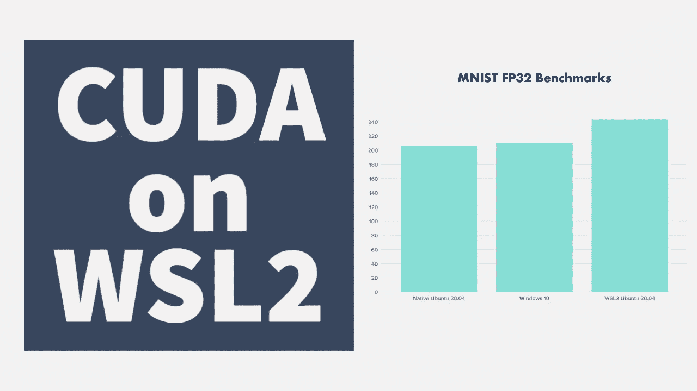
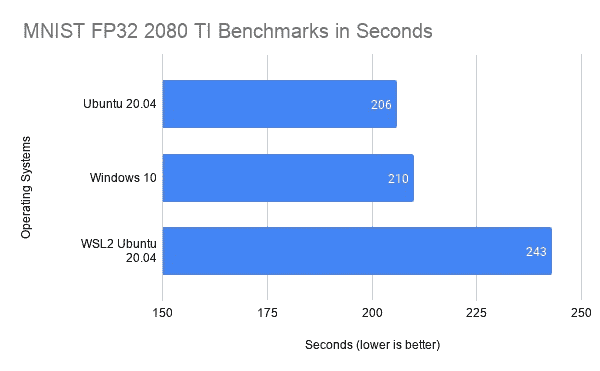

# 用于深度学习的 WSL2 上的 Cuda 第一印象和基准

> 原文：<https://towardsdatascience.com/cuda-on-wsl2-for-deep-learning-first-impressions-and-benchmarks-3c0178754035?source=collection_archive---------14----------------------->



不打算说谎，微软一直在软件开发社区做一些好事。我喜欢用 Visual Studio 代码编写代码，如果你想为生产优化你的深度学习模型，ONNX 非常棒。WSL2 允许你访问整个 Linux 内核正是我一直想要的，但缺乏 CUDA 支持意味着它对我这个人工智能工程师来说是不可能的。

作为一名人工智能工程师和内容创作者，我需要 Windows 作为工具来创建我的内容，但我需要 Linux 来轻松运行和培训我的人工智能软件项目。我在我的机器上有一个双启动设置，但它并不理想。我讨厌当我在训练一个模型时，我不能使用我的创作工具。所以我必须同步工作而不是异步工作。

我知道大多数深度学习库支持 Windows，但让东西工作的体验，尤其是开源人工智能软件，总是令人头疼。我知道我可以使用类似`qemu`的东西在 Linux 上运行 Windows 软件，但这需要我将整个 GPU 隔离到 VM，导致我的 Linux 实例无法访问它。

支持 CUDA WSL2 的微软和 Nvidia 来了！所有 Linux 工具在 Windows 上本机运行的承诺将是我的工作流的一个梦想。当他们发布一个预览版本时，我马上就接受了。在这篇文章中，我将写下我的第一印象以及一些基准！

# 在 WSL2 上设置 CUDA

[在 WSL2](https://docs.nvidia.com/cuda/wsl-user-guide/index.html) 上设置 Cuda 对我来说超级简单。Nvidia 有很好的文档解释你需要采取的步骤。令我惊喜的是，我没有遇到一个错误！我不记得上一次设置仍在测试阶段的软件时发生这种情况是什么时候了。

# 设置我的机器学习工具

作为一名专门花大量时间进行深度学习的人工智能工程师，我需要一些工具来改善我的开发体验。

1.  支持 CUDA 的 docker([NVIDIA-docker](https://github.com/NVIDIA/nvidia-doc)
2.  [PyTorch](https://pytorch.org/) 作为我选择的深度学习框架

自从双引导进入 Linux 后，我还没有尝试过 WSL2，所以我惊喜地发现我可以像在普通的 Ubuntu 机器上一样轻松地下载和安装我的工具。我安装这些软件包都没有问题。正如你所料，这是一次 Ubuntu 体验。

# 培训模型

好了，这是真正的考验。首先我将谈谈我的经验，然后我将展示一些基准来比较 WSL2 和裸机 Linux 上的 Cuda。

我认为在训练深度学习模型时，无论你是否有自己的硬件或是否在云上训练，一个常见的工作流程是为所有数据准备一个单独的磁盘，为实际的操作系统准备一个磁盘。WSL2 将自动检测和安装 Windows 10 识别的任何磁盘，因此很酷；但是我在安装的数据驱动器上遇到了文件`permissions`的问题。

**注意** : *这个问题只出现在挂载的驱动器上，如果你在你的 WSL2 文件系统中做任何事情，它都会正常工作。*

因此，由于文件权限受到限制，我的训练脚本会在随机数据文件上出错。所以我读了 WSL [文档](https://docs.microsoft.com/en-us/windows/wsl/file-permissions)，它说…

> *从 WSL 访问 Windows 文件时，文件权限或者从 Windows 权限中计算，或者从 WSL 添加到文件中的元数据中读取。默认情况下，不启用此元数据。*

好的，WSL2 计算文件权限，有时会出错，我想，我只需要启用这个元数据就能让它正常工作*对吗*？嗯，差不多吧…所以我添加了元数据，然后对我所有的数据文件做了`chmod -R 777`，这是一种快速而肮脏的方法，可以释放权限，这样我就可以继续训练了！嗯，有一点效果...然后它又出现了同样的权限错误！所以我查看了权限，它不知何故恢复了我的更改，回到了受限访问。更有意思的是，如果我多次检查文件权限，它就会恢复到我的 chmod 权限。所以这是随机改变权限，我知道的唯一方法是用`ls -l`检查权限。我发现了一个奇怪的 WSL2 量子现象，我将硬币...*[*薛定谔的文件权限*](https://en.wikipedia.org/wiki/Schr%C3%B6dinger%27s_cat#:~:text=Schr%C3%B6dinger's%20cat%20is%20a%20thought,mechanics%20applied%20to%20everyday%20objects.) *。*当我使用`chmod 700`将完全的读、写和执行权限只授予 WSL2 用户而不是每个人和他们的妈妈时，问题就解决了。这在某种程度上解决了薛定谔的文件权限问题，所以我继续生活。*

*从那以后，我开始训练，没有任何问题！一切看起来都很好，模型损失正在下降，没有什么看起来不寻常的。我决定做一些基准测试，比较 Ubuntu 与 WSL2 Ubuntu 与 Windows 10 的深度学习训练性能。*

# *基准测试——Ubuntu vs . wsl 2 vs . Windows 10*

*为了进行基准测试，我使用了来自 [Pytorch 示例回购](https://github.com/pytorch/examples/blob/master/mnist/main.py)的 MNIST 脚本。我修改了脚本，使网络更大，以获得更大模型的更准确读数。*

```
*class Net(nn.Module):
    def __init__(self):
        super(Net, self).__init__()
        self.conv1 = nn.Conv2d(1, 128, 3, 1)
        self.conv2 = nn.Conv2d(128, 128, 3, 1)
        self.conv3 = nn.Conv2d(128, 128, 3, 1)
        self.dropout1 = nn.Dropout2d(0.25)
        self.dropout2 = nn.Dropout2d(0.5)
        self.fc1 = nn.Linear(15488, 15488//2)
        self.fc2 = nn.Linear(15488//2, 10)

    def forward(self, x):
        x = self.conv1(x)
        x = F.relu(x)
        x = self.conv2(x)
        x = F.relu(x)
        x = self.conv3(x)
        x = F.relu(x)
        x = F.max_pool2d(x, 2)
        x = self.dropout1(x)
        x = torch.flatten(x, 1)
        x = self.fc1(x)
        x = F.relu(x)
        x = self.dropout2(x)
        x = self.fc2(x)
        output = F.log_softmax(x, dim=1)
        return output*
```

*我的机器规格是…*

*   *英特尔 i9 10920X — 12 个内核，24 条线程*
*   *英伟达 RTX 2080 TI — 11GB VRAM*

*我对…进行了 3 次测试*

*   *Ubuntu 20.04*
*   *WSL2 Ubuntu 20.04*
*   *Windows 10*

*我使用 FP32 精度的 512 批次大小，运行 14 个时期。以下是结果…*

****

*所以说实话成绩还不算太差！**在我的英伟达 RTX 2080 Ti 上，支持 CUDA 的 WSL2 比原生 Ubuntu 多花了 18%的时间来训练 MNIST 模型**。WSL2 对 CUDA 的支持仍处于早期预览模式，我希望工程师和研究人员以及微软和 Nvidia 最终会达到接近 Ubuntu 的性能。*

*对于一些人来说，花 18%的时间来训练模型可能是不可行的，但对我来说，如果这意味着我可以异步地训练深度学习模型，并使用我的 Windows 兼容软件工具来创建内容，我可以接受这种小的性能打击。我打算暂时继续使用 Windows 10 和 WSL2 作为我的日常驱动程序，看看效果如何！*

*✍🏽原载于【https://www.michaelphi.com】*

**🥇注册我的 [**电子邮件简讯**](http://eepurl.com/gwy3hj) **，了解最新的文章和视频！****

**📺喜欢看基于项目的视频？来看看我的 [**Youtube**](https://www.youtube.com/channel/UCYpBgT4riB-VpsBBBQkblqQ?view_as=subscriber) ！**