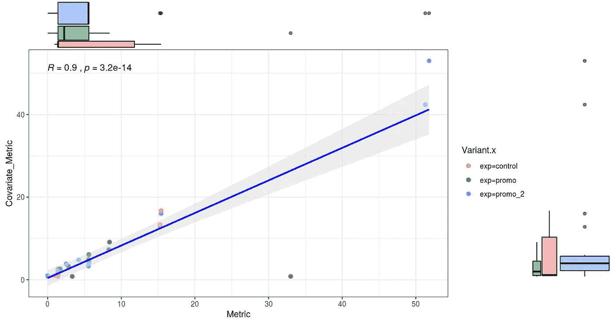
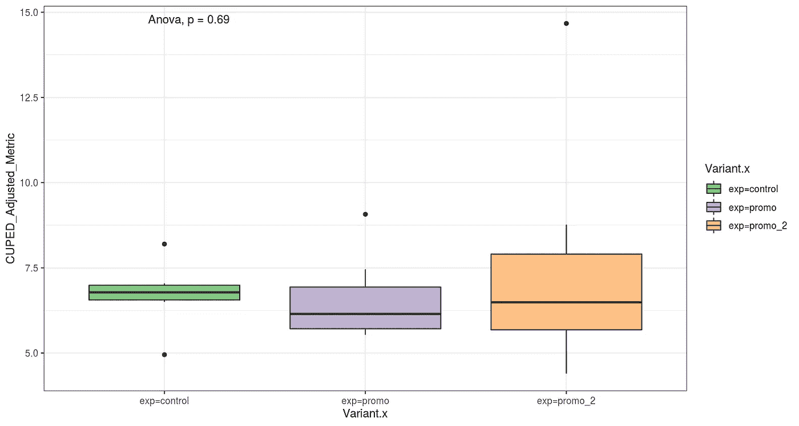
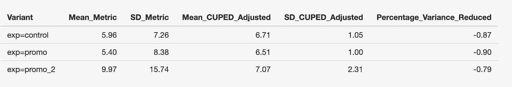
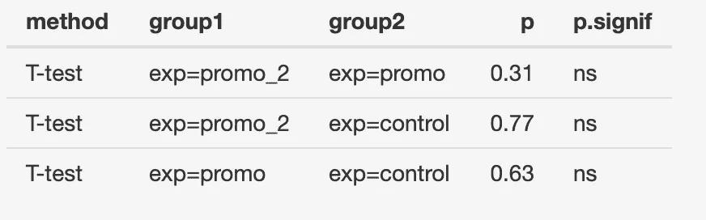

# 杯形 R-闪亮工具

> 原文：<https://towardsdatascience.com/cuped-r-shiny-tool-7a4869d77f0a?source=collection_archive---------32----------------------->



# CUPED 简介

最近，我一直在探索提高实验灵敏度的方法——通过减少与实验前信息相关的方差。如果可以确定实验前指标(协变量)和实验指标之间的强相关性，则在进行任何显著性测试之前，可以控制实验指标中存在的方差。当使用预实验数据(CUPED)方法实施控制时，有几个不同的程序值得考虑，但我在 [**以前的中型帖子**](https://medium.com/bbc-data-science/increasing-experiment-sensitivity-through-pre-experiment-variance-reduction-166d7d00d8fd) (改编自[**【Booking.com】**](https://booking.ai/how-booking-com-increases-the-power-of-online-experiments-with-cuped-995d186fff1d))中已经写过关于“协变方法”的内容。协变量方法关注预实验和实验指标之间的关系(这通常是一个连续变量)，忽略实验开始前存在的差异。所述方差的减少导致实验能力的增加，这意味着您更有可能检测到统计上显著的影响(考虑这是一种降噪的方法，以便检测在您的实验条件之间可能存在或可能不存在的任何真实影响)。

我以前在 CUPED 方法方面的工作包括一个使用我在 Python 中的一些工作的例子，以及如何将预实验信息合并到您在 *cookie_id* 单元上的实验数据中。遗憾的是，执行这种分析可能是相当劳动密集型的，包括导入数据帧，确保它们具有唯一的标识符，然后执行与实验前和实验数据帧的合并(我们大多数人都没有那么多时间)。

出于这个原因，我构建了一个前端的、用户友好的 R Shiny 工具，它只需要上传几个简单的文件，所有繁重的工作都会为您完成。除了将我的 Python 作品翻译成 R 函数，这是一个相当简单的工作，你可以在这里 找到该工具的 [**链接。**](https://googlyanalytics.shinyapps.io/cuped_analysis_app/?_ga=2.236935368.893426594.1602426019-115386085.1602426019)

你也可以在我的 [**GitHub**](https://github.com/frankhopkins/cuped_analysis_application) 上找到该工具的代码。

# 使用工具

可以通过上面的 url 访问 CUPED 分析工具。您只需为协变量和实验指标填写两个单独的 *xlsx* 文件。您可以下载这些模板并将它们上传回应用程序。

一旦这些文件被上传回应用程序，就会为您计算 CUPED 调整后的指标，因此不需要额外的代码。应用于每个 *cookie_unit* 的常数(θ)计算如下:

```
cor_frame <- inner_join(covariate, metric, by = ‘User_Id’)

 covariance <- cov(cor_frame$Metric, cor_frame$Covariate_Metric)

 variance <- var(cor_frame$Covariate_Metric)

 theta <- covariance/variance

 cor_frame$CUPED_Adjusted_Metric <- cor_frame$Metric — (cor_frame$Covariate_Metric — mean(cor_frame$Covariate_Metric)) * theta
```

然后，您可以为您的协变量和实验指标绘制散点图；还提供了您的 R 和 p 值，这有助于您确定变量之间的关系强度，以及随后您的协变量是否适合 CUPED 方法:


图一。实验前协变量和实验指标之间的相关性，以及每个实验条件和指标的分布。r 和 p 值在图上给出。

在确定了实验前指标和实验指标之间的关系后，您可以对 CUPED 调整后的指标执行显著性测试。此输出提供组间方差分析(ANOVA)的结果，其中 *p* 设置为 **0.05** :



图二。经 CUPED 调整的指标的组间单向方差分析的输出。

然后，您可以分别生成实验指标和实验前协变量的平均值和标准差的表格。此表中最右边的一行显示了在显著性测试之前，您的 CUPED 调整指标忽略的相对差异量:



图 3。计算前后平均值和标准偏差的表格输出。方差减少的百分比是两个标准差之间的相对差值。

从图 3 中可以看出，在对所有三个实验条件进行显著性测试之前，已经减少了大量的差异。进行这种分析意味着你将提高实验的灵敏度，并得出更大数量的具有统计学意义的测试结论。

您还可以在您的实验中使用的每个个体变体之间生成成对比较(重复 *t 检验*)。这不仅有助于您识别给定的变异是否超出了您的控制条件，还能识别所有其他比较之间的统计差异:



图 4。表输出显示了 CUPED 调整指标的实验条件之间的独立 t 检验

享受这个工具吧！

弗兰克