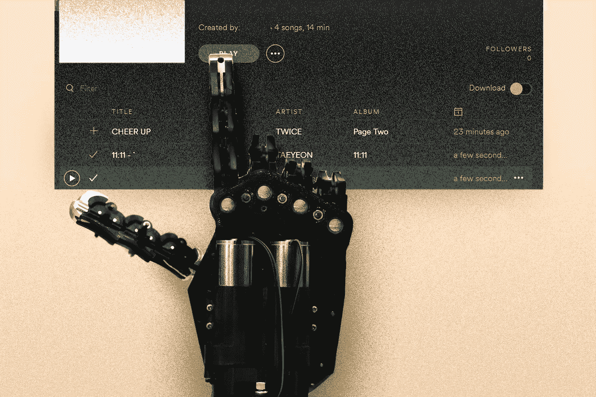
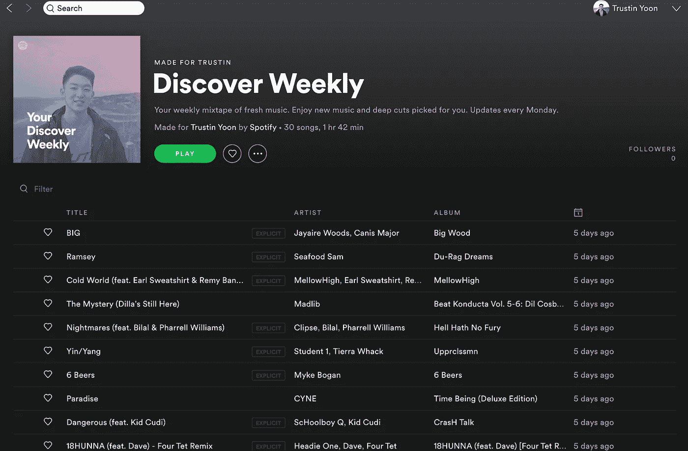
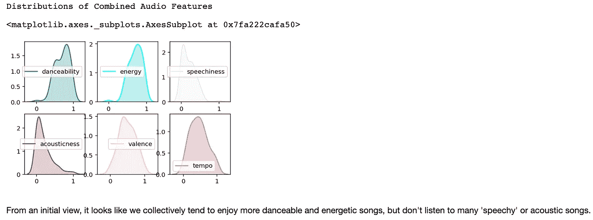
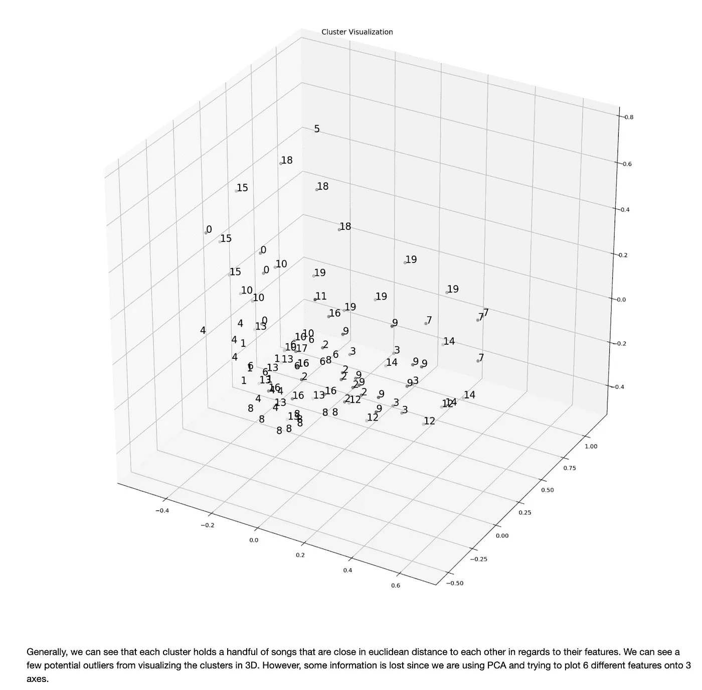
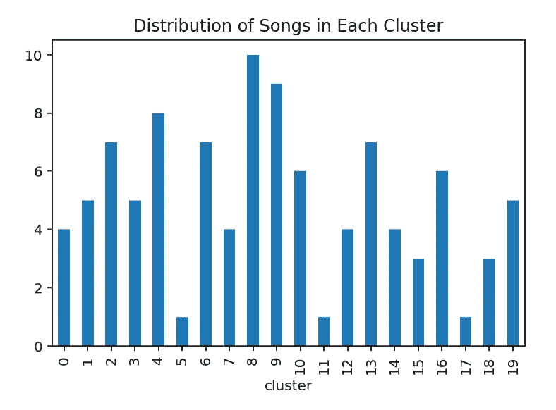
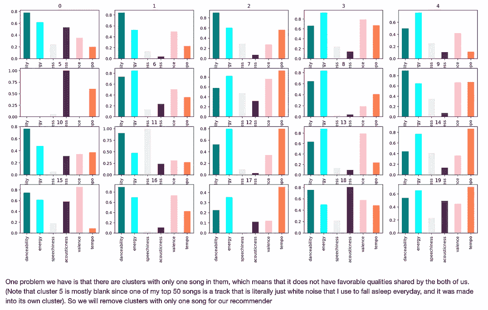
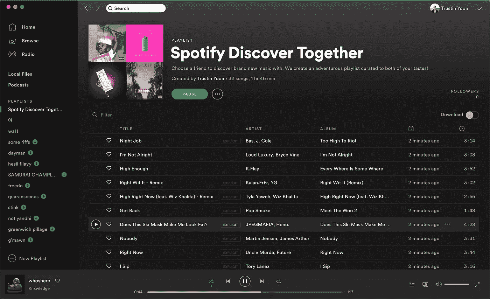

# 使用 K-Means 聚类管理两个人的 Spotify Discover 播放列表

> 原文：<https://towardsdatascience.com/curating-a-spotify-discover-playlist-for-two-people-with-k-means-clustering-a926a9e1ec7d?source=collection_archive---------46----------------------->

## 选择一个朋友一起发现全新的音乐。我们通过机器学习创建了一个符合你两种口味的冒险播放列表。

照片由[晨酿](https://unsplash.com/@morningbrew?utm_source=medium&utm_medium=referral)在 [Unsplash](https://unsplash.com?utm_source=medium&utm_medium=referral) 拍摄

iTunes 革新了音乐。Spotify 又这么做了。

音乐是我生活中的必需品。不仅因为我可以即时访问 5000 万首歌曲和超过 100 万个播客(耐心等待 9 月份的罗根)，还因为内置的*推荐*功能，在我还没有听完之前，它就神奇地告诉我我最新喜欢的歌曲是什么。Spotify 研究了我过去 7 年的收听历史，在彻底改变我的音乐品味方面发挥了巨大作用。我对 90 年代地下新灵魂 boombap 的热爱不是由我的韩国家庭介绍给我的，也不是来自我成长的爱看排行榜前 50 名的尔湾郊区。这是因为连续几个小时一次又一次地陷入 Spotify 推荐算法的兔子洞。我已经能够发现最喜欢的艺术家，并使我的流派调色板多样化，这远远超出了没有 Spotify 的情况。

对我的音乐探索之旅最重要的帮助就是 Spotify 的 Discover Weekly 播放列表。通过访问超过 1.1 亿用户的收听历史，Spotify 数据科学家每周一为用户推荐 30 首新歌曲，充分发挥了他们的 ML 能力。

我的每周探索播放列表截图

在 Spotify 的推荐中寻找一颗隐藏的宝石是如此令人愉快的经历，以至于我想知道是否有可能将这变成一次合作体验。**我想创建一个探索每周播放列表，了解两个人的音乐品味，并为他们推荐歌曲。由于隔离仍然是一件事，我认为这个“一起发现”播放列表可以作为一种新颖的社交活动。所以我和我的朋友 Arjun Reddy 合作，我们准备好了。**

点击这里查看完整的 GitHub 回购:[https://github.com/trustinyoon/Spotify-Discover-2gether](https://github.com/trustinyoon/Spotify-Discover-2gether)

# 数据收集

Arjun 和我决定将为我们的集体音乐品味策划的“一起发现”播放列表自动化，作为一项测试。我们使用 Spotify Web API 的轻量级 Python 库 Spotipy，并创建了一个 Spotify 开发者应用程序来获得 Spotify 个人资料数据的授权。这是官方的 Spotipy 文档:[https://spotipy.readthedocs.io/en/2.13.0/](https://spotipy.readthedocs.io/en/2.13.0/)

我们还从 Plegas Gerasimos 的回购协议中派生出授权流程代码，其中包含授权流程代码，可在此处找到:【https://github.com/makispl/Spotify-Data-Analysis

然后，我们创建了一个代码，授权访问用户的 Spotify 个人资料，使用 Spotify 的 current_user_top_tracks()函数提取他们的 50 首中期歌曲。中期是最佳的时间范围，因为短期歌曲太短(大约 1 周的歌曲)而长期太长(基本上是用户所有时间的歌曲历史)。然后将用户的前 50 首中期歌曲提取到一个. csv 文件中，并对第二个用户重复这一过程。

我们将前 50 首歌曲合并成一个包含 100 首歌曲的数据框架，用于分析和推荐歌曲。每首歌曲都有 Spotify 提供的关于其不同声音特征的官方数据:可跳舞性、能量、调(音乐调)、响度、模式(小调或大调)、语速、声学、乐器性、活跃度、效价(听起来有多积极/快乐/欢快)和节奏。这些特性用于从我们的数据帧创建集群。在得出其他特征对我们的分析来说是噪音的结论后，我们选择将重点放在可跳性、能量、语速、声音、效价和节奏上。这是我们最近最喜欢的歌曲的分布图。

# k 均值聚类

现在我们有了两个用户的前 50 首歌曲，我们可以使用这些歌曲来推荐适合两个人最近音乐品味的新歌。K-means 聚类是我们选择的方法，以便我们可以将组合歌曲中的每首歌曲分组到具有相似声音特征的聚类(子流派/歌曲类型)中。我们选择 k=20，即使 elbow 方法显示最佳 k=6，因为我们希望有更多指定的聚类，并基于不太一般化的聚类来推荐歌曲。如果歌曲在 6 轴图上的位置接近欧几里德距离，则它们将被聚集在一起。下面是 100 首歌曲的三维可视化，分别用它们各自的聚类来标记。

可视化时，一些信息会丢失，因为我们将 6 个特征展平到 3 个维度上。我们仍然能够可视化 20 个聚类，其中在给定的聚类中，每首歌曲彼此之间具有接近的欧几里德距离。

我们可以在下面进一步探究每个集群的摘要。

每个聚类的歌曲数量直方图(左)聚类的平均歌曲特征分布(右)

# 构建“一起发现”播放列表

一旦我们获得了每个集群的歌曲列表，我们就将每个列表输入到 Spotipy 的 recommendation()函数中，该函数接受 5 首种子歌曲作为推荐的基础。对于包含 5 首以上歌曲的聚类，我们从列表中随机选择 5 首来代表该聚类。包含少于 5 首歌曲的集群，我们保持原样。我们为每个聚类运行推荐功能，每次它为包含少于 5 首歌曲的聚类产生 1 首推荐曲目，为包含 5 首歌曲的聚类产生 2 首推荐曲目。我们想把更多的权重放在有更多歌曲的集群上，因为这意味着我们通常更喜欢那些集群中的歌曲。在获取所有推荐的曲目后，我们将它们放入一个列表中作为 Spotify 函数的参数，该函数会自动创建一个播放列表，并将给定的歌曲列表直接放入用户的 Spotify 库中。

# 结论

经过一周的编码，我们终于自动化了“一起发现”播放列表！下面是它的样子！

虽然有几首歌我们已经听过了，但我们普遍对推荐的质量非常满意，我们每个人都在个人播放列表中添加了几首推荐的歌曲！

“一起发现”还没有被开发成一个有效的公共网络应用。我们正在寻找任何能够熟练使用 JSON、web APIs 或 UI/UX 的应用程序开发人员，他们有兴趣帮助我们将这个项目变成一个可供任何两个想要一起探索新音乐的人使用的应用程序！如果你感兴趣，请通过 trustinyoon@gmail.com 或 arjunravulareddy@gmail.com[联系我们！](mailto:Arjunravulareddy@gmail.com)

___________________________________________________________________

**9/14/20 更新:我们已经建立了一个功能正常的网络应用程序，正在寻找出色的用户界面/UX 和图形设计师来帮助我们的标志，着陆页面美学和营销材料！如果有兴趣，请给 trustinyoon@gmail.com 发邮件，附上你的投资组合链接:)**