# Python 中装饰者的奇特案例

> 原文：<https://towardsdatascience.com/curious-case-of-decorators-in-python-9644a99e538?source=collection_archive---------37----------------------->

## 学习使用 Python 中的函数作为对象

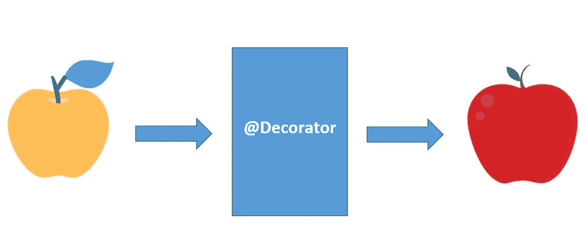

作者图片

我第一次接触 Python 中的 decorators 是在我使用 Flask 部署我的模型的时候。我在浏览 Flask 文档时遇到了一个 decorator 函数，读起来像@app.route("/")。我很感兴趣，开始阅读更多关于它的内容，并意识到装饰者的概念非常有趣和有用。

如果你也遇到了类似于 **@some_function** 的东西，并且你很想知道它，那么你应该通读这篇文章。装饰者的概念被认为有点难以破解，本文试图简化对装饰者的理解。

让我们快速浏览基础和构建模块以理解概念。

## 目录:

1.  函数是 Python 中的第一个类对象
2.  嵌套函数的一个重要特征
3.  建造装饰者
4.  广义装饰者
5.  结论
6.  参考

为了掌握装饰者的概念，我们应该首先知道并习惯于将函数作为对象使用。

# **函数是 Python 中的第一类对象**

在 Python 中，一切都是对象，称某个对象为第一类对象只是一个花哨的形容词，用于表示具有以下特权的对象。

*   函数可以存储在列表、元组和字典等数据结构中。
*   变量可以被分配给一个函数。
*   函数可以作为参数传递给其他函数。
*   函数可以从函数返回。

简而言之，一个第一类对象就像一个足球，可以在程序中的任何地方传递和投掷。让我们把上面提到的第一类对象的所有特征一个一个地看一下。

**函数可以存储在列表、元组、字典等数据结构中:**

让我们创建几个简单的函数，并将它们作为集合存储在一个列表中。

首先，我们定义了两个函数“加法”和“乘法”。

其次，将这两个函数添加到一个列表中，然后通过列表访问这些函数来调用它们。

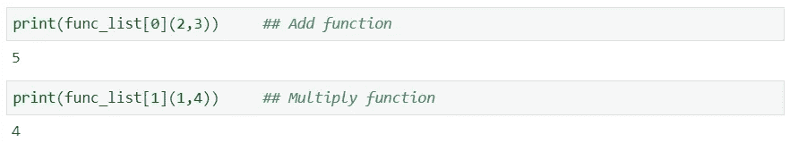

因此，由此我们可以很容易地看出，函数可以存储到一个集合类型的数据结构中。

**变量可以分配给一个函数:**

我们可以将一个变量赋给一个函数，然后使用所赋的变量名调用该函数。下面给出的代码显示了同样的情况。

在代码中，我们将变量“var_add”赋给了函数“add”。最后，分配的变量已被用来成功调用函数。

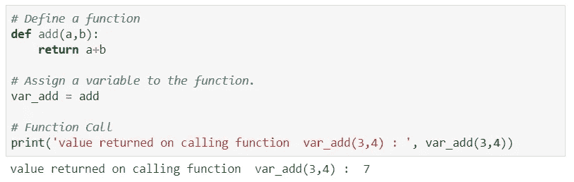

***

**函数可以作为参数传递给其他函数:**

在 Python 中，函数是一个对象，所以它也可以作为参数传递给其他函数。

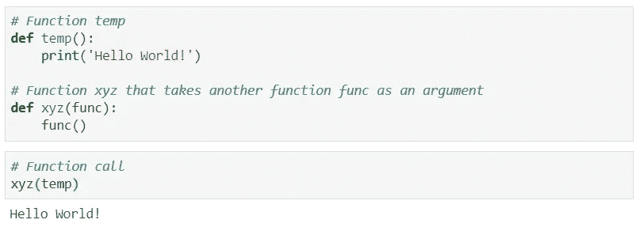

***

这里要注意的一件重要事情是，当我们将函数作为对象传递时，我们从不使用带括号的函数。原因很简单，函数和括号是用来进行函数调用的。

下面提到的代码显示了不同之处。我们知道 type()函数返回对象/类的类型，因此我们将 type function 应用于带括号和不带括号的函数名，以了解两者之间的区别。

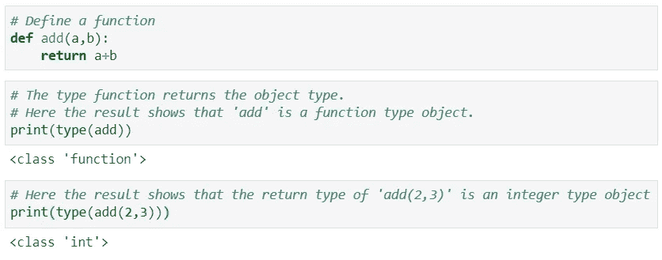

***

**一个函数可以从一个函数返回:**

如上所述，我们知道函数是一个对象，因此函数可以返回一个函数对象。下面的代码显示了同样的情况。

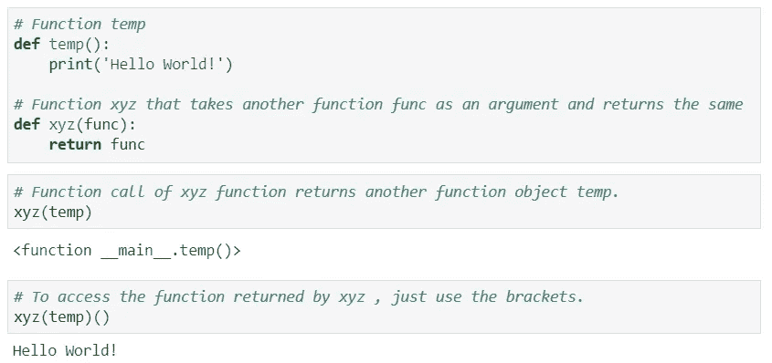

***

# 嵌套函数的一个重要特征

为了理解 Decorators，我们需要知道嵌套函数的一个非常重要的特性，我们将在这里简要讨论这个特性。

在下面的代码中，我们定义了一个外部函数，一个内部函数嵌套在外部函数中。这里要注意的有趣的事情是，内部嵌套函数可以访问外部函数的参数/自变量。

**注意**:参数指的是我们定义函数时的变量，而实参是调用函数时赋给那些参数的值。

嵌套函数可以访问封闭范围的参数/变量。这种功能的嵌套函数叫做 [*闭包*](https://www.programiz.com/python-programming/closure) *。这个特性在装饰者中被广泛使用。*

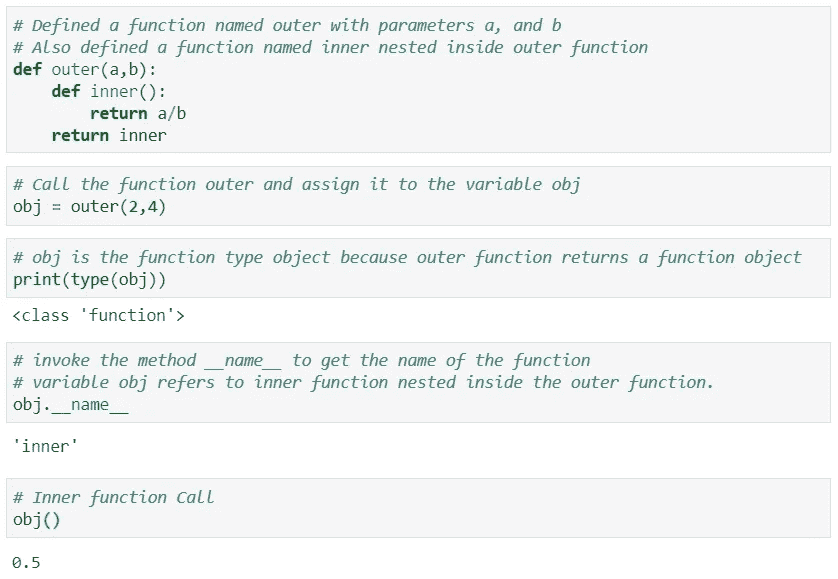

***

# 建造装饰者

现在，我们知道了函数对象的一些最重要的特性。因此，我们有完美的基础来建立装饰者的概念。

首先让我们看一下装饰函数的定义。

> Python 中的 decorator 是一个接受另一个函数作为参数的函数，它通常会修改或增强它接受的函数，并返回修改后的函数。

为了理解 decorator 的定义，让我们一步一步地看下面给出的代码。

首先，我们定义了一个名为“decorator”的装饰函数。此函数接受另一个函数“func”作为参数。

其次，decorator 函数是一个外部函数，它还有一个内部函数，名为“wrapper ”,定义在 decorator 函数内部。这个包装函数调用 func(a，b)函数，返回 func(a，b)函数返回值的平方。

第三，这个装饰函数接受' func '作为参数，并返回包装函数。

第四，我们还单独定义了一个函数 add。定义这个函数的目的是将这个函数传递给装饰函数，并检查它是如何被修改的。

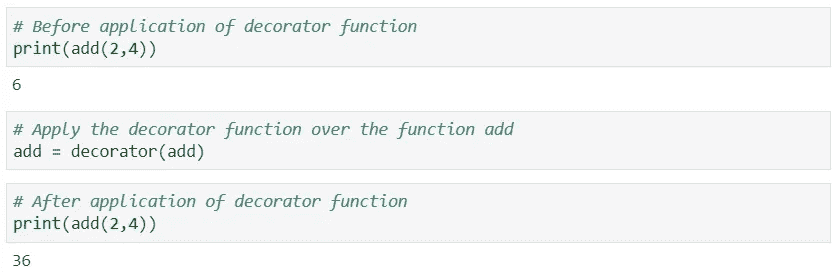

***

我们可以看到，在对它应用装饰函数之后,“添加”函数的行为被完全修改了。

如果我们更深入地检查底层函数的名称，我们会看到它是包装函数，运行在名称“add”下。因此' add '只是一个赋给包装函数的变量名。

这就是为什么在应用装饰器之后，原始函数“add”不是将数字相加，而是将数字的和平方的原因。

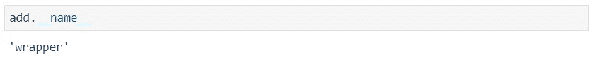

**装饰者中@的使用:**

为了提高装饰器的可读性，我们使用@和装饰器函数名。

```
# Without using @
add = decorator(add)
```

或者

```
# with @
@decorator
def add(x,y):
     return x+y
```

两种方式(有或没有' @ ')我们都可以分配一个装饰函数。然而，使用' @ '是一种普遍接受的、干净的方法，可以给 python 函数分配 decorators。

# 广义装饰者

装饰器通常在它修改的函数之前定义。然而，在上面定义的装饰器中，包装函数使用的参数数量与装饰器所应用的函数中的参数数量相同。这只是一个简单的例子，展示了 decorator 如何工作。

与上面定义的装饰器相比，如果我们想要创建一个可以应用于任何函数的装饰器，那么我们需要在分配参数数量上的灵活性。这种灵活性是通过*args 和**kwargs 实现的。*args 和**kwargs 允许我们向函数传递多个参数或基于关键字的参数。

从下面的代码中我们可以看到，在调用函数 xyz 时，我们传递了多个参数。

多个参数存储在变量 args 中，而*用于解包这些参数，因此我们能够实现函数中参数数量的灵活性。

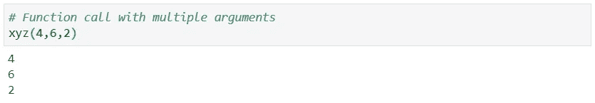

我们可以用两个参数调用同一个 xyz 函数，它工作得很好。

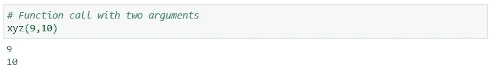

类似地，我们可以理解下面代码中提到的**kwargs 的功能。这里**再次充当解包操作符，而 kwargs 充当键值对的字典。

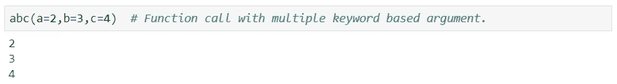

***

现在，在知道了*args 和**kwargs 之后，我们可以创建一个与参数数量无关的通用装饰器。

下面提到的代码显示了我们如何根据包装函数的要求使用*args，**kwargs，因为最终包装函数将通过使用原始函数的参数来替换原始函数(add_num(x，y))。

在对原始函数 add_num 应用装饰函数之后，它被修改了，它开始返回参数的平方和，而不是添加参数。

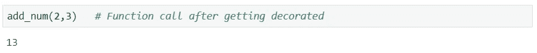

我们可以在带有任意数量参数的函数上应用这个装饰器(参考下面的代码)。所以我们可以一次创建一个装饰器，并在任何需要的地方使用它。

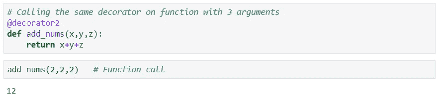

# 结论

本文的目的是给你足够的信息，让读者更容易理解、工作和构建装饰者的基础。

对于数据爱好者来说，有几个地方你会遇到 Python 中的 decorators:

1.  同时使用 Flask 或 Django 等框架部署您的模型。
2.  创建 web 应用程序时。
3.  Python 中有几个内置的 decorators，比如@classmethod 和@staticmethod，它们在定义类时被用来创建可选的构造函数等等。
4.  关于 decorators 的更多信息，请浏览参考列表中给出的文章和文档。

# 参考

1.  文献:[https://wiki.python.org/moin/PythonDecoratorLibrary](https://wiki.python.org/moin/PythonDecoratorLibrary)
2.  [盖尔·阿恩 Hjelle 的《Python 装饰者入门》](https://realpython.com/primer-on-python-decorators/#:~:text=Decorators%20provide%20a%20simple%20syntax,function%20without%20explicitly%20modifying%20it.)
3.  [https://python 101 . python library . org/chapter 25 _ decorators . html](https://python101.pythonlibrary.org/chapter25_decorators.html)
4.  关闭:[https://www.programiz.com/python-programming/closure](https://www.programiz.com/python-programming/closure)
5.  [Derrick MW iti 关于装饰者的文章](https://www.datacamp.com/community/tutorials/decorators-python)