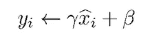
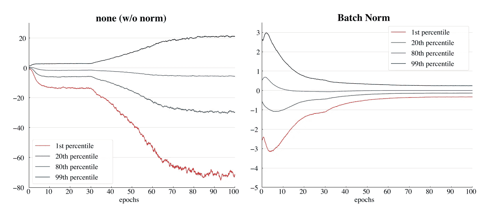
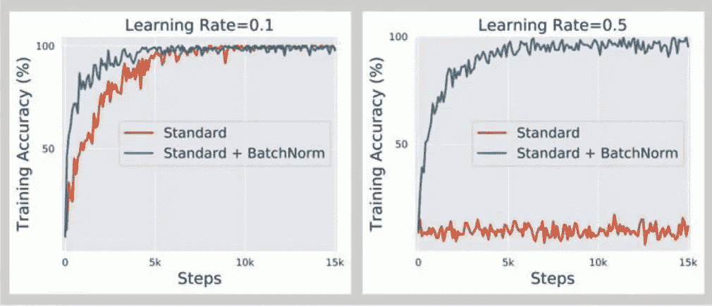
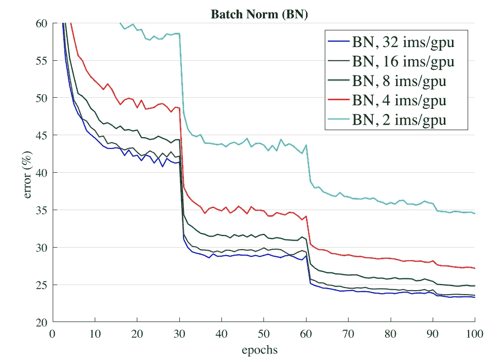
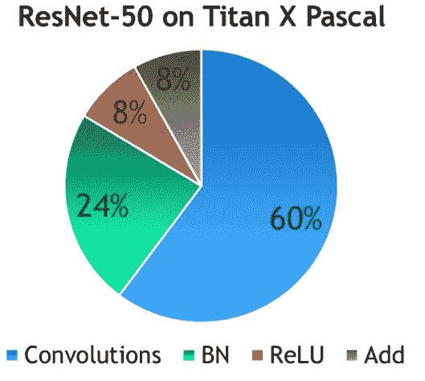
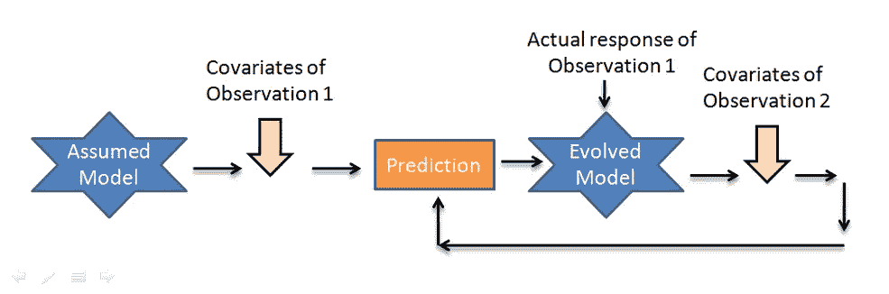

# 批量规范化的诅咒

> 原文：<https://towardsdatascience.com/curse-of-batch-normalization-8e6dd20bc304?source=collection_archive---------8----------------------->

## 使用批处理规范化有哪些缺点？

弗雷迪·科林斯在 [Unsplash](https://unsplash.com?utm_source=medium&utm_medium=referral) 上拍摄的照片

批量规范化确实是深度学习领域的重大突破之一，也是过去几年研究人员讨论的热门话题之一。批量标准化是一种广泛采用的技术，能够实现更快和更稳定的训练，并已成为最有影响力的方法之一。然而，尽管它的多功能性，仍然有一些点阻碍了这种方法，正如我们将在本文中讨论的，这表明规范化方法仍然有改进的空间。

# 我们为什么要使用批处理规范化？

在讨论任何事情之前，首先，我们应该知道什么是批处理规范化，它是如何工作的，并讨论它的用例。

## 什么是批处理规范化

在训练期间，当我们更新先前的权重时，每个中间激活层的输出分布在每次迭代时移动。这种现象被称为内部协变移位(ICS)。因此，如果我想防止这种情况发生，很自然的事情就是修复所有的发行版。简而言之，如果我有一些问题，我的分布在四处移动，我会夹紧它们，不让它们四处移动，以帮助梯度优化和防止梯度消失，这将有助于我的神经网络训练更快。因此，减少这种内部协变变化是推动批量标准化发展的关键原则。

## 它是如何工作的

批次归一化通过减去批次的经验平均值除以经验标准差来归一化前一个输出图层的输出。这将有助于数据看起来像 ***高斯分布*** 。

其中 *mu* 和 *sigma_square* 分别为批均值和批方差。

并且，我们根据两个可学习的参数 *γ* 和 *β学习新的均值和协方差。*所以简而言之，你可以认为批量标准化是帮助你控制批量分布的一阶和二阶矩的东西。

从 VGG-16 网络的中间卷积层输出的特征分布。1.(之前)没有任何规范化，2。(之后)应用批处理规范化。

## 利益

我将列举使用批处理规范化的一些好处，但我不会说得太详细，因为已经有成吨的文章在讨论这个问题了。

*   更快的收敛。
*   降低初始权重的重要性。
*   对超参数稳健。
*   需要较少的数据进行归纳。

1.更快的收敛，2。对超参数稳健

# 被诅咒的批处理规范化

所以，回到文章的动机，在很多情况下，批处理规范化开始损害性能或者根本不起作用。

## 使用小批量时不稳定

如上所述，批量标准化层必须计算平均值和方差，以标准化整个批量的先前输出。如果批量相当大，并且随着批量的减小而不断减小，这种统计估计将相当准确。

用 32、16、8、4 和 2 个图像/GPU 训练的 ResNet-50 的批量常模的验证误差

以上是 ResNet-50 的验证误差图。可以推断，如果批次大小保持为 32，其最终验证误差约为 23，并且误差随着批次大小的减小而不断减小(批次大小不能为 1，因为它将是其自身的平均值)。而且损失有很大的差别(10%左右)。

如果小批量是一个问题，为什么我们不用一个更大的批量呢？嗯，我们不能在任何情况下都使用更大的批量。考虑微调，我们不能使用高批量来不伤害我们的高梯度模型。考虑分布式训练，您的大批量最终将作为一组小批量分布在实例中。

## 导致培训时间增加

作为 NVIDIA 和卡内基梅隆大学进行的实验的结果，他们声称“即使批量规范化不是计算密集型的，收敛所需的总迭代次数也减少了。每次迭代的时间可能会显著增加。，并且它可以随着批量的增加而进一步增加。

使用 Titan X Pascal 在 ImageNet 上的 ResNet-50 训练时间分布

如您所见，批量标准化消耗了总训练时间的 1/4。原因是因为 batch norm 需要通过输入数据进行两次迭代，一次用于计算批处理统计数据，另一次用于归一化输出。

## 训练和推理的不同结果

例如，考虑现实世界的应用程序“对象检测”。在训练对象检测器时，我们通常使用大批量(YOLOv4 和 Faster-RCNN 都是在批量默认为 64 的情况下训练的)。但是这些车型投入生产后，这些车型**工作** **不如训练**时的 **好。这是因为它们是用大批量训练的，而在实时中，它们得到的批量等于 1，因为它必须随后处理每一帧。考虑到这种限制，一些实现倾向于使用基于训练集激活的预先计算的均值和方差。另一种可能性是基于您的测试集激活分布来计算平均值和变化值，但仍然不是分批的。**

## 不利于在线学习

与批量学习相反，在线学习是一种学习技术，其中系统通过顺序输入数据实例进行增量训练，这些数据实例可以单独输入，也可以通过称为*小批量的小组输入。*每一步学习都是快速而廉价的，因此系统可以在新数据到达时即时学习。

典型的在线学习渠道

由于它依赖于外部数据源，数据可能单独或成批到达。由于每次迭代中批量大小的变化，它不能很好地概括输入数据的规模和变化，这最终会影响性能。

## 对递归神经网络不好

尽管批量归一化显著地加快了卷积神经网络的训练和泛化速度，但它们被证明难以应用于递归结构。可以在 RNN 的堆栈之间应用批量归一化，其中归一化是“垂直”应用的，即每个 RNN 的输出。但是它不能“水平地”应用，即在时间步长之间应用，因为它会由于重复重新缩放导致的爆炸梯度而损害训练。

【注意】:一些研究实验声称批处理规范化使神经网络容易出现**对抗性漏洞**。但由于缺乏研究和证明，我们没有包括这一点。

# 可供选择的事物

所以这是使用批处理规范化的一些缺点。在批处理规范化不能保持的情况下，有几种替代方法。

*   图层规范化。
*   实例规范化。
*   分组标准化(+权重标准化)。
*   同步批量标准化。

# 结论

所以训练深度神经网络很简单，但我认为还不太容易。从这个意义上说，我可以选择的架构很少，每个人都使用固定的学习速度，固定的优化器和固定的技巧。这些技巧是通过自然选择选择出来的，几乎就像有人想出了一些技巧，如果它有效，他们就引入它，如果它无效，人们最终会忘记它，没有人会再使用它。除此之外，批处理规范化是深度学习发展中的一项里程碑技术。然而，正如所讨论的，沿着批处理维度进行规范化会引入一些问题，这表明规范化技术仍有改进的空间。